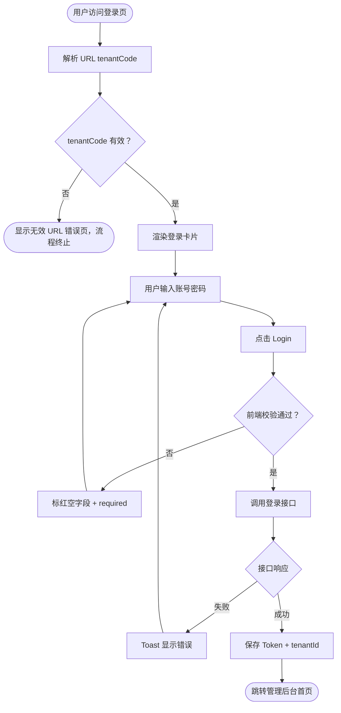

# 需求文档：PC 管理端 — 登录页面

> **端**: PC 管理端（桌面浏览器 Web 管理后台）
> **本文档仅包含**: PC 端登录页面的功能需求、交互行为和验收标准
> **视觉规格（颜色 / 尺寸 / 间距）**: 见 [UI-REQ-001-pc.md](../../outputs/ui/pc/UI-REQ-001-pc.md)
> **管理后台框架**: 见 [REQ-002-pc.md](./REQ-002-pc.md)（Header / Sidebar / Main Content）
> **共享需求**: 业务规则、API 接口、会话管理见 [REQ-001-shared.md](../shared/REQ-001-shared.md)
> **技术栈**: 见 [background/tech-stack.md](../../background/tech-stack.md)

---

## 1. 背景与目标

### 1.1 业务背景

PC 管理端（Back Office）面向总承包商（MAINCON）和分包商（SUBCON）的管理人员，是进入整个后台管理系统的唯一入口。用户登录后可查看和管理项目信息、人员、设备、考勤等各项业务数据。

### 1.2 业务目标

为 PC 管理端提供安全、清晰的登录页面，支持 MAINCON 和 SUBCON 两种角色登录，通过 URL 路径自动识别租户，无需用户手动输入企业账号。

### 1.3 非目标（Out of Scope）

- 登录后的管理后台框架布局（见 REQ-002-pc）
- Token 刷新、会话过期逻辑（见 REQ-001-shared）
- 忘记密码 / 注册功能（当前版本不支持）

---

## 2. 用户与角色

### 2.1 角色定义

| 角色 ID | 角色名 | 描述 | 典型场景 |
|--------|-------|------|---------|
| ROLE-001 | MAINCON 管理员 | 总承包商管理人员 | 通过 MAINCON Tab 登录后台 |
| ROLE-002 | SUBCON 管理员 | 分包商管理人员 | 通过 SUBCON Tab 登录后台 |

### 2.2 用户故事

#### US-001：MAINCON 管理员登录

```
作为 MAINCON 管理员
我想要 在 PC 浏览器上通过账号密码登录 Smart Construction 管理后台
以便 我可以查看和管理项目数据、人员信息、设备状态等各项业务
```

**优先级**: P0

#### US-002：SUBCON 管理员登录

```
作为 SUBCON 管理员
我想要 切换到 SUBCON Tab 并通过账号密码登录管理后台
以便 我可以查看分配给本分包商的项目数据和任务
```

**优先级**: P0

#### US-003：语言切换

```
作为 任意管理员
我想要 在登录页切换界面语言（中文 / English）
以便 我可以用熟悉的语言完成登录操作
```

**优先级**: P1

---

## 3. 角色与权限矩阵

| 操作 | MAINCON 管理员 | SUBCON 管理员 |
|-----|:---:|:---:|
| 访问登录页 | ✅ | ✅ |
| MAINCON Tab 登录 | ✅ | ❌ |
| SUBCON Tab 登录 | ❌ | ✅ |
| 语言切换 | ✅ | ✅ |

---

## 4. 核心实体与数据生命周期

### 4.1 实体清单

| 实体 ID | 实体名 | 描述 | 关键属性（业务语义） |
|--------|-------|------|------------------|
| ENT-001 | tenantCode | URL 路径中的租户标识 | 从 URL `/mcc/login` 解析，只读 |
| ENT-002 | 登录凭证 | 用户提交的账号 + 密码 | username、password，不持久化 |
| ENT-003 | 会话 Token | 登录成功后持有 | 见 REQ-001-shared |

### 4.2 实体关系

- `tenantCode` → 映射到后端 `tenantId`（登录成功后由后端返回）
- 登录凭证 → 提交给后端校验，不在前端持久化原始密码

---

## 5. 状态机

### 5.1 登录页面状态

| 状态 ID | 状态名 | 描述 | 是否终态 |
|--------|-------|------|---------|
| S-001 | 初始化 | 页面加载，解析 URL 中的 tenantCode | 否 |
| S-002 | URL 无效 | tenantCode 不存在，显示错误整页 | 是 |
| S-003 | 空表单 | tenantCode 有效，等待用户输入 | 否 |
| S-004 | 表单填写中 | 用户正在输入账号密码 | 否 |
| S-005 | 校验失败 | 前端必填校验不通过，输入框标红 | 否 |
| S-006 | 请求中 | 接口调用中，按钮 Loading | 否 |
| S-007 | 登录失败 | 接口返回错误，显示 Toast | 否 |
| S-008 | 登录成功 | 跳转管理后台首页 | 是 |

### 5.2 状态转换表

| From | To | 触发动作 | 守卫条件 | 副作用 |
|------|-----|---------|---------|-------|
| S-001 | S-002 | 页面加载完成 | URL 中无有效 tenantCode | 显示错误整页 |
| S-001 | S-003 | 页面加载完成 | tenantCode 有效 | 渲染登录卡片 |
| S-003 | S-004 | 用户输入 | — | — |
| S-004 | S-005 | 点击 Login | 账号或密码为空 | 空字段标红 + "required" |
| S-004 | S-006 | 点击 Login | 表单校验通过 | 按钮变 Loading，禁止重复点击 |
| S-005 | S-004 | 用户继续输入 | — | 错误提示消失 |
| S-006 | S-007 | 接口返回失败 | — | Toast 显示错误信息 |
| S-006 | S-008 | 接口返回成功 | — | 保存 Token，跳转首页 |
| S-007 | S-004 | — | — | 按钮恢复可点击 |

### 5.3 非法转换

- 不允许 S-006（请求中）再次点击 Login（按钮已禁用）
- 不允许 S-002（URL 无效）进入登录表单

---

## 6. 业务流程

### 6.1 主流程（MAINCON 登录）

1. 用户访问 `https://smartsite.mcc.sg/{tenantCode}/login`
2. 前端从 URL 路径解析 `tenantCode`
3. `tenantCode` 无效 → 显示错误整页，流程终止
4. `tenantCode` 有效 → 渲染登录卡片，默认选中 MAINCON Tab
5. 用户输入账号和密码
6. 点击 Login → 前端校验：账号、密码不能为空
7. 校验不通过 → 空字段标红 + 显示 "required"，流程回到第 5 步
8. 校验通过 → 调用 `POST /system/auth/login`，附带 `tenantCode`
9. 接口返回失败 → Toast 显示错误信息，回到第 5 步
10. 接口返回成功 → 保存 Token 和 tenantId，跳转管理后台首页

### 6.2 主流程图（Mermaid）



### 6.3 异常流程

| 异常场景 | 触发条件 | 系统响应 | 用户感知 |
|---------|---------|---------|---------|
| URL 无效 | tenantCode 不存在或租户已禁用 | 显示错误整页，阻止渲染登录表单 | "Invalid access URL, please contact your administrator" |
| 必填字段为空 | 点击 Login 时账号或密码为空 | 空字段边框变红，显示 "required" | 输入框下方红色提示 |
| 账号或密码错误 | 接口返回认证失败 | Toast 显示后端返回的错误信息 | Toast 提示 |
| 网络超时 | 接口请求超时 | Toast 显示网络错误提示 | Toast 提示，按钮恢复可点 |

---

## 7. 功能需求详述

### 7.1 F-001：页面整体布局

**关联用户故事**: US-001、US-002

全屏背景图（城市天际线夜景，新加坡风格） + 居中登录卡片。

```
┌─────────────────────────────────────────────────────────────┐
│                   (全屏城市夜景背景图)                         │
│              ┌─────────────────────────┐                    │
│              │  SMART CONSTRUCTION     │                    │
│              │  BACK OFFICE            │                    │
│              │  Account Login Page 文A  │                    │
│              │  MAINCON    SUBCON      │                    │
│              │  ─────────              │                    │
│              │  [账号输入框]            │                    │
│              │  [密码输入框        👁]  │                    │
│              │  ☑ Remember the password│                    │
│              │  [     Login     ]      │                    │
│              └─────────────────────────┘                    │
└─────────────────────────────────────────────────────────────┘
```

> 视觉规格（颜色、尺寸、间距）见 [UI-REQ-001-pc.md](../../outputs/ui/pc/UI-REQ-001-pc.md) §3、§4。

### 7.2 F-002：品牌标识区

**关联用户故事**: US-001、US-002

- 主标题："SMART CONSTRUCTION"，全大写
- 副标题："BACK OFFICE"，全大写

> 视觉规格（字号、字重、颜色、间距）见 [UI-REQ-001-pc.md](../../outputs/ui/pc/UI-REQ-001-pc.md) §4.3。

### 7.3 F-003：语言切换

**关联用户故事**: US-003

- 入口：卡片内"Account Login Page"行右侧，语言切换图标
- 交互：点击弹出下拉菜单，选项：English / 中文（简体）
- 切换范围：登录卡片内所有文本即时刷新

> 视觉规格（图标尺寸、颜色、布局）见 [UI-REQ-001-pc.md](../../outputs/ui/pc/UI-REQ-001-pc.md) §4。

### 7.4 F-004：MAINCON / SUBCON Tab 切换

**关联用户故事**: US-001、US-002

- Tab 数量：2 个：MAINCON / SUBCON
- 布局：水平排列，左对齐
- 默认选中：MAINCON

> 视觉规格（颜色、字重、底线样式、间距）见 [UI-REQ-001-pc.md](../../outputs/ui/pc/UI-REQ-001-pc.md) §4。

**接口映射**：
- MAINCON → `POST /system/auth/login`
- SUBCON → `POST /system/auth/subcontractor/login`

### 7.5 F-005：租户识别（tenantCode）

**关联用户故事**: US-001、US-002

PC 端租户通过 **URL 路径自动识别**，用户无需手动输入。

- **URL 格式**：`https://smartsite.mcc.sg/{tenantCode}/login`
- **解析逻辑**：页面加载时读取 URL 路径第一段作为 `tenantCode`
- **存储**：保存到 Vuex / 内存变量，登录请求时附带

**异常处理**：
- URL 中无 `tenantCode` → 整页显示错误，阻止登录
- 租户不存在或已禁用 → 后端返回错误，前端 Toast 提示

### 7.6 F-006：登录表单

**关联用户故事**: US-001、US-002

| 字段 | Placeholder | 类型 | 约束 |
|------|-------------|------|------|
| 账号 | "Please fill in account" | text | 必填 |
| 密码 | "Please fill in password" | password | 必填 |

**密码输入框附加**：
- 右侧显示眼睛图标（👁），默认掩码显示
- 点击切换明文 / 掩码

> 视觉规格（输入框尺寸、边框颜色、错误态样式）见 [UI-REQ-001-pc.md](../../outputs/ui/pc/UI-REQ-001-pc.md) §4。

### 7.7 F-007：记住密码

**关联用户故事**: US-001、US-002

- 位置：密码输入框下方
- 默认状态：选中（checked）
- 功能：选中 → Token 存 `localStorage`；未选中 → 存 `sessionStorage`

> 视觉规格（Checkbox 尺寸、颜色、文字样式）见 [UI-REQ-001-pc.md](../../outputs/ui/pc/UI-REQ-001-pc.md) §4。

### 7.8 F-008：登录按钮

**关联用户故事**: US-001、US-002

- 点击触发前端校验，通过后调用登录接口
- Loading 态：接口请求中禁止重复点击
- 禁用态：Loading 中 `cursor: not-allowed`

> 视觉规格（按钮颜色、各状态样式）见 [UI-REQ-001-pc.md](../../outputs/ui/pc/UI-REQ-001-pc.md) §4。

---

## 8. 验收标准（Acceptance Criteria）

### AC-001-pc-001：MAINCON 登录成功

**关联用户故事**: US-001

```
Given  用户访问有效 tenantCode 的登录页，选中 MAINCON Tab
When   填写正确账号密码，点击 Login
Then   按钮进入 Loading 态，接口成功后跳转管理后台首页，Token 保存至本地
```

### AC-001-pc-002：SUBCON 登录成功

**关联用户故事**: US-002

```
Given  用户访问有效 tenantCode 的登录页，切换到 SUBCON Tab
When   填写正确账号密码，点击 Login
Then   调用 subcontractor/login 接口，成功后跳转管理后台首页
```

### AC-001-pc-003：必填校验

```
Given  账号或密码任一为空
When   点击 Login
Then   空字段输入框边框变红，下方显示 "required"，不发起接口请求
```

### AC-001-pc-004：URL 无效

```
Given  URL 中无有效 tenantCode
When   页面加载完成
Then   显示错误整页 "Invalid access URL, please contact your administrator"，不渲染登录表单
```

### AC-001-pc-005：登录失败

```
Given  账号或密码错误
When   点击 Login，接口返回错误
Then   按钮恢复可点击，Toast 显示后端返回的错误信息
```

### AC-001-pc-006：密码可见切换

```
Given  密码输入框已输入内容
When   点击眼睛图标
Then   切换明文 / 掩码显示，图标状态同步变化
```

### AC-001-pc-007：记住密码

```
Given  勾选 Remember the password
When   登录成功
Then   Token 存储到 localStorage；取消勾选时存储到 sessionStorage
```

### AC-001-pc-008：语言切换

```
Given  用户在登录页点击 "文A" 图标
When   选择中文（简体）或 English
Then   登录卡片内所有文本即时切换为对应语言
```

---

## 9. 非功能需求

### 9.1 性能

| 指标 | 目标值 |
|-----|-------|
| 登录页首屏加载 | ≤ 2s（正常网络） |
| 登录接口响应 | ≤ 1s（P95） |

### 9.2 安全

- 密码字段不允许浏览器自动填充原始明文（`autocomplete="new-password"`）
- Token 不暴露在 URL 中
- HTTPS 传输

### 9.3 兼容性

- 浏览器：Chrome 80+、Firefox 78+、Safari 14+、Edge 80+
- 最低分辨率：1280×720px
- 国际化：中文（简体）/ English

---

## 10. 数据量级与扩展性

| 维度 | 说明 |
|-----|------|
| 并发登录 | 取决于租户规模，无前端特殊处理 |
| 租户数 | 由后端支撑，前端无感知 |

---

## 11. 依赖与外部系统

| 依赖 | 用途 | 集成方式 |
|-----|------|---------|
| REQ-001-shared | 登录 API、会话管理规则 | 直接引用 |
| REQ-002-pc | 登录成功后的跳转目标 | 路由跳转 |

---

## 12. 数据迁移

无。

---

## 13. 上线操作清单（Launch Checklist）

### 13.1 上线前

- [ ] 确认各租户 tenantCode 已在后端配置
- [ ] 确认登录背景图资源已上传 CDN
- [ ] 确认 HTTPS 证书有效

### 13.2 上线后

- [ ] 用 MAINCON 账号完整走通登录流程
- [ ] 用 SUBCON 账号完整走通登录流程
- [ ] 验证无效 tenantCode 显示错误整页
- [ ] 通知相关运营/客服团队

---

## 14. 灰度与发布策略

随 REQ-001 基础框架整体发布，无独立灰度需求。

---

## 15. 成功指标（北极星）

| 指标 | 目标 |
|-----|------|
| 登录成功率 | ≥ 99%（排除账号密码错误） |
| 登录页报错率 | ≤ 0.1% |

---

## 16. Open Questions（待定项）

| OQ ID | 问题 | 影响 | Owner | 截止 |
|------|------|------|-------|------|
| OQ-001 | 记住密码是否需要加密存储账号？当前方案仅记住账号不记密码 | F-007 | PM | — |

---

## 17. Figma / 原型链接

- Figma 设计稿：<!-- 填写 REQ-001 登录页 Frame 链接，参见 rules/ui-rules.md §8 -->
- 交互原型：

---

## 18. 变更历史

| 版本 | 日期 | 修改人 | 变更摘要 | 影响下游文档 |
|-----|------|-------|---------|------------|
| 0.1.0 | 2026-03-01 | — | 初稿（原始格式） | 全部 |
| 0.2.0 | 2026-05-02 | agent | 拆分为登录页（REQ-001-pc）和管理后台框架（REQ-002-pc）；升级为新模板格式；技术说明改为引用 tech-stack.md | UI、Frontend、QA |

---

## 19. 备注

- PC 端品牌标识为 "SMART CONSTRUCTION" + "BACK OFFICE"，与 APP 端的 "NOVASYNC" + "SMART SITE" 不同
- PC 端通过 URL 路径自动识别租户，APP 端通过表单字段 "Company Account" 手动输入
- PC 端登录表单仅账号 + 密码两个字段，APP 端需企业账号 + 用户账号 + 密码三个字段
- PC 端登录按钮文案 "Login"，APP 端为 "Sign In"
- PC 端输入框为有边框样式（bordered），APP 端为下划线样式（underline）
- PC 端主色调 #4A90D9，APP 端 #6892FF
- PC 端有 "Remember the password" 功能，APP 端无
- PC 端有 MAINCON / SUBCON Tab 切换，APP 端仅有标准登录 + 扫码登录
