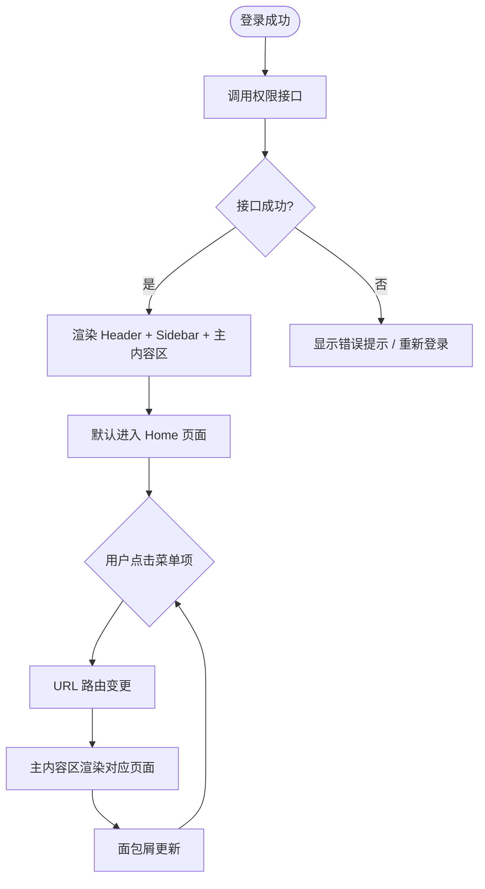

# 需求文档：PC 管理端 — 管理后台框架

> **端**: PC 管理端（桌面浏览器 Web 管理后台）
> **本文档仅包含**: 登录后的管理后台框架——顶部导航栏、左侧侧边栏、主内容区域及通用交互规范
> **视觉规格（颜色 / 尺寸 / 间距）**: 见 UI-REQ-002-pc.md（待建）
> **登录页面**: 见 [REQ-001-pc.md](./REQ-001-pc.md)
> **共享需求**: 业务规则、API 接口、会话管理见 [REQ-001-shared.md](../shared/REQ-001-shared.md)
> **技术栈**: 见 [background/tech-stack.md](../../background/tech-stack.md)

---

## 1. 背景与目标

### 1.1 业务背景

用户登录后进入管理后台，需要一套统一的页面框架（布局、导航、权限控制）承载所有业务功能模块。当前阶段各功能页面内容为空白占位，后续随各功能模块需求推进逐步填充。

### 1.2 业务目标

为 PC 管理端提供统一的后台框架，使 MAINCON / SUBCON 管理员在登录后能够通过顶部导航和左侧菜单快速进入各功能模块。

### 1.3 非目标（Out of Scope）

- 各功能模块的具体页面内容（在后续各功能需求文档中定义）
- Home 首页的数据看板内容（后续迭代补充）
- 移动端适配（PC 端最低支持 1280×720px）

---

## 2. 用户与角色

### 2.1 角色定义

| 角色 ID | 角色名 | 描述 | 典型场景 |
|--------|-------|------|---------|
| ROLE-001 | MAINCON 管理员 | 总承包商管理员 | 管理项目、分包商、人员、设备等 |
| ROLE-002 | SUBCON 管理员 | 分包商管理员 | 管理本分包单位的人员、考勤、设备等 |

### 2.2 用户故事

#### US-002-001：查看管理后台框架

```
作为 MAINCON 管理员 / SUBCON 管理员
我想要 登录后看到清晰的管理后台框架（Header、侧边栏菜单、主内容区）
以便 我可以快速找到并进入各功能模块
```

**优先级**: P0

#### US-002-002：切换项目

```
作为 MAINCON 管理员
我想要 通过 Header 的项目选择器切换当前项目
以便 在多个项目间快速切换，查看各项目数据
```

**优先级**: P0

#### US-002-003：折叠侧边栏

```
作为 MAINCON 管理员 / SUBCON 管理员
我想要 折叠左侧边栏以获得更大的内容区域
以便 在小屏幕下或专注查看内容时减少侧边栏占用空间
```

**优先级**: P1

#### US-002-004：退出登录

```
作为 MAINCON 管理员 / SUBCON 管理员
我想要 通过用户下拉菜单退出登录
以便 安全离开系统
```

**优先级**: P0

---

## 3. 角色与权限矩阵

| 操作 | MAINCON 管理员 | SUBCON 管理员 |
|-----|:---:|:---:|
| 查看 Header | ✅ | ✅ |
| 切换项目（项目选择器） | ✅ | ✅（仅可见所属项目） |
| 查看通知 | ✅ | ✅ |
| 折叠 / 展开侧边栏 | ✅ | ✅ |
| 查看侧边栏菜单 | ✅（按权限） | ✅（按权限） |
| 退出登录 | ✅ | ✅ |
| 切换语言 | ✅ | ✅ |

> 侧边栏菜单项由后端权限接口 `/system/auth/get-permission-info` 动态返回，不同角色可见菜单不同。

---

## 4. 核心实体与数据生命周期

### 4.1 实体清单

| 实体 ID | 实体名 | 描述 | 关键属性（业务语义） |
|--------|-------|------|------------------|
| ENT-001 | 项目（Project） | 用户有权访问的项目列表 | projectId、shortName、colorTag |
| ENT-002 | 权限信息 | 用户在当前项目下的菜单与操作权限 | menuList、buttonPermissions |
| ENT-003 | 通知（Notification） | 系统发给用户的通知消息 | count（未读数）、messageList |

### 4.2 实体关系

- 一个用户在一个项目下拥有一份权限信息（1:1 per project）
- 一个用户可有多条未读通知（1:N）

---

## 5. 状态机

### 5.1 侧边栏状态

| 状态 ID | 状态名 | 描述 | 是否终态 |
|--------|-------|------|---------|
| S-001 | 展开 | 显示图标 + 文字，宽度完整 | 否 |
| S-002 | 折叠 | 仅显示图标，宽度收窄 | 否 |

### 5.2 状态转换表

| From | To | 触发动作 | 守卫条件 | 副作用 |
|------|-----|---------|---------|-------|
| S-001（展开） | S-002（折叠） | 点击 ≡ 汉堡按钮 | 无 | 主内容区宽度扩展 |
| S-002（折叠） | S-001（展开） | 点击 ≡ 汉堡按钮 | 无 | 主内容区宽度收缩 |

---

## 6. 业务流程

### 6.1 主流程：登录后进入管理后台

1. 用户完成登录 → 系统跳转至管理后台
2. 系统调用 `/system/auth/get-permission-info` → 获取用户权限与菜单列表
3. 系统渲染 Header（Logo、面包屑、项目选择器、工具区）
4. 系统按权限渲染左侧侧边栏菜单
5. 主内容区默认显示 Home 页面（当前为空白）
6. 用户点击侧边栏菜单项 → URL 路由变更 → 主内容区渲染对应页面 → 面包屑更新

### 6.2 主流程图



### 6.3 异常流程

| 异常场景 | 触发条件 | 系统响应 | 用户感知 |
|---------|---------|---------|---------|
| 权限接口失败 | `/get-permission-info` 请求失败 | 显示错误提示，引导重新登录 | 看到错误提示页 |
| 访问无权限页面 | 直接 URL 访问无权限页面 | 显示 403 提示页 | "无权限访问" |
| Token 过期 | API 返回 401 | 尝试刷新 Token；失败则跳转登录页 | 自动跳转到登录页 |
| 切换项目失败 | 项目切换接口失败 | Toast 提示错误 | "切换项目失败，请重试" |

---

## 7. 功能需求详述

### 7.1 F-001：顶部导航栏（Header）

**关联用户故事**: US-002-001、US-002-002、US-002-004
**所属流程节点**: 流程 6.1 第 3 步

#### 布局结构

```
┌──────────────────────┬───┬──────────────────────────────────────────────────────────┐
│ Logo + 品牌名         │ ≡ │  面包屑导航           项目选择器  数据统计  通知  用户信息 │
└──────────────────────┴───┴──────────────────────────────────────────────────────────┘
  ← Logo 区域 →        ←───────────────────── 右侧区域 ────────────────────────────── →
```

#### F-001-1：Logo 区域

- 左侧显示建筑/工地图标 + 品牌名称 "Smart construction site"
- 宽度与侧边栏等宽：展开时与侧边栏同宽，折叠时收窄（仅显示图标）
- **折叠状态**：隐藏品牌名称文字，仅显示 Logo 图标

#### F-001-2：侧边栏折叠按钮

- Logo 区域右侧显示 ≡ 汉堡菜单图标
- 点击切换侧边栏展开 / 折叠状态

#### F-001-3：面包屑导航

- 折叠按钮右侧
- 格式：`一级菜单 / 二级菜单`，用 " / " 分隔
- 根据当前路由自动生成，不需手动维护
- 上级页面文字可点击，点击后路由跳转
- 当前页不可点击

#### F-001-4：项目选择器

- 显示彩色圆点（项目标识色）+ 当前项目名称 + 下拉箭头
- 点击后弹出项目列表下拉菜单：
  - 每项包含彩色圆点 + 项目名称
  - 当前选中项显示 ✓
  - 列表最大高度可滚动
  - 顶部或底部额外显示 "Company Insights" 入口
- 选择项目后：关闭下拉，Header 传递新 `Project-Id`，页面数据刷新
- 选择 "Company Insights" 后：主内容区切换为公司层级视图，Header / 侧边栏高亮标识当前为公司层级

#### F-001-5：通知铃铛

- 铃铛图标 + 未读数角标
- 未读数 > 0 时显示角标；超过 99 显示 "99+"；无未读不显示角标
- 点击进入通知面板 / 通知页面

#### F-001-6：数据统计图标

- 点击进入数据统计 / Dashboard 页面

#### F-001-7：用户信息

- 头像圆形 + 用户名
- 点击弹出用户下拉菜单：

| 菜单项 | 说明 |
|--------|------|
| 个人中心 | 进入个人资料设置页 |
| 修改密码 | 打开修改密码弹窗 |
| 退出登录 | 调用登出 API，清除本地 Token，跳转登录页 |

#### F-001-8：固定定位

- Header 固定在页面顶部，不随内容滚动

> 视觉规格见 UI-REQ-002-pc.md §F-001

---

### 7.2 F-002：左侧导航栏（Sidebar）

**关联用户故事**: US-002-001、US-002-003
**所属流程节点**: 流程 6.1 第 4 步

#### F-002-1：展开 / 折叠

- 两种状态：展开（完整宽度，图标 + 文字）、折叠（收窄，仅图标）
- 折叠时 Hover 菜单图标，弹出 Tooltip 显示菜单名称
- 切换有过渡动画，主内容区宽度同步过渡

#### F-002-2：菜单项渲染

- 菜单列表由后端权限接口 `/system/auth/get-permission-info` 返回，按权限动态渲染
- 无权限的菜单项不显示
- **当前阶段**：仅渲染一级菜单，二级子菜单随后续功能需求逐步新增

#### F-002-3：菜单列表（当前一级菜单）

| 序号 | 菜单名称 | 说明 |
|------|---------|------|
| 1 | Home | 首页（当前显示空白页面） |
| 2 | Dashboard | 数据看板 |
| 3 | Project Detail | 项目详情 |
| 4 | Progress Management | 进度管理 |
| 5 | Subcon Management | 分包商管理 |
| 6 | Personnel Management | 人员管理 |
| 7 | Attendance Management | 考勤管理 |
| 8 | Equipment Management | 设备管理 |
| 9 | Tower crane management | 塔吊管理 |
| 10 | Material Management | 材料管理 |
| 11 | Progress Management（报表） | 进度报表 |
| 12 | Visit Record | 访客记录 |

#### F-002-4：选中状态

- 当前选中菜单：图标 + 文字高亮，左侧显示选中指示器（竖线）
- 选中状态与当前路由保持同步

#### F-002-5：Company Insights 视角菜单

- 当用户切换到 Company Insights 视角时，侧边栏切换为公司层级菜单，显示 "Project Progress" 菜单项
- 点击后主内容区显示空白占位页面（后续补充内容）

#### F-002-6：固定定位

- 侧边栏固定在页面左侧，不随内容滚动
- 内容超出时垂直可滚动

> 视觉规格见 UI-REQ-002-pc.md §F-002

---

### 7.3 F-003：主内容区域（Main Content）

**关联用户故事**: US-002-001
**所属流程节点**: 流程 6.1 第 5~6 步

#### F-003-1：定位与布局

- 位于 Header 下方、Sidebar 右侧
- 顶部偏移 = Header 高度；左侧偏移 = 侧边栏当前宽度
- 侧边栏折叠 / 展开时，主内容区宽度同步过渡

#### F-003-2：页面路由

- 点击侧边栏菜单项 → URL 路由变更 → 主内容区渲染对应页面
- 面包屑同步更新
- 支持浏览器前进 / 后退
- 支持直接 URL 访问（需鉴权校验）

#### F-003-3：当前阶段内容

- 登录后默认进入 Home 页面，显示空白页面
- 点击其他菜单项显示空白占位页面
- 各页面具体内容在后续各功能需求文档中单独定义

#### F-003-4：页面内 Tab 栏（通用组件，后续页面复用）

部分页面顶部包含 Tab 栏切换子页面（如 Project Detail 有 "Project Information" / "Subcontractor" / "Access Control" 三个 Tab）：

- Tab 选中文字与下划线高亮
- 切换动画：下划线位移
- Tab 下方有全宽分隔线

> 视觉规格见 UI-REQ-002-pc.md §F-003

---

### 7.4 F-004：会话管理（PC 端特有）

> 通用会话规则见 [REQ-001-shared.md](../shared/REQ-001-shared.md) §3

**PC 端特有说明**：

- **租户标识来源**：从 URL 路径解析（如 `https://smartsite.mcc.sg/mcc/login` → `tenantCode = mcc`），登录成功后保存后端返回的 `tenantId` 到本地
- **Token 存储策略**：
  - 登录时勾选 "Remember the password" → 存 `localStorage`（关闭浏览器后保留）
  - 未勾选 → 存 `sessionStorage`（关闭浏览器后清除）
- **请求拦截**：所有 API 请求通过 Axios 拦截器统一添加以下 Header：
  - `Authorization: Bearer {token}`
  - `X-Tenant-Id: {tenantId}`（来自登录返回值，非 URL 中的 tenantCode）
  - `Project-Id: {currentProjectId}`
  - `lang: {currentLanguage}`

---

### 7.5 F-005：多语言支持

- 支持 中文（简体）/ English 切换
- 默认语言：English
- 语言切换入口：用户下拉菜单 或 Header 右侧独立入口
- 切换后所有文本即时刷新（菜单名称、面包屑、页面内容）
- 语言偏好保存到本地存储

---

## 8. 验收标准（Acceptance Criteria）

### AC-002-pc-001：Header 固定显示

**关联用户故事**: US-002-001

```
Given  用户已登录，进入管理后台任意页面
When   页面内容超出视口高度，用户向下滚动
Then   Header 保持固定在顶部，不随内容滚动
```

### AC-002-pc-002：侧边栏菜单按权限渲染

**关联用户故事**: US-002-001

```
Given  用户已登录
When   管理后台框架渲染完成
Then   侧边栏只显示用户有权限的菜单项，无权限的菜单不可见
```

### AC-002-pc-003：点击菜单项路由跳转

**关联用户故事**: US-002-001

```
Given  用户在管理后台，侧边栏可见
When   用户点击任一菜单项
Then   URL 路由变更，主内容区渲染对应页面，面包屑同步更新，当前菜单项高亮
```

### AC-002-pc-004：侧边栏折叠展开

**关联用户故事**: US-002-003

```
Given  侧边栏当前处于展开状态
When   用户点击 ≡ 汉堡按钮
Then   侧边栏折叠为仅显示图标，主内容区宽度扩展，有过渡动画
```

```
Given  侧边栏当前处于折叠状态
When   用户点击 ≡ 汉堡按钮
Then   侧边栏展开显示图标 + 文字，主内容区宽度收缩，有过渡动画
```

### AC-002-pc-005：折叠态 Tooltip

```
Given  侧边栏处于折叠状态
When   用户 Hover 某个菜单图标
Then   弹出 Tooltip 显示该菜单名称
```

### AC-002-pc-006：项目切换

**关联用户故事**: US-002-002

```
Given  用户在管理后台，Header 显示当前项目
When   用户点击项目选择器，从下拉列表选择另一个项目
Then   关闭下拉菜单，Header 更新显示新项目名称，页面数据以新 Project-Id 刷新
```

### AC-002-pc-007：通知角标

```
Given  用户有未读通知
When   进入管理后台
Then   铃铛图标右上角显示红色角标，未读数 ≤ 99 显示数字，> 99 显示 "99+"
```

```
Given  用户无未读通知
When   进入管理后台
Then   铃铛图标不显示角标
```

### AC-002-pc-008：退出登录

**关联用户故事**: US-002-004

```
Given  用户在管理后台
When   用户点击用户头像 → 选择"退出登录"
Then   调用登出 API，清除本地 Token，跳转至登录页
```

### AC-002-pc-009：Token 过期自动跳转

```
Given  用户 Token 已过期且 Refresh Token 也已失效
When   用户触发任意 API 请求
Then   自动跳转至登录页，不显示空白页面
```

### AC-002-pc-010：无权限页面

```
Given  用户无某功能页面的访问权限
When   用户直接通过 URL 访问该页面
Then   显示 403 无权限提示页，不渲染业务内容
```

### AC-002-pc-011：语言切换

```
Given  用户在管理后台
When   用户切换语言（中文 / English）
Then   所有文本（菜单名称、面包屑、页面内容）即时更新为目标语言，语言偏好保存本地
```

### AC-002-pc-012：默认进入 Home 页面

```
Given  用户登录成功
When   跳转进入管理后台
Then   默认进入 Home 页面，侧边栏 Home 菜单项高亮，面包屑显示 "Home"
```

---

## 9. 非功能需求

### 9.1 性能

| 指标 | 目标值 | 测量方式 |
|-----|-------|---------|
| 框架首次渲染（权限接口返回后） | ≤ 500ms | 页面 Performance 打点 |
| 侧边栏折叠 / 展开动画 | 300ms | CSS transition |
| 项目切换数据刷新 | ≤ 2s | 接口响应时间 |

### 9.2 安全

- 鉴权方式：JWT Bearer Token
- Token 存储：`localStorage`（记住密码）/ `sessionStorage`（不记住）
- 所有请求携带 `X-Tenant-Id`，后端校验租户隔离
- 无权限页面返回 403，不暴露业务数据

### 9.3 可访问性

- WCAG 等级：AA
- 键盘导航：侧边栏菜单项支持 Tab 键导航，Enter 触发跳转
- 折叠态菜单 Tooltip 对屏幕阅读器可见

### 9.4 兼容性

- 浏览器：Chrome 100+、Edge 100+、Safari 15+
- 移动端：不支持（PC 端最低 1280×720px）
- 国际化：中英双语

### 9.5 响应式适配

| 屏幕宽度 | 适配方案 |
|---------|---------|
| ≥ 1440px | 完整布局，侧边栏默认展开 |
| 1280-1439px | 侧边栏默认折叠，可手动展开 |
| < 1280px | 超出最低支持范围，提示用户使用更大屏幕 |

---

## 10. 数据量级与扩展性

| 维度 | 当前预期 | 说明 |
|-----|---------|------|
| 菜单项数量 | 12 个一级菜单 | 后续随功能迭代增加二级子菜单 |
| 通知条数 | 99+ 显示上限 | 具体通知内容在通知模块需求中定义 |
| 项目数量 | 单用户可见 ≤ 50 个项目 | 下拉菜单需支持滚动 |

---

## 11. 依赖与外部系统

| 依赖系统 | 用途 | 集成方式 | Owner |
|---------|------|---------|-------|
| 权限服务 | 获取菜单与按钮权限 | `GET /system/auth/get-permission-info` | 后端 |
| 认证服务 | 登出、Token 刷新 | `POST /system/auth/logout` | 后端 |

---

## 12. 数据迁移

无。

---

## 13. 上线操作清单（Launch Checklist）

### 13.1 上线前

- [ ] 权限接口已按菜单列表配置默认角色权限
- [ ] 各租户已有可选项目数据
- [ ] 前端路由与菜单权限标识已对齐后端配置

### 13.2 上线后

- [ ] 验证各角色登录后菜单渲染正确
- [ ] 验证项目切换后数据正确刷新
- [ ] 验证 Token 过期自动跳转登录页正常

---

## 14. 灰度与发布策略

- 灰度方式：按租户灰度
- 回滚预案：前端回退版本，无 DB 变更

---

## 15. 成功指标（北极星）

| 指标 | 目标 | 测量周期 |
|-----|------|---------|
| 用户进入后台后找到目标菜单的平均点击次数 | ≤ 2 次 | 上线后 1 个月 |
| 框架 JS 报错率 | < 0.1% | 持续监控 |

---

## 16. Open Questions（待定项）

| OQ ID | 问题 | 影响 | Owner | 截止 |
|------|------|------|-------|------|
| OQ-001 | 通知铃铛点击后进入的是通知面板（抽屉）还是独立页面？ | F-001-5 交互设计 | PM | 待定 |
| OQ-002 | Company Insights 视角下侧边栏菜单的完整列表？ | F-002-5 | PM | 待定 |
| OQ-003 | 项目选择器中用户可见的项目范围由什么权限控制？ | F-001-4 | 后端 | 待定 |

---

## 17. Figma / 原型链接

- Figma 设计稿：<!-- 填写管理后台框架 Frame 链接 -->
- 交互原型：

---

## 18. 变更历史

| 版本 | 日期 | 修改人 | 变更摘要 | 影响下游文档 |
|-----|------|-------|---------|------------|
| 0.1.0 | 2026-03-01 | — | 初稿 | 全部 |
| 0.2.0 | 2026-05-02 | agent | 升级为新模板格式 v0.2.0；样式规格分离至 UI Spec；补充 AC、OQ、非功能需求 | UI、Frontend、QA |

---

## 19. 备注

- 侧边栏菜单内容来自后端权限 API，不同角色用户看到的菜单不同
- **当前阶段侧边栏仅显示一级菜单**，二级子菜单随各功能模块需求推进后逐步新增
- **Home 首页当前显示为空白页面**，后续根据业务需求补充具体内容
- 管理后台框架参考截图为 Project Detail 页面，其他页面复用同样的 Header + Sidebar + Main Content 布局
