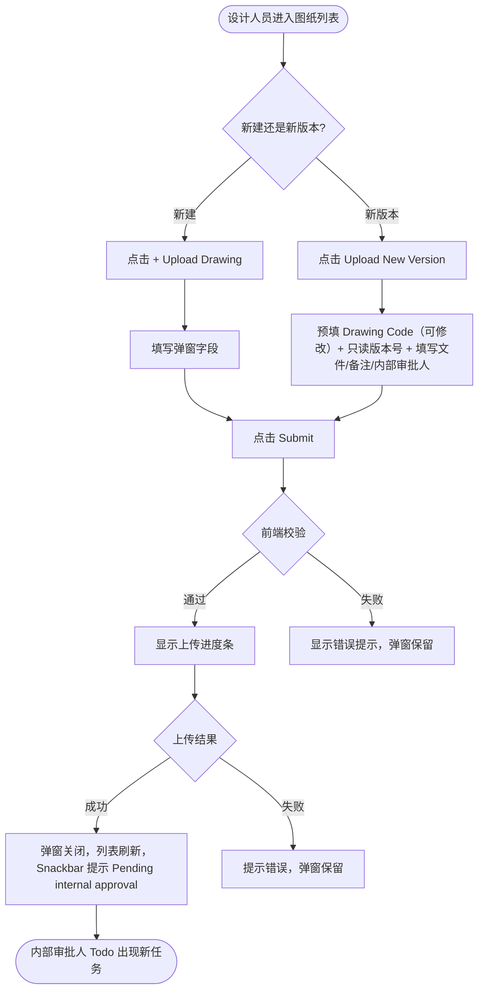

# 需求文档：PC 端 — 图纸上传与审批发起

> **使用说明**：本文档是整个交付链路的**单一事实源**。所有下游文档（UI/前端/后端/QA）从本文档派生。
> 任何字段标注 `<!-- TODO: ... -->` 表示 PM 待补充，下游 agent 看到 TODO 不应编造，应保留并向上反馈。

---

## 1. 背景与目标

### 1.1 业务背景

PC 管理端是图纸管理的主要操作端，设计人员（Designer）在此上传新版图纸并指定内部审批人，进入**两级审批流程**（内部审批 → 外部审批）。外部审批通过后图纸正式生效；项目管理人员须在 PC 端完成 SE 分配（见 REQ-003D-pc），被分配的 SE 才会收到通知并看到该图纸。审批驳回后，设计人员在此收到站内消息通知并重新上传。

> 两级审批流程定义见 [REQ-007-shared.md](../shared/REQ-007-shared.md)。

### 1.2 业务目标

让设计人员能在 PC 端完成新建图纸和上传新版本的全流程操作，指定内部审批人并触发两级审批流程，确保图纸经过内部技术审核与外部合规审批后才正式生效。

### 1.3 非目标（Out of Scope）

- 内部审批操作本身（由 REQ-007A-pc 覆盖）
- DC 外部审批操作（由 REQ-007B-pc 覆盖）
- 版本历史 4 阶段视图（由 REQ-007C-pc 覆盖）
- DC 配置页面（由 REQ-007D-pc 覆盖）
- Site Engineer 分配（由 REQ-003D-pc 覆盖）
- APP 端操作（由 REQ-003-app 覆盖）

---

## 2. 用户与角色

### 2.1 角色定义

| 角色 ID | 角色名 | 描述 | 典型场景 |
|--------|-------|------|---------|
| ROLE-001 | 设计人员（Designer） | 图纸责任人，负责上传图纸并发起内部审批 | 上传新图纸/新版本，填写版本说明，指定内部审批人 |
| ROLE-002 | 内部审批人 | 接收内部审批任务（设计经理/总工程师等技术人员） | 在 Todo 列表看到新任务（触发后场景，详见 REQ-007A-pc） |

### 2.2 用户故事（User Stories）

#### US-003A-001：上传图纸并发起内部审批

```
作为 设计人员（Designer）
我想要 在 PC 端上传新版图纸并指定内部审批人
以便 图纸先经过内部技术审核，再进入外部审批流程，出问题时责任明确可追溯
```

**优先级**：P1
**所属史诗**：图纸管理全流程

---

## 3. 角色与权限矩阵

| 操作 | 设计人员（Designer） | 内部审批人 | 项目管理人员 | Site Engineer |
|-----|:--------------:|:-----:|:----------:|:------------:|
| 新建图纸 | ✅ | ❌ | ❌ | ❌ |
| 上传新版本（非审批中状态） | ✅ | ❌ | ❌ | ❌ |
| 上传新版本（`PENDING_INTERNAL` 或 `INTERNAL_APPROVED`） | ❌（置灰） | ❌ | ❌ | ❌ |
| 查看图纸列表 | ✅ | ✅ | ✅ | — |

---

## 4. 核心实体与数据生命周期

### 4.1 实体清单

| 实体 ID | 实体名 | 描述 | 关键属性（业务语义） |
|--------|-------|------|------------------|
| ENT-001 | Drawing（图纸） | 图纸主记录 | Code、Name、Category、Description、当前版本号、Status |
| ENT-002 | DrawingVersion（图纸版本） | 每次上传对应一个版本 | 版本号、文件、版本说明、审批人、上传人、上传时间、状态 |

### 4.2 实体关系

- 一个 Drawing 包含多个 DrawingVersion（1:N）
- 每个 DrawingVersion 关联一个审批人（ROLE-002）

### 4.3 数据生命周期

**Drawing 生命周期**：
1. 创建：Drawing 团队通过 [+ Upload Drawing] 新建
2. 流转：每次上传新版本即创建新 DrawingVersion，状态跟随最新版本
3. 更新：审批通过/驳回时，版本及图纸状态自动更新
4. 归档/销毁：<!-- TODO: 是否有归档策略 -->

**DrawingVersion 生命周期**：
1. 创建：设计人员上传文件并提交
2. 流转：`PENDING_INTERNAL` → `INTERNAL_APPROVED` → `APPROVED`（主线）；或 → `INTERNAL_REJECTED` / `EXTERNAL_REJECTED`（驳回）
3. 终态：`APPROVED`（生效，旧版本变 `DEPRECATED`）、`INTERNAL_REJECTED`、`EXTERNAL_REJECTED`

---

## 5. 状态机

### 5.1 DrawingVersion 状态定义

> 完整 5 态枚举由 [REQ-007-shared §4.4](../shared/REQ-007-shared.md) 定义，本文档仅列与上传操作直接相关的状态。

| 状态 ID | 状态名 | 描述 | 是否终态 |
|--------|-------|------|---------|
| S-001 | PENDING_INTERNAL | 已上传，等待内部审批 | 否 |
| S-002 | INTERNAL_APPROVED | 内部审批通过，等待 DC 外部审批 | 否 |
| S-003 | INTERNAL_REJECTED | 内部审批驳回 | 是 |
| S-004 | APPROVED | 内部 + 外部均通过，版本正式生效 | 是 |
| S-005 | EXTERNAL_REJECTED | DC 标记外部审批驳回 | 是 |
| S-006 | DEPRECATED | 已被新版本替代 | 是 |

### 5.2 状态转换表

| From | To | 触发动作 | 守卫条件 | 副作用 |
|------|-----|---------|---------|-------|
| — | S-001 | 设计人员上传并提交 | Drawing Code 唯一（新建时）；当前无 `PENDING_INTERNAL` 或 `INTERNAL_APPROVED` 版本 | 通知内部审批人（Todo 出现任务） |
| S-001 | S-002 | 内部审批人通过 | — | 通知项目所有已配置 DC |
| S-001 | S-003 | 内部审批人驳回 | Comment 必填 | 站内通知设计人员 |
| S-002 | S-004 | DC 标记外部通过 + 上传签字版 | 签字版文件、审批凭证、外部审批日期必填 | 版本生效，QR 生成，推送 SE |
| S-002 | S-005 | DC 标记外部驳回 | Comment 必填 | 站内通知设计人员 |
| S-004 | S-006 | 新版本审批通过 | — | 旧版本标记 DEPRECATED |

### 5.3 非法转换

- `APPROVED` → `PENDING_INTERNAL`（不可回退到待审批）
- `DEPRECATED` → 任何状态（已废弃版本不可再激活）
- `INTERNAL_REJECTED` / `EXTERNAL_REJECTED` → `APPROVED`（不能跳过审批）

---

## 6. 业务流程

### 6.1 主流程（新建图纸）

1. 设计人员点击左侧菜单"Drawing Management" → "Drawing Masterlist"进入图纸管理列表页
2. 点击右上角 [+ Upload Drawing] 按钮
3. 弹出"Upload New Drawing"弹窗
4. 填写 Drawing Code（项目内唯一）、Drawing Name、Category（必填）、Description（选填）
5. 上传图纸文件（PDF/DWG/DXF/PNG/JPG，≤50MB）
6. 填写 Version Note（选填），选择 **Internal Approver**（必填）
7. 点击 [Submit]：前端校验必填项 → 显示上传进度条 → 调用上传接口
8. 上传成功：弹窗关闭，列表刷新，Snackbar 提示 `"Drawing uploaded successfully. Pending internal approval."`；内部审批人 Todo 出现新任务
9. 上传失败：提示具体错误，弹窗保留，用户可重试

**主流程（上传新版本）**：
1. 点击列表行 [Upload New Version] 按钮（仅当状态**不为** `PENDING_INTERNAL` 且**不为** `INTERNAL_APPROVED` 时可点）
2. 弹出"Upload New Version — {drawingCode} {drawingName}"弹窗
3. 显示当前版本号（只读），预填 Drawing Code（**可修改**）；**只读展示** Drawing Name、Category、Description（继承主记录，不可编辑）
4. 上传人可修改 Drawing Code，使其与图纸文件中的版本号保持一致
5. 上传文件、填写 Version Note、选择 **Internal Approver**
6. 提交流程同新建图纸步骤 7–9；系统版本号（V0、V1…）始终自动递增

### 6.2 主流程图（Mermaid）



### 6.3 异常流程

| 异常场景 | 触发条件 | 系统响应 | 用户感知 |
|---------|---------|---------|---------|
| 文件格式不支持 | 选择非 PDF/DWG/DXF/PNG/JPG 文件 | 拒绝选择，弹出提示 | 错误提示：支持格式列表 |
| 文件超过 50MB | 文件大小 > 50MB | 拒绝选择，弹出提示 | 错误提示：文件过大 |
| Drawing Code 重复 | 新建时 Code 已存在 | 提交时校验失败 | 字段下方显示错误 |
| 当前图纸有 `PENDING_INTERNAL` 或 `INTERNAL_APPROVED` 版本 | 上传新版本时已有审批中版本 | [Upload New Version] 按钮置灰 | 按钮不可点，状态提示 |
| 上传网络中断 | 上传过程网络断开 | 提示上传失败 | Toast 提示，弹窗保留可重试 |

---

## 7. 功能需求详述

### 7.1 功能 F-001：图纸列表页

**关联用户故事**：US-003A-001
**所属流程节点**：流程 6.1 步骤 1

- 侧边栏菜单"Drawing Management"为一级菜单，其下包含二级菜单"Drawing Masterlist"；点击进入图纸管理列表页面
- 列表展示所有图纸，默认按 Last Updated 倒序
- 表格列：Drawing Code（可排序）、Name、Category、Current Version、Status（颜色标签）、Confirmed（Active 时显示 x/y；其他状态显示 —）、Last Updated（可排序）、Actions
- 顶部操作区：左侧 [Filter Search]（点击以 Popover 方式弹出搜索条件面板），右侧 [+ Upload Drawing]
- [Filter Search] 按钮文案根据当前生效的搜索条件数量动态变化：无条件时显示"Filter Search"；有 n 个条件时显示"Filter Search (n)"
- 搜索 Popover 字段：Drawing Code（文本）、Drawing Name（文本）、Category（下拉单选）、Status（下拉单选）
- 搜索 Popover 底部：[Search] 触发查询，执行搜索后 Popover 关闭；[Cancel] 清空所有条件并关闭 Popover
- 点击页面其他区域（Popover 外部）时 Popover 关闭，已填写但未点击 [Search] 的条件**保留**在表单内，不执行查询

**Status 列颜色标签（5 种状态）**：

| 状态值 | 标签文案 | 颜色 |
|--------|---------|------|
| `PENDING_INTERNAL` | Pending Internal | 橙色 `#E6A23C` |
| `PENDING_EXTERNAL` | Pending External | 橙色 `#E6A23C` |
| `ACTIVE` | Active | 绿色 `#67C23A` |
| `INTERNAL_REJECTED` | Int. Rejected | 红色 `#F56C6C` |
| `EXTERNAL_REJECTED` | Ext. Rejected | 红色 `#F56C6C` |

**Status 筛选下拉选项（6 项）**：All / Active / Pending Internal / Pending External / Int. Rejected / Ext. Rejected

### 7.2 功能 F-002：新建图纸弹窗（Upload New Drawing）

**关联用户故事**：US-003A-001
**所属流程节点**：流程 6.1 新建图纸 步骤 3–8

**输入字段**：

| 字段 | 类型 | 必填 | 约束 |
|-----|------|:---:|------|
| Drawing Code | 文本 | ✅ | 项目内唯一 |
| Drawing Name | 文本 | ✅ | — |
| Category | 下拉单选 | ✅ | 选项来自系统字典 |
| Description | 文本 | ❌ | — |
| Drawing File | 文件上传 | ✅ | PDF/DWG/DXF/PNG/JPG，≤50MB；支持拖拽 |
| Version Note | 文本 | ❌ | — |
| Internal Approver | 下拉单选 | ✅ | 项目内有 `drawing:approve` 权限的用户列表 |

**处理逻辑**：
1. 点击 [Submit] 时触发前端必填校验
2. 校验通过后显示进度条，调用上传接口（含文件 + 元数据）
3. 成功：弹窗关闭，列表刷新，Snackbar 提示 `"Drawing uploaded successfully. Pending internal approval."`，同时引导管理员分配 SE："Remember to assign Site Engineers so they can view this drawing."
4. 失败：保留弹窗，显示具体错误

**边界与约束**：
- 文件格式：仅接受 PDF、DWG、DXF、PNG、JPG
- 文件大小：单文件最大 50MB
- Drawing Code：提交时服务端校验唯一性

### 7.3 功能 F-003：上传新版本弹窗（Upload New Version）

**关联用户故事**：US-003A-001
**所属流程节点**：流程 6.1 新版本 步骤 2–6

- 标题：Upload New Version — {drawingCode} {drawingName}
- **Drawing Code**：预填当前值，**可编辑**
- **只读展示** Drawing Name、Category、Description（继承主记录，灰色不可编辑，供上传人核对）
- 显示当前系统版本号（只读）：Current Version: Vn；提交成功后系统版本自动递增为 V(n+1)；**首次上传时系统版本为 V0**
- 可编辑字段：Drawing Code（预填可改）、Drawing File、Version Note、**Internal Approver**（约束同新建弹窗）
- 触发条件：[Upload New Version] 按钮仅在状态**不为** `PENDING_INTERNAL` 且**不为** `INTERNAL_APPROVED` 时可点

**Drawing Code 变更规则**：
- Drawing Code 修改后，主记录的 Drawing Code 随之更新为新值
- 系统版本号（V0、V1…）独立递增，不受 Drawing Code 影响
- 修改后的 Drawing Code 仍须满足项目内唯一性约束（服务端校验）

### 7.4 功能 F-004：上传进度

- 上传文件时显示进度条（0% → 100%）
- 上传期间 [Submit] 按钮禁用，防止重复提交
- 上传完成或失败后进度条消失

---

## 8. 验收标准（Acceptance Criteria）

### AC-003A-001：新建图纸 — 成功路径

**关联用户故事**：US-003A-001

```
Given  用户具备 drawing:upload 权限，且已进入图纸列表页
When   填写所有必填字段（含 Internal Approver）并上传合法文件，点击 [Submit]
Then   弹窗关闭，列表刷新，显示新图纸且状态为 PENDING_INTERNAL，Snackbar 提示"Pending internal approval"
```

### AC-003A-002：新建图纸 — Drawing Code 重复

```
Given  项目内已存在 Drawing Code "ARCH-001"
When   新建图纸时 Code 填入 "ARCH-001" 并提交
Then   服务端返回错误，字段下方显示"Code 已存在"，弹窗保留
```

### AC-003A-003：文件格式校验

```
Given  用户在上传弹窗中选择不支持格式的文件（如 .xlsx）
When   选择文件后
Then   系统拒绝该文件并提示支持的格式列表；文件上传区域清空
```

### AC-003A-004：文件大小校验

```
Given  用户选择大于 50MB 的文件
When   选择文件后
Then   系统拒绝该文件并提示文件过大（最大 50MB）
```

### AC-003A-005：审批中状态时禁止上传新版本

```
Given  图纸当前状态为 PENDING_INTERNAL 或 PENDING_EXTERNAL（即 INTERNAL_APPROVED）
When   用户查看该行的 Actions 列
Then   [Upload New Version] 按钮处于置灰不可点状态
```

### AC-003A-006：上传成功后内部审批人 Todo 出现任务

```
Given  上传新版本成功
When   指定的内部审批人进入 Todo 列表
Then   新的"Internal Approval Required"任务立即出现，包含图纸编号、名称和版本号
```

### AC-003A-007：上传进度条

```
Given  用户点击 [Submit] 且前端校验通过
When   文件正在上传中
Then   显示进度条，[Submit] 按钮禁用；上传完成或失败后进度条消失
```

### AC-003A-008：上传成功引导分配 SE

```
Given  新建图纸上传成功
When   Snackbar 出现
Then   Snackbar 提示文案包含"Remember to assign Site Engineers"引导文案
```

### AC-003A-009：上传新版本时可修改 Drawing Code

```
Given  图纸当前 Drawing Code 为 "ARCH-001"，设计人员打开 Upload New Version 弹窗
When   将 Drawing Code 修改为 "ARCH-001-R2" 并提交成功
Then   图纸列表中该图纸的 Drawing Code 更新为 "ARCH-001-R2"，系统版本号正常递增
```

### AC-003A-010：上传新版本时 Drawing Code 修改仍受唯一性约束

```
Given  项目内已存在 Drawing Code "ARCH-002"
When   上传新版本时将 Drawing Code 改为 "ARCH-002" 并提交
Then   服务端返回错误，Drawing Code 字段下方内联展示"Code 已存在"，弹窗保留
```

### AC-003A-011：图纸列表 Status 列显示 5 种状态标签

```
Given  项目图纸处于不同审批阶段
When   用户查看图纸列表 Status 列
Then   PENDING_INTERNAL 显示橙色"Pending Internal"；PENDING_EXTERNAL 显示橙色"Pending External"；
       ACTIVE 显示绿色"Active"；INTERNAL_REJECTED 显示红色"Int. Rejected"；
       EXTERNAL_REJECTED 显示红色"Ext. Rejected"
```

### AC-003A-012：Status 筛选下拉包含 6 个选项

```
Given  用户打开 Filter Search Popover
When   点击 Status 筛选下拉
Then   选项包含：All / Active / Pending Internal / Pending External / Int. Rejected / Ext. Rejected
```

---

## 9. 非功能需求

### 9.1 性能

| 指标 | 目标值 | 测量方式 |
|-----|-------|---------|
| 图纸列表首屏加载 | ≤ 2s（100 条数据以内） | Lighthouse / 手动 |
| 文件上传速度 | 50MB 文件 ≤ 60s（正常网络） | 实测 |
| 上传接口响应 P95 | ≤ 3s（不含文件传输时间） | 后端监控 |

### 9.2 安全

- 鉴权方式：JWT
- 文件类型白名单校验（前后端双重校验）
- 审计：文件上传操作记录操作人、时间、文件名

### 9.3 可访问性

- WCAG 等级：AA
- 键盘可达：弹窗内所有输入项支持 Tab 键导航
- 屏幕阅读器：是

### 9.4 兼容性

- 浏览器：Chrome 100+、Edge 100+、Safari 15+
- 移动端：不支持（PC 专属）
- 国际化：中英双语

### 9.5 可观测性

- 关键埋点：上传新图纸、上传新版本、上传成功、上传失败（含错误类型）
- 错误监控：Sentry（文件上传失败率 > 5% 告警）

---

## 10. 数据量级与扩展性

| 维度 | 当前预期 | 1 年后 | 3 年后 |
|-----|---------|-------|-------|
| 单项目图纸数量 | ≤ 500 条 | ≤ 2000 条 | ≤ 5000 条 |
| 单文件大小上限 | 50MB | 50MB | <!-- TODO: 是否放宽 --> |
| 版本数量/图纸 | ≤ 20 个版本 | ≤ 50 个版本 | 不限 |

---

## 11. 依赖与外部系统

| 依赖系统 | 用途 | 集成方式 | Owner |
|---------|------|---------|-------|
| 对象存储（OSS/S3） | 图纸文件存储 | 服务端预签名 URL 上传 | 后端 |
| 消息通知系统 | 审批人 Todo 推送 | 内部事件 | 后端 |
| REQ-003-shared | 接口定义、业务规则 | 文档引用 | — |

---

## 12. 数据迁移

无

---

## 13. 上线操作清单

### 13.1 上线前

- [ ] OSS/S3 Bucket 创建并配置访问权限
- [ ] 文件类型白名单配置确认
- [ ] 审批人权限角色初始化
- [ ] 功能开关默认开启确认

### 13.2 上线后

- [ ] 验证文件上传到存储成功
- [ ] 验证审批人 Todo 推送正常
- [ ] 文件上传失败率监控正常

---

## 14. 灰度与发布策略

- 灰度方式：按项目灰度
- 灰度比例：1 个试点项目 → 全量
- 监控指标：上传失败率、审批触发率
- 回滚预案：关闭上传入口功能开关，数据无需回滚

---

## 15. 成功指标（北极星）

| 指标 | 当前基线 | 目标 | 测量周期 |
|-----|---------|------|---------|
| 图纸上传成功率 | — | ≥ 95% | 每周 |
| 上传到审批触发时间 | — | ≤ 1min | 每周 |

---

## 16. Open Questions

| OQ ID | 问题 | 影响 | Owner | 截止 |
|------|------|------|-------|------|
| OQ-001 | 文件大小上限未来是否需要放宽？ | F-002 约束 | PM | — |
| OQ-002 | 是否支持批量上传多张图纸？ | F-002 范围 | PM | — |

---

## 17. Figma / 原型链接

- Figma 设计稿：<!-- 填写上传弹窗 / 图纸列表 Frame 链接 -->
- 交互原型：

---

## 18. 变更历史

| 版本 | 日期 | 修改人 | 变更摘要 | 影响下游文档 |
|-----|------|-------|---------|------------|
| 0.1.0 | 2026-05-04 | agent | 从 REQ-003-pc 按 US-003A-001 拆分初稿 | 全部 |
| 0.2.0 | 2026-05-05 | agent | 因 REQ-007 两级审批升级：上传人角色改为设计人员、审批人字段改为 Internal Approver、状态枚举扩展为 5 态、Upload New Version 禁用条件更新、列表筛选选项扩展为 6 项 | Frontend、Backend、QA |

---

## 19. 备注

- 本文档从 REQ-003-pc.md 按用户故事拆分而来，原始共享业务规则与 API 定义见 [REQ-003-shared.md](../shared/REQ-003-shared.md)。
- 图纸管理其他用户故事见：REQ-003B-pc（审批）、REQ-003C-pc（查看历史/确认）、REQ-003D-pc（分配 SE）。
