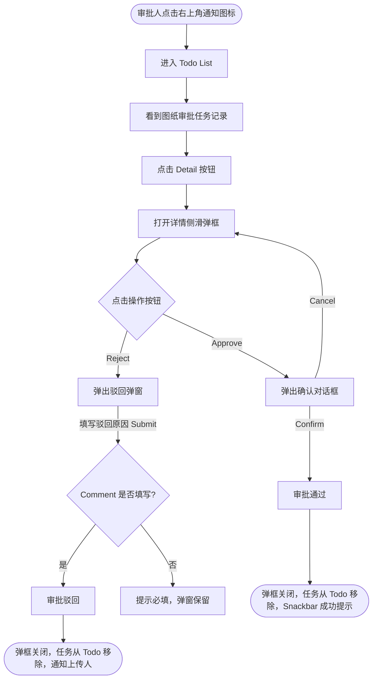

# 需求文档：PC 端 — 审批人图纸审批

> **使用说明**：本文档是整个交付链路的**单一事实源**。所有下游文档（UI/前端/后端/QA）从本文档派生。

---

## 1. 背景与目标

### 1.1 业务背景

图纸上传后须经过正式审批才能发布给现场人员。审批人需要在 PC 端 Todo 列表中及时处理待审批任务，以保障项目图纸管控流程的顺畅运转。

### 1.2 业务目标

让审批人在 PC 端能够快速发现、查看并完成图纸审批任务，做到不遗漏、操作明确（通过/驳回）。

### 1.3 非目标（Out of Scope）

- 图纸上传/发起审批（由 REQ-003A-pc 覆盖）
- 版本历史/确认记录查看（由 REQ-003C-pc 覆盖）
- Site Engineer 分配（由 REQ-003D-pc 覆盖）
- APP 端操作（由 REQ-003-app 覆盖）

---

## 2. 用户与角色

### 2.1 角色定义

| 角色 ID | 角色名 | 描述 | 典型场景 |
|--------|-------|------|---------|
| ROLE-002 | 审批人 | 负责审批图纸版本，通过或驳回 | 在 PC Todo 列表中打开审批任务，查看图纸文件，作出审批决定 |

### 2.2 用户故事（User Stories）

#### US-003B-001：处理待审批图纸任务

```
作为 审批人员
我想要 通过右上角通知图标进入 Todo List，点击待审批记录的 [Detail] 按钮，
        在详情侧滑弹框中查看图纸信息，并通过底部 [Approve] / [Reject] 按钮完成审批
以便 不遗漏审批任务，保障图纸管理流程的顺畅运转
```

**优先级**：P1
**所属史诗**：图纸管理全流程

---

## 3. 角色与权限矩阵

| 操作 | Drawing 团队成员 | 审批人 | 项目管理人员 | Site Engineer |
|-----|:--------------:|:-----:|:----------:|:------------:|
| 查看 Todo 审批任务卡片 | ❌ | ✅ | ❌ | ❌ |
| 通过审批 | ❌ | ✅ | ❌ | ❌ |
| 驳回审批（含填写意见） | ❌ | ✅ | ❌ | ❌ |

---

## 4. 核心实体与数据生命周期

### 4.1 实体清单

| 实体 ID | 实体名 | 描述 | 关键属性（业务语义） |
|--------|-------|------|------------------|
| ENT-002 | DrawingVersion（图纸版本） | 审批的操作对象 | 版本号、文件、审批人、状态（PENDING_APPROVAL / ACTIVE / REJECTED） |
| ENT-003 | ApprovalTask（审批任务） | Todo 列表中的一条任务 | 关联 DrawingVersion、任务状态、处理时间、审批意见 |

### 4.2 数据生命周期

**ApprovalTask 生命周期**：
1. 创建：DrawingVersion 上传成功后自动生成，状态为 PENDING
2. 流转：审批人通过 → APPROVED；审批人驳回 → REJECTED
3. 终态：APPROVED 或 REJECTED（不可撤销）

---

## 5. 状态机

### 5.1 ApprovalTask 状态定义

| 状态 ID | 状态名 | 描述 | 是否终态 |
|--------|-------|------|---------|
| S-001 | PENDING | 等待审批人处理 | 否 |
| S-002 | APPROVED | 已通过 | 是 |
| S-003 | REJECTED | 已驳回 | 是 |

### 5.2 状态转换表

| From | To | 触发动作 | 守卫条件 | 副作用 |
|------|-----|---------|---------|-------|
| S-001 | S-002 | 审批人点击 [Approve] 并确认 | — | DrawingVersion → ACTIVE；前版本 → DEPRECATED；通知 SE |
| S-001 | S-003 | 审批人点击 [Reject] 并提交驳回意见 | 驳回意见必填 | DrawingVersion → REJECTED；站内通知上传人 |

### 5.3 非法转换

- APPROVED → PENDING（已通过不可撤销）
- REJECTED → APPROVED（不可跳过重新审批直接通过）

---

## 6. 业务流程

### 6.1 主流程（审批图纸）

1. 审批人点击 PC 端右上角**通知图标**，展开下拉面板，进入 **Todo List** 标签页
2. 在待办列表中看到类型为 "Drawing Approval" 的任务记录（含图纸基本信息）
3. 点击任务行右侧的 **[Detail]** 按钮，右侧弹出**详情侧滑弹框**
4. 侧滑弹框展示图纸完整信息（Drawing Code、Drawing Name、版本号、Version Note、上传人、上传时间、图纸文件预览/下载链接）
5. 弹框底部操作区提供 **[Approve]**（主色按钮）和 **[Reject]**（次要按钮）两个操作按钮
6. **通过路径**：点击 [Approve] → 弹出确认对话框 "Confirm to approve this drawing version?" → 点击 [Confirm] → 审批通过，侧滑弹框关闭，该任务从 Todo List 中移除，Snackbar 提示 "Drawing approved successfully."
7. **驳回路径**：点击 [Reject] → 弹出驳回弹窗 → 填写驳回原因（Rejection Comment，必填）→ 点击 [Submit] → 审批驳回，侧滑弹框关闭，该任务从 Todo List 中移除，Snackbar 提示 "Drawing rejected."

### 6.2 主流程图（Mermaid）



### 6.3 异常流程

| 异常场景 | 触发条件 | 系统响应 | 用户感知 |
|---------|---------|---------|---------|
| 驳回原因为空提交 | Rejection Comment 字段为空时点击 [Submit] | 前端校验不通过，弹窗保留 | 字段下方显示必填提示 |
| 审批接口调用失败 | 网络异常 / 服务端错误 | Toast 错误提示 | 保留任务记录，可重试 |
| 已被他人处理（并发） | 同一任务被另一审批人处理 | 服务端返回 409，前端提示"任务已处理" | Toast 提示，任务记录从列表刷新消失 |

---

## 7. 功能需求详述

### 7.1 功能 F-001：通知图标与 Todo List 入口

**关联用户故事**：US-003B-001
**所属流程节点**：流程 6.1 步骤 1–2

- PC 端右上角展示**通知图标**（bell icon），有未读待办时显示红点数量徽标
- 点击通知图标展开下拉面板，面板包含 **Todo List** 标签页
- Todo List 以列表形式展示类型为 "Drawing Approval" 的任务记录
- 每条任务记录展示信息：
  - 任务类型标签：Drawing Approval
  - Drawing Code + Drawing Name
  - 版本号（如 V2）
  - 上传人姓名
  - 上传时间（相对时间 + Tooltip 绝对时间）
- 每条任务记录右侧提供 **[Detail]** 按钮
- 记录按上传时间倒序排列（最新靠前）
- 审批处理完成后，对应记录**立即从列表中移除**

### 7.2 功能 F-002：图纸审批详情侧滑弹框

**关联用户故事**：US-003B-001
**所属流程节点**：流程 6.1 步骤 3–5

- 点击任务记录的 [Detail] 按钮，从右侧滑出**详情侧滑弹框**（Drawer）
- 弹框展示图纸完整信息：
  - Drawing Code
  - Drawing Name
  - 版本号（Version）
  - Version Note（如有）
  - 上传人姓名
  - 上传时间
  - 图纸文件预览 / 下载链接
- 弹框**底部操作区**提供两个按钮：
  - **[Approve]**（主色按钮）：触发通过审批确认对话框
  - **[Reject]**（次要按钮）：触发驳回审批弹窗
- 点击弹框外部区域或右上角关闭图标：弹框关闭，任务记录保留

### 7.3 功能 F-003：通过审批确认对话框

**关联用户故事**：US-003B-001
**所属流程节点**：流程 6.1 步骤 6

- 标准 Element UI Confirm Dialog
- 文案：标题 "Confirm Approval"，内容 "Are you sure to approve this drawing version? This action cannot be undone."
- 按钮：[Confirm]（主色）、[Cancel]（次要）
- 点击 [Confirm] → 调用接口，成功后：侧滑弹框关闭，任务记录从 Todo List 移除，Snackbar 提示 "Drawing approved successfully."
- 点击 [Cancel] → 对话框关闭，返回侧滑弹框，无任何操作

### 7.4 功能 F-004：驳回审批弹窗

**关联用户故事**：US-003B-001
**所属流程节点**：流程 6.1 步骤 7

**输入字段**：

| 字段 | 类型 | 必填 | 约束 |
|-----|------|:---:|------|
| Rejection Comment | 多行文本 | ✅ | 最大 500 字 |

**处理逻辑**：
1. 点击 [Submit] 时前端校验 Rejection Comment 非空
2. 校验通过 → 调用驳回接口
3. 成功：驳回弹窗关闭，侧滑弹框关闭，任务记录从 Todo List 移除，Snackbar 提示 "Drawing rejected."；上传人收到站内通知（含驳回原因）
4. 失败：Toast 错误提示，弹窗保留

---

## 8. 验收标准（Acceptance Criteria）

### AC-003B-001：通知图标入口与 Todo List 展示

**关联用户故事**：US-003B-001

```
Given  图纸上传成功，审批人已登录 PC 端
When   审批人点击右上角通知图标，进入 Todo List
Then   列表中出现类型为 "Drawing Approval" 的任务记录，展示图纸编号、名称、版本号、
       上传人、上传时间，以及 [Detail] 按钮
```

### AC-003B-002：点击 Detail 打开详情侧滑弹框

**关联用户故事**：US-003B-001

```
Given  审批人在 Todo List 中看到待审批任务记录
When   点击该记录的 [Detail] 按钮
Then   右侧弹出详情侧滑弹框，展示图纸完整信息，底部显示 [Approve] 和 [Reject] 按钮
```

### AC-003B-003：通过审批 — 成功路径

**关联用户故事**：US-003B-001

```
Given  审批人在详情侧滑弹框中查看图纸信息
When   点击 [Approve] → 在确认对话框中点击 [Confirm]
Then   审批通过，侧滑弹框关闭，该任务记录从 Todo List 移除，
       Snackbar 提示 "Drawing approved successfully."，图纸版本状态变为 ACTIVE
```

### AC-003B-004：通过审批 — 取消确认

**关联用户故事**：US-003B-001

```
Given  审批人在详情侧滑弹框中点击 [Approve] 弹出确认对话框
When   点击 [Cancel]
Then   对话框关闭，返回侧滑弹框，任务记录保留，图纸状态不变
```

### AC-003B-005：驳回审批 — 成功路径

**关联用户故事**：US-003B-001

```
Given  审批人在详情侧滑弹框中查看图纸信息
When   点击 [Reject] → 在驳回弹窗中填写驳回原因 → 点击 [Submit]
Then   驳回成功，弹窗关闭，侧滑弹框关闭，该任务记录从 Todo List 移除，
       Snackbar 提示 "Drawing rejected."，图纸版本状态变为 REJECTED，上传人收到站内通知
```

### AC-003B-006：驳回审批 — Rejection Comment 为空

**关联用户故事**：US-003B-001

```
Given  审批人在驳回弹窗中未填写 Rejection Comment
When   点击 [Submit]
Then   前端校验不通过，字段下方显示必填提示，弹窗保留
```

### AC-003B-007：审批后 Todo 记录移除

**关联用户故事**：US-003B-001

```
Given  审批人完成通过或驳回操作
When   操作成功响应后
Then   对应的任务记录立即从 Todo List 中移除，列表自动更新
```

### AC-003B-008：审批后图纸列表状态更新

**关联用户故事**：US-003B-001

```
Given  审批人通过了版本 V2 的审批
When   任何用户刷新图纸列表
Then   该图纸状态显示为 ACTIVE，Current Version 显示为 V2，旧版本 V1 变为 DEPRECATED
```

### AC-003B-009：并发处理场景

**关联用户故事**：US-003B-001

```
Given  同一审批任务被另一审批人率先处理
When   当前审批人在侧滑弹框中点击 [Approve] 或 [Reject] 并提交
Then   服务端返回 409，前端 Toast 提示"任务已处理"，侧滑弹框关闭，
       该记录从 Todo List 刷新消失
```

---

## 9. 非功能需求

### 9.1 性能

| 指标 | 目标值 | 测量方式 |
|-----|-------|---------|
| Todo 列表加载 | ≤ 1.5s（50 条任务以内） | 手动 / Lighthouse |
| 审批操作响应 P95 | ≤ 2s | 后端监控 |

### 9.2 安全

- 鉴权方式：JWT
- 只有被指定为审批人的用户才能操作对应任务（服务端校验）
- 审批操作记录操作人、时间、审批意见

### 9.3 可访问性

- WCAG 等级：AA
- 确认对话框、驳回弹窗均支持键盘导航（Tab / Enter / Esc）

### 9.4 兼容性

- 浏览器：Chrome 100+、Edge 100+、Safari 15+
- 移动端：不支持（PC 专属）
- 国际化：中英双语

### 9.5 可观测性

- 关键埋点：点击 Approve、点击 Reject、审批成功、驳回成功、审批失败
- 错误监控：审批接口失败率 > 5% 告警

---

## 10. 数据量级与扩展性

| 维度 | 当前预期 | 1 年后 | 3 年后 |
|-----|---------|-------|-------|
| 单用户 Todo 审批任务数 | ≤ 50 条 | ≤ 200 条 | ≤ 500 条 |

---

## 11. 依赖与外部系统

| 依赖系统 | 用途 | 集成方式 | Owner |
|---------|------|---------|-------|
| REQ-003A-pc | 上传图纸触发审批任务创建 | 业务事件 | — |
| 消息通知系统 | 驳回时站内通知上传人 | 内部事件 | 后端 |
| REQ-003-shared | 接口定义、业务规则 | 文档引用 | — |

---

## 12. 数据迁移

无

---

## 13. 上线操作清单

### 13.1 上线前

- [ ] 审批人权限角色初始化
- [ ] Todo 列表审批任务类型配置确认
- [ ] 站内通知模板（驳回）确认

### 13.2 上线后

- [ ] 验证审批通过后图纸状态正确更新
- [ ] 验证驳回后上传人收到站内通知
- [ ] 并发审批场景测试

---

## 14. 灰度与发布策略

- 灰度方式：与 REQ-003A-pc 同批次灰度（依赖上传流程）
- 灰度比例：1 个试点项目 → 全量
- 回滚预案：关闭审批功能开关

---

## 15. 成功指标（北极星）

| 指标 | 当前基线 | 目标 | 测量周期 |
|-----|---------|------|---------|
| 审批任务完成率（7天内） | — | ≥ 90% | 每周 |
| 审批平均处理时长 | — | ≤ 24h | 每周 |

---

## 16. Open Questions

| OQ ID | 问题 | 影响 | Owner | 截止 |
|------|------|------|-------|------|
| OQ-001 | 审批人是否支持转交审批任务？ | F-001 操作区 | PM | — |
| OQ-002 | 驳回意见字符上限是否为 500？ | F-003 约束 | PM | — |

---

## 17. Figma / 原型链接

- Figma 设计稿：<!-- 填写 Todo 列表审批任务卡片 / 驳回弹窗 Frame 链接 -->

---

## 18. 变更历史

| 版本 | 日期 | 修改人 | 变更摘要 | 影响下游文档 |
|-----|------|-------|---------|------------|
| 0.1.0 | 2026-05-04 | agent | 从 REQ-003-pc 按 US-003B-001 拆分初稿 | 全部 |
| 0.2.0 | 2026-05-05 | agent | 重构审批交互路径：入口改为通知图标 → Todo List；任务记录新增 [Detail] 按钮；审批操作（Approve/Reject）移至详情侧滑弹框底部；驳回原因字段统一为 Rejection Comment；更新 F-001～F-004、AC-003B-001～AC-003B-009 | UI / 前端 / QA |

---

## 19. 备注

- 本文档从 REQ-003-pc.md 按用户故事拆分而来，原始共享业务规则与 API 定义见 [REQ-003-shared.md](../shared/REQ-003-shared.md)。
- 图纸管理其他用户故事见：REQ-003A-pc（上传）、REQ-003C-pc（查看历史/确认）、REQ-003D-pc（分配 SE）。
