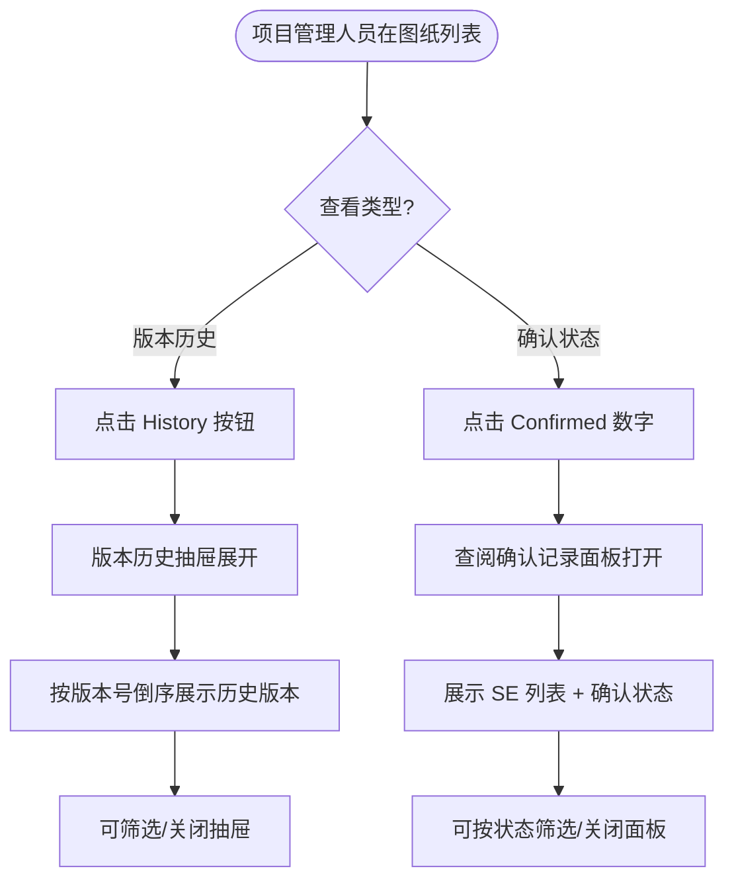

# 需求文档：PC 端 — 图纸版本历史与查阅确认记录

> **使用说明**：本文档是整个交付链路的**单一事实源**。所有下游文档（UI/前端/后端/QA）从本文档派生。

---

## 1. 背景与目标

### 1.1 业务背景

图纸在项目生命周期内会多次更新，项目管理人员需要随时了解每张图纸的完整变更历史、审批记录，以及现场 Site Engineer 的查阅确认情况，以便对图纸管控全流程保持可见性并及时跟进未确认人员。

### 1.2 业务目标

让项目管理人员在 PC 端能够快速查看图纸的版本历史（含审批记录）和每个版本的 SE 查阅确认状态，无需联系各方即可掌握当前进度。

### 1.3 非目标（Out of Scope）

- 图纸上传（由 REQ-003A-pc 覆盖）
- 审批操作（由 REQ-003B-pc 覆盖）
- SE 分配操作（由 REQ-003D-pc 覆盖）
- APP 端查阅确认（由 REQ-003-app 覆盖）

---

## 2. 用户与角色

### 2.1 角色定义

| 角色 ID | 角色名 | 描述 | 典型场景 |
|--------|-------|------|---------|
| ROLE-003 | 项目管理人员 | 对图纸管控全流程负责 | 查看版本历史、审批记录、SE 查阅确认状态 |

### 2.2 用户故事（User Stories）

#### US-003C-001：查看版本历史与审批记录

```
作为 项目管理人员
我想要 在 PC 端查看每张图纸的完整版本历史和每次审批的结果记录
以便 追溯图纸变更过程，核查审批合规性
```

**优先级**：P1
**所属史诗**：图纸管理全流程

#### US-003C-002：查看 Site Engineer 查阅确认状态

```
作为 项目管理人员
我想要 在 PC 端查看当前有效版本中每个被分配 Site Engineer 的查阅确认情况
以便 及时跟进未确认人员，确保现场人员都已知晓最新图纸
```

**优先级**：P1
**所属史诗**：图纸管理全流程

---

## 3. 角色与权限矩阵

| 操作 | Drawing 团队成员 | 审批人 | 项目管理人员 | Site Engineer |
|-----|:--------------:|:-----:|:----------:|:------------:|
| 查看版本历史抽屉 | ✅ | ✅ | ✅ | ❌ |
| 查看查阅确认记录面板 | ✅ | ✅ | ✅ | ❌ |

---

## 4. 核心实体与数据生命周期

### 4.1 实体清单

| 实体 ID | 实体名 | 描述 | 关键属性（业务语义） |
|--------|-------|------|------------------|
| ENT-002 | DrawingVersion | 图纸版本主记录 | 版本号、文件、状态、审批人、审批时间、审批意见 |
| ENT-004 | SEConfirmation | SE 查阅确认记录 | 关联 DrawingVersion + SE 用户、是否已确认、确认时间 |

### 4.2 数据生命周期

**SEConfirmation 生命周期**：
1. 创建：图纸版本审批通过后，为所有已分配 SE 自动创建确认记录，初始状态为 UNCONFIRMED
2. 流转：SE 在 APP 端打开并确认图纸 → CONFIRMED
3. 终态：CONFIRMED（不可撤销）

---

## 5. 状态机

### 5.1 SEConfirmation 状态定义

| 状态 ID | 状态名 | 描述 | 是否终态 |
|--------|-------|------|---------|
| S-001 | UNCONFIRMED | SE 尚未查阅确认 | 否 |
| S-002 | CONFIRMED | SE 已查阅确认 | 是 |

### 5.2 状态转换表

| From | To | 触发动作 | 守卫条件 | 副作用 |
|------|-----|---------|---------|-------|
| S-001 | S-002 | SE 在 APP 端打开图纸并点击确认 | — | 确认时间记录；列表中该 SE 对应行状态更新 |

### 5.3 非法转换

- CONFIRMED → UNCONFIRMED（已确认不可撤销）

---

## 6. 业务流程

### 6.1 主流程（查看版本历史）

1. 项目管理人员在图纸列表中找到目标图纸
2. 点击 Actions 列中的 [History] 按钮（或相应入口）
3. 页面右侧弹出"版本历史"抽屉（Drawer），默认展示所有历史版本列表
4. 版本列表按版本号倒序排列，每条记录展示：版本号、状态标签、上传人、上传时间、审批人、审批时间、审批意见（REJECTED 时显示驳回理由）
5. 关闭抽屉：点击右上角 [×] 或点击遮罩层

### 6.2 主流程（查看 SE 查阅确认状态）

1. 项目管理人员在图纸列表中找到目标图纸（Status = ACTIVE）
2. 点击 Confirmed 列中的"x/y"数字链接
3. 页面弹出"查阅确认记录"面板（Dialog 或 Drawer）
4. 面板展示：当前有效版本号，SE 列表（姓名、角色/工种、确认状态标签、确认时间）
5. 支持按确认状态筛选（All / Confirmed / Unconfirmed）
6. 关闭面板

### 6.3 主流程图（Mermaid）



### 6.4 异常流程

| 异常场景 | 触发条件 | 系统响应 | 用户感知 |
|---------|---------|---------|---------|
| 图纸无版本历史 | 刚创建的图纸 | 抽屉展示空状态 | 提示"暂无历史版本" |
| 图纸 Status ≠ ACTIVE | 点击 Confirmed 列 | Confirmed 列显示 —，不可点击 | 不展示链接 |
| 接口加载失败 | 网络异常 | 面板内显示错误提示 + 重试按钮 | Toast 提示 |

---

## 7. 功能需求详述

### 7.1 功能 F-001：版本历史抽屉（History Drawer）

**关联用户故事**：US-003C-001
**所属流程节点**：流程 6.1

- 触发入口：图纸列表 Actions 列 [History] 按钮（所有状态均可点）
- 抽屉宽度：<!-- TODO: 确认宽度，建议 480px 或 600px -->
- 标题："{drawingCode} {drawingName} — Version History"
- 版本列表（按版本号倒序）：

| 列 | 说明 |
|----|------|
| 版本号 | Vn，当前有效版本加 ACTIVE 标签 |
| 状态 | 颜色标签（ACTIVE / PENDING_APPROVAL / REJECTED / DEPRECATED） |
| 上传人 | 用户姓名 |
| 上传时间 | 绝对时间 yyyy-MM-dd HH:mm |
| 审批人 | 用户姓名 |
| 审批时间 | 绝对时间（PENDING_APPROVAL 时显示 —） |
| 审批意见 | 仅 REJECTED 时显示驳回原因；其余显示 — |

- 分页：单图纸版本数量通常 ≤ 50，先无分页，超过 20 条时分页（每页 20）

### 7.2 功能 F-002：查阅确认记录面板（Confirmation Panel）

**关联用户故事**：US-003C-002
**所属流程节点**：流程 6.2

- 触发入口：图纸列表 Confirmed 列的"x/y"数字（Status = ACTIVE 时可点）
- 面板标题："{drawingCode} {drawingName} — SE Confirmation（V{n}）"
- 顶部：当前有效版本号、已确认数 / 总分配 SE 数（x/y）
- 筛选器：[All] [Confirmed] [Unconfirmed]（默认全部）
- SE 列表：

| 列 | 说明 |
|----|------|
| 姓名 | SE 用户名 |
| 角色/工种 | <!-- TODO: 是否展示此字段 --> |
| 状态 | CONFIRMED（绿色）/ UNCONFIRMED（灰色）标签 |
| 确认时间 | yyyy-MM-dd HH:mm；未确认显示 — |

---

## 8. 验收标准（Acceptance Criteria）

### AC-003C-001：版本历史抽屉 — 正常展示

**关联用户故事**：US-003C-001

```
Given  图纸已有至少 2 个历史版本
When   点击该图纸的 [History] 按钮
Then   版本历史抽屉打开，按版本号倒序展示所有版本，当前有效版本标注 ACTIVE 标签
```

### AC-003C-002：版本历史 — REJECTED 版本显示驳回意见

```
Given  某图纸有一个 REJECTED 版本，且驳回时填写了意见
When   打开该图纸版本历史抽屉
Then   REJECTED 版本行的"审批意见"列展示驳回原因文本
```

### AC-003C-003：版本历史 — 空状态

```
Given  图纸刚创建，尚未有任何版本
When   打开版本历史抽屉
Then   抽屉展示空状态，提示"暂无历史版本"
```

### AC-003C-004：查阅确认记录 — 正常展示

**关联用户故事**：US-003C-002

```
Given  图纸状态为 ACTIVE，且已分配至少 1 名 SE
When   点击 Confirmed 列的"x/y"数字
Then   查阅确认记录面板打开，展示所有分配 SE 的姓名和确认状态，顶部显示"x/y"汇总数
```

### AC-003C-005：查阅确认记录 — 筛选

```
Given  查阅确认记录面板已打开，有 Confirmed 和 Unconfirmed 的 SE
When   点击 [Unconfirmed] 筛选器
Then   列表仅展示尚未确认的 SE 记录
```

### AC-003C-006：Confirmed 列 — 非 ACTIVE 状态不可点

```
Given  图纸状态为 PENDING_APPROVAL 或 REJECTED
When   用户查看 Confirmed 列
Then   显示 —，无可点击链接
```

---

## 9. 非功能需求

### 9.1 性能

| 指标 | 目标值 | 测量方式 |
|-----|-------|---------|
| 版本历史抽屉加载 | ≤ 1.5s（50 条版本） | 手动 |
| 确认记录面板加载 | ≤ 1.5s（100 条 SE） | 手动 |

### 9.2 安全

- 鉴权方式：JWT
- 只有项目内有权限用户可查看版本历史和确认记录（服务端校验）

### 9.3 可访问性

- WCAG 等级：AA
- 抽屉/面板支持 Esc 键关闭

### 9.4 兼容性

- 浏览器：Chrome 100+、Edge 100+、Safari 15+
- 移动端：不支持（PC 专属）
- 国际化：中英双语

### 9.5 可观测性

- 关键埋点：打开版本历史抽屉、打开确认记录面板、使用筛选器

---

## 10. 数据量级与扩展性

| 维度 | 当前预期 | 1 年后 | 3 年后 |
|-----|---------|-------|-------|
| 版本数/图纸 | ≤ 20 个 | ≤ 50 个 | 不限 |
| 分配 SE 数/图纸 | ≤ 30 人 | ≤ 100 人 | ≤ 200 人 |

---

## 11. 依赖与外部系统

| 依赖系统 | 用途 | 集成方式 | Owner |
|---------|------|---------|-------|
| REQ-003A-pc | 版本数据来源 | 业务数据 | — |
| REQ-003B-pc | 审批记录来源 | 业务数据 | — |
| REQ-003D-pc | SE 分配数据来源 | 业务数据 | — |
| REQ-003-shared | 接口定义、业务规则 | 文档引用 | — |

---

## 12. 数据迁移

无

---

## 13. 上线操作清单

### 13.1 上线前

- [ ] 版本历史接口联调确认
- [ ] SE 确认记录接口联调确认

### 13.2 上线后

- [ ] 验证版本历史数据准确
- [ ] 验证确认记录实时更新

---

## 14. 灰度与发布策略

- 灰度方式：与 REQ-003A-pc 同批次灰度
- 灰度比例：1 个试点项目 → 全量
- 回滚预案：隐藏 History 按钮和 Confirmed 列入口

---

## 15. 成功指标（北极星）

| 指标 | 当前基线 | 目标 | 测量周期 |
|-----|---------|------|---------|
| 版本历史查看使用率 | — | ≥ 50% 的项目管理人员/周 | 每周 |
| 确认记录面板查看率 | — | ≥ 60% 的 ACTIVE 图纸被查看 | 每周 |

---

## 16. Open Questions

| OQ ID | 问题 | 影响 | Owner | 截止 |
|------|------|------|-------|------|
| OQ-001 | 查阅确认记录面板是否展示 SE 的角色/工种字段？ | F-002 列定义 | PM | — |
| OQ-002 | 版本历史抽屉宽度是否固定？ | UI 设计 | UI | — |

---

## 17. Figma / 原型链接

- Figma 设计稿：<!-- 填写版本历史抽屉 / 查阅确认记录面板 Frame 链接 -->

---

## 18. 变更历史

| 版本 | 日期 | 修改人 | 变更摘要 | 影响下游文档 |
|-----|------|-------|---------|------------|
| 0.1.0 | 2026-05-04 | agent | 从 REQ-003-pc 按 US-003C-001/002 拆分初稿 | 全部 |

---

## 19. 备注

- 本文档从 REQ-003-pc.md 按用户故事拆分而来，原始共享业务规则与 API 定义见 [REQ-003-shared.md](../shared/REQ-003-shared.md)。
- 图纸管理其他用户故事见：REQ-003A-pc（上传）、REQ-003B-pc（审批）、REQ-003D-pc（分配 SE）。
