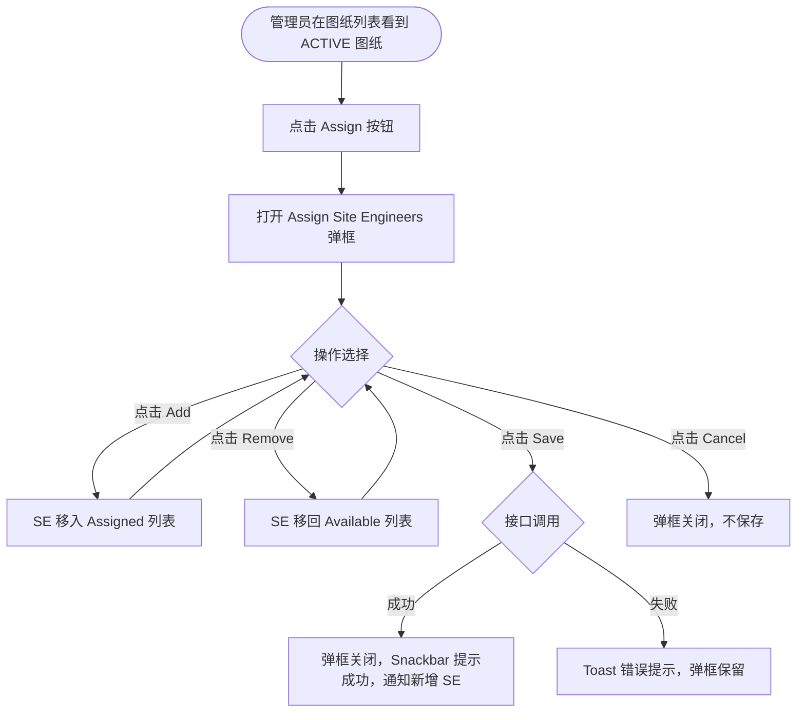

# 需求文档：PC 端 — 项目管理员图纸 SE 分配

> **使用说明**：本文档是整个交付链路的**单一事实源**。所有下游文档（UI/前端/后端/QA）从本文档派生。

---

## 1. 背景与目标

### 1.1 业务背景

图纸经审批通过（状态变为 ACTIVE）后，并非自动对所有 Site Engineer 可见。项目管理员需要在 PC 端图纸列表的操作区，通过 [Assign] 按钮将指定图纸手动分配给对应的 Site Engineer，被分配的 SE 才会收到通知并在 APP 端看到该图纸。

### 1.2 业务目标

让项目管理员在 PC 端能够快速、准确地将审批通过的图纸分配给对应的 Site Engineer，确保现场人员及时获得最新图纸并留下可追溯的分配记录。

### 1.3 非目标（Out of Scope）

- 图纸上传/发起审批（由 REQ-003A-pc 覆盖）
- 图纸审批通过/驳回（由 REQ-003B-pc 覆盖）
- 版本历史/查阅确认记录（由 REQ-003C-pc 覆盖）
- APP 端图纸查看与确认（由 REQ-003-app 覆盖）

---

## 2. 用户与角色

### 2.1 角色定义

| 角色 ID | 角色名 | 描述 | 典型场景 |
|--------|-------|------|---------|
| ROLE-003 | 项目管理员 | 负责图纸分配，决定哪些 SE 可见该图纸 | 图纸审批通过后，在图纸列表中点击 [Assign] 打开分配弹框，选择 SE 并保存 |

### 2.2 用户故事（User Stories）

#### US-003D-001：将审批通过的图纸分配给 Site Engineer

```
作为 项目管理员
我想要 在图纸列表的操作列中点击 [Assign] 按钮，通过弹框将审批通过的图纸分配给对应的 SE
以便 指定的 SE 能在 APP 端收到通知并查看最新版图纸，保障现场施工使用正确版本
```

**优先级**：P1
**所属史诗**：图纸管理全流程

---

## 3. 角色与权限矩阵

| 操作 | Drawing 团队成员 | 审批人 | 项目管理员 | Site Engineer |
|-----|:--------------:|:-----:|:----------:|:------------:|
| 查看图纸列表中的 [Assign] 按钮 | ❌ | ❌ | ✅ | ❌ |
| 打开 Assign SE 弹框 | ❌ | ❌ | ✅ | ❌ |
| 添加 / 移除已分配 SE | ❌ | ❌ | ✅ | ❌ |
| 保存分配结果 | ❌ | ❌ | ✅ | ❌ |

---

## 4. 核心实体与数据生命周期

### 4.1 实体清单

| 实体 ID | 实体名 | 描述 | 关键属性（业务语义） |
|--------|-------|------|------------------|
| ENT-002 | DrawingVersion（图纸版本） | 分配的操作对象，状态须为 ACTIVE | 版本号、状态 |
| ENT-004 | DrawingAssignment（图纸分配记录） | 记录某图纸版本分配给哪些 SE | drawingId、drawingVersionId、assignedUserIds、assignedAt、assignedBy |

### 4.2 数据生命周期

**DrawingAssignment 生命周期**：
1. 创建：项目管理员首次保存分配结果时创建
2. 更新：再次打开 [Assign] 弹框修改 SE 列表并保存时，覆盖更新（以最新保存结果为准）
3. 读取：APP 端 SE 查询"我被分配的图纸"时读取
4. 终态：无终态，可随时变更

---

## 5. 状态机

本需求无独立状态机。分配操作直接影响 SE 的图纸可见性：

- 分配成功 → SE 在 APP 端可见该图纸版本，收到站内通知
- 移除分配 → SE 在 APP 端不再可见（历史确认记录保留）

---

## 6. 业务流程

### 6.1 主流程（分配 SE）

1. 项目管理员在图纸列表中找到状态为 ACTIVE 的图纸
2. 点击该行操作列的 **[Assign]** 按钮
3. 弹出 **Assign Site Engineers** 弹框：
   - 标题：`Assign Site Engineers — {Drawing Name}`
   - 左侧面板 **Assigned**：展示当前已分配的 SE 列表（含数量，如 `Assigned (2)`）；含姓名搜索框；无数据时显示 "No Data"
   - 右侧面板 **Available**：展示项目内所有可分配的 SE 列表（含数量，如 `Available (6)`）；含姓名搜索框；每条记录右侧有 **[Add]** 按钮
4. 管理员在右侧 Available 列表中点击 **[Add]**，该 SE 移入左侧 Assigned 列表，Assigned 计数 +1，Available 计数 -1
5. 已在 Assigned 列表中的 SE 可点击 **[Remove]** 移回 Available 列表
6. 点击 **[Save]**：保存分配结果，弹框关闭，Snackbar 提示 "SE assignment saved successfully."，被新增的 SE 收到站内通知
7. 点击 **[Cancel]**：弹框关闭，本次修改不保存

### 6.2 主流程图（Mermaid）



### 6.3 异常流程

| 异常场景 | 触发条件 | 系统响应 | 用户感知 |
|---------|---------|---------|---------|
| 保存接口失败 | 网络异常 / 服务端错误 | Toast 错误提示 | 弹框保留，可重试 |
| 图纸状态不为 ACTIVE | 管理员对非 ACTIVE 图纸操作（仅理论场景，前端已做按钮置灰） | 服务端返回 400 | Toast 提示操作无效 |
| SE 列表为空（项目内无 SE） | 项目尚未添加 SE 成员 | Available 面板显示空状态 "No Data" | 管理员知悉，无法分配 |

---

## 7. 功能需求详述

### 7.1 功能 F-001：图纸列表 [Assign] 按钮

**关联用户故事**：US-003D-001
**所属流程节点**：流程 6.1 步骤 1–2

- 图纸列表每行 Actions 列增加 **[Assign]** 按钮
- **仅当图纸状态为 ACTIVE 时** [Assign] 按钮可点击；其他状态（PENDING_APPROVAL / REJECTED / DEPRECATED）下按钮置灰，Tooltip 说明原因（如 "Only available for ACTIVE drawings"）
- 点击后打开 Assign Site Engineers 弹框

### 7.2 功能 F-002：Assign Site Engineers 弹框

**关联用户故事**：US-003D-001
**所属流程节点**：流程 6.1 步骤 3–6

#### 弹框整体

- 弹框类型：Modal Dialog（非侧滑，居中展示）
- 标题：`Assign Site Engineers — {Drawing Name}`
- 右上角关闭图标（等同 [Cancel]）
- 底部按钮区：[Cancel]（次要）、[Save]（主色）

#### 左侧面板：Assigned

| 元素 | 说明 |
|-----|------|
| 面板标题 | `Assigned ({n})`，n 为当前已分配 SE 数量，实时更新 |
| 搜索框 | placeholder：`Search engineer name`，实时过滤左侧列表 |
| SE 列表 | 每条展示：头像（姓名首字母缩写色块）、姓名、角色标签 "Site Engineer"、**[Remove]** 按钮 |
| 空状态 | 无已分配 SE 时显示 "No Data" |

#### 右侧面板：Available

| 元素 | 说明 |
|-----|------|
| 面板标题 | `Available ({n})`，n 为当前可分配 SE 数量，实时更新 |
| 搜索框 | placeholder：`Search engineer name`，实时过滤右侧列表 |
| SE 列表 | 每条展示：头像（姓名首字母缩写色块）、姓名、角色标签 "Site Engineer"、**[Add]** 按钮 |
| 空状态 | 所有 SE 均已分配时显示 "No Data" |

#### 交互规则

- 点击 [Add]：该 SE 从 Available 移入 Assigned，两侧计数实时更新，**不立即调用接口**（仅本地状态变更，点击 [Save] 后统一提交）
- 点击 [Remove]：该 SE 从 Assigned 移回 Available，两侧计数实时更新
- 搜索框仅过滤当前面板展示列表，不影响另一侧
- 弹框打开时，初始化数据：Assigned 列表 = 该图纸当前已保存的分配 SE；Available 列表 = 项目内所有 SE 去除已分配的

### 7.3 功能 F-003：保存分配结果

**关联用户故事**：US-003D-001
**所属流程节点**：流程 6.1 步骤 6

- 点击 [Save] → 以 Assigned 列表当前结果调用分配接口（覆盖保存）
- 成功：
  - 弹框关闭
  - Snackbar 提示 "SE assignment saved successfully."
  - 对**本次新增**的 SE 发送站内通知（含图纸名称、版本号、可在 APP 查看的引导）
  - 对**本次移除**的 SE 不发送通知
- 失败：Toast 错误提示，弹框保留，可重试

---

## 8. 验收标准（Acceptance Criteria）

### AC-003D-001：[Assign] 按钮仅对 ACTIVE 图纸可点击

```
Given  图纸列表中存在不同状态的图纸
When   管理员查看操作列
Then   状态为 ACTIVE 的图纸行 [Assign] 按钮可点击；
       其他状态的图纸行 [Assign] 按钮置灰，hover 显示 Tooltip 说明原因
```

### AC-003D-002：打开弹框展示正确的初始数据

```
Given  某图纸已分配了 2 名 SE，项目共有 6 名 SE
When   管理员点击该图纸的 [Assign] 按钮
Then   弹框打开，左侧 Assigned (2) 展示已分配的 2 名 SE，
       右侧 Available (4) 展示剩余 4 名 SE
```

### AC-003D-003：点击 [Add] 将 SE 移入 Assigned

```
Given  Assign 弹框已打开
When   管理员点击右侧某 SE 的 [Add] 按钮
Then   该 SE 从右侧 Available 列表消失，出现在左侧 Assigned 列表中；
       Assigned 计数 +1，Available 计数 -1
```

### AC-003D-004：点击 [Remove] 将 SE 移回 Available

```
Given  Assign 弹框已打开，左侧 Assigned 列表有 SE
When   管理员点击左侧某 SE 的 [Remove] 按钮
Then   该 SE 从左侧 Assigned 列表消失，出现在右侧 Available 列表中；
       Assigned 计数 -1，Available 计数 +1
```

### AC-003D-005：搜索框实时过滤对应面板列表

```
Given  Assign 弹框已打开
When   管理员在右侧搜索框输入部分姓名
Then   右侧列表实时过滤，仅显示姓名匹配的 SE；左侧列表不受影响
```

### AC-003D-006：保存分配 — 成功路径

```
Given  管理员在弹框中完成 SE 选择
When   点击 [Save]
Then   弹框关闭，Snackbar 提示 "SE assignment saved successfully."；
       本次新增的 SE 收到站内通知；图纸分配记录更新为最新 Assigned 列表
```

### AC-003D-007：保存分配 — 接口失败

```
Given  管理员点击 [Save]，服务端返回错误
When   接口调用失败
Then   弹框保留，Toast 提示错误信息，管理员可重试
```

### AC-003D-008：点击 [Cancel] 不保存

```
Given  管理员在弹框中对 SE 列表做了修改
When   点击 [Cancel] 或右上角关闭图标
Then   弹框关闭，分配结果不变，修改丢弃
```

### AC-003D-009：空状态展示

```
Given  左侧 Assigned 列表为空 / 右侧 Available 列表为空
When   弹框展示对应面板
Then   对应面板显示 "No Data" 空状态提示
```

---

## 9. 非功能需求

### 9.1 性能

| 指标 | 目标值 | 测量方式 |
|-----|-------|---------|
| 弹框打开（加载 SE 列表） | ≤ 1s | 手动 / Lighthouse |
| 保存分配接口响应 P95 | ≤ 2s | 后端监控 |

### 9.2 安全

- 鉴权方式：JWT
- 服务端校验操作人是否具备项目管理员权限
- 服务端校验图纸状态是否为 ACTIVE，防止绕过前端限制

### 9.3 可访问性

- WCAG 等级：AA
- 弹框支持键盘导航（Tab / Enter / Esc）
- [Add] / [Remove] 按钮支持 Enter 触发

### 9.4 兼容性

- 浏览器：Chrome 100+、Edge 100+、Safari 15+
- 移动端：不支持（PC 专属）
- 国际化：中英双语

### 9.5 可观测性

- 关键埋点：打开 Assign 弹框、点击 Add、点击 Remove、保存分配成功、保存分配失败
- 错误监控：分配接口失败率 > 5% 告警

---

## 10. 数据量级与扩展性

| 维度 | 当前预期 | 1 年后 | 3 年后 |
|-----|---------|-------|-------|
| 单项目 SE 人数 | ≤ 50 人 | ≤ 200 人 | ≤ 500 人 |
| 单图纸已分配 SE 数 | ≤ 20 人 | ≤ 50 人 | ≤ 100 人 |

---

## 11. 依赖与外部系统

| 依赖系统 | 用途 | 集成方式 | Owner |
|---------|------|---------|-------|
| REQ-003B-pc | 图纸审批通过后状态变为 ACTIVE，触发 [Assign] 按钮可操作 | 业务事件 | — |
| 消息通知系统 | 保存分配时向新增 SE 发送站内通知 | 内部事件 | 后端 |
| REQ-003-shared | 接口定义、业务规则 | 文档引用 | — |

---

## 12. 数据迁移

无

---

## 13. 上线操作清单

### 13.1 上线前

- [ ] 确认项目管理员角色权限配置
- [ ] 确认 SE 用户列表接口（按项目过滤）联调完成
- [ ] 站内通知模板（SE 分配通知）确认

### 13.2 上线后

- [ ] 验证分配保存后 SE 在 APP 端可见图纸
- [ ] 验证新增 SE 收到站内通知
- [ ] 验证移除 SE 后 APP 端图纸不可见

---

## 14. 灰度与发布策略

- 灰度方式：与 REQ-003B-pc 同批次灰度（依赖审批通过后 ACTIVE 状态）
- 灰度比例：1 个试点项目 → 全量
- 回滚预案：关闭 [Assign] 按钮入口开关

---

## 15. 成功指标（北极星）

| 指标 | 当前基线 | 目标 | 测量周期 |
|-----|---------|------|---------|
| 图纸审批通过后 24h 内完成分配率 | — | ≥ 85% | 每周 |
| SE 收到分配通知后 48h 内 APP 查阅率 | — | ≥ 70% | 每周 |

---

## 16. Open Questions

| OQ ID | 问题 | 影响 | Owner | 截止 |
|------|------|------|-------|------|
| OQ-001 | 移除已分配 SE 后，该 SE 在 APP 端是否立即不可见？还是当前会话仍可见？ | F-003 副作用 | PM | — |
| OQ-002 | 是否需要支持批量分配（一次给多张图纸分配同一组 SE）？ | F-001 扩展 | PM | — |
| OQ-003 | Available 列表是否只显示本项目的 SE，还是系统全部 SE？ | F-002 数据范围 | PM | — |

---

## 17. Figma / 原型链接

- Figma 设计稿：<!-- 填写 Assign Site Engineers 弹框 Frame 链接 -->

---

## 18. 变更历史

| 版本 | 日期 | 修改人 | 变更摘要 | 影响下游文档 |
|-----|------|-------|---------|------------|
| 0.1.0 | 2026-05-05 | agent | 新建，覆盖 US-003D-001 图纸 SE 分配全流程 | 全部 |

---

## 19. 备注

- 本文档从图纸管理全流程拆分而来，原始共享业务规则与 API 定义见 [REQ-003-shared.md](../shared/REQ-003-shared.md)。
- 图纸管理其他用户故事见：REQ-003A-pc（上传）、REQ-003B-pc（审批）、REQ-003C-pc（历史/确认记录）。
