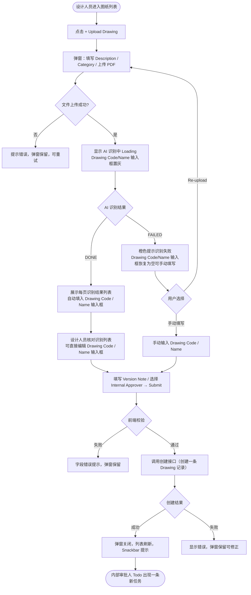
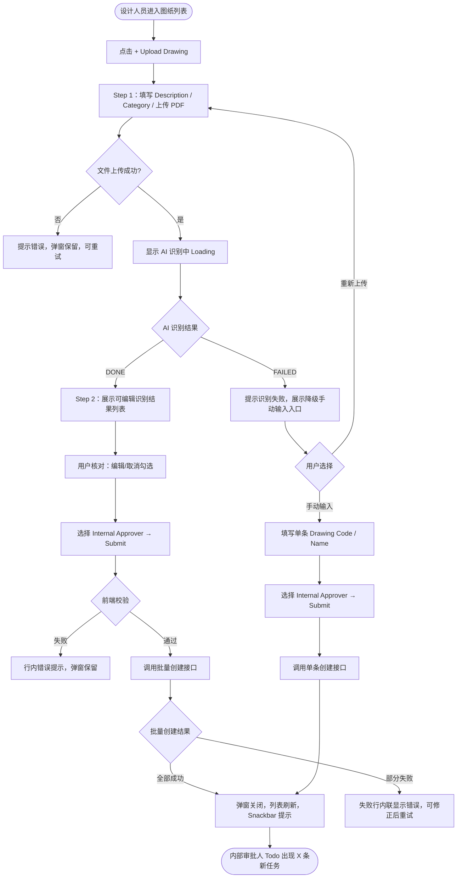

# 需求文档：PC 端 — 图纸上传 AI 自动识别页信息

> **使用说明**：本文档是整个交付链路的**单一事实源**。所有下游文档（UI/前端/后端/QA）从本文档派生。
> 任何字段标注 `<!-- TODO: ... -->` 表示 PM 待补充，下游 agent 看到 TODO 不应编造，应保留并向上反馈。

---

## 1. 背景与目标

### 1.1 业务背景

当前 REQ-003A-pc 定义的上传弹窗需要设计人员手动输入 Drawing Code 和 Drawing Name。

在实际工程场景中，**一个 PDF 图纸文件包含多页，每一页都是一张独立的图纸，图框内印有该页自己唯一的 Drawing No（图纸编号）和 Drawing Name（图纸名称）**，各页编号和名称互不相同。

现状痛点：
- 设计人员需要翻开 PDF 逐页查看，手动抄录想要登记的那页图纸的 Drawing No / Name，容易出错
- 无法在提交前直观地确认 PDF 内所有页的内容，存在上传错误文件的风险

### 1.2 业务目标

在新建图纸的上传弹窗中，设计人员填写 Drawing Description、选择 Category 并上传 PDF 文件后：
1. 系统调用 AI 服务自动识别该 PDF 的**总页数**，以及**每一页图框中各自唯一的 Drawing No 和 Drawing Name**
2. 识别结果以列表形式完整呈现（每行 = 一页图纸 = 一个唯一的 Drawing No + Drawing Name），供设计人员核对 PDF 内容是否正确、是否上传了正确文件
3. AI 将识别结果自动填入 Drawing Code 和 Drawing Name 输入框（<!-- TODO: 多页各有不同编号时填入规则见 OQ-002 -->），设计人员核对后可直接确认或修改，然后提交

最终创建**一条 Drawing 记录**（对应该 PDF 文件），上传流程与 REQ-003A 保持一致。

目标效果：**设计人员不再需要手动翻看 PDF 逐页查找编号，AI 自动把每页图纸的信息列出来，核对确认即可提交。**

### 1.3 非目标（Out of Scope）

- 一次上传创建多条 Drawing 记录（每次上传仍只创建**一条**记录）
- AI 识别引擎本身的训练与维护（由后端/AI 团队负责）
- 上传新版本场景（本期仅支持新建图纸时使用 AI 识别；上传新版本沿用 REQ-003A 流程）
- APP 端操作（APP 不含上传功能）
- DWG / DXF / PNG / JPG 等非 PDF 格式的 AI 识别（本期仅支持 PDF）
- 审批流程本身的变更（沿用 REQ-007-shared 两级审批逻辑）

---

## 2. 用户与角色

### 2.1 角色定义

| 角色 ID | 角色名 | 描述 | 典型场景 |
|--------|-------|------|---------|
| ROLE-001 | 设计人员（Designer） | 图纸责任人，负责上传图纸并发起内部审批 | 上传 PDF 后，通过 AI 识别结果列表核对文件内容，确认 Drawing Code / Name 后提交 |
| ROLE-002 | 内部审批人 | 接收内部审批任务的技术人员 | 提交后在 Todo 列表中收到待审批任务（与 REQ-003A 一致） |

### 2.2 用户故事（User Stories）

#### US-003E-001：上传 PDF 后 AI 自动识别并填写图纸信息

```
作为 设计人员（Designer）
我想要 上传 PDF 文件后，系统自动识别每页的 Drawing No 和 Drawing Name 并以列表呈现，
        同时将识别结果自动填入 Drawing Code / Drawing Name 输入框
以便 我不需要手动翻看 PDF 抄录信息，只需核对 AI 识别结果后确认提交，减少录入错误
```

**优先级**：P1
**所属史诗**：图纸管理全流程

#### US-003E-002：手动修正 AI 识别错误

```
作为 设计人员（Designer）
我想要 当 AI 识别结果有误时，直接在 Drawing Code / Drawing Name 输入框中修改内容
以便 确保最终提交的图纸信息与实际文件一致
```

**优先级**：P1
**所属史诗**：图纸管理全流程

---

## 3. 角色与权限矩阵

| 操作 | 设计人员（Designer） | 内部审批人 | 项目管理人员 | Site Engineer |
|-----|:--------------:|:-----:|:----------:|:------------:|
| 上传 PDF 触发 AI 识别 | ✅ | ❌ | ❌ | ❌ |
| 查看 AI 识别结果列表 | ✅ | ❌ | ❌ | ❌ |
| 编辑 Drawing Code / Name（AI 预填值） | ✅ | ❌ | ❌ | ❌ |
| 提交创建图纸记录并发起审批 | ✅ | ❌ | ❌ | ❌ |

---

## 4. 核心实体与数据生命周期

### 4.1 实体清单

| 实体 ID | 实体名 | 描述 | 关键属性（业务语义） |
|--------|-------|------|------------------|
| ENT-001 | Drawing（图纸） | 图纸主记录，一个 PDF 文件对应一条记录 | Drawing Code（用户确认后的最终编号）、Drawing Name（用户确认后的最终名称）、Category、Description、当前版本号、Status、**ai_recognition_job_id**（关联的 AIRecognitionJob，可为空——AI 识别成功时必填；降级手动上传时为空） |
| ENT-002 | DrawingVersion（图纸版本） | 该 Drawing 的首版本（V0） | 版本号、PDF 文件（含所有页）、内部审批人、上传人、状态 `PENDING_INTERNAL` |
| ENT-003 | AIRecognitionJob（AI 识别任务） | 一次 PDF 上传对应一个识别任务，记录识别过程与结果 | 任务 ID、文件 URL、总页数、识别状态（`PENDING` / `PROCESSING` / `DONE` / `FAILED`）、各页识别结果 JSON（每页含**页码、缩略图 URL、Drawing No、Drawing Name、识别置信度**）、创建时间 |

### 4.2 实体关系

- 一个 AIRecognitionJob 对应一次 PDF 上传（1:1）
- 一个 AIRecognitionJob 包含多条页级识别结果（1:N，每页一条），仅用于展示核对，**不对应多条 Drawing**
- 用户确认提交后，创建**一条 Drawing + 一条 DrawingVersion**，与 REQ-003A 逻辑完全一致
- **Drawing 记录通过 `ai_recognition_job_id` 持久关联其来源的 AIRecognitionJob**，创建后可随时通过该关联查看每页识别结果（页码、Drawing No、Drawing Name）；降级手动上传时此字段为空

### 4.3 数据生命周期

**AIRecognitionJob 生命周期**：
1. 创建：设计人员上传 PDF 文件后，服务端异步创建识别任务，状态为 `PENDING`
2. 流转：AI 服务处理中 → `PROCESSING`；识别完成 → `DONE`；识别失败 → `FAILED`
3. 终态：`DONE`（用户提交后任务归档）、`FAILED`（提示用户手动输入）
4. 保留期限：<!-- TODO: 识别任务记录保留多久，是否需要定期清理 -->

**Drawing + DrawingVersion 生命周期**：
- 与 REQ-003A 中的创建生命周期完全一致，初始状态 `PENDING_INTERNAL`

---

## 5. 状态机

### 5.1 AIRecognitionJob 状态定义

| 状态 ID | 状态名 | 描述 | 是否终态 |
|--------|-------|------|---------|
| S-001 | PENDING | 文件已上传，识别任务排队等待处理 | 否 |
| S-002 | PROCESSING | AI 服务正在识别页面内容 | 否 |
| S-003 | DONE | 识别完成，结果可供用户核对 | 是（可继续提交）|
| S-004 | FAILED | 识别失败（超时、文件损坏、无法解析图框） | 是（降级为手动输入）|

### 5.2 状态转换表

| From | To | 触发动作 | 守卫条件 | 副作用 |
|------|-----|---------|---------|-------|
| — | S-001 | 设计人员上传 PDF 文件 | 文件格式为 PDF，大小 ≤ 50MB | 服务端创建识别任务，前端显示"识别中"Loading |
| S-001 | S-002 | AI 服务取到任务开始处理 | — | 前端轮询或 WebSocket 推送进度 |
| S-002 | S-003 | AI 识别完成 | — | 识别结果展示于列表；Drawing Code / Name 输入框自动填入建议值 |
| S-002 | S-004 | AI 服务超时或识别异常 | — | 前端提示"识别失败"，Drawing Code / Name 输入框恢复为空可编辑 |
| S-001 | S-004 | 识别任务队列超时 | 超过最大等待时间 <!-- TODO: 超时阈值，建议 30s --> | 同上 |

### 5.3 非法转换

- `DONE` → `PROCESSING`（识别完成后不可重新触发，需重新上传文件）
- `FAILED` → `DONE`（失败后不可直接变为完成）

---

## 6. 业务流程

### 6.1 主流程（AI 识别辅助上传）

1. 设计人员进入图纸管理列表页（Drawing Masterlist）
2. 点击右上角 [+ Upload Drawing] 按钮
3. 弹出"Upload New Drawing"弹窗
4. 填写公共字段：
   - **Drawing Description**（选填，文本输入框）
   - **Category**（必填，下拉单选）
5. 上传 PDF 文件（必填，≤ 50MB）：支持点击选择或拖拽上传
6. 文件选中后，弹窗自动进入"AI 识别中"状态：
   - 显示文件上传进度条
   - 上传完成后显示 Loading 动画 + 文案 `"Analysing drawing pages…"`
   - **Drawing Code / Drawing Name 输入框**及 [Submit] 按钮置灰，防止在识别完成前提交
7. AI 识别完成（`DONE`），弹窗更新：
   - 弹窗中部出现**识别结果列表**，展示 PDF 的总页数及每页的页码、缩略图、Drawing No、Drawing Name（详见 §7.2 F-002）
   - **Drawing Code 输入框**自动填入 AI 建议值（<!-- TODO: 确认取值规则：取置信度最高页 / 第一页，需与 AI 团队对齐 -->）
   - **Drawing Name 输入框**自动填入 AI 建议值（规则同上）
   - 两个输入框恢复可编辑状态
8. 设计人员核对识别结果列表（确认 PDF 内各页内容与预期一致），如需修改直接编辑 Drawing Code / Drawing Name 输入框
9. 填写 **Version Note**（选填）、选择 **Internal Approver**（必填）
10. 点击 [Submit]：前端校验必填项（Drawing Code、Drawing Name、Category、Internal Approver）
11. 校验通过后调用创建接口（与 REQ-003A 接口一致），创建**一条** Drawing 记录
12. 创建成功：弹窗关闭，列表刷新，Snackbar 提示 `"Drawing uploaded successfully. Pending internal approval."`；内部审批人 Todo 出现一条新任务
13. 创建失败（如 Drawing Code 重复）：弹窗保留，显示具体错误

**AI 识别失败降级流程（步骤 6a）**：
- AI 识别失败（`FAILED`）时，识别结果列表区域显示橙色提示横幅 `"Unable to analyse the drawing automatically. Please enter the drawing information manually."`
- Drawing Code / Drawing Name 输入框恢复为空可编辑，用户手动填写
- 提供 [Re-upload] 按钮重新选择文件，触发新一轮识别

### 6.2 主流程图（Mermaid）



### 6.3 异常流程

| 异常场景 | 触发条件 | 系统响应 | 用户感知 |
|---------|---------|---------|---------|
| 文件格式不支持 | 选择非 PDF 文件 | 拒绝选择 | 提示"AI 识别仅支持 PDF 格式" |
| 文件超过 50MB | 文件大小 > 50MB | 拒绝选择 | 提示文件过大（最大 50MB） |
| AI 识别超时 | AI 服务响应超时 | 任务状态变 `FAILED` | 橙色提示，Drawing Code/Name 输入框恢复为空可编辑 |
| AI 识别结果页数为 0 | PDF 无法解析 | 任务状态变 `FAILED` | 同上 |
| Drawing Code 与已有图纸重复 | 服务端唯一性校验失败 | 返回错误 | Drawing Code 字段下方显示"Code already exists"，弹窗保留 |
| 上传网络中断 | 上传过程网络断开 | 提示上传失败 | Toast 提示，弹窗保留可重试 |

---

## 7. 功能需求详述

### 7.1 功能 F-001：上传弹窗整体布局调整

**关联用户故事**：US-003E-001
**所属流程节点**：流程 6.1 步骤 3–9

在 REQ-003A §7.2（F-002）定义的新建图纸弹窗基础上，新增 AI 识别结果列表区域，并调整字段顺序：

**字段顺序**（从上到下）：

| 序号 | 字段 / 区域 | 说明 |
|-----|-----------|------|
| 1 | Drawing Description | 选填，文本输入框 |
| 2 | Category | 必填，下拉单选 |
| 3 | Drawing File | 必填，文件上传区，仅 PDF，≤ 50MB |
| 4 | **[新增] AI 识别结果列表** | 上传后展示，详见 F-002；初始不显示 |
| 5 | Drawing Code | 必填，AI 识别完成后自动填入（可编辑） |
| 6 | Drawing Name | 必填，AI 识别完成后自动填入（可编辑） |
| 7 | Version Note | 选填，文本输入框 |
| 8 | Internal Approver | 必填，下拉单选 |

**各阶段 Drawing Code / Name 输入框状态**：

| 阶段 | 输入框状态 |
|------|---------|
| 未上传文件 | 空，可编辑 |
| 上传中 / AI 识别中 | 置灰，不可编辑 |
| AI 识别完成（DONE） | 自动填入建议值，可编辑 |
| AI 识别失败（FAILED） | 空，可编辑（需手动输入） |

### 7.2 功能 F-002：AI 识别结果列表（只读核对视图）

**关联用户故事**：US-003E-001
**所属流程节点**：流程 6.1 步骤 7

**功能定位**：仅用于**内容核对**，让设计人员在提交前看清 PDF 内包含哪些页、每页的图纸编号和名称分别是什么，从而确认上传的文件正确。列表每行对应 PDF 的一页图纸，**每页图纸有其自己唯一的 Drawing No 和 Drawing Name**。列表本身为只读，不影响最终创建逻辑，提交后仍只创建一条 Drawing 记录。

**顶部汇总文案**：
- 识别正常：`"X pages detected. Drawing information has been pre-filled below. Please review and confirm."`
- 有页面未识别到信息时追加橙色提示：`"Some pages could not be fully analysed. Please verify the drawing information below."`

**列表字段**：

| 列 | 类型 | 说明 |
|----|------|------|
| 页码 | 只读文本 | `Page 1`、`Page 2`…，按 PDF 页面顺序 |
| 缩略图 | 只读图片 | 该页 PDF 的低分辨率预览图；支持点击放大查看 |
| Drawing No | 只读文本 | 该页图框内的图纸编号（每页唯一，与其他页不同）；未识别到时显示 `—`（标记 ⚠ 橙色）|
| Drawing Name | 只读文本 | 该页图框内的图纸名称（每页唯一，与其他页不同）；未识别到时显示 `—`（标记 ⚠ 橙色）|

> **注意**：列表为只读，不支持行内编辑。如需修改最终提交的 Drawing Code / Name，直接编辑弹窗下方的对应输入框。

**Drawing Code / Drawing Name 自动填入规则**：
- <!-- TODO: 见 OQ-002 — 多页各有不同 Drawing No/Name 时，自动填入哪页的值？需 PM 与业务确认 -->
- 若所有页均未识别到编号/名称，输入框保持为空，等待手动填写

**列表交互规范**：
- 列表最大显示高度固定（建议 240px），超过时纵向滚动
- 缩略图列宽固定（建议 60×60px），支持点击查看大图

> **持久化说明**：识别结果列表中的各页信息（页码、Drawing No、Drawing Name）在用户提交后随 AIRecognitionJob 持久保存，并通过 Drawing 记录上的 `ai_recognition_job_id` 关联。图纸创建后，可在 Drawing 详情页的"AI 识别结果"区域查看每页对应的 page 信息，无需重新上传即可回溯来源 PDF 的所有页识别内容。

### 7.3 功能 F-003：降级手动输入模式

**关联用户故事**：US-003E-001
**所属流程节点**：流程 6.1 降级流程 6a

- AI 识别失败时，识别结果列表区域显示橙色提示横幅：
  `"Unable to analyse the drawing automatically. Please enter the drawing information manually, or re-upload the file."`
- 提供 [Re-upload] 按钮：清空当前选择的文件，重新触发文件选择（新一轮识别）
- Drawing Code / Drawing Name 输入框恢复为空可编辑，设计人员手动填写
- 其余提交逻辑与 REQ-003A 完全一致

---

## 8. 验收标准（Acceptance Criteria）

### AC-003E-001：上传 PDF 后自动触发 AI 识别，输入框置灰

```
Given  设计人员在上传弹窗中选择了合法 PDF 文件（≤ 50MB）
When   文件上传完成
Then   弹窗显示 Loading 动画和文案 "Analysing drawing pages…"；
       Drawing Code / Drawing Name 输入框置灰不可编辑；[Submit] 按钮置灰
```

### AC-003E-002：AI 识别成功后展示结果列表并自动填入输入框

```
Given  AI 识别任务状态变为 DONE
When   前端收到识别完成通知
Then   识别结果列表展示每页的页码、缩略图、Drawing No、Drawing Name；
       顶部显示 "X pages detected. Drawing information has been pre-filled below." 文案；
       Drawing Code 输入框自动填入 AI 建议值；Drawing Name 输入框自动填入 AI 建议值；
       两个输入框恢复可编辑状态
```

### AC-003E-003：设计人员可覆盖 AI 填入的 Drawing Code

```
Given  AI 识别完成，Drawing Code 输入框已自动填入 "ARCH-001"
When   设计人员将输入框内容改为 "ARCH-001-REV1"
Then   Drawing Code 输入框显示 "ARCH-001-REV1"；识别结果列表内容不变（只读不联动）
```

### AC-003E-004：有页面未识别到信息时显示警告

```
Given  AI 识别完成，其中某些页的 Drawing No 或 Drawing Name 未识别到
When   前端渲染识别结果列表
Then   未识别到的字段单元格显示 "—" 并带橙色 ⚠ 标记；
       顶部追加橙色提示 "Some pages could not be fully analysed."
```

### AC-003E-005：提交后仅创建一条 Drawing 记录

```
Given  AI 识别完成，识别结果列表显示了 5 页，设计人员填写完所有必填字段
When   点击 [Submit] 提交
Then   系统仅创建一条 Drawing 记录（状态 PENDING_INTERNAL）；
       图纸列表新增一行；Snackbar 提示 "Drawing uploaded successfully. Pending internal approval."；
       内部审批人 Todo 出现一条（非多条）新任务
```

### AC-003E-006：AI 识别失败展示降级提示，输入框可手动填写

```
Given  AI 识别任务状态变为 FAILED
When   前端收到失败通知
Then   识别结果列表区域显示橙色提示横幅；
       Drawing Code / Drawing Name 输入框恢复为空可编辑；
       提供 [Re-upload] 按钮
```

### AC-003E-007：降级路径下手动填写后可正常提交

```
Given  AI 识别失败，设计人员手动填写了 Drawing Code 和 Drawing Name
When   填写其余必填字段（Category、Internal Approver）后点击 [Submit]
Then   创建成功，仅创建一条 Drawing 记录，流程与 REQ-003A 单条新建一致
```

### AC-003E-008：Re-upload 按钮清空文件并重新触发识别

```
Given  AI 识别失败，弹窗显示降级提示
When   设计人员点击 [Re-upload] 并选择新文件
Then   原文件清空，弹窗重新进入识别中状态，触发新一轮 AI 识别
```

### AC-003E-009：AI 识别中不可提交

```
Given  PDF 文件已上传，AI 识别任务处于 PENDING 或 PROCESSING 状态
When   用户查看弹窗
Then   [Submit] 按钮置灰不可点；Drawing Code / Drawing Name 输入框不可编辑
```

### AC-003E-010：非 PDF 文件被拒绝

```
Given  设计人员尝试选择 .dwg 格式文件
When   选择文件后
Then   系统拒绝该文件并提示 "AI recognition only supports PDF format."；文件上传区保持清空状态
```

### AC-003E-011：超过 50MB 的 PDF 被拒绝

```
Given  设计人员选择了大小 > 50MB 的 PDF 文件
When   选择文件后
Then   系统拒绝该文件并提示超出大小限制（50MB）；文件上传区保持清空状态
```

### AC-003E-012：Drawing 记录关联来源 AI 识别页面信息

```
Given  设计人员通过 AI 识别流程成功上传并创建了 Drawing 记录
When   在 Drawing 详情页查看该记录
Then   可见"AI 识别结果"区域，展示本次识别的 PDF 总页数及每页的页码、Drawing No、Drawing Name；
       与上传弹窗 Step 2 中展示的识别列表内容一致
```

### AC-003E-013：降级手动上传的 Drawing 记录无 AI 识别页面信息

```
Given  AI 识别失败，设计人员选择手动输入后成功创建 Drawing 记录
When   在 Drawing 详情页查看该记录
Then   不展示"AI 识别结果"区域（或显示"本次上传未使用 AI 识别"提示）；不影响其他字段展示
```

---

## 9. 非功能需求

### 9.1 性能

| 指标 | 目标值 | 测量方式 |
|-----|-------|---------|
| AI 识别响应时间（P95） | <!-- TODO: 根据 AI 服务能力确认，建议 ≤ 15s（10 页以内）--> | 后端监控 |
| 识别结果列表渲染（100 页以内） | ≤ 1s | 前端性能测试 |
| 文件上传速度 | 50MB ≤ 60s（正常网络） | 实测 |

### 9.2 安全

- 鉴权方式：JWT
- 文件类型白名单校验（前后端双重校验，仅 PDF）
- AI 识别服务调用须在服务端发起，不向前端暴露 AI 服务凭证
- 审计：文件上传操作记录操作人、时间、文件名、AI 识别是否成功

### 9.3 可访问性

- WCAG 等级：AA
- 键盘可达：弹窗内所有输入项支持 Tab 键导航
- 屏幕阅读器：是

### 9.4 兼容性

- 浏览器：Chrome 100+、Edge 100+、Safari 15+
- 移动端：不支持（PC 专属）
- 国际化：中英双语

### 9.5 可观测性

- 关键埋点：触发 AI 识别、识别成功、识别失败、用户是否修改了 AI 预填值、最终提交
- 错误监控：Sentry（AI 识别失败率 > 20% 告警）
- 业务监控：AI 识别平均耗时、识别成功率、用户手动修正率（提交时 Drawing Code/Name 与 AI 预填值不同的次数占比）

---

## 10. 数据量级与扩展性

| 维度 | 当前预期 | 1 年后 | 3 年后 |
|-----|---------|-------|-------|
| 单文件最大页数（AI 识别） | <!-- TODO: 与 AI 团队确认，建议 ≤ 100 页 --> | — | — |
| 单文件大小上限 | 50MB | 50MB | <!-- TODO: 是否放宽 --> |
| AI 识别任务并发数 | <!-- TODO: 与后端 AI 服务确认 --> | — | — |

---

## 11. 依赖与外部系统

| 依赖系统 | 用途 | 集成方式 | Owner |
|---------|------|---------|-------|
| AI 识别服务 | 识别 PDF 各页图框中的 Drawing No 和 Drawing Name | 服务端异步调用（RESTful / 消息队列） | 后端 / AI 团队 |
| 对象存储（OSS/S3） | PDF 文件存储 | 服务端预签名 URL 上传 | 后端 |
| 消息通知系统 | 内部审批人 Todo 推送 | 内部事件 | 后端 |
| REQ-003A-pc | 单条新建图纸流程（降级路径复用；最终创建接口复用） | 文档引用 | — |
| REQ-003-shared | 接口定义、业务规则 | 文档引用 | — |

---

## 12. 数据迁移

无

---

## 13. 上线操作清单

### 13.1 上线前

- [ ] AI 识别服务部署并完成联调（Drawing No / Drawing Name 字段识别准确率验收）
- [ ] AI 识别超时阈值配置确认
- [ ] 功能开关默认开启确认（关闭时回退至 REQ-003A 原始手动输入弹窗）

### 13.2 上线后

- [ ] 验证 AI 识别任务状态轮询/推送正常
- [ ] 验证 Drawing Code / Name 自动填入逻辑正确
- [ ] AI 识别失败率监控正常（告警阈值已配置）
- [ ] 用户手动修正率埋点数据可读

---

## 14. 灰度与发布策略

- 灰度方式：按项目灰度（功能开关控制，关闭时回退到 REQ-003A 手动输入弹窗）
- 灰度比例：1 个试点项目 → 全量
- 监控指标：AI 识别失败率、用户手动修正率
- 回滚预案：关闭 AI 识别功能开关，用户自动回退到 REQ-003A 手动输入流程；已创建数据无需回滚

---

## 15. 成功指标（北极星）

| 指标 | 当前基线 | 目标 | 测量周期 |
|-----|---------|------|---------|
| AI 识别成功率 | — | ≥ 90% | 每周 |
| 用户手动修正率（AI 预填后提交时被修改的比例） | — | ≤ 15% | 每周 |
| 单次上传 + AI 识别平均耗时 | — | ≤ 20s（10 页 PDF） | 每周 |

---

## 16. Open Questions

| OQ ID | 问题 | 影响 | Owner | 截止 |
|------|------|------|-------|------|
| OQ-001 | AI 识别超时阈值是多少？建议 30s，需与 AI 团队确认 | F-001 超时处理逻辑 | PM + AI 团队 | — |
| OQ-002 | **关键**：PDF 内每页有各自唯一的 Drawing No/Name，但最终只创建一条 Drawing 记录。那么 Drawing Code / Name 输入框应自动填入哪页的值？备选方案：① 第一页；② 置信度最高页；③ 不自动填入，由用户从列表中点击某行选择。需 PM 与业务确认 | F-002 自动填入逻辑（核心决策） | PM | — |
| OQ-003 | 单文件最大支持页数？超出时如何处理（截断 / 仅识别前 N 页 / 报错）？ | F-002 边界 | PM + 后端 | — |
| OQ-004 | AI 识别任务记录（AIRecognitionJob）保留多久？是否需要定期清理？ | 数据存储成本 | PM + 后端 | — |
| OQ-005 | 是否支持上传新版本时也使用 AI 识别（本期 Out of Scope，是否纳入下一期）？ | REQ-003A 范围 | PM | — |
| OQ-006 | AI 服务是自研还是接入第三方（如 Azure Document Intelligence / AWS Textract）？ | §11 外部系统集成方式 | 后端 + AI 团队 | — |

---

## 17. Figma / 原型链接

- Figma 设计稿：<!-- 填写上传弹窗（含 AI 识别中 / 识别结果列表 / 降级模式）Frame 链接 -->
- 交互原型：

---

## 18. 变更历史

| 版本 | 日期 | 修改人 | 变更摘要 | 影响下游文档 |
|-----|------|-------|---------|------------|
| 0.1.0 | 2026-05-22 | agent | 初稿（设计有误：误设计为批量创建多条记录） | 全部 |
| 0.2.0 | 2026-05-22 | agent | 修正核心模型：一个 PDF 文件 = 一条 Drawing 记录；AI 识别结果列表为只读核对视图；取消批量创建逻辑 | 全部 |
| 0.3.0 | 2026-05-22 | agent | 明确业务模型：PDF 内每页图纸各有唯一的 Drawing No 和 Drawing Name（非同一编号重复印刷）；列表展示每页各自的编号和名称供用户核对；新增 OQ-002 明确"多页不同编号时自动填入哪页"的决策点 | UI、Frontend、Backend |
| 0.3.1 | 2026-05-23 | agent | 补充 AI 识别页面信息的持久化关联：ENT-001 Drawing 新增 `ai_recognition_job_id` 字段；ENT-003 页级识别结果 JSON 补充缩略图 URL 和置信度；§4.2 明确 Drawing→AIRecognitionJob 持久关联；§7.2 补充持久化说明；新增 AC-003E-012（Drawing 详情展示来源页信息）、AC-003E-013（降级上传无 AI 页信息） | Backend、Frontend、QA |

---

## 19. 备注

- 本需求是 REQ-003A-pc（图纸上传与审批发起）的上传弹窗增强；最终创建逻辑（一次上传 = 一条 Drawing 记录）与 REQ-003A 完全一致，仅在弹窗中增加 AI 识别结果列表和自动填入交互。
- AI 识别服务的具体能力边界（支持的图框格式、语言、字体）需在开发前与 AI 团队对齐，并制定准确率基线测试方案。

### 1.3 非目标（Out of Scope）

- AI 识别引擎本身的训练与维护（由后端/AI 团队负责）
- 单页图纸上传流程变更（原 REQ-003A 单张图纸上传逻辑不受影响）
- 上传新版本场景（本期仅支持新建图纸时使用 AI 识别；上传新版本沿用 REQ-003A 流程）
- APP 端操作（APP 不含上传功能）
- DWG / DXF / PNG / JPG 等非 PDF 格式的 AI 识别（本期仅支持 PDF）
- 审批流程本身的变更（沿用 REQ-007-shared 两级审批逻辑）

---

## 2. 用户与角色

### 2.1 角色定义

| 角色 ID | 角色名 | 描述 | 典型场景 |
|--------|-------|------|---------|
| ROLE-001 | 设计人员（Designer） | 图纸责任人，负责上传图纸并发起内部审批 | 上传含多页图纸的 PDF，AI 识别后核对并批量提交 |
| ROLE-002 | 内部审批人 | 接收内部审批任务的技术人员 | 批量提交后在 Todo 列表中收到多条待审批任务 |

### 2.2 用户故事（User Stories）

#### US-003E-001：上传 PDF 后 AI 自动识别页信息

```
作为 设计人员（Designer）
我想要 上传一份多页图纸 PDF 后，系统自动识别每页的 Drawing No 和 Drawing Name
以便 我不需要手动逐条输入图纸编号和名称，只需核对 AI 识别结果后批量提交
```

**优先级**：P1
**所属史诗**：图纸管理全流程

#### US-003E-002：手动修正 AI 识别错误

```
作为 设计人员（Designer）
我想要 在 AI 识别结果列表中直接编辑某行的 Drawing No 或 Drawing Name
以便 当 AI 识别有误时，我可以及时纠正，确保最终提交的数据准确
```

**优先级**：P1
**所属史诗**：图纸管理全流程

#### US-003E-003：从识别列表中移除不需要创建的页

```
作为 设计人员（Designer）
我想要 在 AI 识别结果列表中取消勾选（或删除）某些页
以便 只提交我需要创建的图纸，不强制为每一页都创建记录
```

**优先级**：P2
**所属史诗**：图纸管理全流程

---

## 3. 角色与权限矩阵

| 操作 | 设计人员（Designer） | 内部审批人 | 项目管理人员 | Site Engineer |
|-----|:--------------:|:-----:|:----------:|:------------:|
| 打开 AI 上传弹窗 | ✅ | ❌ | ❌ | ❌ |
| 上传 PDF 触发 AI 识别 | ✅ | ❌ | ❌ | ❌ |
| 编辑识别结果列表（Drawing No / Name） | ✅ | ❌ | ❌ | ❌ |
| 取消勾选某页（不创建对应图纸） | ✅ | ❌ | ❌ | ❌ |
| 批量提交创建并发起审批 | ✅ | ❌ | ❌ | ❌ |

---

## 4. 核心实体与数据生命周期

### 4.1 实体清单

| 实体 ID | 实体名 | 描述 | 关键属性（业务语义） |
|--------|-------|------|------------------|
| ENT-001 | Drawing（图纸） | 图纸主记录，每页识别结果对应一条 Drawing | Drawing Code（来自 AI 识别的 Drawing No，可编辑）、Drawing Name（AI 识别，可编辑）、Category（弹窗统一填写）、Description（弹窗统一填写）|
| ENT-002 | DrawingVersion（图纸版本） | 每条 Drawing 的首版本 | 版本号 V0、上传人、文件（PDF 对应页的单页提取文件）、内部审批人、状态 `PENDING_INTERNAL` |
| ENT-003 | AIRecognitionJob（识别任务） | 一次 PDF 上传对应一个识别任务，记录识别过程与结果 | 任务 ID、文件 URL、总页数、识别状态（`PENDING` / `PROCESSING` / `DONE` / `FAILED`）、各页识别结果 JSON、创建时间 |

### 4.2 实体关系

- 一个 AIRecognitionJob 对应一次 PDF 上传（1:1）
- 一个 AIRecognitionJob 包含多条页级识别结果（1:N，每页一条）
- 用户确认并提交后，每一条勾选的页级识别结果对应创建一个 Drawing + 一个 DrawingVersion（1:1）
- 多个新建的 Drawing 共享同一次上传的 PDF 原始文件，各 DrawingVersion 的文件字段指向对应页提取的单页 PDF

### 4.3 数据生命周期

**AIRecognitionJob 生命周期**：
1. 创建：设计人员上传 PDF 文件后，服务端异步创建识别任务，状态为 `PENDING`
2. 流转：AI 服务处理中 → `PROCESSING`；识别完成 → `DONE`；识别失败（超时/解析异常） → `FAILED`
3. 终态：`DONE`（用户确认提交后任务归档）、`FAILED`（提示用户手动输入）
4. 保留期限：<!-- TODO: 识别任务记录保留多久，是否需要清理 -->

**Drawing + DrawingVersion（批量创建）生命周期**：
- 与 REQ-003A 中的单条创建生命周期一致，初始状态 `PENDING_INTERNAL`
- 批量创建时，每条 Drawing 独立走两级审批流程，互不影响

---

## 5. 状态机

### 5.1 AIRecognitionJob 状态定义

| 状态 ID | 状态名 | 描述 | 是否终态 |
|--------|-------|------|---------|
| S-001 | PENDING | 文件已上传，识别任务排队等待处理 | 否 |
| S-002 | PROCESSING | AI 服务正在识别页面内容 | 否 |
| S-003 | DONE | 识别完成，结果可供用户核对 | 是（可继续提交）|
| S-004 | FAILED | 识别失败（超时、文件损坏、无法解析图框） | 是（降级为手动输入）|

### 5.2 状态转换表

| From | To | 触发动作 | 守卫条件 | 副作用 |
|------|-----|---------|---------|-------|
| — | S-001 | 设计人员上传 PDF 文件 | 文件格式为 PDF，大小 ≤ 50MB | 服务端创建识别任务，前端显示"识别中"Loading 状态 |
| S-001 | S-002 | AI 服务取到任务开始处理 | — | 前端持续轮询或 WebSocket 推送进度 |
| S-002 | S-003 | AI 识别完成 | — | 前端渲染可编辑的识别结果列表 |
| S-002 | S-004 | AI 服务超时或识别异常 | — | 前端提示"识别失败"，展示降级手动输入入口 |
| S-001 | S-004 | 识别任务超时（等待队列超时） | 超过最大等待时间 <!-- TODO: 超时阈值 --> | 同上 |

### 5.3 非法转换

- `DONE` → `PROCESSING`（识别完成后不可重新触发，需重新上传文件）
- `FAILED` → `DONE`（失败后不可直接变为完成）

---

## 6. 业务流程

### 6.1 主流程（AI 识别批量创建）

1. 设计人员进入图纸管理列表页（Drawing Masterlist）
2. 点击右上角 [+ Upload Drawing] 按钮
3. 弹出"Upload Drawing"弹窗（**Step 1 — 基本信息**）
4. 填写公共字段：
   - **Drawing Description**（选填，文本输入框）
   - **Category**（必填，下拉单选，选项来自系统字典）
5. 上传 PDF 文件（必填，≤ 50MB）：支持点击选择或拖拽上传
6. 文件选中后，弹窗自动进入"AI 识别中"状态：
   - 文件上传进度条显示上传进度
   - 上传完成后显示 Loading 动画 + 文案 `"Analysing drawing pages…"`
   - 弹窗操作按钮置灰，防止重复操作
7. AI 识别完成，弹窗切换到 **Step 2 — 识别结果核对**：
   - 顶部显示汇总信息：`"X pages detected. Please review and confirm the drawing information below."`
   - 以表格/列表形式展示每页识别结果（见 §7.2 功能 F-002）
8. 设计人员核对识别结果：
   - 可内联编辑每行的 Drawing No 和 Drawing Name
   - 可取消勾选不需要创建的页（默认全选）
   - 勾选数量 < 1 时 [Submit] 按钮置灰
9. 在弹窗底部选择 **Internal Approver**（必填，下拉单选，项目内有 `drawing:approve` 权限的用户）
10. 点击 [Submit]：
    - 前端校验：每条勾选行的 Drawing No 不可为空；Drawing No 在本次批量提交内不可重复
    - 校验通过后调用批量创建接口
11. 批量创建成功：
    - 弹窗关闭，图纸列表刷新
    - Snackbar 提示 `"X drawings created successfully. Pending internal approval."`
    - 内部审批人 Todo 列表中出现 X 条新任务（每张图纸对应一条）
12. 批量创建失败（部分或全部）：
    - 弹窗保留，在失败行显示具体错误（如 Drawing Code 与已有图纸重复）
    - 其余成功行正常展示

**AI 识别失败降级流程**（6a）：
- 若 AI 识别失败（`FAILED`），弹窗保留 Step 1 状态
- 显示提示：`"Unable to analyse the drawing automatically. Please enter the drawing information manually."`
- 展示手动输入入口：弹窗切换至 REQ-003A 的原始单条手动输入表单（Drawing Code、Drawing Name 必填）
- 用户可选择重新上传文件（触发新一轮识别）或直接手动输入

### 6.2 主流程图（Mermaid）



### 6.3 异常流程

| 异常场景 | 触发条件 | 系统响应 | 用户感知 |
|---------|---------|---------|---------|
| 文件格式不支持 | 选择非 PDF 文件 | 拒绝选择 | 提示"AI 识别仅支持 PDF 格式" |
| 文件超过 50MB | 文件大小 > 50MB | 拒绝选择 | 提示文件过大（最大 50MB） |
| AI 识别超时 | AI 服务响应超时 | 任务状态变 `FAILED` | 提示识别失败，引导手动输入或重新上传 |
| AI 识别结果为 0 页 | PDF 无法解析或为空文件 | 任务状态变 `FAILED` | 提示无法识别，引导手动输入 |
| Drawing No 批量重复（本次提交内） | 同一次批量中两行 Drawing No 相同 | 前端校验拦截 | 重复行高亮，提示"Drawing No 在本次提交中重复" |
| Drawing No 与项目已有图纸重复 | 服务端唯一性校验失败 | 返回行级错误 | 对应行显示"Drawing Code already exists" |
| Drawing No 识别为空 | AI 未能从图框提取到编号 | 该行 Drawing No 字段展示为空，标记 `⚠` 待填写 | 行内错误提示："Drawing No is required" |
| 批量创建网络中断 | 提交时网络断开 | 提示提交失败 | Toast 提示，弹窗保留，可重试 |

---

## 7. 功能需求详述

### 7.1 功能 F-001：Upload Drawing 弹窗 — Step 1（基本信息 + 文件上传）

**关联用户故事**：US-003E-001
**所属流程节点**：流程 6.1 步骤 3–6

**输入字段**：

| 字段 | 类型 | 必填 | 约束 | 说明 |
|-----|------|:---:|------|------|
| Drawing Description | 多行文本 | ❌ | 最多 500 字符 | 对所有批量创建的图纸统一生效 |
| Category | 下拉单选 | ✅ | 选项来自系统字典 | 对所有批量创建的图纸统一生效 |
| Drawing File | 文件上传 | ✅ | 仅 PDF，≤ 50MB；支持拖拽 | 上传后触发 AI 识别 |

**处理逻辑**：
1. 用户选择或拖拽 PDF 文件后，立即上传至服务端临时存储
2. 服务端接收文件后创建 AIRecognitionJob，异步触发 AI 识别
3. 前端进入"识别中"状态（显示 Loading，按钮置灰）
4. 通过轮询（每 2s）或 WebSocket 获取识别任务状态
5. 识别完成（`DONE`）→ 切换至 Step 2
6. 识别失败（`FAILED`）→ 切换至降级手动输入模式

**边界与约束**：
- 仅支持 PDF 格式（前后端双重校验）
- 单文件最大 50MB
- AI 识别最大等待时间：<!-- TODO: 确认超时阈值，建议 30s -->
- 用户在识别期间可点击 [Cancel] 关闭弹窗，识别任务在后台继续但结果不再展示

### 7.2 功能 F-002：Upload Drawing 弹窗 — Step 2（AI 识别结果核对列表）

**关联用户故事**：US-003E-001、US-003E-002、US-003E-003
**所属流程节点**：流程 6.1 步骤 7–10

**识别结果列表字段**：

| 列 | 类型 | 是否可编辑 | 说明 |
|----|------|:-------:|------|
| 勾选框 | Checkbox | ✅ | 默认全勾选；取消勾选则该页不创建图纸 |
| 页码 | 只读文本 | ❌ | `Page 1`、`Page 2`…，按页顺序 |
| 缩略图 | 图片 | ❌ | 该页 PDF 的低分辨率预览图（可展开查看大图） |
| Drawing No | 文本输入框 | ✅ | AI 识别的图纸编号；未识别到时为空（标记 ⚠）；对应最终创建的 Drawing Code |
| Drawing Name | 文本输入框 | ✅ | AI 识别的图纸名称；未识别到时为空（标记 ⚠） |
| 识别置信度 | 可选展示 | ❌ | <!-- TODO: 是否向用户暴露置信度指标，低置信度行可高亮提示 --> |

**顶部汇总区**：
- 总页数：`X pages detected`
- 已勾选页数：`X / Y selected`
- 整体识别状态提示：若有空值行（Drawing No 或 Name 为空）则显示橙色警告 `"X pages have missing information. Please complete before submitting."`

**底部公共字段**（与 Step 1 字段独立于列表之外）：

| 字段 | 类型 | 必填 | 说明 |
|-----|------|:---:|------|
| Version Note | 文本 | ❌ | 对所有批量创建的图纸统一生效 |
| Internal Approver | 下拉单选 | ✅ | 项目内有 `drawing:approve` 权限的用户；对所有批量创建的图纸统一生效 |

**处理逻辑**：
1. 列表默认全选，用户可取消勾选不需要创建的页
2. 内联编辑：点击 Drawing No / Drawing Name 单元格即可编辑，失焦后自动触发行级校验（不可为空）
3. 前端实时校验本次批量内 Drawing No 的唯一性
4. 点击 [Submit] → 触发全量校验：
   - 所有已勾选行的 Drawing No 不可为空
   - 所有已勾选行的 Drawing Name 不可为空
   - Internal Approver 必选
5. 校验通过 → 调用批量创建接口，传入：公共字段（Description、Category、Version Note、Internal Approver）+ 各勾选行的（页码、Drawing No、Drawing Name）
6. 服务端处理：为每一勾选行提取对应单页 PDF → 创建 Drawing + DrawingVersion（状态 `PENDING_INTERNAL`）
7. 批量创建完成 → 弹窗关闭，列表刷新，Snackbar 提示

**列表交互规范**：
- 列表支持滚动（超过 8 行时出现纵向滚动条）
- 行高固定，缩略图列宽固定（建议 60×60px）
- 编辑态行高亮（浅蓝色背景）
- 错误行（Drawing No/Name 为空 或 重复）显示红色边框 + 行内错误文案
- 支持键盘 Tab 键在列表内各输入框间顺序切换

### 7.3 功能 F-003：降级手动输入模式

**关联用户故事**：US-003E-001
**所属流程节点**：流程 6.1 降级流程 6a

- AI 识别失败时，弹窗显示降级提示横幅（橙色），文案：`"Unable to analyse the drawing automatically. You can re-upload the file or enter the drawing information manually."`
- 提供两个操作：[Re-upload] 重新选择文件（清空当前选择，回到 Step 1）；[Enter Manually] 切换至单条手动录入表单
- 手动录入表单与 REQ-003A §7.2（F-002）新建图纸弹窗完全一致，不新增字段

---

## 8. 验收标准（Acceptance Criteria）

### AC-003E-001：上传 PDF 后自动触发 AI 识别

```
Given  设计人员在 Step 1 弹窗中填写了 Category 并选择了合法 PDF 文件（≤ 50MB）
When   文件上传完成
Then   弹窗进入"识别中"状态，显示 Loading 动画和文案 "Analysing drawing pages…"；操作按钮置灰
```

### AC-003E-002：AI 识别成功后展示结果列表

```
Given  AI 识别任务状态变为 DONE
When   前端收到识别完成通知
Then   弹窗切换至 Step 2，顶部显示 "X pages detected"，列表展示每页的缩略图、Drawing No、Drawing Name；默认全部勾选
```

### AC-003E-003：内联编辑 Drawing No

```
Given  设计人员在 Step 2 识别结果列表中
When   点击某行的 Drawing No 输入框，修改内容后失焦
Then   该行 Drawing No 更新为新内容；若内容为空则显示行内错误 "Drawing No is required"
```

### AC-003E-004：内联编辑 Drawing Name

```
Given  设计人员在 Step 2 识别结果列表中
When   点击某行的 Drawing Name 输入框，修改内容后失焦
Then   该行 Drawing Name 更新为新内容；若内容为空则显示行内错误 "Drawing Name is required"
```

### AC-003E-005：取消勾选某页

```
Given  Step 2 列表中某行默认已勾选
When   设计人员取消该行勾选框
Then   该行变为非选中状态（行置灰）；顶部"X / Y selected"数量同步更新；该页在提交时不创建图纸
```

### AC-003E-006：全部取消勾选时 Submit 置灰

```
Given  设计人员取消了所有行的勾选
When   查看弹窗底部按钮
Then   [Submit] 按钮处于置灰不可点状态
```

### AC-003E-007：本次提交内 Drawing No 重复时校验拦截

```
Given  Step 2 列表中第 1 行和第 3 行的 Drawing No 均为 "ARCH-001"
When   设计人员点击 [Submit]
Then   两行 Drawing No 字段均显示红色错误 "Duplicate Drawing No in this submission"；提交被阻止
```

### AC-003E-008：与项目已有图纸 Drawing No 重复时服务端返回行级错误

```
Given  项目中已存在 Drawing Code "STRUCT-005"，提交列表中某行 Drawing No 为 "STRUCT-005"
When   设计人员点击 [Submit] 后服务端处理
Then   该行显示错误 "Drawing Code already exists"；其他行成功创建；弹窗保留以便修正
```

### AC-003E-009：批量提交成功后列表刷新且 Todo 出现多条任务

```
Given  设计人员提交了包含 5 条勾选记录的识别结果
When   服务端批量创建成功
Then   弹窗关闭；图纸列表刷新出现 5 条新图纸，状态均为 "Pending Internal"；
       Snackbar 提示 "5 drawings created successfully. Pending internal approval."；
       指定的内部审批人 Todo 列表出现 5 条新任务
```

### AC-003E-010：AI 识别失败展示降级提示

```
Given  AI 识别任务状态变为 FAILED
When   前端收到失败通知
Then   弹窗显示橙色提示横幅 "Unable to analyse the drawing automatically."；
       提供 [Re-upload] 和 [Enter Manually] 两个操作入口
```

### AC-003E-011：降级手动输入路径可正常提交

```
Given  AI 识别失败，设计人员点击 [Enter Manually]
When   填写 Drawing Code、Drawing Name（必填）及其他字段后点击 [Submit]
Then   单条图纸创建成功，流程与 REQ-003A 单条新建一致
```

### AC-003E-012：非 PDF 文件被拒绝

```
Given  设计人员在 Step 1 尝试上传 .dwg 格式文件
When   选择文件后
Then   系统拒绝该文件并提示 "AI recognition only supports PDF format. Please upload a PDF file."；文件上传区清空
```

### AC-003E-013：超过 50MB 的文件被拒绝

```
Given  设计人员选择了大小 > 50MB 的 PDF 文件
When   选择文件后
Then   系统拒绝该文件并提示文件超过大小限制（50MB）；文件上传区清空
```

---

## 9. 非功能需求

### 9.1 性能

| 指标 | 目标值 | 测量方式 |
|-----|-------|---------|
| AI 识别响应时间（P95） | <!-- TODO: 根据 AI 服务能力确认，建议目标 ≤ 15s（10 页以内）--> | 后端监控 |
| 批量创建接口响应时间（P95） | ≤ 5s（20 条以内） | 后端监控 |
| 识别结果列表渲染（100 页以内） | ≤ 1s | 前端性能测试 |

### 9.2 安全

- 鉴权方式：JWT
- 文件类型白名单校验（前后端双重校验，仅 PDF）
- AI 识别服务调用须在服务端发起，不向前端暴露 AI 服务凭证
- 审计：批量创建操作记录操作人、时间、创建数量、每条 Drawing Code

### 9.3 可访问性

- WCAG 等级：AA
- 键盘可达：识别结果列表支持 Tab 键在输入框间顺序切换；Checkbox 支持空格键切换
- 屏幕阅读器：是

### 9.4 兼容性

- 浏览器：Chrome 100+、Edge 100+、Safari 15+
- 移动端：不支持（PC 专属）
- 国际化：中英双语

### 9.5 可观测性

- 关键埋点：触发 AI 识别、识别成功、识别失败、用户手动修正条数、批量提交条数、批量创建成功/失败
- 错误监控：Sentry（AI 识别失败率 > 20% 告警；批量创建失败率 > 5% 告警）
- 业务监控：AI 识别平均耗时、识别成功率、用户手动修正率（衡量 AI 准确度）

---

## 10. 数据量级与扩展性

| 维度 | 当前预期 | 1 年后 | 3 年后 |
|-----|---------|-------|-------|
| 单次批量创建最大图纸数 | ≤ 50 页（即 ≤ 50 条） | ≤ 100 页 | <!-- TODO: 是否需要更大批量 --> |
| 单文件大小上限 | 50MB | 50MB | <!-- TODO: 是否放宽 --> |
| AI 识别任务并发数 | <!-- TODO: 与后端 AI 服务确认 --> | — | — |

---

## 11. 依赖与外部系统

| 依赖系统 | 用途 | 集成方式 | Owner |
|---------|------|---------|-------|
| AI 识别服务 | 识别 PDF 页面中的 Drawing No 和 Drawing Name | 服务端异步调用（RESTful / 消息队列） | 后端 / AI 团队 |
| 对象存储（OSS/S3） | 原始 PDF 文件及单页提取文件存储 | 服务端预签名 URL 上传 | 后端 |
| 消息通知系统 | 内部审批人 Todo 批量推送 | 内部事件 | 后端 |
| REQ-003A-pc | 单条上传流程（降级路径复用） | 文档引用 | — |
| REQ-003-shared | 接口定义、业务规则 | 文档引用 | — |

---

## 12. 数据迁移

无

---

## 13. 上线操作清单

### 13.1 上线前

- [ ] AI 识别服务部署并完成联调（Drawing No / Drawing Name 字段识别准确率验收）
- [ ] AI 识别超时阈值配置确认
- [ ] OSS/S3 单页 PDF 提取存储路径规范确认
- [ ] 批量创建接口限流配置（防止超大批量请求）
- [ ] 功能开关默认开启确认

### 13.2 上线后

- [ ] 验证 AI 识别任务状态轮询/推送正常
- [ ] 验证批量创建后审批 Todo 推送条数与创建数一致
- [ ] AI 识别失败率监控正常（告警阈值已配置）
- [ ] 用户手动修正率埋点数据可读

---

## 14. 灰度与发布策略

- 灰度方式：按项目灰度（新功能开关控制，关闭时回退至 REQ-003A 原始单条上传弹窗）
- 灰度比例：1 个试点项目 → 全量
- 监控指标：AI 识别失败率、批量创建失败率、用户手动修正率
- 回滚预案：关闭 AI 上传功能开关，用户自动回退到 REQ-003A 手动单条上传；已创建数据无需回滚

---

## 15. 成功指标（北极星）

| 指标 | 当前基线 | 目标 | 测量周期 |
|-----|---------|------|---------|
| AI 识别成功率 | — | ≥ 90% | 每周 |
| 用户手动修正率（识别后需修改的行数占比） | — | ≤ 15% | 每周 |
| 单次上传平均耗时（文件上传 + AI 识别） | — | ≤ 20s（10 页 PDF） | 每周 |

---

## 16. Open Questions

| OQ ID | 问题 | 影响 | Owner | 截止 |
|------|------|------|-------|------|
| OQ-001 | AI 识别超时阈值是多少？建议 30s，需与 AI 团队确认 | F-001 超时处理逻辑 | PM + AI 团队 | — |
| OQ-002 | 是否需要向用户展示 AI 置信度，低置信度行是否高亮提示？ | F-002 列表字段 | PM | — |
| OQ-003 | 单次批量创建上限是否为 50 页？超出是否截断或报错？ | F-002 边界 | PM + 后端 | — |
| OQ-004 | AI 识别任务记录（AIRecognitionJob）保留多久？是否需要定期清理？ | 数据存储成本 | PM + 后端 | — |
| OQ-005 | 是否支持上传新版本时也使用 AI 识别（本期 Out of Scope，是否纳入下一期）？ | REQ-003A 范围 | PM | — |
| OQ-006 | AI 服务是自研还是接入第三方（如 Azure Document Intelligence / AWS Textract）？影响集成方式 | §11 外部系统 | 后端 + AI 团队 | — |

---

## 17. Figma / 原型链接

- Figma 设计稿：<!-- 填写 Step 1 / Step 2 / 降级模式 Frame 链接 -->
- 交互原型：

---

## 18. 变更历史

| 版本 | 日期 | 修改人 | 变更摘要 | 影响下游文档 |
|-----|------|-------|---------|------------|
| 0.1.0 | 2026-05-22 | agent | 初稿：定义 AI 自动识别图纸页信息批量创建流程，含两步弹窗、识别结果列表、降级路径、批量创建接口及验收标准 | 全部 |

---

## 19. 备注

- 本需求是 REQ-003A-pc（图纸上传与审批发起）的增强扩展，改变的是**新建图纸**的上传弹窗交互；REQ-003A 其余部分（上传新版本、文件格式约束、审批流程）不变。
- AI 识别服务的具体能力边界（支持的图框格式、语言、字体）需在开发前与 AI 团队对齐，并制定准确率基线测试方案。
- 批量创建后每条图纸独立走两级审批流程（REQ-007-shared），互不影响，内部审批人可在 Todo 中逐条或批量处理。
