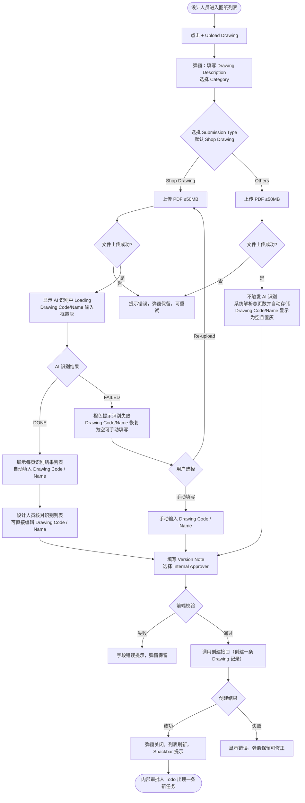

# 需求文档：PC 端 — 图纸上传 AI 自动识别页信息

> **使用说明**：本文档是整个交付链路的**单一事实源**。所有下游文档（UI/前端/后端/QA）从本文档派生。
> 任何字段标注 `<!-- TODO: ... -->` 表示 PM 待补充，下游 agent 看到 TODO 不应编造，应保留并向上反馈。

---

## 1. 背景与目标

### 1.1 业务背景

当前 REQ-003A-pc 定义的上传弹窗需要设计人员手动输入 Drawing Code 和 Drawing Name，且未区分上传文件的类型。

实际工程场景中，设计人员上传的文件分为两类：

| 提交类型 | 说明 | 是否含图框信息 |
|---------|------|:------------:|
| **Shop Drawing** | 图纸文件。一个 PDF 包含多页，**每一页都是一张独立的图纸，图框内印有该页自己唯一的 Drawing No（图纸编号）和 Drawing Name（图纸名称）**，各页编号和名称互不相同 | ✅ |
| **Others** | Shop Drawing 之外的其它文件，不含标准图框，没有 Drawing No / Drawing Name <!-- TODO: 本期统一为一个选项，后期按需拆分为更细的类型，见 OQ-008 --> | ❌ |

两类文件**均仅支持 PDF 格式**（≤ 50MB），且提交后走完全相同的审批流程。二者的区别只在于：Shop Drawing 有图框可供 AI 识别，Others 没有识别对象。

现状痛点：
- 上传 Shop Drawing 时，设计人员需要翻开 PDF 逐页查看，手动抄录想要登记的那页图纸的 Drawing No / Name，容易出错
- 无法在提交前直观地确认 PDF 内所有页的内容，存在上传错误文件的风险
- 弹窗未区分提交类型：Others 本就没有图框信息，却同样被要求填写 Drawing Code / Drawing Name

### 1.2 业务目标

在新建图纸的上传弹窗中，设计人员依次填写 **Drawing Description**、选择 **Category**，再**选择 Submission Type**（Shop Drawing / Others，默认 Shop Drawing），最后上传 PDF 文件。此后两条路径分流：

**Shop Drawing 路径**：
1. 系统调用 AI 服务自动识别该 PDF 的**总页数**，以及**每一页图框中各自唯一的 Drawing No 和 Drawing Name**
2. 识别结果以列表形式完整呈现（每行 = 一页图纸 = 一个唯一的 Drawing No + Drawing Name），供设计人员核对 PDF 内容是否正确、是否上传了正确文件
3. AI 将识别结果自动填入 Drawing Code 和 Drawing Name 输入框（<!-- TODO: 多页各有不同编号时填入规则见 OQ-002 -->），设计人员核对后可直接确认或修改，然后提交

**Others 路径**：
1. **不调用 AI 服务**，不创建识别任务
2. 系统直接读取 PDF 得到**总页数**并自动存储，页码不在页面上展示
3. Drawing Code / Drawing Name 为空，不要求填写
4. 上传完成后即可直接提交

两条路径最终都创建**一条 Drawing 记录**（对应该 PDF 文件），上传与审批流程与 REQ-003A 保持一致。

目标效果：**Shop Drawing 不再需要手动翻看 PDF 逐页查找编号，AI 自动把每页图纸的信息列出来核对即可；Others 不必为没有图框的文件硬填图纸编号，传完直接提交。**

### 1.3 非目标（Out of Scope）

- 一次上传创建多条 Drawing 记录（每次上传仍只创建**一条**记录）
- AI 识别引擎本身的训练与维护（由后端/AI 团队负责）
- 上传新版本场景（本期仅支持新建图纸时选择 Submission Type 与使用 AI 识别；上传新版本沿用 REQ-003A 流程）
- APP 端操作（APP 不含上传功能）
- **非 PDF 格式的上传**（本期新建图纸的两类提交均仅支持 PDF；REQ-007 的 Signed Drawing File、REQ-014 的附件区为独立上传路径，格式约束不受本需求影响）
- Others 的细分类型（本期统一为一个选项，见 OQ-008）
- 审批流程本身的变更（沿用 REQ-007-shared 两级审批逻辑）

---

## 2. 用户与角色

### 2.1 角色定义

| 角色 ID | 角色名 | 描述 | 典型场景 |
|--------|-------|------|---------|
| ROLE-001 | 设计人员（Designer） | 图纸责任人，负责上传图纸并发起内部审批 | 选择 Submission Type 后上传 PDF；Shop Drawing 通过 AI 识别结果列表核对文件内容，确认 Drawing Code / Name 后提交；Others 传完直接提交 |
| ROLE-002 | 内部审批人 | 接收内部审批任务的技术人员 | 提交后在 Todo 列表中收到待审批任务（与 REQ-003A 一致，两类提交无差别） |

### 2.2 用户故事（User Stories）

#### US-003E-001：上传 Shop Drawing 后 AI 自动识别并填写图纸信息

```
作为 设计人员（Designer）
我想要 选择 Shop Drawing 并上传 PDF 后，系统自动识别每页的 Drawing No 和 Drawing Name 并以列表呈现，
        同时将识别结果自动填入 Drawing Code / Drawing Name 输入框
以便 我不需要手动翻看 PDF 抄录信息，只需核对 AI 识别结果后确认提交，减少录入错误
```

**优先级**：P1
**所属史诗**：图纸管理全流程

#### US-003E-002：手动修正 AI 识别错误

```
作为 设计人员（Designer）
我想要 当 AI 识别结果有误时，直接在 Drawing Code / Drawing Name 输入框中修改内容
以便 确保最终提交的图纸信息与实际文件一致
```

**优先级**：P1
**所属史诗**：图纸管理全流程

#### US-003E-003：上传 Others 文件时跳过 AI 识别

```
作为 设计人员（Designer）
我想要 当上传的是 Shop Drawing 之外的其它文件时，选择 Others 类型，系统不做 AI 识别、
        也不要求我填写 Drawing Code / Drawing Name
以便 我不必为本就没有图框的文件干等识别、更不必编造一个图纸编号，传完即可提交
```

**优先级**：P1
**所属史诗**：图纸管理全流程

---

## 3. 角色与权限矩阵

| 操作 | 设计人员（Designer） | 内部审批人 | 项目管理人员 | Site Engineer |
|-----|:--------------:|:-----:|:----------:|:------------:|
| 选择 Submission Type | ✅ | ❌ | ❌ | ❌ |
| 上传 PDF 触发 AI 识别（Shop Drawing） | ✅ | ❌ | ❌ | ❌ |
| 查看 AI 识别结果列表 | ✅ | ❌ | ❌ | ❌ |
| 编辑 Drawing Code / Name（AI 预填值） | ✅ | ❌ | ❌ | ❌ |
| 提交创建图纸记录并发起审批（两类提交） | ✅ | ❌ | ❌ | ❌ |

---

## 4. 核心实体与数据生命周期

### 4.1 实体清单

| 实体 ID | 实体名 | 描述 | 关键属性（业务语义） |
|--------|-------|------|------------------|
| ENT-001 | Drawing（图纸） | 图纸主记录，一个 PDF 文件对应一条记录 | **submission_type**（`SHOP_DRAWING` / `OTHERS`，必填）、Drawing Code（Shop Drawing 必填，为用户确认后的最终编号；**Others 为空**）、Drawing Name（同 Drawing Code 规则）、Category、Description、当前版本号、Status、**ai_recognition_job_id**（关联的 AIRecognitionJob，可为空——Shop Drawing 且 AI 识别成功时必填；降级手动上传或 Others 时为空） |
| ENT-002 | DrawingVersion（图纸版本） | 该 Drawing 的首版本（V0） | 版本号、PDF 文件（含所有页）、**page_count**（PDF 总页数；Shop Drawing 来自 AI 识别结果，Others 由系统直接解析 PDF 得到）、内部审批人、上传人、状态 `PENDING_INTERNAL` |
| ENT-003 | AIRecognitionJob（AI 识别任务） | 一次 **Shop Drawing** 上传对应一个识别任务，记录识别过程与结果；**Others 不创建此记录** | 任务 ID、文件 URL、总页数、识别状态（`PENDING` / `PROCESSING` / `DONE` / `FAILED`）、各页识别结果 JSON（每页含**页码、缩略图 URL、Drawing No、Drawing Name、识别置信度**）、创建时间 |

> **契约影响**：REQ-003-shared §2.1 当前将 `drawingCode` / `drawingName` 定义为**必填**，且 `drawingCode` 项目内唯一。Others 两字段为空，需将其改为**条件必填**（`submissionType = SHOP_DRAWING` 时必填）。MySQL 的 UNIQUE 索引允许多个 NULL，故 `UNIQUE(project_id, drawing_code)` 约束本身无需变更。详见 OQ-009。

### 4.2 实体关系

- 一个 AIRecognitionJob 对应一次 **Shop Drawing** 的 PDF 上传（1:1）；**Others 上传不产生 AIRecognitionJob**
- 一个 AIRecognitionJob 包含多条页级识别结果（1:N，每页一条），仅用于展示核对，**不对应多条 Drawing**
- 用户确认提交后，创建**一条 Drawing + 一条 DrawingVersion**，与 REQ-003A 逻辑完全一致；两类提交在此步骤无差别
- **Drawing 记录通过 `ai_recognition_job_id` 持久关联其来源的 AIRecognitionJob**，创建后可随时通过该关联查看每页识别结果（页码、Drawing No、Drawing Name）；**降级手动上传或 Others 时此字段为空**
- `DrawingVersion.page_count` 在两类提交下均有值：Shop Drawing 取自 AI 识别结果的总页数，Others 由系统解析 PDF 直接得到

### 4.3 数据生命周期

**AIRecognitionJob 生命周期**（仅 Shop Drawing）：
1. 创建：设计人员选择 Shop Drawing 并上传 PDF 文件后，服务端异步创建识别任务，状态为 `PENDING`
2. 流转：AI 服务处理中 → `PROCESSING`；识别完成 → `DONE`；识别失败 → `FAILED`
3. 终态：`DONE`（用户提交后任务归档）、`FAILED`（提示用户手动输入）
4. 保留期限：<!-- TODO: 识别任务记录保留多久，是否需要定期清理，见 OQ-004 -->

**Others 上传路径**：
- 不创建 AIRecognitionJob，无异步任务与状态流转
- 服务端在文件上传完成后同步解析 PDF 得到总页数，写入 `DrawingVersion.page_count`

**Drawing + DrawingVersion 生命周期**：
- 与 REQ-003A 中的创建生命周期完全一致，初始状态 `PENDING_INTERNAL`；两类提交无差别

---

## 5. 状态机

> **适用范围**：本章状态机**仅适用于 Shop Drawing** 提交路径。Others 不创建 AIRecognitionJob，无状态流转——文件上传成功后即可直接提交。

### 5.1 AIRecognitionJob 状态定义

| 状态 ID | 状态名 | 描述 | 是否终态 |
|--------|-------|------|---------|
| S-001 | PENDING | 文件已上传，识别任务排队等待处理 | 否 |
| S-002 | PROCESSING | AI 服务正在识别页面内容 | 否 |
| S-003 | DONE | 识别完成，结果可供用户核对 | 是（可继续提交）|
| S-004 | FAILED | 识别失败（超时、文件损坏、无法解析图框） | 是（降级为手动输入）|

### 5.2 状态转换表

| From | To | 触发动作 | 守卫条件 | 副作用 |
|------|-----|---------|---------|-------|
| — | S-001 | 设计人员上传 PDF 文件 | **Submission Type = Shop Drawing**，文件格式为 PDF，大小 ≤ 50MB | 服务端创建识别任务，前端显示"识别中"Loading |
| S-001 | S-002 | AI 服务取到任务开始处理 | — | 前端轮询或 WebSocket 推送进度 |
| S-002 | S-003 | AI 识别完成 | — | 识别结果展示于列表；Drawing Code / Name 输入框自动填入建议值 |
| S-002 | S-004 | AI 服务超时或识别异常 | — | 前端提示"识别失败"，Drawing Code / Name 输入框恢复为空可编辑 |
| S-001 | S-004 | 识别任务队列超时 | 超过最大等待时间 <!-- TODO: 超时阈值，建议 30s，见 OQ-001 --> | 同上 |

### 5.3 非法转换

- `DONE` → `PROCESSING`（识别完成后不可重新触发，需重新上传文件）
- `FAILED` → `DONE`（失败后不可直接变为完成）

---

## 6. 业务流程

### 6.1 主流程

1. 设计人员进入图纸管理列表页（Drawing Masterlist）
2. 点击右上角 [+ Upload Drawing] 按钮
3. 弹出"Upload New Drawing"弹窗
4. 填写公共字段（两类提交相同）：
   - **Drawing Description**（选填，文本输入框）
   - **Category**（必填，下拉单选）
5. **选择 Submission Type（必填，单选）**：`Shop Drawing` / `Others`；**弹窗打开时默认选中 `Shop Drawing`**（预期占比更高），设计人员上传 Others 时需主动切换
6. 上传 PDF 文件（必填，仅 PDF，≤ 50MB）：支持点击选择或拖拽上传

**6A. Shop Drawing 路径（步骤 7–10）**

7. 文件选中后，弹窗自动进入"AI 识别中"状态：
   - 显示文件上传进度条
   - 上传完成后显示 Loading 动画 + 文案 `"Analysing drawing pages…"`
   - **Drawing Code / Drawing Name 输入框**及 [Submit] 按钮置灰，防止在识别完成前提交
8. AI 识别完成（`DONE`），弹窗更新：
   - 弹窗中部出现**识别结果列表**，展示 PDF 的总页数及每页的页码、缩略图、Drawing No、Drawing Name（详见 §7.2 F-002）
   - **Drawing Code 输入框**自动填入 AI 建议值（<!-- TODO: 确认取值规则，见 OQ-002 -->）
   - **Drawing Name 输入框**自动填入 AI 建议值（规则同上）
   - 两个输入框恢复可编辑状态
9. 设计人员核对识别结果列表（确认 PDF 内各页内容与预期一致），如需修改直接编辑 Drawing Code / Drawing Name 输入框
10. 进入步骤 11

**6B. Others 路径（步骤 7'–8'）**

7'. 文件选中后，弹窗显示文件上传进度条；**不触发 AI 识别，不创建识别任务，无 Loading 等待**
8'. 上传完成后：
   - **不显示识别结果列表**
   - 服务端解析 PDF 得到总页数并自动存储，**页码不在页面上展示**
   - **Drawing Code / Drawing Name 输入框显示为空且置灰不可编辑**（Others 无图纸编号）
   - [Submit] 按钮可用，进入步骤 11

**公共收尾（步骤 11–14）**

11. 填写 **Version Note**（选填）、选择 **Internal Approver**（必填）
12. 点击 [Submit]：前端校验必填项
    - Shop Drawing：Drawing Code、Drawing Name、Category、Internal Approver
    - Others：Category、Internal Approver（**不校验 Drawing Code / Drawing Name**）
13. 校验通过后调用创建接口（与 REQ-003A 接口一致），创建**一条** Drawing 记录
14. 创建成功：弹窗关闭，列表刷新，Snackbar 提示 `"Drawing uploaded successfully. Pending internal approval."`；内部审批人 Todo 出现一条新任务
15. 创建失败（如 Drawing Code 重复）：弹窗保留，显示具体错误

**AI 识别失败降级流程（步骤 8a，仅 Shop Drawing）**：
- AI 识别失败（`FAILED`）时，识别结果列表区域显示橙色提示横幅 `"Unable to analyse the drawing automatically. Please enter the drawing information manually."`
- Drawing Code / Drawing Name 输入框恢复为空可编辑，用户手动填写
- 提供 [Re-upload] 按钮重新选择文件，触发新一轮识别

**切换 Submission Type**：
- 若已上传文件后切换 Submission Type，需清空已选文件、识别结果列表与 Drawing Code / Name 输入框，回到步骤 6 的初始状态（避免两类状态串台）

### 6.2 主流程图（Mermaid）



### 6.3 异常流程

| 异常场景 | 触发条件 | 系统响应 | 用户感知 |
|---------|---------|---------|---------|
| 文件格式不支持 | 选择非 PDF 文件（**两类提交均适用**） | 拒绝选择 | 提示"仅支持 PDF 格式" |
| 文件超过 50MB | 文件大小 > 50MB | 拒绝选择 | 提示文件过大（最大 50MB） |
| AI 识别超时 | AI 服务响应超时（仅 Shop Drawing） | 任务状态变 `FAILED` | 橙色提示，Drawing Code/Name 输入框恢复为空可编辑 |
| AI 识别结果页数为 0 | PDF 无法解析（仅 Shop Drawing） | 任务状态变 `FAILED` | 同上 |
| Others 的 PDF 无法解析页数 | 文件损坏 | 拒绝上传 | 提示"无法读取该 PDF，请检查文件"，弹窗保留可重试 |
| Drawing Code 与已有图纸重复 | 服务端唯一性校验失败（仅 Shop Drawing） | 返回错误 | Drawing Code 字段下方显示"Code already exists"，弹窗保留 |
| 上传网络中断 | 上传过程网络断开 | 提示上传失败 | Toast 提示，弹窗保留可重试 |

---

## 7. 功能需求详述

### 7.1 功能 F-001：上传弹窗整体布局调整

**关联用户故事**：US-003E-001、US-003E-003
**所属流程节点**：流程 6.1 步骤 3–11

在 REQ-003A §7.2（F-002）定义的新建图纸弹窗基础上，新增 Submission Type 选择项与 AI 识别结果列表区域，并调整字段顺序：

**字段顺序**（从上到下）：

| 序号 | 字段 / 区域 | 说明 |
|-----|-----------|------|
| 1 | Drawing Description | 选填，文本输入框（两类相同） |
| 2 | Category | 必填，下拉单选（两类相同） |
| 3 | **[新增] Submission Type** | 必填，单选：`Shop Drawing` / `Others`；**位于 Category 之后、文件上传之前**，决定后续表单形态；**默认选中 `Shop Drawing`** |
| 4 | Drawing File | 必填，文件上传区，**仅 PDF**，≤ 50MB（两类相同） |
| 5 | **[新增] AI 识别结果列表** | **仅 Shop Drawing**：上传后展示，详见 F-002；初始不显示。Others 始终不显示 |
| 6 | Drawing Code | Shop Drawing：必填，AI 识别完成后自动填入（可编辑）。**Others：显示为空，置灰不可编辑** |
| 7 | Drawing Name | 规则同 Drawing Code |
| 8 | Version Note | 选填，文本输入框（两类相同） |
| 9 | Internal Approver | 必填，下拉单选（两类相同） |

**各阶段 Drawing Code / Name 输入框状态**：

| Submission Type | 阶段 | 输入框状态 |
|----------------|------|---------|
| Shop Drawing | 未上传文件 | 空，可编辑 |
| Shop Drawing | 上传中 / AI 识别中 | 置灰，不可编辑 |
| Shop Drawing | AI 识别完成（DONE） | 自动填入建议值，可编辑 |
| Shop Drawing | AI 识别失败（FAILED） | 空，可编辑（需手动输入） |
| **Others** | **全阶段** | **显示为空，置灰不可编辑；提交时不校验** |

**边界与约束**：
- 两类提交均仅支持 PDF（前后端双重校验）
- 单文件最大 50MB
- Submission Type 默认选中 `Shop Drawing`，故不存在"未选择类型"的初始态，文件上传区自弹窗打开即可用
- 已上传文件后切换 Submission Type，清空文件、识别结果与 Drawing Code / Name

### 7.2 功能 F-002：AI 识别结果列表（只读核对视图）

**关联用户故事**：US-003E-001
**所属流程节点**：流程 6.1 步骤 8

> **适用范围**：**仅 Shop Drawing**。Others 不触发识别，本区域始终不渲染。

**功能定位**：仅用于**内容核对**，让设计人员在提交前看清 PDF 内包含哪些页、每页的图纸编号和名称分别是什么，从而确认上传的文件正确。列表每行对应 PDF 的一页图纸，**每页图纸有其自己唯一的 Drawing No 和 Drawing Name**。列表本身为只读，不影响最终创建逻辑，提交后仍只创建一条 Drawing 记录。

**顶部汇总文案**：
- 识别正常：`"X pages detected. Drawing information has been pre-filled below. Please review and confirm."`
- 有页面未识别到信息时追加橙色提示：`"Some pages could not be fully analysed. Please verify the drawing information below."`

**列表字段**：

| 列 | 类型 | 说明 |
|----|------|------|
| 页码 | 只读文本 | `Page 1`、`Page 2`…，按 PDF 页面顺序 |
| 缩略图 | 只读图片 | 该页 PDF 的低分辨率预览图；支持点击放大查看 |
| Drawing No | 只读文本 | 该页图框内的图纸编号（每页唯一，与其他页不同）；未识别到时显示 `—`（标记 ⚠ 橙色）|
| Drawing Name | 只读文本 | 该页图框内的图纸名称（每页唯一，与其他页不同）；未识别到时显示 `—`（标记 ⚠ 橙色）|

> **注意**：列表为只读，不支持行内编辑。如需修改最终提交的 Drawing Code / Name，直接编辑弹窗下方的对应输入框。

**Drawing Code / Drawing Name 自动填入规则**：
- <!-- TODO: 见 OQ-002 — 多页各有不同 Drawing No/Name 时，自动填入哪页的值？需 PM 与业务确认 -->
- 若所有页均未识别到编号/名称，输入框保持为空，等待手动填写

**列表交互规范**：
- 列表最大显示高度固定（建议 240px），超过时纵向滚动
- 缩略图列宽固定（建议 60×60px），支持点击查看大图

> **持久化说明**：识别结果列表中的各页信息（页码、Drawing No、Drawing Name）在用户提交后随 AIRecognitionJob 持久保存，并通过 Drawing 记录上的 `ai_recognition_job_id` 关联。图纸创建后，可在 Drawing 详情页的"AI 识别结果"区域查看每页对应的 page 信息，无需重新上传即可回溯来源 PDF 的所有页识别内容。

### 7.3 功能 F-003：降级手动输入模式

**关联用户故事**：US-003E-001
**所属流程节点**：流程 6.1 降级流程 8a

> **适用范围**：**仅 Shop Drawing**。Others 本就不识别，不存在"降级"概念。

- AI 识别失败时，识别结果列表区域显示橙色提示横幅：
  `"Unable to analyse the drawing automatically. Please enter the drawing information manually, or re-upload the file."`
- 提供 [Re-upload] 按钮：清空当前选择的文件，重新触发文件选择（新一轮识别）
- Drawing Code / Drawing Name 输入框恢复为空可编辑，设计人员手动填写
- 其余提交逻辑与 REQ-003A 完全一致

### 7.4 功能 F-004：Others 提交路径

**关联用户故事**：US-003E-003
**所属流程节点**：流程 6.1 步骤 7'–8'

**处理逻辑**：
1. Submission Type 选中 `Others` 后，弹窗隐藏 AI 识别结果列表区域，Drawing Code / Drawing Name 输入框置灰并显示为空
2. 上传 PDF（仅 PDF，≤ 50MB）：显示上传进度条，**不显示"Analysing drawing pages…"Loading，不创建 AIRecognitionJob**
3. 服务端在上传完成后**同步解析 PDF 得到总页数**，写入 `DrawingVersion.page_count`；页码由系统自动处理，**不在页面上展示**
4. 上传成功后 [Submit] 按钮即可用
5. 提交校验：仅校验 Category 与 Internal Approver，**不校验 Drawing Code / Drawing Name**
6. 创建**一条** Drawing 记录（`submission_type = OTHERS`、`drawing_code = NULL`、`drawing_name = NULL`、`ai_recognition_job_id = NULL`）
7. 后续审批流程与 Shop Drawing 完全一致（REQ-007-shared 两级审批）

**边界与约束**：
- Others 不调用 AI 服务，无识别耗时、无超时、无 FAILED 状态
- Others 的 PDF 若损坏导致页数无法解析，拒绝上传并提示重试（不降级、不静默通过）

---

## 8. 验收标准（Acceptance Criteria）

### AC-003E-001：Shop Drawing 上传 PDF 后自动触发 AI 识别，输入框置灰

```
Given  设计人员选择 Submission Type = Shop Drawing，并在上传弹窗中选择了合法 PDF 文件（≤ 50MB）
When   文件上传完成
Then   弹窗显示 Loading 动画和文案 "Analysing drawing pages…"；
       Drawing Code / Drawing Name 输入框置灰不可编辑；[Submit] 按钮置灰
```

### AC-003E-002：AI 识别成功后展示结果列表并自动填入输入框

```
Given  AI 识别任务状态变为 DONE
When   前端收到识别完成通知
Then   识别结果列表展示每页的页码、缩略图、Drawing No、Drawing Name；
       顶部显示 "X pages detected. Drawing information has been pre-filled below." 文案；
       Drawing Code 输入框自动填入 AI 建议值；Drawing Name 输入框自动填入 AI 建议值；
       两个输入框恢复可编辑状态
```

### AC-003E-003：设计人员可覆盖 AI 填入的 Drawing Code

```
Given  AI 识别完成，Drawing Code 输入框已自动填入 "ARCH-001"
When   设计人员将输入框内容改为 "ARCH-001-REV1"
Then   Drawing Code 输入框显示 "ARCH-001-REV1"；识别结果列表内容不变（只读不联动）
```

### AC-003E-004：有页面未识别到信息时显示警告

```
Given  AI 识别完成，其中某些页的 Drawing No 或 Drawing Name 未识别到
When   前端渲染识别结果列表
Then   未识别到的字段单元格显示 "—" 并带橙色 ⚠ 标记；
       顶部追加橙色提示 "Some pages could not be fully analysed."
```

### AC-003E-005：提交后仅创建一条 Drawing 记录

```
Given  AI 识别完成，识别结果列表显示了 5 页，设计人员填写完所有必填字段
When   点击 [Submit] 提交
Then   系统仅创建一条 Drawing 记录（状态 PENDING_INTERNAL）；
       图纸列表新增一行；Snackbar 提示 "Drawing uploaded successfully. Pending internal approval."；
       内部审批人 Todo 出现一条（非多条）新任务
```

### AC-003E-006：AI 识别失败展示降级提示，输入框可手动填写

```
Given  Submission Type = Shop Drawing，AI 识别任务状态变为 FAILED
When   前端收到失败通知
Then   识别结果列表区域显示橙色提示横幅；
       Drawing Code / Drawing Name 输入框恢复为空可编辑；
       提供 [Re-upload] 按钮
```

### AC-003E-007：降级路径下手动填写后可正常提交

```
Given  AI 识别失败，设计人员手动填写了 Drawing Code 和 Drawing Name
When   填写其余必填字段（Category、Internal Approver）后点击 [Submit]
Then   创建成功，仅创建一条 Drawing 记录，流程与 REQ-003A 单条新建一致
```

### AC-003E-008：Re-upload 按钮清空文件并重新触发识别

```
Given  AI 识别失败，弹窗显示降级提示
When   设计人员点击 [Re-upload] 并选择新文件
Then   原文件清空，弹窗重新进入识别中状态，触发新一轮 AI 识别
```

### AC-003E-009：AI 识别中不可提交

```
Given  Submission Type = Shop Drawing，PDF 文件已上传，AI 识别任务处于 PENDING 或 PROCESSING 状态
When   用户查看弹窗
Then   [Submit] 按钮置灰不可点；Drawing Code / Drawing Name 输入框不可编辑
```

### AC-003E-010：非 PDF 文件被拒绝（两类提交均适用）

```
Given  设计人员选择 Submission Type = Shop Drawing 或 Others，尝试选择 .dwg 格式文件
When   选择文件后
Then   系统拒绝该文件并提示 "Only PDF format is supported."；文件上传区保持清空状态
```

### AC-003E-011：超过 50MB 的 PDF 被拒绝

```
Given  设计人员选择了大小 > 50MB 的 PDF 文件
When   选择文件后
Then   系统拒绝该文件并提示超出大小限制（50MB）；文件上传区保持清空状态
```

### AC-003E-012：Drawing 记录关联来源 AI 识别页面信息

```
Given  设计人员通过 Shop Drawing + AI 识别流程成功上传并创建了 Drawing 记录
When   在 Drawing 详情页查看该记录
Then   可见"AI 识别结果"区域，展示本次识别的 PDF 总页数及每页的页码、Drawing No、Drawing Name；
       与上传弹窗中展示的识别列表内容一致
```

### AC-003E-013：降级手动上传的 Drawing 记录无 AI 识别页面信息

```
Given  AI 识别失败，设计人员选择手动输入后成功创建 Drawing 记录
When   在 Drawing 详情页查看该记录
Then   不展示"AI 识别结果"区域（或显示"本次上传未使用 AI 识别"提示）；不影响其他字段展示
```

### AC-003E-014：选择 Others 时不触发 AI 识别，Drawing Code / Name 为空且只读

```
Given  设计人员选择 Submission Type = Others
When   上传合法 PDF 文件（≤ 50MB）并等待上传完成
Then   弹窗不显示 "Analysing drawing pages…" Loading，不显示识别结果列表；
       Drawing Code / Drawing Name 输入框显示为空且置灰不可编辑；
       未创建 AIRecognitionJob；[Submit] 按钮可用
```

### AC-003E-015：Others 无需填写 Drawing Code / Name 即可提交

```
Given  Submission Type = Others，PDF 上传完成，Drawing Code / Drawing Name 为空
When   填写 Category 与 Internal Approver 后点击 [Submit]
Then   前端不校验 Drawing Code / Drawing Name；
       创建成功，仅创建一条 Drawing 记录（submission_type = OTHERS，drawing_code / drawing_name 为空）；
       内部审批人 Todo 出现一条新任务，审批流程与 Shop Drawing 完全一致
```

### AC-003E-016：Others 的 PDF 总页数由系统自动记录且不在页面展示

```
Given  Submission Type = Others，设计人员上传了一个 8 页的 PDF
When   上传完成
Then   DrawingVersion.page_count 记录为 8；
       弹窗内不展示任何页码或页级信息
```

### AC-003E-017：Others 创建的 Drawing 详情页无 AI 识别结果区域

```
Given  设计人员通过 Others 路径成功创建了 Drawing 记录
When   在 Drawing 详情页查看该记录
Then   不展示"AI 识别结果"区域；ai_recognition_job_id 为空；不影响其他字段展示
```

### AC-003E-018：切换 Submission Type 清空已上传文件与识别状态

```
Given  设计人员已选择 Shop Drawing 并上传了 PDF，AI 识别已完成，Drawing Code 已自动填入
When   将 Submission Type 切换为 Others
Then   已选文件被清空；识别结果列表消失；
       Drawing Code / Drawing Name 清空并置灰；弹窗回到待上传文件的初始状态
```

### AC-003E-019：弹窗打开时 Submission Type 默认选中 Shop Drawing

```
Given  设计人员点击 [+ Upload Drawing] 打开上传弹窗
When   弹窗完成渲染
Then   Submission Type 默认选中 Shop Drawing；文件上传区自弹窗打开即可用（无需先选类型）；
       Drawing Code / Drawing Name 输入框为空且可编辑（Shop Drawing 未上传文件时的初始态）
```

---

## 9. 非功能需求

### 9.1 性能

| 指标 | 目标值 | 测量方式 |
|-----|-------|---------|
| AI 识别响应时间（P95，仅 Shop Drawing） | <!-- TODO: 根据 AI 服务能力确认，建议 ≤ 15s（10 页以内），见 OQ-001 --> | 后端监控 |
| Others 页数解析耗时（P95） | ≤ 1s | 后端监控 |
| 识别结果列表渲染（100 页以内） | ≤ 1s | 前端性能测试 |
| 文件上传速度 | 50MB ≤ 60s（正常网络） | 实测 |

### 9.2 安全

- 鉴权方式：JWT
- 文件类型白名单校验（前后端双重校验，**两类提交均仅 PDF**）
- AI 识别服务调用须在服务端发起，不向前端暴露 AI 服务凭证
- 审计：文件上传操作记录操作人、时间、文件名、Submission Type、AI 识别是否成功

### 9.3 可访问性

- WCAG 等级：AA
- 键盘可达：弹窗内所有输入项支持 Tab 键导航；Submission Type 单选支持方向键切换
- 屏幕阅读器：是；Drawing Code / Name 在 Others 下的只读态需有可读说明

### 9.4 兼容性

- 浏览器：Chrome 100+、Edge 100+、Safari 15+
- 移动端：不支持（PC 专属）
- 国际化：中英双语

### 9.5 可观测性

- 关键埋点：**Submission Type 选择分布**、**切换 Submission Type 次数**、触发 AI 识别、识别成功、识别失败、用户是否修改了 AI 预填值、最终提交
- 错误监控：Sentry（AI 识别失败率 > 20% 告警）
- 业务监控：AI 识别平均耗时、识别成功率、用户手动修正率（提交时 Drawing Code/Name 与 AI 预填值不同的次数占比）、**Others 提交占比**（用于验证 Submission Type 拆分是否必要、后期是否需细分）

---

## 10. 数据量级与扩展性

| 维度 | 当前预期 | 1 年后 | 3 年后 |
|-----|---------|-------|-------|
| 单文件最大页数（AI 识别） | <!-- TODO: 与 AI 团队确认，建议 ≤ 100 页，见 OQ-003 --> | — | — |
| 单文件大小上限 | 50MB | 50MB | <!-- TODO: 是否放宽 --> |
| AI 识别任务并发数 | <!-- TODO: 与后端 AI 服务确认 --> | — | — |
| Others 提交占比 | <!-- TODO: 上线后由埋点回填，用于评估是否细分类型 --> | — | — |

---

## 11. 依赖与外部系统

| 依赖系统 | 用途 | 集成方式 | Owner |
|---------|------|---------|-------|
| AI 识别服务 | 识别 PDF 各页图框中的 Drawing No 和 Drawing Name（**仅 Shop Drawing**） | 服务端异步调用（RESTful / 消息队列） | 后端 / AI 团队 |
| PDF 解析库 | 读取 PDF 总页数（**两类提交均需**；Others 仅需此项，不经过 AI） | 服务端同步调用 | 后端 |
| 对象存储（OSS/S3） | PDF 文件存储 | 服务端预签名 URL 上传 | 后端 |
| 消息通知系统 | 内部审批人 Todo 推送 | 内部事件 | 后端 |
| REQ-003A-pc | 单条新建图纸流程（降级路径复用；最终创建接口复用） | 文档引用 | — |
| REQ-003-shared | 接口定义、业务规则（**需同步新增 `submissionType` 枚举、`drawingCode`/`drawingName` 改条件必填**，见 OQ-009） | 文档引用 | — |

---

## 12. 数据迁移

无。存量 Drawing 记录的 `submission_type` 默认回填为 `SHOP_DRAWING`（本需求上线前所有上传均为图纸文件）。<!-- TODO: 与后端确认回填方案 -->

---

## 13. 上线操作清单

### 13.1 上线前

- [ ] AI 识别服务部署并完成联调（Drawing No / Drawing Name 字段识别准确率验收）
- [ ] AI 识别超时阈值配置确认
- [ ] REQ-003-shared 契约同步：`submissionType` 枚举、`drawingCode` / `drawingName` 条件必填
- [ ] 数据库确认：`drawing_code` 允许 NULL，且 `UNIQUE(project_id, drawing_code)` 在多 NULL 下不冲突
- [ ] 存量 Drawing 的 `submission_type` 回填为 `SHOP_DRAWING`
- [ ] 功能开关默认开启确认（关闭时回退至 REQ-003A 原始手动输入弹窗）

### 13.2 上线后

- [ ] 验证 AI 识别任务状态轮询/推送正常
- [ ] 验证 Drawing Code / Name 自动填入逻辑正确
- [ ] 验证 Others 提交不产生 AIRecognitionJob、page_count 正确写入
- [ ] AI 识别失败率监控正常（告警阈值已配置）
- [ ] 用户手动修正率、Submission Type 分布埋点数据可读

---

## 14. 灰度与发布策略

- 灰度方式：按项目灰度（功能开关控制，关闭时回退到 REQ-003A 手动输入弹窗）
- 灰度比例：1 个试点项目 → 全量
- 监控指标：AI 识别失败率、用户手动修正率、Submission Type 分布
- 回滚预案：关闭 AI 识别功能开关，用户自动回退到 REQ-003A 手动输入流程；已创建数据无需回滚（`submission_type` 字段保留不影响旧流程）

---

## 15. 成功指标（北极星）

| 指标 | 当前基线 | 目标 | 测量周期 |
|-----|---------|------|---------|
| AI 识别成功率 | — | ≥ 90% | 每周 |
| 用户手动修正率（AI 预填后提交时被修改的比例） | — | ≤ 15% | 每周 |
| 单次上传 + AI 识别平均耗时（Shop Drawing） | — | ≤ 20s（10 页 PDF） | 每周 |
| Others 提交耗时（无 AI 等待） | — | ≤ 上传耗时 + 2s | 每周 |

---

## 16. Open Questions

| OQ ID | 问题 | 影响 | Owner | 截止 |
|------|------|------|-------|------|
| OQ-001 | AI 识别超时阈值是多少？建议 30s，需与 AI 团队确认 | F-001 超时处理逻辑 | PM + AI 团队 | — |
| OQ-002 | **关键**：PDF 内每页有各自唯一的 Drawing No/Name，但最终只创建一条 Drawing 记录。那么 Drawing Code / Name 输入框应自动填入哪页的值？备选方案：① 第一页；② 置信度最高页；③ 不自动填入，由用户从列表中点击某行选择。<br>**根因**：§1.1 描述的是页级模型（每页一张独立图纸、各有唯一编号），而 §4 与 REQ-003-shared §2.1 采用的是主记录模型（一条 Drawing 一个 drawingCode）——本问题是二者矛盾的症状。已决定本期维持现状模型，模型重构单独排期。 | F-002 自动填入逻辑（核心决策）；阻塞下游 UI / 前端生成 | PM | — |
| OQ-003 | 单文件最大支持页数？超出时如何处理（截断 / 仅识别前 N 页 / 报错）？ | F-002 边界 | PM + 后端 | — |
| OQ-004 | AI 识别任务记录（AIRecognitionJob）保留多久？是否需要定期清理？ | 数据存储成本 | PM + 后端 | — |
| OQ-005 | 是否支持上传新版本时也使用 AI 识别 / 选择 Submission Type（本期 Out of Scope，是否纳入下一期）？ | REQ-003A 范围 | PM | — |
| OQ-006 | AI 服务是自研还是接入第三方（如 Azure Document Intelligence / AWS Textract）？ | §11 外部系统集成方式 | 后端 + AI 团队 | — |
| OQ-008 | **[新增]** Others 后期按需拆分为哪些细分类型？拆分后是否影响审批流程与列表筛选？（本期统一为一个选项） | §1.3 范围、后续迭代 | PM | — |
| OQ-009 | **[新增]** REQ-003-shared §2.1 的 `drawingCode` / `drawingName` 由必填改为条件必填、§2.6 新增 `submissionType` 枚举、§4.1 上传接口收窄为仅 PDF——契约变更需后端确认改动量与 DB 约束影响 | 契约同步、BE 改动 | PM + 后端 | — |
| OQ-010 | **[新增]** REQ-006-pc §181 假设"原始文件可能非 PDF（DWG/DXF/PNG/JPG）"，但新建图纸已收窄为仅 PDF——该分支是否成为死代码？需确认是否删除 | REQ-006 范围 | PM | — |

---

## 17. Figma / 原型链接

- Figma 设计稿：<!-- 填写上传弹窗（含 Submission Type 选择 / AI 识别中 / 识别结果列表 / Others 形态 / 降级模式）Frame 链接 -->
- 交互原型：

---

## 18. 变更历史

| 版本 | 日期 | 修改人 | 变更摘要 | 影响下游文档 |
|-----|------|-------|---------|------------|
| 0.1.0 | 2026-05-22 | agent | 初稿（设计有误：误设计为批量创建多条记录） | 全部 |
| 0.2.0 | 2026-05-22 | agent | 修正核心模型：一个 PDF 文件 = 一条 Drawing 记录；AI 识别结果列表为只读核对视图；取消批量创建逻辑 | 全部 |
| 0.3.0 | 2026-05-22 | agent | 明确业务模型：PDF 内每页图纸各有唯一的 Drawing No 和 Drawing Name（非同一编号重复印刷）；列表展示每页各自的编号和名称供用户核对；新增 OQ-002 明确"多页不同编号时自动填入哪页"的决策点 | UI、Frontend、Backend |
| 0.3.1 | 2026-05-23 | agent | 补充 AI 识别页面信息的持久化关联：ENT-001 Drawing 新增 `ai_recognition_job_id` 字段；ENT-003 页级识别结果 JSON 补充缩略图 URL 和置信度；§4.2 明确 Drawing→AIRecognitionJob 持久关联；§7.2 补充持久化说明；新增 AC-003E-012（Drawing 详情展示来源页信息）、AC-003E-013（降级上传无 AI 页信息） | Backend、Frontend、QA |
| 0.4.0 | 2026-07-16 | agent | **新增 Submission Type（Shop Drawing / Others）**：上传文件前先选提交类型。Shop Drawing 走 AI 识别（原逻辑不变）；Others 不触发 AI、不创建 AIRecognitionJob，由系统解析 PDF 记录总页数（页码不展示），Drawing Code / Name 显示为空且只读、提交时不校验；两类提交均仅支持 PDF，审批流程完全一致。ENT-001 新增 `submission_type`，ENT-002 新增 `page_count`；`drawingCode` / `drawingName` 改为条件必填。新增 US-003E-003、F-004、AC-003E-014～019、OQ-007～010。同时删除文末 §1.3–§19 的 v0.1.0 批量创建残留内容（与现行设计冲突、AC 编号重复） | 全部 |
| 0.4.1 | 2026-07-16 | agent | **关闭 OQ-007**：Submission Type 默认选中 `Shop Drawing`。连带移除"未选择类型"相关逻辑——§7.1 边界约束、§6.3 异常流程对应行；AC-003E-019 由"未选类型不可上传"改为"默认选中 Shop Drawing"（有默认值即不存在未选态） | UI、Frontend、QA |
| 0.4.2 | 2026-07-16 | agent | **修正操作顺序**：Submission Type 位于 Drawing Description、Category **之后**，文件上传**之前**（原 0.4.0 误设计为弹窗第一项）。同步修正 §1.2 业务目标、§6.1 步骤 4–5、§6.2 主流程图、§7.1 字段顺序表 | UI、Frontend、QA |

---

## 19. 备注

- 本需求是 REQ-003A-pc（图纸上传与审批发起）的上传弹窗增强；最终创建逻辑（一次上传 = 一条 Drawing 记录）与 REQ-003A 完全一致，仅在弹窗中增加 Submission Type 选择、AI 识别结果列表和自动填入交互。
- **Submission Type 是 AI 识别的业务开关**：不向用户暴露"要不要用 AI"这种实现细节，而是让用户按业务语义选择文件类型，由系统决定是否识别。Others 天然覆盖了"无需 AI 识别"的场景。
- AI 识别服务的具体能力边界（支持的图框格式、语言、字体）需在开发前与 AI 团队对齐，并制定准确率基线测试方案。
- **本文档当前存在已知的模型矛盾**：§1.1 描述页级模型（每页一张独立图纸、各有唯一编号），§4 采用主记录模型（一条 Drawing 一个 drawingCode）。已决定本期维持现状模型，OQ-002 继续挂起，模型重构单独排期。**在 OQ-002 关闭前，下游 UI / 前端文档无法据此完整生成。**
