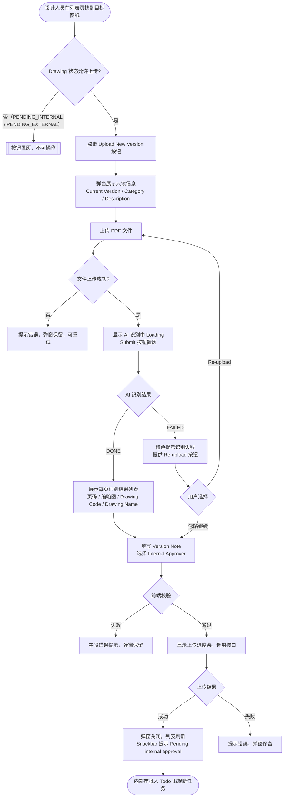

# 需求文档：PC 端 — 上传新版本

> **使用说明**：本文档是整个交付链路的**单一事实源**，聚焦于已有图纸的"上传新版本"操作。
> 图纸列表页展示规则见 [REQ-003A-pc](REQ-003A-pc.md)；新建图纸上传（含 AI 识别）见 [REQ-003E-pc](REQ-003E-pc.md)；审批业务规则见 [REQ-007-shared](../shared/REQ-007-shared.md)。

---

## 1. 背景与目标

### 1.1 业务背景

**数据模型说明**：在本系统中，一次上传行为（Upload）对应一个提交记录（DrawingVersion），每个提交记录绑定一个 PDF 文件。一个 PDF 文件包含多页图纸，**每一页都是一张独立的图纸，图框内印有该页自己唯一的 Drawing Code（图纸编号）和 Drawing Name（图纸名称）**。因此，Drawing 主记录对应 PDF 中某一页的具体图纸，由 Drawing Code 唯一标识。

新建图纸时（REQ-003E-pc），设计人员通过 AI 识别 PDF 各页信息后，为某一页图纸创建对应的 Drawing 主记录，并通过 Drawing Code 永久标识该图纸。

当图纸经内部审批驳回（`INTERNAL_REJECTED`）或外部审批驳回（`EXTERNAL_REJECTED`）后，设计人员需要修改该图纸并重新上传新版本，重新触发两级审批流程。此外，在图纸版本生效（`ACTIVE`）后也可上传新版本持续迭代。

"上传新版本"与"新建图纸"的本质区别在于：新版本是针对**已有 Drawing 主记录（Drawing Code 和 Drawing Name 已确定）**，提交一份包含该图纸最新内容的 PDF 文件，系统版本号自动递增，历史版本保留可查。

### 1.2 业务目标

让设计人员能在已有图纸基础上上传包含最新图面内容的 PDF 文件，通过 **AI 识别结果列表**核对 PDF 各页内容确认上传了正确文件，然后指定内部审批人后重新触发两级审批流程。

每次上传新版本是一次独立的**版本提交记录（DrawingVersion）**：
- 提交记录与该 Drawing 主记录绑定，Drawing Code 唯一标识本次提交针对的是哪张图纸
- 提交的 PDF 文件经 AI 识别，以页级列表（页码 / 缩略图 / Drawing Code / Drawing Name）呈现，**供设计人员核对 PDF 内容是否正确，避免上传错误文件**
- **不涉及对 Drawing 主记录（Drawing Code、Drawing Name、Category、Description）的任何修改**；这些字段在新建图纸时（REQ-003E-pc）已确定，版本迭代时保持不变

### 1.3 非目标（Out of Scope）

- 新建图纸（新 Drawing 主记录）：由 REQ-003E-pc 覆盖
- 上传新版本时修改 Drawing Code、Drawing Name、Category、Description 等主记录字段（版本迭代不改主记录）
- AI 识别引擎本身的训练与维护（由后端 / AI 团队负责）
- 内部审批操作本身：由 REQ-007A-pc 覆盖
- DC 外部审批操作：由 REQ-007B-pc 覆盖
- 版本历史查看：由 REQ-003C-pc 覆盖
- Site Engineer 分配：由 REQ-003D-pc 覆盖
- APP 端操作：由 REQ-003-app 覆盖

---

## 2. 用户与角色

### 2.1 角色定义

| 角色 ID | 角色名 | 描述 | 典型场景 |
|--------|-------|------|---------|
| ROLE-001 | 设计人员（Designer） | 图纸责任人，负责上传新版本并重新发起审批 | 收到驳回通知后，在列表页点击 [Upload New Version] 上传修改后的文件 |
| ROLE-002 | 内部审批人 | 接收内部审批任务（设计经理/总工程师等） | 设计人员提交后，在 Todo 列表看到新的内部审批任务 |

### 2.2 用户故事（User Stories）

#### US-003F-001：设计人员上传新版本并重新发起审批

```
作为 设计人员（Designer）
我想要 在图纸列表中对已有图纸上传包含最新图面内容的 PDF 文件，
        通过 AI 识别结果列表核对 PDF 各页内容后，指定内部审批人提交
以便 该图纸重新进入两级审批流程，历史版本保留不丢失，
     且能在提交前确认上传的 PDF 文件确实包含该图纸（Drawing Code）的最新图面
```

**优先级**：P1

---

## 3. 角色与权限矩阵

| 操作 | 设计人员 | 内部审批人 | 图纸管理员 | Site Engineer |
|-----|:-------:|:---------:|:---------:|:-------------:|
| 点击 [Upload New Version]（状态允许时） | ✅ | ❌ | ❌ | ❌ |
| [Upload New Version] 置灰（状态不允许） | 置灰 | — | — | — |

---

## 4. 触发条件与状态守卫

### 4.1 允许上传新版本的状态

| Drawing 状态 | 是否允许上传新版本 | 说明 |
|------------|:--------------:|------|
| `ACTIVE` | ✅ | 最新版本已生效，可迭代 |
| `INTERNAL_REJECTED` | ✅ | 内部审批驳回，需修改重传 |
| `EXTERNAL_REJECTED` | ✅ | 外部审批驳回，需修改重传 |
| `PENDING_INTERNAL` | ❌（置灰） | 当前版本审批中，不可并行上传 |
| `PENDING_EXTERNAL` | ❌（置灰） | 当前版本外部审批中，不可并行上传 |

### 4.2 相关状态转换

| From | To | 触发动作 | 守卫条件 | 副作用 |
|------|-----|---------|---------|-------|
| 任意允许状态 | `PENDING_INTERNAL` | 设计人员提交新版本 | 当前无 `PENDING_INTERNAL` 或 `PENDING_EXTERNAL` 版本 | 通知内部审批人（Todo 出现任务）；旧版本状态不变直至新版本审批通过 |
| `PENDING_INTERNAL` | `ACTIVE`（旧版本 → `DEPRECATED`） | 新版本最终审批通过 | — | 旧版本标记 DEPRECATED |

> 完整状态机定义见 [REQ-007-shared §4.4](../shared/REQ-007-shared.md)。

---

## 5. 业务流程

### 5.1 主流程

1. 设计人员在图纸管理列表页（REQ-003A-pc）找到目标图纸
2. 点击该行 Actions 列的 **[Upload New Version]** 按钮（按钮仅在状态允许时可点，否则置灰）
3. 弹出 **"Upload New Version"** 弹窗，标题栏显示 `{drawingCode} — {drawingName}`
4. 弹窗展示当前只读信息（**Current Version**、**Category**、**Description**），供上传人核对所操作图纸的基本信息
5. 上传最新版本图纸 PDF 文件（必填，≤ 50MB，仅 PDF）：
   - 支持点击选择或拖拽上传
   - 文件选中后，弹窗自动进入"AI 识别中"状态：
     - 显示文件上传进度条
     - 上传完成后显示 Loading 动画 + 文案 `"Analysing drawing pages…"`
     - [Submit] 按钮置灰，防止在识别完成前提交
   - AI 识别完成（`DONE`）：弹窗中部出现**识别结果列表**，展示 PDF 的总页数及每页的页码、缩略图、Drawing Code、Drawing Name（详见 §6.2 F-002）
   - AI 识别失败（`FAILED`）：识别结果列表区域显示橙色提示横幅，提供 [Re-upload] 按钮（详见 §6.3 F-003）
6. 填写 **Version Note**（选填）
7. 选择 **Internal Approver**（必填，下拉单选）
8. 点击 [Submit]：前端校验必填项（Drawing File 已上传且 AI 识别完成或已降级、Internal Approver）
9. 校验通过后显示上传进度条，调用接口创建新 DrawingVersion（版本号自动递增）
10. 上传成功：弹窗关闭，列表刷新，Snackbar 提示 `"New version uploaded. Pending internal approval."`；内部审批人 Todo 出现新任务
11. 上传失败：提示具体错误，弹窗保留，用户可重试

### 5.2 流程图（Mermaid）



### 5.3 异常流程

| 异常场景 | 触发条件 | 系统响应 | 用户感知 |
|---------|---------|---------|---------|
| 文件格式不支持 | 选择非 PDF 文件 | 拒绝选择，弹出提示 | 提示"Only PDF format is supported for version upload." |
| 文件超过 50MB | 文件大小 > 50MB | 拒绝选择，弹出提示 | 提示文件过大（最大 50MB） |
| AI 识别超时 | AI 服务响应超时 | 任务状态变 `FAILED` | 橙色提示，提供 [Re-upload] 按钮 |
| AI 识别结果页数为 0 | PDF 无法解析 | 任务状态变 `FAILED` | 同上 |
| 上传网络中断 | 上传过程网络断开 | 提示上传失败 | Toast 提示，弹窗保留，可重试 |
| 状态变更（并发） | 点击按钮后状态被其他操作变为禁止态 | 接口返回 409 | "This drawing is now under review. Please refresh and try again." |

---

## 6. 功能需求详述

### 6.1 功能 F-001：上传新版本弹窗整体布局

**关联用户故事**：US-003F-001
**所属流程节点**：流程 5.1 步骤 3–11

**弹窗标题**：`Upload New Version`
**副标题 / 上下文标识**（只读，置于标题下方）：`{drawingCode} — {drawingName}`

**弹窗内字段顺序**（从上到下）：

| 序号 | 字段 / 区域 | 类型 | 说明 |
|-----|-----------|------|------|
| 1 | Current Version | 只读文本 | 当前系统版本号 `Vn`；提交成功后自动递增为 V(n+1) |
| 2 | Category | 只读文本 | 继承 Drawing 主记录；不可修改 |
| 3 | Description | 只读文本 | 继承 Drawing 主记录；无内容时显示 `—`；不可修改 |
| 4 | Drawing File | 文件上传 | 必填，仅 PDF，≤ 50MB；支持点击或拖拽；上传后触发 AI 识别 |
| 5 | **[新增] AI 识别结果列表** | 动态展示区 | 上传后呈现，详见 F-002；初始不显示 |
| 6 | Version Note | 文本输入框 | 选填，建议 ≤ 500 字符，说明本次版本修改内容 |
| 7 | Internal Approver | 下拉单选 | 必填，项目内有 `drawing:approve` 权限的用户列表 |

**各阶段 Submit 按钮状态**：

| 阶段 | [Submit] 状态 |
|------|-------------|
| 未上传文件 | 置灰 |
| 上传中 / AI 识别中 | 置灰 |
| AI 识别完成（DONE） | 可点击 |
| AI 识别失败（FAILED）且用户选择继续 | 可点击 |

> **设计说明**：Drawing Code、Drawing Name 不在弹窗字段列表中单独展示，而是作为弹窗副标题的上下文标识显示，明确当前操作针对哪张图纸。Category、Description、Current Version 作为只读字段展示，供上传人确认操作对象正确。

### 6.2 功能 F-002：AI 识别结果列表（只读核对视图）

**关联用户故事**：US-003F-001
**所属流程节点**：流程 5.1 步骤 5（AI 识别完成后）

**功能定位**：仅用于**内容核对**，让设计人员在提交前确认新 PDF 文件包含的图纸内容与预期一致（尤其是确认 Drawing Code 与当前图纸主记录匹配），避免上传错误文件。列表本身为只读，**不影响 Drawing Code / Drawing Name 等主记录字段**（这些字段在新建图纸时已确定，版本迭代时保持不变）。

**顶部汇总文案**：
- 识别正常：`"X pages detected. Please review the drawing information below before submitting."`
- 有页面未识别到信息时追加橙色提示：`"Some pages could not be fully analysed. Please verify the drawing information below."`

**列表字段**：

| 列 | 类型 | 说明 |
|----|------|------|
| 页码 | 只读文本 | `Page 1`、`Page 2`…，按 PDF 页面顺序 |
| 缩略图 | 只读图片 | 该页 PDF 的低分辨率预览图；支持点击放大查看 |
| Drawing Code | 只读文本 | 该页图框内的图纸编号；未识别到时显示 `—`（标记 ⚠ 橙色）|
| Drawing Name | 只读文本 | 该页图框内的图纸名称；未识别到时显示 `—`（标记 ⚠ 橙色）|

> **注意**：列表为只读，不支持行内编辑。如需修改 Drawing Code / Drawing Name，请联系图纸管理员（主记录字段不在本流程修改）。

**列表交互规范**：
- 列表最大显示高度固定（建议 240px），超过时纵向滚动
- 缩略图列宽固定（建议 60×60px），支持点击查看大图

### 6.3 功能 F-003：AI 识别失败降级处理

**关联用户故事**：US-003F-001
**所属流程节点**：流程 5.1 步骤 5（AI 识别失败分支）

- AI 识别失败时，识别结果列表区域显示橙色提示横幅：
  `"Unable to analyse the drawing automatically. Please re-upload the file or proceed to submit."`
- 提供 **[Re-upload]** 按钮：清空当前选择的文件，重新触发文件选择（新一轮识别）
- 提供 **[Proceed Anyway]** 按钮：跳过识别结果核对，直接允许填写 Version Note / Internal Approver 并提交（适用于 AI 服务故障但设计人员确认文件正确的场景）
- 选择"Proceed Anyway"后，[Submit] 按钮解锁，提交逻辑与正常路径一致

### 6.4 功能 F-004：上传进度

- 点击 [Submit] 且前端校验通过后，弹窗内展示进度条（0% → 100%）
- 上传期间 [Submit] 按钮禁用，防止重复提交
- 上传完成或失败后进度条消失

---

## 7. 验收标准（Acceptance Criteria）

### AC-003F-001：成功路径（AI 识别正常）

```
Given  设计人员具备 drawing:upload 权限，目标图纸状态为 ACTIVE / INTERNAL_REJECTED / EXTERNAL_REJECTED
When   点击 [Upload New Version]，上传 PDF 文件，AI 识别完成后核对识别结果列表，
       填写 Version Note（选填），选择 Internal Approver，点击 [Submit]
Then   弹窗关闭，列表刷新，图纸状态变为 PENDING_INTERNAL；
       Snackbar 提示"New version uploaded. Pending internal approval."；
       系统版本号在原版本号基础上加 1；
       Drawing 主记录的 Code、Name、Category、Description 均不变
```

### AC-003F-002：上传 PDF 后自动触发 AI 识别，Submit 按钮置灰

```
Given  设计人员在弹窗中选择了合法 PDF 文件（≤ 50MB）
When   文件上传完成
Then   弹窗显示 Loading 动画和文案 "Analysing drawing pages…"；
       [Submit] 按钮置灰不可点
```

### AC-003F-003：AI 识别完成后展示识别结果列表

```
Given  AI 识别任务状态变为 DONE
When   前端收到识别完成通知
Then   识别结果列表展示每页的页码、缩略图、Drawing Code、Drawing Name；
       顶部显示 "X pages detected. Please review the drawing information below before submitting."；
       [Submit] 按钮解锁可点
```

### AC-003F-004：有页面未识别到信息时显示警告

```
Given  AI 识别完成，其中某些页的 Drawing Code 或 Drawing Name 未识别到
When   前端渲染识别结果列表
Then   未识别到的字段单元格显示 "—" 并带橙色 ⚠ 标记；
       顶部追加橙色提示 "Some pages could not be fully analysed."
```

### AC-003F-005：AI 识别失败后展示降级提示

```
Given  AI 识别任务状态变为 FAILED
When   前端收到失败通知
Then   识别结果列表区域显示橙色提示横幅；
       提供 [Re-upload] 和 [Proceed Anyway] 两个操作入口；
       [Submit] 按钮保持置灰
```

### AC-003F-006：Re-upload 按钮清空文件并重新触发识别

```
Given  AI 识别失败，弹窗显示降级提示
When   设计人员点击 [Re-upload] 并选择新文件
Then   原文件清空，弹窗重新进入识别中状态，触发新一轮 AI 识别
```

### AC-003F-007：Proceed Anyway 后可正常提交

```
Given  AI 识别失败，设计人员点击 [Proceed Anyway]
When   选择 Internal Approver 后点击 [Submit]
Then   [Submit] 按钮解锁；上传成功，版本号递增，流程与正常路径一致
```

### AC-003F-008：文件格式校验（仅 PDF）

```
Given  用户在弹窗中尝试选择非 PDF 文件（如 .dwg）
When   选择文件后
Then   系统拒绝该文件并提示"Only PDF format is supported for version upload."；
       文件上传区域清空
```

### AC-003F-009：文件大小校验

```
Given  用户选择大于 50MB 的 PDF 文件
When   选择文件后
Then   系统拒绝该文件并提示文件过大（最大 50MB）；文件上传区域清空
```

### AC-003F-010：上传进度条与防重复提交

```
Given  用户点击 [Submit] 且前端校验通过
When   文件正在上传中
Then   显示进度条，[Submit] 按钮禁用；上传完成或失败后进度条消失
```

### AC-003F-011：审批中状态时按钮置灰

```
Given  图纸当前状态为 PENDING_INTERNAL 或 PENDING_EXTERNAL
When   用户查看该行的 Actions 列
Then   [Upload New Version] 按钮处于置灰不可点状态
```

### AC-003F-012：弹窗只读字段验证

```
Given  设计人员打开 Upload New Version 弹窗
When   查看弹窗内容
Then   Current Version、Category、Description 均以只读灰色样式展示，无编辑入口；
       弹窗副标题显示正确的 drawingCode 和 drawingName；
       可编辑字段仅为 Drawing File、Version Note、Internal Approver
```

### AC-003F-013：上传成功后内部审批人 Todo 出现任务

```
Given  上传新版本成功
When   指定的内部审批人进入 Todo 列表
Then   新的"Internal Approval Required"任务立即出现，包含图纸编号、名称和新版本号
```

---

## 8. 非功能需求

### 8.1 性能

| 指标 | 目标值 | 测量方式 |
|-----|-------|---------|
| AI 识别响应时间（P95） | <!-- TODO: 根据 AI 服务能力确认，建议 ≤ 15s（10 页以内）--> | 后端监控 |
| 识别结果列表渲染（100 页以内） | ≤ 1s | 前端性能测试 |
| 文件上传速度 | 50MB ≤ 60s（正常网络） | 实测 |
| 上传接口响应 P95 | ≤ 3s（不含文件传输时间） | 后端监控 |

### 8.2 安全

- 鉴权方式：JWT
- 文件类型白名单校验（前后端双重校验，仅 PDF）
- AI 识别服务调用须在服务端发起，不向前端暴露 AI 服务凭证
- 审计：文件上传操作记录操作人、时间、文件名、图纸 ID、AI 识别是否成功

### 8.3 可访问性

- WCAG 等级：AA
- 键盘可达：弹窗内所有输入项支持 Tab 键导航；Esc 关闭弹窗
- 屏幕阅读器：是

### 8.4 兼容性

- 浏览器：Chrome 100+、Edge 100+、Safari 15+
- 移动端：不支持（PC 专属）
- 国际化：中英双语

### 8.5 可观测性

- 关键埋点：点击 [Upload New Version]、触发 AI 识别、识别成功、识别失败、选择 Proceed Anyway、上传成功、上传失败（含错误类型）
- 错误监控：Sentry（文件上传失败率 > 5% 告警；AI 识别失败率 > 20% 告警）
- 业务监控：AI 识别平均耗时、识别成功率

---

## 9. 数据量级

| 维度 | 当前预期 | 1 年后 | 3 年后 |
|-----|---------|-------|-------|
| 版本数量/图纸 | ≤ 20 个版本 | ≤ 50 个版本 | 不限 |
| 单文件大小上限 | 50MB | 50MB | <!-- TODO: 是否放宽 --> |

---

## 10. 依赖与外部系统

| 依赖系统 | 用途 | 集成方式 |
|---------|------|---------|
| AI 识别服务 | 识别新版本 PDF 各页的 Drawing Code 和 Drawing Name（供设计人员核对文件内容） | 服务端异步调用（RESTful / 消息队列） |
| 对象存储（OSS/S3） | 图纸文件存储 | 服务端预签名 URL 上传 |
| 消息通知系统 | 内部审批人 Todo 推送 | 内部事件 |
| REQ-003A-pc | 图纸列表页入口（[Upload New Version] 按钮所在） | 文档引用 |
| REQ-003E-pc | AI 识别交互规范参考（F-002 识别结果列表交互与 REQ-003E F-002 一致） | 文档引用 |
| REQ-003-shared | 接口定义、业务规则 | 文档引用 |

---

## 11. 灰度与发布策略

- 灰度方式：按项目灰度（与 REQ-003A-pc 同批次）
- 灰度比例：1 个试点项目 → 全量
- 回滚预案：关闭 [Upload New Version] 入口功能开关，已上传数据无需回滚

---

## 12. Open Questions

| OQ ID | 问题 | 影响 | Owner | 截止 |
|------|------|------|-------|------|
| OQ-001 | AI 识别超时阈值是多少？建议与 REQ-003E 统一（30s），需与 AI 团队确认 | F-003 降级处理逻辑 | PM + AI 团队 | — |
| OQ-002 | 上传新版本的 AI 识别结果是否需要持久化关联到 DrawingVersion？（参照 REQ-003E 中 Drawing 关联 AIRecognitionJob 的模式） | Backend 数据设计 | PM + 后端 | — |
| OQ-003 | 文件大小上限未来是否需要放宽？ | F-001 约束 | PM | — |
| OQ-004 | Version Note 是否需要字数上限约束？ | F-001 字段约束 | PM | — |

## 14. 变更历史

| 版本 | 日期 | 修改人 | 变更摘要 | 影响下游文档 |
|-----|------|-------|---------|------------|
| 0.1.0 | 2026-05-25 | agent | 从 REQ-003A-pc v0.3.1 拆分；原文档 F-003（上传新版本弹窗）、F-004（上传进度）及相关 AC（003A-003B/004/005/006/007/009/010）迁入本文档，AC 重编为 003F-001 ~ 003F-008 | Frontend、Backend、QA |
| 0.2.0 | 2026-05-25 | agent | 参照 REQ-003E-pc 对齐字段设计（误将 Drawing Name 从只读改为可编辑）——**本版本逻辑有误，已由 0.3.0 修正** | — |
| 0.3.0 | 2026-05-25 | agent | 修正核心逻辑：上传新版本仅创建 DrawingVersion，不涉及 Drawing 主记录的任何字段修改；Drawing Code / Name 回归只读展示区；移除 Drawing Code / Name 变更规则；权限矩阵删除修改 Code/Name 行；主流程步骤 5 移除修改主记录入口；流程图更新；异常流程删除 Code 重复行；AC-003F-001 更新成功路径描述；删除 AC-003F-006/007/009/010；新增 AC-003F-006（按钮置灰，原 008）、AC-003F-007（弹窗只读字段校验） | Frontend、Backend、QA |
| 0.4.0 | 2026-05-25 | agent | 对齐数据模型：明确 Drawing = 原始 PDF 某一页的图纸（由 Drawing Code 唯一标识）；上传新版本 = 为该 Drawing Code 对应图纸提交更新后的图面文件（一次上传 = 一个 DrawingVersion，绑定该 Drawing Code）；补充 §1.1 数据模型说明 | — |
| 0.5.0 | 2026-05-25 | agent | 核心流程重构：上传新版本弹窗新增 AI 识别环节（与 REQ-003E 一致）；文件类型收窄为仅 PDF；弹窗只读字段调整为 Current Version / Category / Description，Drawing Code / Name 移至副标题；新增 F-002（AI 识别结果只读列表）、F-003（AI 识别失败降级，含 Re-upload / Proceed Anyway）、F-004（上传进度，原 F-002）；§1.3 移除"不触发 AI 识别"非目标，新增"不修改主记录字段"非目标；主流程扩展为 11 步；流程图重绘；异常流程更新；AC 全量重写（AC-001 ~ AC-013）；§8 性能指标补充 AI 识别项；§8.2 安全补充 AI 服务凭证保护；§8.5 可观测性补充 AI 埋点；§10 依赖新增 AI 识别服务和 REQ-003E；OQ 重写新增 AI 相关问题 | Frontend、Backend、QA |
| 0.5.1 | 2026-08-08 | XIA YING | 按 glossary.md §2 统一角色名称：项目管理员 / 项目管理人员 / 业务人员 / 管理员 → 图纸管理员；Drawing 团队（成员）→ 设计人员；审批人 → 内部审批人；普通业务人员 → 普通用户 | 全部 |

---

## 15. 备注

- 本文档从 REQ-003A-pc（图纸上传与审批发起）拆分，专注"上传新版本"单一职责。
- 新建图纸上传（含 AI 识别）见 [REQ-003E-pc](REQ-003E-pc.md)。
- 图纸列表页展示与筛选见 [REQ-003A-pc](REQ-003A-pc.md)。
