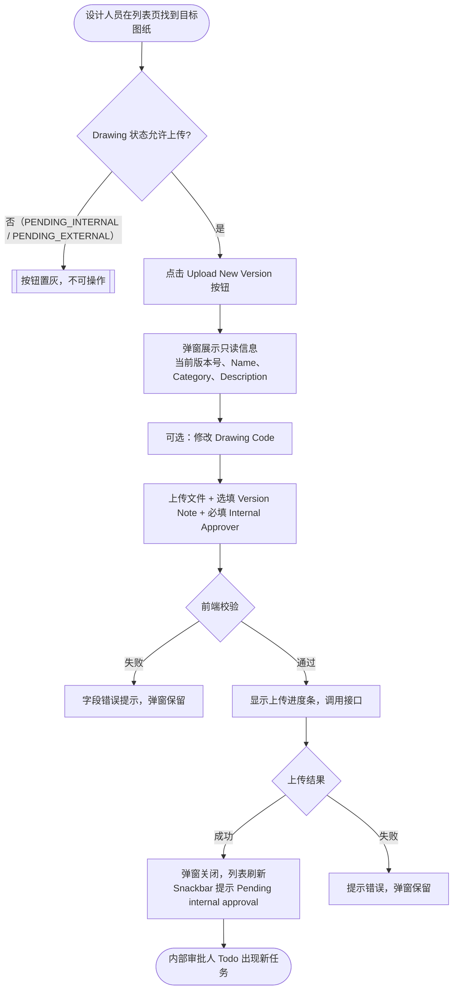

# 需求文档：PC 端 — 上传新版本

> **使用说明**：本文档是整个交付链路的**单一事实源**，聚焦于已有图纸的"上传新版本"操作。
> 图纸列表页展示规则见 [REQ-003A-pc](REQ-003A-pc.md)；新建图纸上传（含 AI 识别）见 [REQ-003E-pc](REQ-003E-pc.md)；审批业务规则见 [REQ-007-shared](../shared/REQ-007-shared.md)。

---

## 1. 背景与目标

### 1.1 业务背景

当图纸经内部审批驳回（`INTERNAL_REJECTED`）或外部审批驳回（`EXTERNAL_REJECTED`）后，设计人员需要修改图纸并重新上传新版本，重新触发两级审批流程。此外，在图纸版本生效（`ACTIVE`）后也可上传新版本持续迭代。

"上传新版本"与"新建图纸"的本质区别在于：新版本基于已有 Drawing 主记录创建新的 DrawingVersion，系统版本号自动递增，历史版本保留可查。

### 1.2 业务目标

让设计人员能快速在已有图纸基础上上传新版本文件，指定内部审批人后重新触发两级审批流程，同时允许修正 Drawing Code 以与纸质图纸保持一致。

### 1.3 非目标（Out of Scope）

- 新建图纸（新 Drawing 主记录）：由 REQ-003E-pc 覆盖
- 内部审批操作本身：由 REQ-007A-pc 覆盖
- DC 外部审批操作：由 REQ-007B-pc 覆盖
- 版本历史查看：由 REQ-003C-pc 覆盖
- Site Engineer 分配：由 REQ-003D-pc 覆盖
- APP 端操作：由 REQ-003-app 覆盖

---

## 2. 用户与角色

### 2.1 角色定义

| 角色 ID | 角色名 | 描述 | 典型场景 |
|--------|-------|------|---------|
| ROLE-001 | 设计人员（Designer） | 图纸责任人，负责上传新版本并重新发起审批 | 收到驳回通知后，在列表页点击 [Upload New Version] 上传修改后的文件 |
| ROLE-002 | 内部审批人 | 接收内部审批任务（设计经理/总工程师等） | 设计人员提交后，在 Todo 列表看到新的内部审批任务 |

### 2.2 用户故事（User Stories）

#### US-003F-001：设计人员上传新版本并重新发起审批

```
作为 设计人员（Designer）
我想要 在图纸列表中对已有图纸上传修改后的文件，指定内部审批人
以便 图纸重新进入两级审批流程，历史版本保留不丢失
```

**优先级**：P1

---

## 3. 角色与权限矩阵

| 操作 | 设计人员 | 内部审批人 | 项目管理员 | Site Engineer |
|-----|:-------:|:---------:|:---------:|:-------------:|
| 点击 [Upload New Version]（状态允许时） | ✅ | ❌ | ❌ | ❌ |
| [Upload New Version] 置灰（状态不允许） | 置灰 | — | — | — |
| 修改 Drawing Code（弹窗内） | ✅ | ❌ | ❌ | ❌ |

---

## 4. 触发条件与状态守卫

### 4.1 允许上传新版本的状态

| Drawing 状态 | 是否允许上传新版本 | 说明 |
|------------|:--------------:|------|
| `ACTIVE` | ✅ | 最新版本已生效，可迭代 |
| `INTERNAL_REJECTED` | ✅ | 内部审批驳回，需修改重传 |
| `EXTERNAL_REJECTED` | ✅ | 外部审批驳回，需修改重传 |
| `PENDING_INTERNAL` | ❌（置灰） | 当前版本审批中，不可并行上传 |
| `PENDING_EXTERNAL` | ❌（置灰） | 当前版本外部审批中，不可并行上传 |

### 4.2 相关状态转换

| From | To | 触发动作 | 守卫条件 | 副作用 |
|------|-----|---------|---------|-------|
| 任意允许状态 | `PENDING_INTERNAL` | 设计人员提交新版本 | 当前无 `PENDING_INTERNAL` 或 `PENDING_EXTERNAL` 版本；Drawing Code 项目内唯一 | 通知内部审批人（Todo 出现任务）；旧版本状态不变直至新版本审批通过 |
| `PENDING_INTERNAL` | `ACTIVE`（旧版本 → `DEPRECATED`） | 新版本最终审批通过 | — | 旧版本标记 DEPRECATED |

> 完整状态机定义见 [REQ-007-shared §4.4](../shared/REQ-007-shared.md)。

---

## 5. 业务流程

### 5.1 主流程

1. 设计人员在图纸管理列表页（REQ-003A-pc）找到目标图纸
2. 点击该行 Actions 列的 **[Upload New Version]** 按钮（按钮仅在状态允许时可点，否则置灰）
3. 弹出"Upload New Version — {drawingCode} {drawingName}"弹窗
4. 弹窗展示当前只读信息（版本号、Drawing Name、Category、Description）
5. 设计人员按需修改 Drawing Code（可选）
6. 上传新版本文件（必填）
7. 填写 Version Note（选填），选择 **Internal Approver**（必填）
8. 点击 [Submit]：前端校验必填项 → 显示上传进度条 → 调用接口
9. 上传成功：弹窗关闭，列表刷新，Snackbar 提示 `"New version uploaded. Pending internal approval."`；内部审批人 Todo 出现新任务
10. 上传失败：提示具体错误，弹窗保留，用户可重试

### 5.2 流程图（Mermaid）



### 5.3 异常流程

| 异常场景 | 触发条件 | 系统响应 | 用户感知 |
|---------|---------|---------|---------|
| 文件格式不支持 | 选择非 PDF/DWG/DXF/PNG/JPG 文件 | 拒绝选择，弹出提示 | 提示支持格式列表（PDF / DWG / DXF / PNG / JPG） |
| 文件超过 50MB | 文件大小 > 50MB | 拒绝选择，弹出提示 | 提示文件过大（最大 50MB） |
| Drawing Code 重复 | 修改后的 Code 在项目内已存在 | 提交时服务端校验失败 | Drawing Code 字段下方内联显示"Code already exists"，弹窗保留 |
| 上传网络中断 | 上传过程网络断开 | 提示上传失败 | Toast 提示，弹窗保留，可重试 |
| 状态变更（并发） | 点击按钮后状态被其他人操作变为禁止态 | 接口返回 409，前端提示 | "This drawing is now under review. Please refresh and try again." |

---

## 6. 功能需求详述

### 6.1 功能 F-001：上传新版本弹窗（Upload New Version）

**关联用户故事**：US-003F-001
**所属流程节点**：流程 5.1 步骤 3–9

**弹窗标题**：`Upload New Version — {drawingCode} {drawingName}`

**只读展示区**（继承自 Drawing 主记录，不可编辑，灰色样式，供上传人核对）：

| 字段 | 内容 | 说明 |
|------|------|------|
| Current Version | `Vn`（只读） | 当前系统版本号；提交成功后自动递增为 V(n+1)；**首次上传时系统版本为 V0** |
| Drawing Name | Drawing.name | 只读，继承主记录 |
| Category | Drawing.category | 只读，继承主记录 |
| Description | Drawing.description | 只读，继承主记录；无内容时显示 `—` |

**可编辑字段**：

| 序号 | 字段 | 类型 | 必填 | 约束 |
|-----|------|------|:---:|------|
| 1 | Drawing Code | 文本输入框 | ✅ | 预填当前值，**可编辑**；项目内唯一（服务端校验） |
| 2 | Drawing File | 文件上传 | ✅ | 支持 PDF / DWG / DXF / PNG / JPG；≤ 50MB；支持点击选择或拖拽上传 |
| 3 | Version Note | 文本输入框 | ❌ | 选填，无字数限制（建议 ≤ 500 字符） |
| 4 | Internal Approver | 下拉单选 | ✅ | 项目内有 `drawing:approve` 权限的用户列表 |

**Drawing Code 变更规则**：
- 修改 Drawing Code 后，Drawing 主记录的 Code 随之更新为新值
- 系统版本号（V0、V1…）独立自增，不受 Drawing Code 影响
- 修改后的 Drawing Code 仍须满足项目内唯一性约束（服务端在提交时校验）

**提交逻辑**：
1. 点击 [Submit] 触发前端必填校验（Drawing Code、Drawing File、Internal Approver）
2. 校验通过后显示上传进度条，调用接口（创建新 DrawingVersion，版本号自动递增）
3. 成功：弹窗关闭，列表刷新，Snackbar 提示 `"New version uploaded. Pending internal approval."`
4. 失败：保留弹窗，展示具体错误

### 6.2 功能 F-002：上传进度

- 点击 [Submit] 且前端校验通过后，弹窗内展示进度条（0% → 100%）
- 上传期间 [Submit] 按钮禁用，防止重复提交
- 上传完成或失败后进度条消失

---

## 7. 验收标准（Acceptance Criteria）

### AC-003F-001：成功路径

```
Given  设计人员具备 drawing:upload 权限，目标图纸状态为 ACTIVE / INTERNAL_REJECTED / EXTERNAL_REJECTED
When   点击 [Upload New Version]，填写 Drawing Code、上传文件、选择 Internal Approver，点击 [Submit]
Then   弹窗关闭，列表刷新，图纸状态变为 PENDING_INTERNAL，
       Snackbar 提示"New version uploaded. Pending internal approval."；
       系统版本号在原版本号基础上加 1
```

### AC-003F-002：文件格式校验

```
Given  用户在上传新版本弹窗中选择不支持格式的文件（如 .xlsx）
When   选择文件后
Then   系统拒绝该文件并提示支持的格式列表（PDF / DWG / DXF / PNG / JPG）；文件上传区域清空
```

### AC-003F-003：文件大小校验

```
Given  用户选择大于 50MB 的文件
When   选择文件后
Then   系统拒绝该文件并提示文件过大（最大 50MB）
```

### AC-003F-004：上传成功后内部审批人 Todo 出现任务

```
Given  上传新版本成功
When   指定的内部审批人进入 Todo 列表
Then   新的"Internal Approval Required"任务立即出现，包含图纸编号、名称和版本号
```

### AC-003F-005：上传进度条与防重复提交

```
Given  用户点击 [Submit] 且前端校验通过
When   文件正在上传中
Then   显示进度条，[Submit] 按钮禁用；上传完成或失败后进度条消失
```

### AC-003F-006：Drawing Code 修改成功

```
Given  图纸当前 Drawing Code 为 "ARCH-001"，设计人员打开 Upload New Version 弹窗
When   将 Drawing Code 修改为 "ARCH-001-R2" 并提交成功
Then   图纸列表中该图纸的 Drawing Code 更新为 "ARCH-001-R2"，系统版本号正常递增
```

### AC-003F-007：Drawing Code 修改仍受唯一性约束

```
Given  项目内已存在 Drawing Code "ARCH-002"
When   上传新版本时将 Drawing Code 改为 "ARCH-002" 并提交
Then   服务端返回错误，Drawing Code 字段下方内联展示"Code already exists"，弹窗保留
```

### AC-003F-008：审批中状态时按钮置灰

```
Given  图纸当前状态为 PENDING_INTERNAL 或 PENDING_EXTERNAL
When   用户查看该行的 Actions 列
Then   [Upload New Version] 按钮处于置灰不可点状态
```

---

## 8. 非功能需求

### 8.1 性能

| 指标 | 目标值 | 测量方式 |
|-----|-------|---------|
| 文件上传速度 | 50MB 文件 ≤ 60s（正常网络） | 实测 |
| 上传接口响应 P95 | ≤ 3s（不含文件传输时间） | 后端监控 |

### 8.2 安全

- 鉴权方式：JWT
- 文件类型白名单校验（前后端双重校验）
- 审计：文件上传操作记录操作人、时间、文件名、图纸 ID

### 8.3 可访问性

- WCAG 等级：AA
- 键盘可达：弹窗内所有输入项支持 Tab 键导航；Esc 关闭弹窗
- 屏幕阅读器：是

### 8.4 兼容性

- 浏览器：Chrome 100+、Edge 100+、Safari 15+
- 移动端：不支持（PC 专属）
- 国际化：中英双语

### 8.5 可观测性

- 关键埋点：点击 [Upload New Version]、上传成功、上传失败（含错误类型）
- 错误监控：Sentry（文件上传失败率 > 5% 告警）

---

## 9. 数据量级

| 维度 | 当前预期 | 1 年后 | 3 年后 |
|-----|---------|-------|-------|
| 版本数量/图纸 | ≤ 20 个版本 | ≤ 50 个版本 | 不限 |
| 单文件大小上限 | 50MB | 50MB | <!-- TODO: 是否放宽 --> |

---

## 10. 依赖与外部系统

| 依赖系统 | 用途 | 集成方式 |
|---------|------|---------|
| 对象存储（OSS/S3） | 图纸文件存储 | 服务端预签名 URL 上传 |
| 消息通知系统 | 内部审批人 Todo 推送 | 内部事件 |
| REQ-003A-pc | 图纸列表页入口（[Upload New Version] 按钮所在） | 文档引用 |
| REQ-003-shared | 接口定义、业务规则 | 文档引用 |

---

## 11. 灰度与发布策略

- 灰度方式：按项目灰度（与 REQ-003A-pc 同批次）
- 灰度比例：1 个试点项目 → 全量
- 回滚预案：关闭 [Upload New Version] 入口功能开关，已上传数据无需回滚

---

## 12. Open Questions

| OQ ID | 问题 | 影响 | Owner | 截止 |
|------|------|------|-------|------|
| OQ-001 | 文件大小上限未来是否需要放宽？ | F-001 约束 | PM | — |
| OQ-002 | Version Note 是否需要字数上限约束？ | F-001 字段约束 | PM | — |

---

## 13. Figma / 原型链接

- Figma 设计稿：<!-- 填写 Upload New Version 弹窗 Frame 链接 -->

---

## 14. 变更历史

| 版本 | 日期 | 修改人 | 变更摘要 | 影响下游文档 |
|-----|------|-------|---------|------------|
| 0.1.0 | 2026-05-25 | agent | 从 REQ-003A-pc v0.3.1 拆分；原文档 F-003（上传新版本弹窗）、F-004（上传进度）及相关 AC（003A-003B/004/005/006/007/009/010）迁入本文档，AC 重编为 003F-001 ~ 003F-008 | Frontend、Backend、QA |

---

## 15. 备注

- 本文档从 REQ-003A-pc（图纸上传与审批发起）拆分，专注"上传新版本"单一职责。
- 新建图纸上传（含 AI 识别）见 [REQ-003E-pc](REQ-003E-pc.md)。
- 图纸列表页展示与筛选见 [REQ-003A-pc](REQ-003A-pc.md)。
