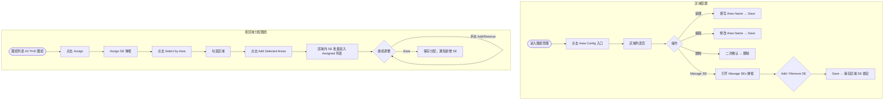

# 需求文档：PC 端 — 图纸管理区域配置与双模式 SE 分配（单选 + 按区域批量）

> **使用说明**：本文档是整个交付链路的**单一事实源**。所有下游文档（UI/前端/后端/QA）从本文档派生。
> 任何字段标注 `<!-- TODO: ... -->` 表示 PM 待补充，下游 agent 看到 TODO 不应编造，应保留并向上反馈。

---

## 1. 背景与目标

### 1.1 业务背景

REQ-003D-pc 定义了图纸管理员通过 [Assign] 弹框将图纸逐一分配给 Site Engineer 的流程。现状痛点：

- 项目规模扩大后，SE 人数可达数十甚至上百人，在 Available 列表中逐个搜索、逐个 Add 效率极低
- 实际工地中，SE 通常按**施工区域（Zone/Area）**分组管理（如 A 区、B 区、地下室等），不同区域的图纸只需分配给对应区域的 SE
- 目前系统没有区域概念，每次分配都需要图纸管理员凭记忆判断哪些 SE 负责哪个区域，容易遗漏或误分配

### 1.2 业务目标

1. 在图纸管理模块下提供**区域配置入口**，图纸管理员可维护项目区域列表，并为每个区域预先绑定负责的 SE 名单。
2. 在图纸 [Assign] 弹框中同时支持**两种 SE 选择模式**，两种模式可在同一次分配操作中混合使用：
   - **单选模式**（Individual）：在 Available 列表中逐条搜索并 Add 单个 SE，适合对少量特定人员进行精确分配
   - **按区域批量模式**（By Area）：选中一个或多个预配置区域，一键将区域内全部 SE 批量加入 Assigned 列表，适合快速完成大批量分配

### 1.3 非目标（Out of Scope）

- 区域与图纸 Category / Drawing Code 的自动关联（本期由图纸管理员手动选择区域，不做自动匹配）
- APP 端区域配置（APP 端无管理后台操作）
- 区域作为图纸筛选维度（本期仅用于 SE 分配加速，不影响图纸列表筛选，可后续迭代）
- SE 人员管理本身（SE 账号的增删由用户管理模块负责，本需求仅消费 SE 名单）
- 一个 SE 只能属于一个区域的限制（本期允许一名 SE 同时属于多个区域）

---

## 2. 用户与角色

### 2.1 角色定义

| 角色 ID | 角色名 | 描述 | 典型场景 |
|--------|-------|------|---------|
| ROLE-001 | 图纸管理员 | 具备 `drawing:area-config` 权限，负责维护区域列表及区域内的 SE 绑定 | 新建区域、为区域添加/移除 SE；在分配图纸时按区域批量选 SE |
| ROLE-002 | Site Engineer（SE） | 被添加到区域后，其姓名出现在对应区域的 SE 列表中 | 被图纸管理员加入区域后，收到通知（可选，见 OQ-001） |

### 2.2 用户故事（User Stories）

#### US-003G-001：维护项目区域列表

```
作为 图纸管理员
我想要 在图纸管理下的区域配置页面，新建、编辑和删除项目区域
以便 将工地按施工分区组织，为后续 SE 分配提供区域维度
```

**优先级**：P1
**所属史诗**：图纸管理全流程

---

#### US-003G-002：为区域配置 SE 名单

```
作为 图纸管理员
我想要 进入某个区域的详情，将项目内的 SE 添加或移除到该区域
以便 每个区域都有预设的 SE 负责人名单，一次配置后可在分配图纸时复用
```

**优先级**：P1
**所属史诗**：图纸管理全流程

---

#### US-003G-003：在分配图纸时按区域批量选 SE

```
作为 图纸管理员
我想要 在图纸 [Assign] 弹框中选择一个或多个区域，将该区域的所有 SE 一键批量加入 Assigned 列表
以便 不再需要逐个搜索 SE，分配速度大幅提升，也减少遗漏
```

**优先级**：P1
**所属史诗**：图纸管理全流程

---

#### US-003G-004：在同一次分配操作中混合使用单选与按区域批量选

```
作为 图纸管理员
我想要 在同一次图纸 [Assign] 操作中，既可以按区域批量添加一组 SE，也可以在此基础上手动单独添加或移除特定 SE
以便 灵活应对"大部分按区域分配，个别特殊人员需单独调整"的真实场景，无需重新发起分配流程
```

**优先级**：P1
**所属史诗**：图纸管理全流程

---

## 3. 角色与权限矩阵

| 操作 | 图纸管理员 | 普通用户 | Site Engineer | DC |
|-----|:---------:|:-----------:|:-------------:|:--:|
| 查看区域配置入口 | ✅ | ❌ | ❌ | ❌ |
| 新建区域 | ✅ | ❌ | ❌ | ❌ |
| 编辑区域名称 | ✅ | ❌ | ❌ | ❌ |
| 删除区域 | ✅ | ❌ | ❌ | ❌ |
| 查看区域内 SE 列表 | ✅ | ❌ | ❌ | ❌ |
| 为区域添加 SE | ✅ | ❌ | ❌ | ❌ |
| 从区域移除 SE | ✅ | ❌ | ❌ | ❌ |
| 在 [Assign] 弹框中使用"按区域选择" | ✅ | ❌ | ❌ | ❌ |

---

## 4. 核心实体与数据生命周期

### 4.1 实体清单

| 实体 ID | 实体名 | 描述 | 关键属性（业务语义） |
|--------|-------|------|------------------|
| ENT-010 | DrawingArea（图纸区域） | 项目级区域配置，用于组织 SE 人员 | areaId、projectId、areaName、createdAt、createdBy |
| ENT-011 | DrawingAreaSE（区域-SE 绑定） | 记录某区域包含哪些 SE | areaId、userId（SE）、addedAt、addedBy |

### 4.2 实体关系

- 一个项目（Project）包含多个 DrawingArea（1:N）
- 一个 DrawingArea 包含多个 SE（通过 DrawingAreaSE，1:N）
- 一名 SE 可属于多个 DrawingArea（M:N，本期不限制）
- DrawingArea 与 Drawing / DrawingAssignment 无直接外键关联；区域仅作为 [Assign] 弹框中的批量选择工具

### 4.3 数据生命周期

**DrawingArea 生命周期**：
1. 创建：图纸管理员在区域配置页新建区域时创建
2. 更新：图纸管理员编辑区域名称时更新
3. 删除：图纸管理员删除区域时软删除（`deletedAt` 打时间戳）；已关联的 DrawingAreaSE 记录随之失效（无需单独删除，查询时联表过滤）
4. 保留期限：随项目归档

**DrawingAreaSE 生命周期**：
1. 创建：图纸管理员在区域详情中点击 [Add] 保存后创建
2. 删除：图纸管理员点击 [Remove] 保存后硬删除
3. 注意：SE 账号被停用/移出项目时，DrawingAreaSE 记录保留，但查询时需过滤掉非活跃 SE（由后端处理）

---

## 5. 状态机

本需求无独立状态机。DrawingArea 无状态流转，仅存在（active）和已删除（deleted）两态。

---

## 6. 业务流程

### 6.1 主流程一：配置区域（新建 / 编辑 / 删除）

1. 图纸管理员在图纸管理页面顶部导航或配置入口点击 **[Area Config]** 按钮，进入区域配置页
2. 页面展示当前项目的区域列表，每行显示区域名称、已绑定 SE 数量、创建时间、操作列（[Edit] / [Delete]）
3. 点击 **[+ Add Area]**：弹出新建区域弹窗，填写 Area Name → 点击 [Save] 创建
4. 点击某行的 **[Edit]**：弹出编辑弹窗，修改 Area Name → 点击 [Save] 保存
5. 点击某行的 **[Delete]**：弹出二次确认对话框 → 确认后删除区域（区域内已绑定 SE 同步解绑）

### 6.2 主流程二：为区域配置 SE

1. 在区域配置页点击某区域行的 **[Manage SE]** 按钮（或区域名称可点击进入详情）
2. 打开 **Manage SEs — {Area Name}** 弹框：
   - 左侧 **In Area**：当前已绑定该区域的 SE 列表（含数量，每条有 [Remove] 按钮）
   - 右侧 **Available**：项目内所有 SE 去除已在该区域的（每条有 [Add] 按钮）
   - 两侧均含姓名搜索框，空状态显示 "No Data"
3. 图纸管理员点击 [Add] 将 SE 加入区域 / 点击 [Remove] 从区域移出
4. 点击 **[Save]** 保存，Snackbar 提示 "Area SE configuration saved."
5. 点击 **[Cancel]** 不保存

### 6.3 主流程三：在 [Assign] 弹框中按区域批量选 SE（REQ-003D-pc 增强）

1. 图纸管理员在图纸列表点击某 ACTIVE 图纸的 **[Assign]** 按钮，打开 Assign Site Engineers 弹框（沿用 REQ-003D-pc F-002）
2. 弹框右侧 Available 面板顶部新增 **[Select by Area]** 下拉按钮
3. 点击 [Select by Area]：展开下拉面板，以**树形结构**展示本项目所有区域及其下属 SE：
   - 每个区域行：Checkbox + 区域名称 + `({该区域 SE 数量})`
   - 区域行下缩进展示该区域内每名 SE 的 Checkbox + 姓名
4. 图纸管理员可灵活选择：
   - **勾选区域行**：自动全选该区域下所有 SE（区域 Checkbox 为选中态）
   - **单独勾选/取消 SE 行**：仅选中特定 SE；若区域内 SE 被部分选中，区域 Checkbox 显示**半选（indeterminate）**态
   - 两种选择方式可**混合使用**：在同一次下拉操作中既可整区域选，也可逐条选单个 SE
5. 点击 **[Add Selected]**：将所有已勾选的 SE（去重后的并集）中**尚未在 Assigned 列表中**的 SE 批量加入 Assigned 列表
6. 已在 Assigned 列表的 SE 不重复添加（幂等）
7. 后续流程与 REQ-003D-pc 一致：图纸管理员可继续手动 Add/Remove 单个 SE，最终点击 [Save] 统一保存

### 6.4 流程图（Mermaid）



---

## 7. 功能需求详述

### 7.1 功能 F-001：图纸管理区域配置入口

**关联用户故事**：US-003G-001
**所属流程节点**：流程 6.1 步骤 1

- 在图纸管理页面的顶部操作区（与 [Upload] 等操作按钮同排，或作为独立的 **[⚙ Area Config]** 图标按钮）新增区域配置入口
- 仅 `drawing:area-config` 权限用户可见；普通用户、SE、DC 不可见
- 入口样式：次要按钮（Secondary Button），图标 + 文字 `Area Config`
- 点击后：跳转至区域配置页（独立路由，如 `/drawing/area-config`），或以抽屉（Drawer）方式在当前页内打开（<!-- TODO: PM 确认交互形式，建议独立页面以便管理大量区域 -->）

### 7.2 功能 F-002：区域配置列表页

**关联用户故事**：US-003G-001
**所属流程节点**：流程 6.1

#### 页面结构

| 区域 | 内容 |
|-----|------|
| 页面标题 | `Area Configuration` |
| 顶部操作栏 | [+ Add Area] 按钮（主色）；右侧搜索框（placeholder: `Search area name`） |
| 区域列表 | 表格，按创建时间倒序排列 |
| 空状态 | 无区域时显示插图 + 文字 "No areas configured. Click [+ Add Area] to get started." |

#### 表格列定义

| 列名 | 说明 | 排序 |
|-----|------|------|
| Area Name | 区域名称 | — |
| SE Count | 已绑定 SE 数量（如 `5 SEs`） | — |
| Created At | 创建时间（格式 YYYY-MM-DD） | 默认倒序 |
| Actions | [Manage SE]、[Edit]、[Delete] 三个操作 | — |

### 7.3 功能 F-003：新建 / 编辑区域弹窗

**关联用户故事**：US-003G-001
**所属流程节点**：流程 6.1 步骤 3–4

- 弹窗标题：新建时 `Add New Area`，编辑时 `Edit Area`
- 表单字段：
  - **Area Name**（必填）：文本输入框，placeholder: `e.g. Zone A, Basement`；最大 50 字符；同项目内不可重名（实时或提交时校验）
- 底部按钮：[Cancel]（次要）、[Save]（主色）
- 保存成功：弹窗关闭，列表刷新，Snackbar 提示 `Area saved successfully.`
- 保存失败（名称重复）：输入框下方 inline 错误提示 `Area name already exists.`

### 7.4 功能 F-004：删除区域二次确认

**关联用户故事**：US-003G-001
**所属流程节点**：流程 6.1 步骤 5

- 点击 [Delete] 弹出 Confirm Dialog：
  - 标题：`Delete Area`
  - 内容：`Are you sure you want to delete "{Area Name}"? All SE bindings in this area will be removed. This action cannot be undone.`
  - 按钮：[Cancel]（次要）、[Delete]（危险色 / Danger）
- 确认删除后：该区域及其所有 DrawingAreaSE 绑定软删除；列表刷新；Snackbar 提示 `Area deleted.`

### 7.5 功能 F-005：Manage SEs 弹框（区域 SE 配置）

**关联用户故事**：US-003G-002
**所属流程节点**：流程 6.2

#### 弹框整体

- 弹框类型：Modal Dialog（居中，宽度参考 REQ-003D-pc F-002 的 Assign SE 弹框）
- 标题：`Manage SEs — {Area Name}`
- 右上角关闭图标（等同 [Cancel]）
- 底部按钮：[Cancel]（次要）、[Save]（主色）

#### 左侧面板：In Area

| 元素 | 说明 |
|-----|------|
| 面板标题 | `In Area ({n})`，n 为当前已绑定 SE 数，实时更新 |
| 搜索框 | placeholder: `Search engineer name`，实时过滤 |
| SE 列表 | 头像色块、姓名、角色标签 "Site Engineer"、[Remove] 按钮 |
| 空状态 | `No SEs in this area.` |

#### 右侧面板：Available

| 元素 | 说明 |
|-----|------|
| 面板标题 | `Available ({n})`，n 为项目内未在该区域的 SE 数，实时更新 |
| 搜索框 | placeholder: `Search engineer name`，实时过滤 |
| SE 列表 | 头像色块、姓名、角色标签 "Site Engineer"、[Add] 按钮 |
| 空状态 | `All SEs have been added to this area.` |

#### 交互规则

- 与 REQ-003D-pc F-002 交互逻辑一致：点击 [Add] / [Remove] 仅更新本地状态，点击 [Save] 后统一提交
- 保存成功：弹框关闭，列表中该区域 SE Count 列实时更新，Snackbar 提示 `Area SE configuration saved.`
- 保存失败：Toast 错误提示，弹框保留

### 7.6 功能 F-006：[Assign] 弹框双模式 SE 选择（REQ-003D-pc F-002 增强）

**关联用户故事**：US-003G-003、US-003G-004
**所属流程节点**：流程 6.3

> ⚠️ 本功能是对 REQ-003D-pc 功能 F-002 的**增量变更**。弹框整体结构（Assigned / Available 双栏、[Save] / [Cancel]）保持不变；Available 面板新增"按区域选择"入口，形成**双模式并存**：
>
> | 模式 | 入口 | 适用场景 |
> |------|------|---------|
> | **单选模式**（Individual） | Available 列表中每条 SE 右侧的 [Add] 按钮（原有） | 精确指定少量特定 SE |
> | **批量模式**（By Area） | Available 面板顶部的 [Select by Area ▾] 按钮（新增） | 快速将整组区域 SE 批量加入 |
>
> 两种模式**可在同一次弹框操作中混合使用**，所有变更均在本地暂存，点击 [Save] 后统一提交。

#### 新增 UI 元素

- Available 面板搜索框**上方**新增 **[Select by Area ▾]** 次要按钮（图标 + 文字），与搜索框同行或独占一行（<!-- TODO: PM 确认布局，建议与搜索框同行节省垂直空间 -->）
- 若项目无已配置区域，按钮置灰，Tooltip 提示 `No areas configured. Go to Area Config to set up.`

#### Select by Area 下拉面板

面板采用**树形结构**，支持区域级选择与 SE 级选择并存：

| 元素 | 说明 |
|-----|------|
| 顶部全选 | `Select All` Checkbox，勾选后选中所有区域的所有 SE |
| 区域行 | Checkbox（三态：全选 / 半选 / 未选）+ 区域名称 + `({SE 数量})`；点击展开/收起子级 SE 列表 |
| SE 行（缩进） | Checkbox + SE 姓名 + 角色标签；默认展开，可折叠 |
| 区域 Checkbox 联动规则 | 勾选区域行 → 全选该区域所有 SE；取消区域行 → 取消该区域所有 SE；部分 SE 被选中 → 区域行显示 **indeterminate**（半选）态 |
| 底部操作栏 | [Add Selected]（主色按钮，显示已选 SE 总数，如 `Add Selected (5)`）、[Clear]（链接式，清空所有勾选）|
| 搜索框 | 面板顶部搜索框，支持按区域名或 SE 姓名过滤，过滤结果保持树形层级 |
| 空状态 | 无区域时显示 "No areas configured."；搜索无结果时显示 "No results found." |

#### 批量 Add 规则

- 点击 [Add Selected] 后：
  1. 收集所有已勾选 SE 的并集（无论来自整区域勾选还是单个 SE 勾选）
  2. 过滤掉已在 Assigned 列表中的 SE（幂等，不重复添加）
  3. 将剩余 SE 批量加入 Assigned 列表，Assigned 计数增加，Available 计数减少
  4. 下拉面板关闭，弹框恢复正常状态
- 批量 Add 后，图纸管理员仍可通过**单选模式**继续手动 Add / Remove 单个 SE，两种模式操作结果合并计入 Assigned 列表
- 所有变更（无论来自单选还是批量）**不立即调用接口**，点击 [Save] 后统一提交（与原有逻辑一致）

---

## 8. 验收标准（Acceptance Criteria）

### AC-003G-001：Area Config 入口仅对图纸管理员可见

```
Given  图纸管理员和普通用户同时登录系统
When   两者分别进入图纸管理页面
Then   图纸管理员可见 [Area Config] 入口；普通用户不可见该入口
```

### AC-003G-002：新建区域成功

```
Given  区域配置页无已有区域 / 已有部分区域
When   图纸管理员点击 [+ Add Area]，输入不重复的 Area Name，点击 [Save]
Then   区域配置列表新增该区域一行，SE Count 为 0，Snackbar 提示 "Area saved successfully."
```

### AC-003G-003：Area Name 不可重复

```
Given  已存在名为 "Zone A" 的区域
When   图纸管理员新建区域并输入 "Zone A"，点击 [Save]
Then   输入框下方显示 "Area name already exists."，区域未创建
```

### AC-003G-004：删除区域同步解绑 SE

```
Given  "Zone B" 区域已绑定 3 名 SE
When   图纸管理员删除 "Zone B"，确认删除
Then   "Zone B" 从列表消失；原来绑定的 3 名 SE 不再属于任何区域（除非另行绑定）
```

### AC-003G-005：为区域添加 SE

```
Given  "Zone A" 当前无绑定 SE，项目内有 5 名 SE
When   图纸管理员打开 "Zone A" 的 Manage SEs 弹框，Add 其中 3 名，点击 [Save]
Then   弹框关闭，"Zone A" 的 SE Count 更新为 3，Snackbar 提示 "Area SE configuration saved."
```

### AC-003G-006：[Select by Area] 按钮在无区域时置灰

```
Given  项目尚未配置任何区域
When   图纸管理员打开图纸 [Assign] 弹框
Then   Available 面板的 [Select by Area] 按钮呈置灰状态，hover 显示 Tooltip 提示去配置区域
```

### AC-003G-007：按区域批量 Add SE — 正常路径

```
Given  项目有 "Zone A"（含 SE1、SE2、SE3）和 "Zone B"（含 SE3、SE4）
       当前 Assigned 列表为空
When   图纸管理员在 [Assign] 弹框中勾选 Zone A 区域行和 Zone B 区域行，点击 [Add Selected]
Then   SE1、SE2、SE3、SE4 全部进入 Assigned 列表（SE3 不重复），Assigned 计数为 4
```

### AC-003G-011：在下拉面板中单独勾选特定 SE

```
Given  项目有 "Zone A"（含 SE1、SE2、SE3）
       当前 Assigned 列表为空
When   图纸管理员打开 [Select by Area] 下拉面板，仅勾选 Zone A 下的 SE1 和 SE3（不勾选 SE2），
       点击 [Add Selected]
Then   仅 SE1、SE3 进入 Assigned 列表，SE2 不被添加，Assigned 计数为 2
```

### AC-003G-012：混合选择 — 整区域 + 单个 SE

```
Given  项目有 "Zone A"（含 SE1、SE2）和 "Zone B"（含 SE3、SE4）
       当前 Assigned 列表为空
When   图纸管理员在下拉面板中勾选 Zone A 区域行（整区域），并单独勾选 Zone B 下的 SE3（不勾选 SE4），
       点击 [Add Selected]
Then   SE1、SE2、SE3 进入 Assigned 列表，SE4 不被添加，Assigned 计数为 3
```

### AC-003G-013：区域 Checkbox 半选（indeterminate）态

```
Given  "Zone A" 含 SE1、SE2、SE3
When   图纸管理员在下拉面板中仅勾选 Zone A 下的 SE1（未勾选 SE2、SE3）
Then   Zone A 区域行的 Checkbox 显示 indeterminate（半选）态，而非全选或未选
```

### AC-003G-008：按区域批量 Add SE — 幂等性

```
Given  SE1 已在 Assigned 列表，SE1 同属 "Zone A"
When   图纸管理员选择 Zone A，点击 [Add Selected Areas]
Then   SE1 不被重复添加，Assigned 列表中 SE1 仅出现一次
```

### AC-003G-009：按区域 Add 后仍可手动单独调整

```
Given  图纸管理员已通过 Select by Area 将 Zone A 的 3 名 SE 批量添加到 Assigned
When   图纸管理员继续手动点击 Available 中某 SE 的 [Add] 按钮，或点击 Assigned 中某 SE 的 [Remove] 按钮
Then   对应 SE 正常加入 / 移出 Assigned 列表，与批量操作结果合并，两种模式互不干扰
```

### AC-003G-010a：双模式混合使用 — 批量后精细调整

```
Given  项目有 "Zone A"（含 SE1、SE2、SE3）
When   图纸管理员先通过 Select by Area 批量 Add Zone A（SE1、SE2、SE3 进入 Assigned），
       再手动 Remove SE2，再手动 Add SE4（SE4 不属于任何区域）
Then   最终 Assigned 列表为 SE1、SE3、SE4；
       点击 [Save] 保存该结果，SE1、SE3、SE4 收到分配通知
```

### AC-003G-010b：区域配置页空状态

```
Given  项目尚未配置任何区域
When   图纸管理员进入区域配置页
Then   显示空状态插图与提示文字，[+ Add Area] 按钮可用
```

---

## 9. 非功能需求

### 9.1 性能

| 指标 | 目标值 | 测量方式 |
|-----|-------|---------|
| 区域配置列表加载 | ≤ 1s | 手动 / Lighthouse |
| Manage SEs 弹框打开（含 SE 列表） | ≤ 1s | 手动 |
| [Select by Area] 下拉区域列表渲染 | ≤ 500ms | 手动 |
| 批量 Add 区域 SE（本地操作） | 即时（无接口调用） | 手动 |

### 9.2 安全

- 鉴权：JWT
- 服务端校验 `drawing:area-config` 权限，无权限时所有区域配置接口返回 403
- 区域与 SE 绑定的修改操作须校验操作人为图纸管理员
- DrawingArea 归属项目隔离，不可跨项目读取

### 9.3 可访问性

- WCAG 等级：AA
- 区域列表表格支持键盘导航
- Manage SEs 弹框支持 Tab / Enter / Esc 键盘操作
- Select by Area 下拉 Checkbox 列表支持键盘多选

### 9.4 兼容性

- 浏览器：Chrome 100+、Edge 100+、Safari 15+
- 移动端：不支持（PC 专属管理功能）
- 国际化：中英双语

### 9.5 可观测性

关键埋点：
- 进入区域配置页
- 新建区域成功 / 失败
- 删除区域成功
- 为区域添加 SE 保存成功 / 失败
- 打开 [Select by Area] 下拉
- 按区域批量 Add SE（记录选中区域数、批量加入的 SE 数）

---

## 10. 数据量级与扩展性

| 维度 | 当前预期 | 1 年后 | 3 年后 |
|-----|---------|-------|-------|
| 单项目区域数 | ≤ 20 个 | ≤ 50 个 | ≤ 100 个 |
| 单区域 SE 数 | ≤ 30 人 | ≤ 100 人 | ≤ 200 人 |
| 一名 SE 所属区域数 | ≤ 5 个 | ≤ 10 个 | ≤ 20 个 |

---

## 11. 依赖与外部系统

| 依赖系统 | 用途 | 集成方式 | Owner |
|---------|------|---------|-------|
| REQ-003D-pc | 图纸 [Assign] 弹框原有逻辑，本需求在其基础上增量扩展 | 功能增强 | — |
| 用户管理模块 | 获取本项目的全部 SE 人员列表 | REST API | 后端 |
| REQ-003A-pc | 图纸管理列表页，需在其顶部操作区新增 [Area Config] 入口 | UI 变更 | — |

---

## 12. 数据迁移

无（新功能，无历史数据需迁移）

---

## 13. 上线操作清单

### 13.1 上线前

- [ ] 确认 `drawing:area-config` 权限已在图纸管理员角色中配置
- [ ] 区域 CRUD 接口联调完成
- [ ] 区域 SE 绑定接口联调完成
- [ ] [Assign] 弹框"按区域选择"功能联调完成（含区域列表接口）
- [ ] 区域配置页路由权限控制验证

### 13.2 上线后

- [ ] 验证图纸管理员可成功创建、编辑、删除区域
- [ ] 验证为区域绑定 SE 后，[Select by Area] 下拉正确展示
- [ ] 验证按区域批量 Add SE 后保存，SE 正确收到分配通知
- [ ] 验证无区域时 [Select by Area] 按钮置灰

---

## 14. 灰度与发布策略

- 灰度方式：与 REQ-003D-pc 同批次或独立灰度均可（区域配置为独立入口，不影响原有分配流程）
- 灰度比例：1 个试点项目 → 全量
- 回滚预案：隐藏 [Area Config] 入口开关 + 隐藏 [Select by Area] 按钮开关（两个独立 Feature Flag）

---

## 15. 成功指标（北极星）

| 指标 | 当前基线 | 目标 | 测量周期 |
|-----|---------|------|---------|
| 有区域配置的项目中，按区域批量分配使用率 | — | ≥ 60%（图纸分配操作中有使用过 Select by Area） | 每月 |
| 图纸分配操作平均耗时（从打开弹框到 Save） | — | 较 REQ-003D-pc 上线后基线下降 ≥ 30% | 每月 |

---

## 16. Open Questions

| OQ ID | 问题 | 影响 | Owner | 截止 |
|------|------|------|-------|------|
| OQ-001 | SE 被加入区域时是否需要发送站内通知？ | F-005 副作用 | PM | — |
| OQ-002 | 区域配置入口是独立页面（新路由）还是右侧 Drawer？建议独立页面以便管理大量区域 | F-001 交互形式 | PM | — |
| OQ-003 | 区域名称是否需要支持多语言（中英文双名称）？ | F-003 数据模型 | PM | — |
| OQ-004 | [Select by Area] 后批量 Add 的 SE 在 Available 面板中是否仍可见（用于二次调整）？建议不从 Available 移除，仅在 Assigned 面板增加，图纸管理员可用 [Remove] 减少 | F-006 交互细节 | PM | — |
| OQ-005 | 删除区域是否需要校验"该区域 SE 当前有未完成的图纸分配"？还是允许直接删除？ | F-004 业务规则 | PM | — |
| OQ-006 | 在双模式混合操作时，Assigned 面板是否需要区分"来源于区域批量添加"和"手动单独添加"的 SE（例如用不同 Tag 标识）？ | F-006 UI 细节 | PM | — |

---

## 17. Figma / 原型链接

- 区域配置列表页：<!-- 填写 Figma Frame 链接 -->
- Manage SEs 弹框：<!-- 填写 Figma Frame 链接 -->
- [Assign] 弹框双模式（Individual + By Area）交互：<!-- 填写 Figma Frame 链接 -->

---

## 18. 变更历史

| 版本 | 日期 | 修改人 | 变更摘要 | 影响下游文档 |
|-----|------|-------|---------|------------|
| 0.1.0 | 2026-05-28 | agent | 新建，覆盖区域配置 CRUD（US-003G-001）、区域 SE 绑定（US-003G-002）、按区域批量分配 SE（US-003G-003） | 全部下游待生成 |
| 0.2.0 | 2026-05-28 | agent | 明确双模式设计（单选 Individual + 按区域批量 By Area）；新增 US-003G-004（混合使用）；F-006 增加双模式对比表；新增 AC-003G-010a（混合使用端到端验收）；新增 OQ-006 | 全部下游待生成 |
| 0.3.0 | 2026-05-28 | agent | 增强 6.3 流程三与 F-006：[Select by Area] 下拉面板升级为树形结构，支持整区域勾选与单个 SE 勾选并存；区域行新增 indeterminate 半选态；底部按钮改为 [Add Selected]（含已选计数）+ [Clear]；新增 AC-003G-011（单独选 SE）、AC-003G-012（混合选择）、AC-003G-013（半选态） | FRONTEND-REQ-003G-pc、QA-REQ-003G-pc 需同步更新 |
| 0.3.1 | 2026-08-08 | XIA YING | 按 glossary.md §2 统一角色名称：项目管理员 / 项目管理人员 / 业务人员 / 管理员 → 图纸管理员；Drawing 团队（成员）→ 设计人员；审批人 → 内部审批人；普通业务人员 → 普通用户 | 全部 |

---

## 19. 备注

- 本需求是对 REQ-003D-pc（图纸 SE 分配）的**增量增强**，原有逐个手动 Add/Remove SE 的流程保持不变，"按区域选择"为可选的加速入口。
- 区域配置模式参考 REQ-007D-pc（DC 配置页面）的设计规范，保持一致的图纸管理员配置页风格。
- 如后续产品迭代需要将"区域"扩展为图纸的筛选/归类维度，本文档定义的 DrawingArea 实体可直接复用，无需重新设计数据模型。
