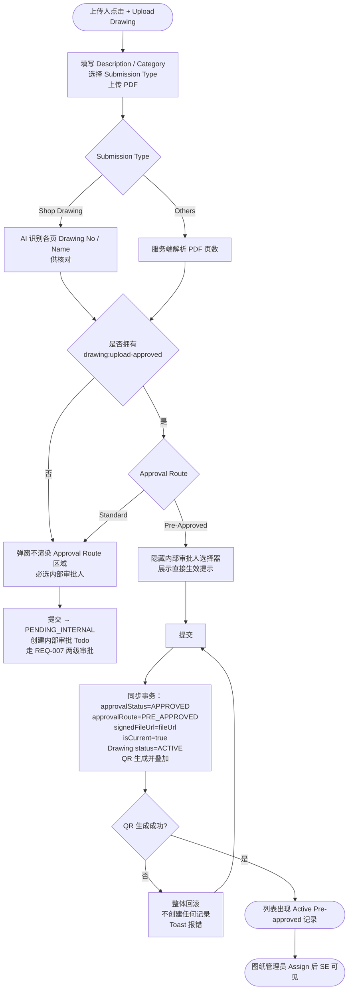

# 需求文档：PC 端 — 免审批上传（已完成审批的图纸直接生效）

> **使用说明**：本文档是整个交付链路的**单一事实源**。所有下游文档（UI/前端/后端/QA）从本文档派生。
> 任何字段标注 `<!-- TODO: ... -->` 表示 PM 待补充，下游 agent 看到 TODO 不应编造，应保留并向上反馈。

---

## 1. 背景与目标

### 1.1 业务背景

[REQ-007-shared](../shared/REQ-007-shared.md) 定义的图纸审批为**内部审批 → 外部审批**两级串行流程，且明确"所有图纸均需经过外部审批，无'仅内部审批'选项"。该约束在图纸**从系统内发起**时是正确的。

但实际业务中存在一类图纸，它在进入 Smart Site 之前**已经在系统外完成了全部审批**：

- 系统上线前已通过审批并在工地流通的存量图纸，需要补录进系统
- 由外部单位（设计院、总包）直接交付的、已带审批签章的图纸
- 项目移交、分包接管时一次性接收的既有图纸资料

现状痛点：

- 这类图纸没有可走的通道。上传人只能让它重新走一遍内部 + 外部审批，等于**对一份已经生效的图纸再审一次**
- 内部审批人和 DC 被迫处理无实际审核价值的 Todo，两级审批的严肃性被稀释
- 走完流程前图纸处于 `PENDING_INTERNAL` / `INTERNAL_APPROVED`，SE 在此期间看不到本应立即可用的图纸，现场施工被文档流程阻塞
- 部分上传人为绕开等待，转而在线下用微信/邮件分发图纸，脱离了版本管控与 QR 核验体系

### 1.2 业务目标

在新建图纸的上传弹窗中，为**持有专项权限**的上传人提供第二条审批路径 **Pre-Approved（免审批）**：

1. 上传人选择 Pre-Approved 路径后，**无需指定内部审批人**，提交即完成
2. 系统跳过内部审批与外部审批两个阶段，版本**直接进入 `APPROVED` 并立即生效**（`isCurrent = true`，图纸 `status = ACTIVE`）
3. 上传的文件同时作为**最终签字版**，按 [REQ-006-shared](../shared/REQ-006-shared.md) 现有机制同步生成 QR 并叠加，确保这条路径产出的图纸与正常流程产出的图纸在流通形态上完全一致
4. 该路径全程留痕：系统自动记录使用了免审批路径、由谁上传、何时上传，在版本历史与列表中可识别

目标效果：**已经审批过的图纸传上来就能用，不必陪跑一遍审批流程；同时这条捷径被权限收口、被标记留痕，不会变成绕过质量管控的默认做法。**

### 1.3 非目标（Out of Scope）

- **上传新版本场景**：本期免审批路径**仅适用于新建图纸的首个版本**。已有图纸的改版仍必须走两级审批（见 §7.3 非法转换）
- **录入外部审批凭证 / 审批日期 / 报审编号**：本期不要求上传人填写任何审批留档信息，弹窗中不出现相关字段（决策依据见 §19；相关风险见 OQ-001）
- **事后补录审批信息**：不提供对已免审批生效的版本补充凭证的入口（见 OQ-001）
- **批量导入**：本期仅支持在上传弹窗中逐条提交，不提供多文件批量免审批入库（见 OQ-003）
- **APP 端**：APP 端不含上传功能，本需求不涉及
- **AI 识别逻辑的变更**：Shop Drawing 的识别流程完全沿用 [REQ-003E-pc](REQ-003E-pc.md)，免审批路径不改变识别行为
- **两级审批流程本身的变更**：Standard 路径的行为一字不变，本需求只新增一条并行路径
- **SE 分配与推送机制的变更**：沿用 [REQ-007-shared §7.6](../shared/REQ-007-shared.md) 现有规则，不新增推送逻辑（见 §3.4）

---

## 2. 业务流程

### 2.1 主流程：免审批上传（成功路径）

1. **[ROLE-001 免审批上传人]** 在图纸列表点击 **[+ Upload Drawing]**，打开新建图纸弹窗（[REQ-003E-pc §7.1](REQ-003E-pc.md)）
2. **[ROLE-001]** 填写 Drawing Description、选择 Category、选择 Submission Type，上传 PDF 文件 —— 此步骤与现有流程完全一致
3. **[系统]** `SHOP_DRAWING` 时照常触发 AI 识别并展示各页识别结果供核对；`OTHERS` 时直接解析页数
4. **[ROLE-001]** 在弹窗的 **Approval Route** 区域选择 **`Pre-Approved — already approved outside the system`**
5. **[系统]** 隐藏并豁免 **Internal Approver** 选择器；在选择区下方展示提示文案，说明该图纸将跳过全部审批直接生效
6. **[ROLE-001]** 点击 **[Confirm]** 提交
7. **[系统]** 同步执行（loading 3–5 秒）：创建 Drawing + DrawingVersion → 版本直接生效（`APPROVED` / `isCurrent = true`）→ 图纸 `status = ACTIVE` → `signedFileUrl = fileUrl` → QR 生成并叠加至 PDF
8. **[系统]** 成功后弹窗关闭，Toast 提示图纸已直接生效，列表出现该记录，Status 列显示 `🟢 Active` 并附加灰色小字 `Pre-approved`
9. **[ROLE-003 图纸管理员]** 后续通过 [Assign]（[REQ-003D-pc](REQ-003D-pc.md)）将图纸分配给 SE，SE 按现有机制收到通知并查阅

### 2.2 主流程图（Mermaid）



### 2.3 异常流程

| 异常场景 | 触发条件 | 系统响应 | 用户感知 |
|---------|---------|---------|---------|
| 无免审批权限的用户调用接口 | 前端被绕过，请求携带 `approvalRoute = PRE_APPROVED` 但操作人无 `drawing:upload-approved` | 返回 403，错误码 `1003003020`，不创建任何记录 | Toast "You do not have permission to upload a pre-approved drawing" |
| 对已有图纸使用免审批路径 | 请求同时携带 `drawingId` 与 `approvalRoute = PRE_APPROVED` | 返回错误码 `1003003021`，不创建版本 | Toast "Pre-approved upload is only allowed when creating a new drawing" |
| QR 生成失败 | QR 服务不可用或 OSS 异常 | **整体事务回滚**，Drawing / DrawingVersion 均不落库，返回 `1003007009` | Toast "QR generation failed, please retry"，上传人当场重试（文件无需重传） |
| 图纸编号重复 | `SHOP_DRAWING` 且 `drawingCode` 在项目内已存在 | 返回 `1003003019`（沿用现有码），不创建记录 | 输入框下方红色提示 "Code already exists" |
| 文件格式 / 大小不合规 | 非 PDF 或 > 50MB | 沿用 [REQ-003E-pc](REQ-003E-pc.md) 现有校验，返回 `1003003002` / `1003003003` | 沿用现有提示 |
| 提交过程中权限被回收 | 图纸管理员在上传人打开弹窗后回收了该权限 | 后端在提交时实时校验，返回 `1003003020` | Toast 提示无权限，弹窗保持打开，用户可改选 Standard 路径重新提交 |

---

## 3. 功能需求详述

### 3.1 功能 F-001：上传弹窗新增 Approval Route 选择区

**关联用户故事**：US-003H-001、US-003H-002
**所属流程节点**：流程 6.1 步骤 4–5
**改动对象**：[REQ-003E-pc §7.1](REQ-003E-pc.md) 新建图纸弹窗

在弹窗中 **Internal Approver 选择器上方**新增一个 **Approval Route** 单选区域：

| 项 | 规则 |
|----|------|
| 渲染条件 | **仅当**当前用户拥有 `drawing:upload-approved` 时渲染整个区域；否则弹窗与现状完全一致（`v-if` 控制，不是置灰） |
| 选项 1 | `Standard Approval — internal then external`（**默认选中**） |
| 选项 2 | `Pre-Approved — already approved outside the system` |
| 切换为选项 2 时 | 隐藏 Internal Approver 选择器并解除其必填校验；已选值清空 |
| 切换回选项 1 时 | 恢复 Internal Approver 选择器及其必填校验 |
| 选项 2 下方提示 | 常驻展示警示文案：`This drawing will take effect immediately without internal or external approval. This action is recorded.` |
| 上传路径不影响的部分 | Drawing Description / Category / Submission Type / 文件上传 / AI 识别结果列表 / Drawing Code / Drawing Name 的填写与校验规则**完全不变** |

> **设计约束**：默认值必须是 Standard。免审批是例外路径，任何情况下都不应成为默认选项。

---

### 3.2 功能 F-002：提交后的系统行为

**关联用户故事**：US-003H-001
**所属流程节点**：流程 6.1 步骤 7
**接口**：`POST /drawing/create`（沿用 [REQ-003-shared §4.1.3](../shared/REQ-003-shared.md)，新增一个请求参数）

**新增请求参数**：

| 参数 | 类型 | 必填 | 说明 |
|------|------|------|------|
| approvalRoute | String | ❌ | `STANDARD`（不传时的默认值）/ `PRE_APPROVED`。传 `PRE_APPROVED` 时 `approverId` 变为非必填并被忽略 |

**`approvalRoute = PRE_APPROVED` 时的业务逻辑（全部在同一事务内）**：

1. 校验操作人同时拥有 `drawing:upload` 与 `drawing:upload-approved`，否则 `1003003020`
2. 校验请求**未携带** `drawingId`，否则 `1003003021`
3. 其余字段校验沿用现有规则（文件、`submissionType`、`drawingCode` 唯一性、`pageCount` 等），**无任何放宽**
4. 创建 Drawing 主记录，`status = ACTIVE`（而非 `PENDING_APPROVAL`）
5. 创建 DrawingVersion：`versionNo = V1`、`approvalStatus = APPROVED`、`approvalRoute = PRE_APPROVED`、`isCurrent = true`、`isDeprecated = false`、`approvedTime = 当前时间`
6. 将 `signedFileUrl` 写为与 `fileUrl` 相同的 OSS 地址
7. **不创建** DrawingApproval 记录；**不创建** Todo 任务；**不通知**内部审批人与 DC
8. 调用 QR 生成（[REQ-006-shared §3.1](../shared/REQ-006-shared.md)），叠加至 `signedFileUrl` 得到 `pdfWithQrUrl`
9. QR 生成失败时**整体回滚**，返回 `1003007009`——不允许出现"已生效但无 QR"的版本（与 [AC-007-008](../shared/REQ-007-shared.md) 保持同一原则）
10. 审计日志记录：操作人、时间、文件名、`submissionType`、`approvalRoute = PRE_APPROVED`

**`approvalRoute = STANDARD` 或不传时**：行为与现状**完全一致**，本需求不产生任何影响。

**新增错误码**：

| 错误码 | 说明 | 英文提示 |
|--------|------|---------|
| 1003003020 | 无免审批上传权限 | You do not have permission to upload a pre-approved drawing |
| 1003003021 | 免审批上传仅适用于新建图纸 | Pre-approved upload is only allowed when creating a new drawing |

> QR 生成失败复用 REQ-007 已定义的 `1003007009`，不新增重复码。

---

### 3.3 功能 F-003：免审批版本在版本历史中的展示

**关联用户故事**：US-003H-004
**改动对象**：[REQ-007C-pc §7.3 / §7.4](REQ-007C-pc.md) 4 阶段生命周期视图

免审批版本的 ② Internal 与 ③ External 两个阶段从未发生，必须有明确的展示规则，否则前端会渲染出无数据来源的空白卡片。

**4 阶段卡片渲染规则（`approvalRoute = PRE_APPROVED` 且 `approvalStatus = APPROVED`）**：

| 卡片 | 图标 | 内容 | 操作按钮 |
|------|------|------|---------|
| ① Uploaded | 📄 | 文件名、Uploader（上传人姓名）、上传时间、文件大小 | [Preview]、[Download] → `fileUrl` |
| ② Internal Approval | ⊘ | `Skipped — pre-approved upload`；副行：`Uploaded as already approved by {uploaderName}` | 无 |
| ③ External Approval | ⊘ | `Skipped — pre-approved upload` | 无（**不显示** [Mark Result]） |
| ④ Signed Version | 📄 | 文件名、`Uploaded: {uploadTime}`、文件大小；副行标注 `Same file as uploaded`（该路径下签字版即上传件） | [Preview] → `signedFileUrl`；[Download] → `pdfWithQrUrl` > `signedFileUrl` |

**底部步骤条**：新增 **⊘ 跳过态（灰色）**，用于 ② 与 ③：

```
📄 Uploaded ✓  →  🔍 Internal ⊘  →  🌐 External ⊘  →  ✍️ Signed ✓
```

| 步骤 | 完成 | 进行中 | 失败 | **跳过（新增）** | 未到达 |
|------|:----:|:------:|:----:|:--------------:|:------:|
| ② Internal | ✓ 绿色 | ⏳ 橙色 | ✕ 红色 | **⊘ 灰色** | — 灰色 |
| ③ External | ✓ 绿色 | ⏳ 橙色 | ✕ 红色 | **⊘ 灰色** | — 灰色 |

> **⊘ 与 — 的区别**：`—`（未到达）表示"还没轮到，将来会发生"；`⊘`（跳过）表示"这个阶段确定不会发生"。二者不可混用，否则管理人员会误以为该版本还在等待审批。

---

### 3.4 功能 F-004：免审批版本在图纸列表中的标识

**关联用户故事**：US-003H-004
**改动对象**：[REQ-003A-pc §4.2](REQ-003A-pc.md) 列表 Status 列

| 项 | 规则 |
|----|------|
| Status 标签 | `🟢 Active`，与正常生效的图纸**完全一致**（颜色、文案均不变） |
| 附加标识 | 标签右侧以灰色小字附加 `Pre-approved` |
| 与外部审批结果代码的关系 | 免审批版本**没有**外部审批结果，因此**不附加** `(A)` / `(B)` / `(D)` 代码；`Pre-approved` 与结果代码互斥，同一标签右侧只会出现其中一种 |
| SE 视角 | SE 侧列表**不展示** `Pre-approved` 标识——图纸对 SE 而言就是一份已生效的正式图纸，来源差异属于管理侧信息 |

**推送与分配**：免审批生效**不触发**任何 SE 推送。原因：按 [REQ-003-shared §3.4](../shared/REQ-003-shared.md) 规则 1，新建图纸默认不分配给任何 SE，推送目标列表为空；后续图纸管理员执行 [Assign] 后，SE 按 [REQ-003D-pc](REQ-003D-pc.md) 现有机制获知。本需求**不新增也不修改**任何推送逻辑。

---

### 3.5 功能 F-005：权限项注册与授予

**关联用户故事**：US-003H-003

| 项 | 规则 |
|----|------|
| 权限标识 | `drawing:upload-approved` |
| 归属模块 | 图纸管理（与 `drawing:upload` / `drawing:approve` 同级） |
| 默认归属角色 | **无**。不写入任何现有角色模板，包括设计人员角色 |
| 授予方式 | 图纸管理员在用户权限管理中为具体用户单独勾选 |
| 依赖关系 | 单独持有本权限无效，必须与 `drawing:upload` 同时持有；后端校验时两者同时判断 |
| 前端表现 | 无本权限时，上传弹窗中 Approval Route 区域**整体不渲染**（不是置灰、不是隐藏选项） |

---

## 4. 用户与角色

### 4.1 角色定义

| 角色 ID | 角色名 | 描述 | 典型场景 |
|--------|-------|------|---------|
| ROLE-001 | 免审批上传人 | 同时拥有 `drawing:upload` 与 `drawing:upload-approved` 权限的设计人员 / 资料员。该权限**默认不授予任何人**，由图纸管理员按人单独开通 | 将已在系统外审批通过的存量图纸补录入库，提交后图纸立即生效 |
| ROLE-002 | 设计人员（Designer） | 仅拥有 `drawing:upload` 权限的普通上传人 | 正常上传图纸走两级审批；弹窗中**看不到** Pre-Approved 选项 |
| ROLE-003 | 图纸管理员 | 拥有用户权限管理能力，负责授予 / 回收 `drawing:upload-approved` | 为特定资料员开通免审批上传权限；定期复核该权限的持有人 |
| ROLE-004 | 图纸管理员 | 可查看完整版本历史 | 在版本历史中识别哪些版本是免审批入库的，用于追溯与抽查 |

### 4.2 用户故事（User Stories）

#### US-003H-001：免审批上传已完成审批的图纸

```
作为 免审批上传人（ROLE-001）
我想要 在上传图纸时选择"该图纸已完成审批"，不指定内部审批人，提交后图纸直接生效
以便 已经审批过的图纸不必再走一遍内部 + 外部审批，现场能立即拿到可用的正式图纸
```

**优先级**：P1
**所属史诗**：图纸管理全流程

---

#### US-003H-002：普通上传人不受影响

```
作为 设计人员（ROLE-002）
我想要 上传弹窗对我保持原样，不出现我用不了的选项
以便 我的上传流程没有任何额外的理解成本和误操作空间
```

**优先级**：P1
**所属史诗**：图纸管理全流程

---

#### US-003H-003：图纸管理员收口免审批权限

```
作为 图纸管理员（ROLE-003）
我想要 免审批上传是一项默认关闭、需要单独授予的独立权限
以便 这条跳过全部质量管控的路径始终掌握在少数可信人员手中，不会被滥用
```

**优先级**：P1
**所属史诗**：图纸管理全流程

---

#### US-003H-004：识别免审批入库的版本

```
作为 图纸管理员（ROLE-004）
我想要 在图纸列表和版本历史中一眼看出哪些版本是免审批直接生效的
以便 事后抽查与审计时知道哪些图纸没有经过系统内审核，可以有针对性地核对
```

**优先级**：P2
**所属史诗**：图纸管理全流程

---

## 5. 角色与权限矩阵

> 下游 UI agent 据此生成「显示/隐藏/禁用」逻辑，后端 agent 据此生成权限校验。

| 操作 | 免审批上传人 | 设计人员 | 图纸管理员 | 内部审批人 | DC | Site Engineer |
|------|:-----------:|:-------:|:---------:|:---------:|:--:|:------------:|
| 上传图纸（`drawing:upload`） | ✅ | ✅ | ❌ | ❌ | ❌ | ❌ |
| 在弹窗中看到 Approval Route 选择区（`drawing:upload-approved`） | ✅ | ❌ 不渲染 | ❌ 不渲染 | ❌ | ❌ | ❌ |
| 选择 Pre-Approved 路径提交（`drawing:upload-approved`） | ✅ | ❌ 403 | ❌ 403 | ❌ | ❌ | ❌ |
| 授予 / 回收 `drawing:upload-approved` | ❌ | ❌ | ✅ | ❌ | ❌ | ❌ |
| 在版本历史中查看免审批标识（`drawing:history`） | ✅ | ✅ | ✅ | ✅ | ✅ | ❌ |
| 查看 / 下载免审批生效的图纸（`drawing:view`） | ✅ | ✅ | ✅ | ✅ | ✅ | ✅（需被 [Assign]） |

> **权限说明**：
> - `drawing:upload-approved` 为**新增权限项**，必须与 `drawing:upload` 同时持有才生效——它是对上传能力的路径扩展，而非独立的上传入口。
> - 该权限**默认不包含在任何现有角色模板中**，需图纸管理员为具体用户单独勾选（见 §14.1）。
> - SE 侧无任何感知差异：免审批生效的图纸与正常流程生效的图纸，在 SE 视角完全一致。

---

## 6. 核心实体与数据生命周期

> ⚠️ 本节定义业务实体的**业务语义**，不定义技术字段。技术字段在 data-contract 中定义。

### 6.1 实体清单

| 实体 ID | 实体名 | 描述 | 关键属性（业务语义） |
|--------|-------|------|------------------|
| ENT-001 | Drawing | 图纸主记录 | 沿用 [REQ-003-shared §2.1](../shared/REQ-003-shared.md)，本需求**不新增字段**；免审批创建的记录 `status` 直接为 `ACTIVE` |
| ENT-002 | DrawingVersion | 图纸版本记录（本需求场景下恒为首版 V1） | 沿用 [REQ-003-shared §2.2](../shared/REQ-003-shared.md) + [REQ-007-shared §4.1](../shared/REQ-007-shared.md)，**新增 `approvalRoute`**（见 §6.2）；`approvalStatus` 直接为 `APPROVED`；`fileUrl` 与 `signedFileUrl` 指向同一文件 |
| ENT-003 | DrawingApproval | 审批记录 | 免审批路径**不创建任何 DrawingApproval 记录**（既无 `phase = INTERNAL` 也无 `phase = EXTERNAL`）——系统内确实没有发生过审批行为，不应伪造审批记录 |
| ENT-004 | AIRecognitionJob | AI 识别任务 | 沿用 [REQ-003E-pc](REQ-003E-pc.md)，行为不变：`SHOP_DRAWING` 照常识别，`OTHERS` 不创建 |

### 6.2 新增属性：审批路径（approvalRoute）

| 属性 | 取值 | 含义 |
|------|------|------|
| `approvalRoute` | `STANDARD` | 走两级审批流程创建的版本（默认值，存量数据回填此值） |
| `approvalRoute` | `PRE_APPROVED` | 通过免审批路径直接生效的版本 |

> **为什么用属性而不是新增状态值**：版本的**状态**仍然是 `APPROVED`——它确实是一个已通过、已生效的版本，SE 与 QR 体系对它的处理与正常版本完全相同。改变的只是它**如何**到达该状态。若新增第 6 个状态值，[REQ-003A-pc §4.2](REQ-003A-pc.md)、[REQ-007C-pc §7.2](REQ-007C-pc.md) 及所有下游状态判断都要跟着扩散一遍，而它们真正关心的仍是"是否已生效"。
>
> **留痕由系统自动完成**：免审批版本的操作人与时间直接复用 `DrawingVersion.uploaderId` / `uploaderName` / `uploadTime`，不新增字段、不要求上传人额外录入任何内容。`approvalRoute = PRE_APPROVED` + 上传人 + 上传时间三者即构成完整的责任链。

### 6.3 实体关系

- 一次免审批上传创建**一条 Drawing + 一条 DrawingVersion**，与 [REQ-003E-pc §4.2](REQ-003E-pc.md) 一致，两类 `submissionType` 均无差别
- 该 DrawingVersion **不关联任何 DrawingApproval**（0 条），与 Standard 路径的"1 条 INTERNAL + N 条 EXTERNAL"形成对照
- 该 DrawingVersion 的 `fileUrl` 与 `signedFileUrl` **指向同一个 OSS 对象**——上传人提交的就是最终流通版，不存在"原始版 vs 签字版"的区分
- QR 叠加对象为 `signedFileUrl`，产出 `pdfWithQrUrl`，与 [REQ-007-shared §7.7](../shared/REQ-007-shared.md) 文件使用优先级规则保持一致

### 6.4 数据生命周期

**DrawingVersion（PRE_APPROVED）生命周期**：

1. **创建即生效**：上传人提交后，在同一事务内完成 `approvalStatus = APPROVED`、`isCurrent = true`、`approvalRoute = PRE_APPROVED`、`signedFileUrl = fileUrl`、Drawing `status = ACTIVE`、QR 生成叠加
2. **无中间态**：不存在 `PENDING_INTERNAL` / `INTERNAL_APPROVED` 阶段，不产生任何 Todo 任务
3. **废弃**：后续该图纸通过 Standard 路径上传新版本并生效后，本版本 `isCurrent = false`、`isDeprecated = true`（与正常版本一致）
4. **保留**：文件永久保留，`approvalRoute` 值永不变更，作为该版本的历史事实

---

## 7. 状态机

### 7.1 状态定义

本需求**不新增状态值**，完全沿用 [REQ-007-shared §5.1](../shared/REQ-007-shared.md) 定义的 5 态。相关状态：

| 状态 ID | 枚举值 | UI 展示 | 说明 |
|--------|--------|--------|------|
| S-004 | APPROVED | Approved | 免审批路径创建的版本**直接进入该状态**，为终态 |

### 7.2 状态转换表（新增转换）

| From | To | 触发动作 | 守卫条件（前置） | 副作用 |
|------|-----|---------|-------------|-------|
| —（无前序状态） | S-004 APPROVED | 上传人在新建图纸弹窗选择 **Approval Route = Pre-Approved** 并提交 | ① 操作人同时拥有 `drawing:upload` 与 `drawing:upload-approved`；② 为**新建图纸**（请求未携带 `drawingId`）；③ 文件校验通过（PDF ≤ 50MB）；④ `SHOP_DRAWING` 时 `drawingCode` 项目内唯一 | 同一事务内：`approvalRoute = PRE_APPROVED`；`signedFileUrl = fileUrl`；`isCurrent = true`；Drawing `status = ACTIVE`；QR 生成并叠加至 PDF；**不创建 DrawingApproval**；**不创建任何 Todo**；**不通知内部审批人与 DC** |

> 该转换是 `APPROVED` 状态的**第二条入边**。原有唯一入边（`INTERNAL_APPROVED` → `APPROVED`，由 DC 标记外部通过触发）保持不变。

### 7.3 非法转换

- **免审批路径不可用于上传新版本**：请求携带 `drawingId`（即已有图纸的改版）时，拒绝并返回 `1003003021`。已有图纸的任何改版必须走两级审批
- **不可将已有版本转为免审批**：处于 `PENDING_INTERNAL` / `INTERNAL_APPROVED` 的版本，不存在"直接标记为已审批"的操作入口或接口
- **免审批生效的版本不可再被审批**：`APPROVED` 为终态，对其调用 `/drawing/approve` 或 `/drawing/external-approve` 一律拒绝（沿用 [REQ-007-shared §5.3](../shared/REQ-007-shared.md)）
- **`approvalRoute` 不可事后修改**：一旦落库，任何接口均不提供修改能力

---

## 8. 页面简图

> 本需求不新增页面，改动集中在**一个弹窗的新增区域**和**两处已有页面的展示态**。
> 只画布局，组件选型与复用判断见下游 UI / 前端说明。

### 8.1 新建图纸弹窗 — Approval Route 区域

**对应功能**：F-001（见 §3.1）
**入口**：图纸管理列表页 → [+ Upload Drawing]（弹窗本体见 [REQ-003E-pc](REQ-003E-pc.md)，本需求只增加 Approval Route 一段）

**状态 A：Standard（默认，也是无权限用户看到的唯一形态）**

```
┌─ Upload Drawing ────────────────────────────────── ✕ ─┐
│                                                        │
│   … Description / Category / Submission Type …         │
│   … 文件上传区 / AI 识别结果列表 …                      │
│   … Drawing Code / Drawing Name …                      │
│                                                        │
│  ┌── Approval Route ─────────────────────────────┐    │
│  │  ◉ Standard Approval — internal then external │    │  ← 仅
│  │  ○ Pre-Approved — already approved outside…   │    │  drawing:upload-
│  └───────────────────────────────────────────────┘    │  approved 可见
│                                                        │  （无权限时整段不渲染）
│   Internal Approver *  [ 请选择审批人        ▾ ]       │
│                                                        │
│                              [ Cancel ]  [ Confirm ]   │
└────────────────────────────────────────────────────────┘
```

**状态 B：选中 Pre-Approved**

```
┌─ Upload Drawing ────────────────────────────────── ✕ ─┐
│                                                        │
│   …（上半部分与状态 A 完全一致，不受影响）…            │
│                                                        │
│  ┌── Approval Route ─────────────────────────────┐    │
│  │  ○ Standard Approval — internal then external │    │
│  │  ◉ Pre-Approved — already approved outside…   │    │
│  │  ⚠ This drawing will take effect immediately  │    │  ← 常驻警示
│  │    without internal or external approval.     │    │
│  │    This action is recorded.                   │    │
│  └───────────────────────────────────────────────┘    │
│                                                        │
│   ┌╌╌╌ Internal Approver 整行隐藏，必填校验解除 ╌╌╌┐   │
│                                                        │
│                              [ Cancel ]  [ Confirm ]   │
└────────────────────────────────────────────────────────┘
```

**分区说明**：

| 区域 | 内容 | 备注 |
|-----|------|------|
| Approval Route | 两个单选项 + 选中 Pre-Approved 时的常驻警示文案 | 位置在 Internal Approver **上方**；默认选中 Standard |
| Internal Approver | 原有内部审批人选择器 | 选 Pre-Approved 时隐藏并清空已选值，切回 Standard 时恢复 |
| 弹窗其余部分 | Description / Category / Submission Type / 文件 / AI 识别 / Code / Name | **完全不变**，两条路径共用 |

### 8.2 版本历史抽屉 — 免审批版本展开态

**对应功能**：F-003（见 §3.3）
**入口**：图纸列表 Actions 列 → [History] → 展开某个 `approvalRoute = PRE_APPROVED` 的版本

```
▼ V1  ✅ Approved  (Pre-approved)                       [Collapse]
┌────────────────────────────────────────────────────────────────┐
│  ① Uploaded                     ② Internal Approval            │
│  ┌──────────────────────┐       ┌──────────────────────┐       │
│  │ 📄 arch001-v1.pdf    │       │ ⊘ Skipped —          │       │
│  │ Uploader: 张三       │       │   pre-approved upload│       │
│  │ 2026-08-06 10:00     │       │                      │       │
│  │ Size: 2.5 MB         │       │ Uploaded as already  │       │
│  │        [Preview]     │       │ approved by 张三     │       │
│  │        [Download]    │       │                      │       │
│  └──────────────────────┘       └──────────────────────┘       │
│                                                                │
│  ③ External Approval            ④ Signed Version               │
│  ┌──────────────────────┐       ┌──────────────────────┐       │
│  │ ⊘ Skipped —          │       │ 📄 arch001-v1.pdf    │       │
│  │   pre-approved upload│       │ Uploaded: 2026-08-06 │       │
│  │                      │       │ Size: 2.5 MB         │       │
│  │ （不显示 Mark Result）│       │ ⓘ Same file as       │       │
│  │                      │       │   uploaded           │       │
│  │                      │       │        [Preview]     │       │
│  │                      │       │        [Download]    │       │
│  └──────────────────────┘       └──────────────────────┘       │
│                                                                │
│  📄 Uploaded ✓ → 🔍 Internal ⊘ → 🌐 External ⊘ → ✍️ Signed ✓  │
└────────────────────────────────────────────────────────────────┘
```

**分区说明**：

| 区域 | 内容 | 备注 |
|-----|------|------|
| ②③ 卡片 | `⊘ Skipped — pre-approved upload` | 灰色态。`⊘`（确定不会发生）不可写成 `—`（尚未到达），否则会被误读为仍在等待审批 |
| ④ 卡片 | 上传的同一文件 + `Same file as uploaded` 标注 | Download 优先 `pdfWithQrUrl` |
| 步骤条 | ②③ 为新增的 ⊘ 跳过态 | 见 §3.3 |

### 8.3 图纸列表 Status 列

**对应功能**：F-004（见 §3.4）
**入口**：图纸管理列表页（列表整体见 [REQ-003A-pc](REQ-003A-pc.md)，本需求只影响 Status 列）

```
│ Description            │ Ver │ Status                  │ Actions      │
│ ───────────────────────┼─────┼─────────────────────────┼───────────── │
│ Level 3 slab rebar     │ V3  │ 🟢 Active (A)           │ [View] […]   │  ← 走两级审批
│ Basement waterproofing │ V1  │ 🟢 Active  Pre-approved │ [View] […]   │  ← 免审批入库
│ Roof truss layout      │ V2  │ ⏳ Pending External     │ [View] […]   │
```

**分区说明**：

| 区域 | 内容 | 备注 |
|-----|------|------|
| Status 标签 | `🟢 Active`，与正常生效图纸**完全一致** | 颜色文案均不变 |
| 附加标识 | 右侧灰色小字 `Pre-approved` | 与外部审批结果代码 `(A)/(B)/(D)` **互斥**，同一标签右侧只出现其中一种 |
| SE 视角 | **不展示** `Pre-approved` | 来源差异属管理侧信息 |

---

## 9. 验收标准（Acceptance Criteria）

> 每条 AC 有唯一 ID，格式 `AC-003H-{序号}`。下游 QA agent 必须为每个 AC 至少派生 1 条 TC。

### AC-003H-001：无权限用户看不到 Approval Route 选择区

**关联用户故事**：US-003H-002

```
Given  当前用户拥有 drawing:upload 但不拥有 drawing:upload-approved
When   用户点击 [+ Upload Drawing] 打开新建图纸弹窗
Then   弹窗中不存在 Approval Route 区域（DOM 中不渲染，非置灰）
       且 Internal Approver 选择器正常显示且为必填
       且弹窗其余部分与现状完全一致
```

### AC-003H-002：有权限用户可见 Approval Route 且默认 Standard

**关联用户故事**：US-003H-001、US-003H-003

```
Given  当前用户同时拥有 drawing:upload 与 drawing:upload-approved
When   用户打开新建图纸弹窗
Then   Internal Approver 选择器上方显示 Approval Route 单选区域
       且默认选中 "Standard Approval — internal then external"
       且 Internal Approver 选择器显示且为必填
```

### AC-003H-003：切换到 Pre-Approved 后豁免内部审批人

**关联用户故事**：US-003H-001

```
Given  用户在弹窗中已选择 Standard 并已选定某内部审批人
When   用户切换 Approval Route 为 "Pre-Approved"
Then   Internal Approver 选择器隐藏，已选值清空，必填校验解除
       且下方显示警示文案 "This drawing will take effect immediately without internal or external approval. This action is recorded."
       且此时点击 [Confirm] 不因缺少内部审批人而被拦截
```

### AC-003H-004：免审批提交后版本直接生效

**关联用户故事**：US-003H-001

```
Given  有权限用户已填写全部必填项，Approval Route 选择 Pre-Approved
When   用户点击 [Confirm] 且系统处理成功
Then   DrawingVersion.approvalStatus = APPROVED
       且 approvalRoute = PRE_APPROVED
       且 versionNo = V1、isCurrent = true、isDeprecated = false
       且 Drawing.status = ACTIVE
       且 signedFileUrl 与 fileUrl 指向同一文件
       且 pdfWithQrUrl 有值（QR 已生成并叠加）
       以上全部在同一事务中完成
```

### AC-003H-005：免审批不产生任何审批记录与 Todo

**关联用户故事**：US-003H-001

```
Given  用户通过免审批路径成功提交一张图纸
When   查询该 DrawingVersion 的关联数据
Then   该版本关联的 DrawingApproval 记录数为 0
       且未创建任何 Todo 任务
       且内部审批人与项目 DC 的 Todo 列表中不出现该图纸
       且内部审批人与 DC 未收到任何站内通知
```

### AC-003H-006：免审批路径不可用于上传新版本

**关联用户故事**：US-003H-001

```
Given  某图纸已存在且处于任意状态
When   请求携带 drawingId 且 approvalRoute = PRE_APPROVED 调用 /drawing/create
Then   系统拒绝，返回错误码 1003003021
       且不创建任何 DrawingVersion 记录
       且 Toast 提示 "Pre-approved upload is only allowed when creating a new drawing"
```

### AC-003H-007：无权限用户绕过前端调用接口被拦截

**关联用户故事**：US-003H-003

```
Given  用户不拥有 drawing:upload-approved 权限
When   用户绕过前端，直接以 approvalRoute = PRE_APPROVED 调用 /drawing/create
Then   接口返回 403，错误码 1003003020
       且不创建任何 Drawing / DrawingVersion 记录
```

### AC-003H-008：QR 生成失败时整体回滚

**关联用户故事**：US-003H-001

```
Given  用户提交免审批上传，但 QR 服务不可用
When   系统尝试生成 QR 失败
Then   整体事务回滚，Drawing 与 DrawingVersion 均未落库
       且图纸列表中不出现该记录
       且 Toast 显示 "QR generation failed, please retry"
       且不存在"已生效但无 QR"的版本
```

### AC-003H-009：Standard 路径行为不受影响

**关联用户故事**：US-003H-002

```
Given  有权限用户在弹窗中保持 Approval Route = Standard
When   用户选定内部审批人并提交
Then   版本 approvalStatus = PENDING_INTERNAL、approvalRoute = STANDARD
       且内部审批人收到 Todo 任务
       且后续流程与 REQ-007-shared 两级审批完全一致，无任何差异
```

### AC-003H-010：版本历史中 ②③ 阶段显示为跳过

**关联用户故事**：US-003H-004

```
Given  某图纸存在一个 approvalRoute = PRE_APPROVED 的 APPROVED 版本
When   管理人员在版本历史抽屉中展开该版本
Then   ② Internal Approval 卡片显示 ⊘ "Skipped — pre-approved upload"
       且 ③ External Approval 卡片显示 ⊘ "Skipped — pre-approved upload" 且不显示 [Mark Result] 按钮
       且 ④ Signed Version 卡片显示上传的文件并标注 "Same file as uploaded"
       且底部步骤条显示 📄 Uploaded ✓ → 🔍 Internal ⊘ → 🌐 External ⊘ → ✍️ Signed ✓
```

### AC-003H-011：列表中显示 Pre-approved 标识

**关联用户故事**：US-003H-004

```
Given  某图纸通过免审批路径生效
When   管理人员查看图纸列表
Then   Status 列显示 🟢 Active，右侧附加灰色小字 "Pre-approved"
       且不附加外部审批结果代码 (A)/(B)/(D)
       且同一 SE 账号在 SE 视角的列表中不显示 "Pre-approved" 标识
```

### AC-003H-012：免审批生效的图纸对 SE 与正常图纸无差异

**关联用户故事**：US-003H-001

```
Given  某免审批图纸已生效，且图纸管理员已通过 [Assign] 将其分配给某 SE
When   该 SE 在 APP 端或 PC 端查看该图纸
Then   可正常查看与下载，下载优先返回 pdfWithQrUrl
       且扫描 QR 可正常打开公开状态页
       且展示形态与走完两级审批的图纸完全一致
```

### AC-003H-013：提交时权限被实时校验

**关联用户故事**：US-003H-003

```
Given  用户打开弹窗并选择 Pre-Approved 后，图纸管理员回收了其 drawing:upload-approved 权限
When   用户点击 [Confirm] 提交
Then   后端实时校验拦截，返回 1003003020
       且弹窗保持打开、已填内容不丢失
       且用户可改选 Standard 路径重新提交
```

---

## 10. 非功能需求

### 10.1 性能

| 指标 | 目标值 | 测量方式 |
|-----|-------|---------|
| 免审批提交同步操作（建记录 + 生效 + QR 生成） | ≤ 5 秒 | 前端 loading 计时，P95 |
| 权限判定（是否渲染 Approval Route 区域） | 复用登录态权限集，无额外请求 | 前端实现约束 |

> 与 [REQ-007-shared §9.1](../shared/REQ-007-shared.md) 的外部审批通过操作同为"生效 + QR"同步事务，指标对齐。

### 10.2 安全

- 鉴权方式：JWT（现有 SSO 体系）
- **权限双重校验**：前端控制渲染，后端在提交时**独立校验** `drawing:upload-approved`，不信任前端传参
- **审计强制**：免审批上传操作**必须**留操作日志，记录操作人、时间、文件名、`drawingCode`、`approvalRoute`；该日志不可删除
- 越权防护：校验操作人与目标项目归属关系（沿用现有项目级隔离）
- 权限授予与回收操作本身需留审计日志（属用户权限管理模块既有能力）

### 10.3 可访问性

> 基线之外的额外要求（其余沿用项目基线）：

- 键盘可达：Approval Route 单选项支持 Tab 聚焦与方向键切换
- 警示文案与单选项建立 `aria-describedby` 关联

### 10.4 可观测性

- 关键埋点：免审批上传提交次数（按操作人、按项目维度）
- 业务监控：**免审批上传占当月新建图纸的比例 > 30% 时告警**，通知 PM 复核该路径是否被当作常规通道使用
- 错误监控：`1003003020`（越权尝试）触发次数，非零即需人工确认
- 权限监控：持有 `drawing:upload-approved` 的用户数变化，新增授予时通知图纸管理员复核

---

## 11. 数据量级与扩展性

| 维度 | 当前预期 | 1 年后 | 3 年后 |
|-----|---------|-------|-------|
| 每项目免审批上传记录数 | ~50（存量图纸补录集中在上线初期） | ~80 | ~150 |
| 免审批占新建图纸比例 | < 10%（上线初期补录阶段可能短期偏高） | < 5% | < 5% |
| 持有 `drawing:upload-approved` 的用户数 | 1–2 / 项目 | 1–3 / 项目 | 1–3 / 项目 |

---

## 12. 外部系统依赖

> 需求间的依赖已在 front matter 的 `depends_on` / `related_to` 中声明，此处不重复登记。
> 各关联需求需要同步修改的具体位置见 §19.2。

| 外部系统 | 用途 | 集成方式 | Owner |
|---------|------|---------|-------|
| 用户权限管理模块 | 注册并授予 `drawing:upload-approved` | 内部服务 | 后端 TL |
| QR 生成服务 | 免审批生效时同步生成 QR 并叠加至 PDF | 内部服务调用 | 后端 TL |
| OSS（对象存储） | 文件存储；`fileUrl` 与 `signedFileUrl` 指向同一对象 | REST API | 后端 TL |

---

## 13. 数据迁移

- **`approvalRoute` 字段回填**：为 `drawing_versions` 表新增 `approval_route` 字段，存量记录**全部回填 `STANDARD`**（存量数据均产生于两级审批流程）
- **字段约束**：非空，默认值 `STANDARD`，保证新旧代码并存期间行为一致
- **权限项注册**：向权限表插入 `drawing:upload-approved`，**不绑定任何角色**
- **迁移策略**：一次性脚本，上线前执行；执行后校验 `approval_route` 无空值
- **回滚方案**：字段可保留不用（默认值 `STANDARD` 时系统行为与现状一致），无需数据回滚

---

## 14. 上线操作清单（Launch Checklist）

### 14.1 上线前

- [ ] 执行数据迁移脚本：新增 `approval_route` 字段并回填 `STANDARD`（详见 §13）
- [ ] 权限初始化：注册 `drawing:upload-approved`，确认**未绑定任何角色模板**
- [ ] 与业务方确认首批授予名单（建议每项目不超过 2 人），并留存授予记录
- [ ] 环境配置检查：QR 服务可用性、OSS 桶权限
- [ ] 审计日志通道验证：确认免审批上传操作能正确落入操作日志
- [ ] 功能开关默认关闭，待内部验证通过后开启

### 14.2 上线后

- [ ] 端到端验证：免审批上传一张图纸 → 确认版本直接 ACTIVE、QR 已叠加、无 Todo 产生
- [ ] 回归验证：Standard 路径完整走一遍两级审批，确认行为无变化
- [ ] 越权验证：用无权限账号尝试直接调用接口，确认返回 403
- [ ] 通知业务方：免审批路径的使用边界（仅限系统外已完成审批的图纸），并明确该操作全程留痕
- [ ] 上线首月复核一次免审批上传记录，确认无滥用

---

## 15. 灰度与发布策略

- 灰度方式：按项目（租户）灰度 + 权限授予天然构成第二层灰度（未授权用户完全无感）
- 灰度节奏：1 个内部项目（授予 1 人）验证 → 存量补录需求最迫切的 2–3 个项目 → 全量
- 监控指标：免审批上传占比、`1003003020` 触发次数、QR 生成失败率
- 回滚预案：Feature Flag 关闭免审批路径，弹窗恢复为单一 Standard 路径；已通过该路径生效的版本**保持有效不回退**（它们是合法的已生效图纸），仅停止新增

---

## 16. 成功指标（北极星）

| 指标 | 目标值 | 说明 |
|-----|-------|------|
| 存量图纸补录耗时 | 相比走两级审批缩短 > 80% | 免去内部 + 外部审批等待 |
| 免审批上传占新建图纸比例 | 稳态 < 5% | 超出说明该路径被当作常规通道，需干预 |
| 免审批图纸的事后异议率 | 0 | 事后被发现"其实没审批过"的记录数 |
| 线下私发图纸的减少 | 定性评估 | 通过访谈确认上传人不再绕开系统分发图纸 |

---

## 17. Open Questions（待定项）

> ⚠️ 下游 agent 看到 OQ 标记，在对应章节生成 `<!-- TODO: 等待 OQ-XXX 解决 -->`，**不要编造**。

| OQ ID | 问题 | 影响 | Owner | 截止 |
|------|------|------|-------|------|
| OQ-001 | 本期决定免审批上传**不录入任何审批凭证 / 审批日期 / 报审编号**（PM 2026-08-06 决策）。由此产生的后果：版本历史 ②③ 阶段永久为空，事后无法证明该图纸"确实审批过"以及"由谁审批"，审计时只能追溯到"某上传人声称它已审批"。是否需要在后续迭代提供**选填**的凭证补录入口（不阻塞提交，但允许有据可查）？ | §1.3 非目标、§3.1 弹窗字段、§3.3 ②③ 卡片展示 | PM | 待定 |
| OQ-002 | 图纸列表的 [Export] 导出 Excel（[REQ-003A-pc](REQ-003A-pc.md) AC-003A-018）是否需要包含 `approvalRoute` 列，以便管理人员离线筛查免审批记录？ | §3.4 列表展示 | PM | 待定 |
| OQ-003 | 存量图纸补录场景下，单条上传是否够用？若某项目需一次性补录数百张历史图纸，是否需要批量导入能力（本期明确为非目标）？ | §1.3 非目标、§11 数据量级 | PM | 待定 |
| OQ-004 | `drawing:upload-approved` 的授予是否需要审批流（如需图纸管理员 + 上级双签），还是图纸管理员单方勾选即可？当前设计为后者。 | §3.5 权限授予、§14.1 | PM | 待定 |

---

## 18. 变更历史

> **填写规范**：
> - 每次修改需求文件时必须追加一行，不允许修改已有行
> - `变更摘要` 用一句话说明改了什么业务规则
> - 版本号规则：新增功能或修改业务规则 → Minor +1；修复描述错误 → Patch +1

| 版本 | 日期 | 修改人 | 变更摘要 | 影响下游文档 |
|-----|------|-------|---------|------------|
| 0.1.0 | 2026-08-06 | agent | 初稿：新增免审批上传路径（Pre-Approved），仅限新建图纸首版；新增 `drawing:upload-approved` 权限与 `approvalRoute` 属性；定义状态机新增转换、4 阶段视图跳过态、列表 Pre-approved 标识；新增错误码 1003003020 / 1003003021；AC-003H-001~013 | 全部 |
| 0.1.1 | 2026-08-06 | agent | 按新版需求模板重构（业务规则零变更）：章节调整为业务流程/功能需求前置的 19 节结构；新增 §8 页面简图（上传弹窗 Approval Route 区域、版本历史免审批展开态、列表 Status 列）；删除 Figma 节与兼容性节（后者统一由 background/tech-stack.md 定义）；§10.3 可访问性收窄为基线外增量；§12 改为只列外部系统，需求间依赖回归 front matter | 无 |
| 0.1.2 | 2026-08-08 | XIA YING | 按 glossary.md §2 统一角色名称：项目管理员 / 项目管理人员 / 业务人员 / 管理员 → 图纸管理员；Drawing 团队（成员）→ 设计人员；审批人 → 内部审批人；普通业务人员 → 普通用户 | 全部 |
| 0.1.3 | 2026-08-08 | XIA YING | §19.2 移除指向已删除的 CHANGELOG.md 的行，其登记职责并入 requirements/versions.md 需求依赖关系总览 | 无 |

---

## 19. 备注

### 19.1 关于"不录入审批留档信息"的决策

PM 于 2026-08-06 明确本期**只传文件，不录入审批凭证 / 日期 / 报审编号**，以最大化这条路径的效率。本文档据此编写，弹窗中不出现任何相关字段。

作为该决策下的最小保障，系统**自动**记录 `approvalRoute = PRE_APPROVED` + 上传人 + 上传时间（不增加任何录入负担），使版本历史中的 APPROVED 版本始终有来源可查、有责任人可追。审计能力的缺口已记入 **OQ-001** 待后续迭代评估。

### 19.2 对现有文档的影响（需 PM 批准后同步修改）

> 以下文件本次**未做改动**，仅在此登记待办。请确认后再执行修改，避免事实源出现两处不一致的定义。

| 文档 | 位置 | 需要的修改 |
|------|------|-----------|
| [REQ-007-shared](../shared/REQ-007-shared.md) | §1.2 业务目标第 7 条 | "所有图纸均需经过外部审批，无'仅内部审批'选项" 需增加例外说明，指向本需求 |
| [REQ-007-shared](../shared/REQ-007-shared.md) | §5.2 状态转换表 | 新增一行：无前序状态 → `APPROVED`（免审批上传触发），见本文档 §7.2 |
| [REQ-007-shared](../shared/REQ-007-shared.md) | §4.2 实体关系 | "一个 DrawingVersion 包含多条 DrawingApproval（最多 2 条）" 需补充"免审批版本为 0 条" |
| [REQ-003-shared](../shared/REQ-003-shared.md) | §2.2 DrawingVersion | 新增 `approvalRoute` 字段定义；§4.1.3 请求参数新增 `approvalRoute` |
| [REQ-003E-pc](REQ-003E-pc.md) | §1.3 非目标、§7.1 弹窗 | 非目标中"审批流程本身的变更"需注明本需求为例外；弹窗字段表新增 Approval Route 区域 |
| [REQ-007C-pc](REQ-007C-pc.md) | §7.3、§7.4 | 新增 `approvalRoute = PRE_APPROVED` 的卡片渲染规则与步骤条 ⊘ 跳过态 |
| [REQ-003A-pc](REQ-003A-pc.md) | §4.2 状态枚举 | Status 列新增 `Pre-approved` 附加标识规则，说明其与 (A)/(B)/(D) 代码互斥 |
| [versions.md](../versions.md) | REQ 状态总表 · 需求依赖关系总览 | 新增 REQ-003H 行；依赖树中挂于 REQ-003E 之下（注：状态总表当前已严重过期，建议一并整理） |

### 19.3 与其他需求的边界

- **与 REQ-007B（DC 外部审批）**：两条路径互斥。免审批版本不会出现在任何 DC 的 Todo 列表中
- **与 REQ-003F（上传新版本）**：免审批不适用于新版本上传，REQ-003F 流程完全不受影响
- **与 REQ-014（用户反馈迭代）**：FB-006 规定 SE 视角隐藏系统版本号，本需求的 `Pre-approved` 标识同样对 SE 隐藏，方向一致
- **与 REQ-006（QR）**：免审批版本的 QR 生成时机为"上传生效时"，与 REQ-006 §3.1 "仅在版本审批通过后触发"的原则一致——该版本确实已处于审批通过状态
