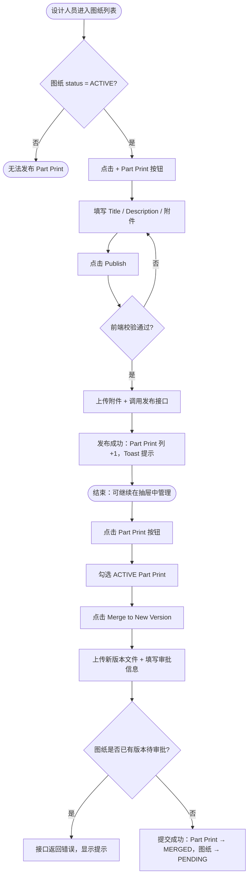

# 需求文档：PC 端 — 图纸局部更新（Part Print）发布与汇总

> **使用说明**：本文档是整个交付链路的**单一事实源**。所有下游文档（UI/前端/QA）从本文档派生。
> 业务规则、数据模型、API 接口见 [REQ-004-shared.md](../shared/REQ-004-shared.md)。
> 本文档仅包含：PC 端特有的页面布局、交互方式、发布局部更新流程、汇总为新版本流程。

---

## 1. 背景与目标

### 1.1 业务背景

设计人员需要在 PC 端对已发布的图纸版本进行局部补充说明，无需走完整审批流程，同时精准通知相关的 Site Engineer。当多次局部更新积累后，可一键汇总提交为正式新版本。

### 1.2 业务目标

在 PC 图纸列表页提供 [+ Part Print] 入口，支持设计人员快速发布局部更新并附件；提供 [Part Print] 入口管理全部局部更新，并在积累足够时汇总提交新版本审批。

### 1.3 非目标（Out of Scope）

- APP 端查阅局部更新与通知（见 REQ-004-app）
- 审批流程本身（见 REQ-007-pc 系列）
- Site Engineer 通知逻辑（见 REQ-004-shared）

---

## 2. 用户与角色

### 2.1 角色定义

| 角色 ID | 角色名 | 描述 | 典型场景 |
|--------|-------|------|---------|
| ROLE-001 | 设计人员 | 图纸上传人，拥有发布/删除/汇总 Part Print 权限 | 发布局部更新、汇总为新版本 |
| ROLE-002 | 管理员 / Drawing 团队 | 可查看 Part Print 列表，无发布/删除/汇总权限 | 查看局部更新进展 |
| ROLE-003 | DC / 内部审批人 | 可查看 Part Print 列表 | 了解改动情况 |
| ROLE-004 | Site Engineer | 不访问 PC 管理端 | 通过 APP 接收通知 |

### 2.2 用户故事（User Stories）

#### US-004pc-001：发布局部更新

```
作为 图纸设计人员
我想要 在 PC 端为某张已发布图纸发布局部更新，并附上说明和补充文件
以便 现场工程师能快速了解该图纸的局部改动，无需等待完整版本发布
```

**优先级**：P1
**所属史诗**：图纸管理

#### US-004pc-002：查看与汇总局部更新

```
作为 图纸设计人员
我想要 在 PC 端查看某图纸的所有局部更新，并选择将其汇总为新版本
以便 在改动积累到一定程度后，发起正式版本审批，形成完整的版本记录
```

**优先级**：P1
**所属史诗**：图纸管理

---

## 3. 角色与权限矩阵

| 操作 | 设计人员（本图纸上传人） | 管理员 / Drawing 团队 | DC / 内部审批人 | Site Engineer |
|-----|:-------------------:|:-------------------:|:-----------:|:------------:|
| 查看 Part Print 列表抽屉（[Part Print]） | ✅ | ✅ | ✅ | ❌ |
| 发布 Part Print（[+ Part Print]） | ✅（仅 ACTIVE 图纸） | ❌ | ❌ | ❌ |
| 删除 Part Print | ✅（仅本人创建的 ACTIVE Part Print） | ❌ | ❌ | ❌ |
| 汇总为新版本（[Merge to New Version]） | ✅ | ❌ | ❌ | ❌ |
| 下载 Part Print 附件 | ✅ | ✅ | ✅ | ❌ |

---

## 4. 核心实体与数据生命周期

### 4.1 实体清单

| 实体 ID | 实体名 | 描述 | 关键属性（业务语义） |
|--------|-------|------|------------------|
| ENT-001 | DrawingPartPrint | 局部更新记录 | title、description、affectedArea、status（ACTIVE/MERGED）、baseVersionId、attachments[]、createdBy |
| ENT-002 | DrawingVersion | 图纸版本 | approvalStatus、fileUrl、versionNo |

### 4.2 实体关系

- 一个 DrawingVersion 可以有多个 DrawingPartPrint（`baseVersionId` 关联）
- 汇总操作将多条 `ACTIVE` DrawingPartPrint 状态变为 `MERGED`，并创建新的 DrawingVersion（`PENDING_INTERNAL`）

### 4.3 数据生命周期

DrawingPartPrint 生命周期：
1. 创建：设计人员点击 [+ Part Print] 发布，状态为 `ACTIVE`
2. 流转：被汇总后状态变为 `MERGED`，`mergedToVersionId` 记录目标版本
3. 归档：`MERGED` 为终态，不可删除、不可再汇总

---

## 5. 状态机

### 5.1 DrawingPartPrint 状态定义

| 状态 ID | 状态名 | 描述 | 是否终态 |
|--------|-------|------|---------|
| S-001 | ACTIVE | 已发布，生效中 | 否 |
| S-002 | MERGED | 已汇总入新版本 | 是 |

### 5.2 状态转换表

| From | To | 触发动作 | 守卫条件 | 副作用 |
|------|-----|---------|---------|-------|
| ACTIVE | MERGED | 设计人员提交汇总 | 用户为本图纸设计人员；图纸无版本在 `PENDING_INTERNAL`/`PENDING_EXTERNAL` | 创建新 DrawingVersion（PENDING_INTERNAL）；通知已分配审批人 |
| ACTIVE | 删除 | 设计人员点击删除并确认 | 用户为 Part Print 创建人 | 永久删除；图纸 Part Print 列计数 -1 |

### 5.3 非法转换

- `MERGED` 状态不可删除、不可再次汇总
- 非 Part Print 创建人不可删除

---

## 6. 业务流程

### 6.1 主流程——发布局部更新

1. 设计人员在图纸列表找到 `status = ACTIVE` 的图纸行
2. 点击 Actions 列 **[+ Part Print]** 按钮，弹出发布弹窗
3. 填写 Title（必填）、Description（必填）、Affected Area（选填）、上传附件（选填）
4. 点击 [Publish]，前端校验通过后上传附件、调用发布接口
5. 发布成功：弹窗关闭，图纸 Part Print 列 +1，顶部 Toast 提示

### 6.2 主流程——汇总为新版本

1. 设计人员点击 **[Part Print]** 打开局部更新抽屉
2. 在 `ACTIVE` 卡片上勾选 [☑ Merge]，选择一条或多条
3. 点击底部 **[Merge to New Version →]**，弹出汇总弹窗
4. 上传新版本文件，确认 Version Note，选择审批人
5. 点击 [Submit for Approval]，调用汇总接口
6. 成功：所选 Part Print 变为 `MERGED`，图纸状态变为 `PENDING_INTERNAL`

### 6.3 主流程图（Mermaid）



### 6.4 异常流程

| 异常场景 | 触发条件 | 系统响应 | 用户感知 |
|---------|---------|---------|---------|
| 附件格式不符 | 上传非 PDF/PNG/JPG | 阻止上传 | 文件行显示格式错误提示 |
| 附件超大 | 单文件 > 20MB（发布）/ > 50MB（汇总） | 阻止上传 | 文件行显示大小错误提示 |
| 图纸已有版本待审批 | 汇总时图纸存在 PENDING 版本 | 接口报错 | `el-alert` 提示等待审批完成 |
| 网络异常 | 接口请求失败 | 保留弹窗内容 | Toast 错误提示，可重试 |

---

## 7. 功能需求详述

### 7.1 功能 F-001：图纸列表页入口

**关联用户故事**：US-004pc-001、US-004pc-002
**所属流程节点**：流程 6.1 步骤 1–2、流程 6.2 步骤 1

Actions 列按钮顺序（位于 Assign 之后）：

```
[View] [History] [Confirms] [Assign] [Part Print] [+ Part Print] [Upload V{n}]
```

| 按钮 | 显示条件 | 权限 | 说明 |
|------|---------|------|------|
| [Part Print] | 始终显示 | `drawing:view` | 打开局部更新列表抽屉 |
| [+ Part Print] | `status = ACTIVE` | `drawing:markup:publish` | 打开发布局部更新弹窗；非 ACTIVE 时隐藏 |

**Part Print 列（可选表格列）**：

| 列名 | 字段 | 宽度 | 说明 |
|------|------|------|------|
| Part Print | `activeMarkupCount` | 90px | 当前 `ACTIVE` 数量；0 时显示 `—`；点击打开局部更新抽屉 |

---

### 7.2 功能 F-002：发布局部更新弹窗

**关联用户故事**：US-004pc-001
**所属流程节点**：流程 6.1 步骤 2–5

**触发方式**：点击图纸列表 Actions 列 [+ Part Print] 按钮。

**弹窗布局**：

```
┌────────────────────────────────────────────────────────┐
│  Publish Part Print — ARCH-001 · 首层平面图  V3      [✕]  │
├────────────────────────────────────────────────────────┤
│                                                        │
│  Title *                                               │
│  [__________________________________________________]  │
│                                                        │
│  Description *                                         │
│  [__________________________________________________]  │
│  [                                                  ]  │
│  [                                                  ]  │
│                                                        │
│  Affected Area                                         │
│  [__________________________________________________]  │
│  e.g. "A-C axis / Level 3-5"                          │
│                                                        │
│  Attachments（最多 10 个，每个 ≤ 20MB）                 │
│  ┌────────────────────────────────────────────────┐    │
│  │  📎  Drag & Drop or  [Browse Files]            │    │
│  │  Supports: PDF / PNG / JPG · Max 20MB each     │    │
│  └────────────────────────────────────────────────┘    │
│  ┌──────────────────────────────────────────────┐      │
│  │  node-detail.pdf  (512KB)              [✕]   │      │
│  └──────────────────────────────────────────────┘      │
│                                                        │
│  ┌────────────────────────────────────────────────┐    │
│  │                                                │    │
│  │        ⬆  上传局部更新                          │    │
│  │                                                │    │
│  └────────────────────────────────────────────────┘    │
│                                                        │
├────────────────────────────────────────────────────────┤
│                         [Cancel]  [Publish]            │
└────────────────────────────────────────────────────────┘
```

**表单字段规格**：

| 字段 | 组件 | 校验规则 |
|------|------|---------|
| Title | `el-input` | 必填，≤ 200 字符 |
| Description | `el-input type="textarea" rows=4` | 必填，≤ 2000 字符，右下角字数计数 |
| Affected Area | `el-input` | 可选，≤ 500 字符，placeholder 示例文字 |
| Attachments | 自定义多文件上传区 | 可选；格式 PDF/PNG/JPG；单文件 ≤ 20MB；最多 10 个 |
| 上传局部更新（大按钮） | 全宽 `el-button`（large，type="primary"，plain），图标 ⬆ | 点击行为待定义（TBD） |

**发布交互**：

1. 点击 [Publish]，前端校验必填项
2. 附件逐个上传，展示每个文件上传进度
3. 全部附件上传完成后调用发布接口
4. 发布成功：弹窗关闭，图纸表格 Part Print 列 +1，Toast：`"Part Print published. Assigned Site Engineers have been notified."`
5. 有填写内容时点击取消或遮罩，弹出二次确认

---

### 7.3 功能 F-003：局部更新列表抽屉

**关联用户故事**：US-004pc-002
**所属流程节点**：流程 6.2 步骤 1–2

**触发方式**：点击 Actions 列 [Part Print] 按钮，从右侧滑入。

**抽屉布局**：

```
┌──────────────────────────────────────────────────────────┐
│ ← Part Print — ARCH-001 · 首层平面图                         │
│   Based on V3 · 2 Active  1 Merged                       │
├──────────────────────────────────────────────────────────┤
│  [All]  [Active (2)]  [Merged (1)]      [+ Part Print]    │
├──────────────────────────────────────────────────────────┤
│                                                          │
│  ┌──────────────────────────────────────────────────┐   │
│  │  [Active]  A轴节点详图修正                         │   │
│  │  Apr 8, 2026 · 张三                               │   │
│  │  A-C轴 / 3-5层                                   │   │
│  │  A轴与3轴交叉节点详图已更新，新增钢筋排布说明...    │   │
│  │  📎 node-detail.pdf                              │   │
│  │                         [☑ Merge]  [🗑 Delete]  │   │
│  └──────────────────────────────────────────────────┘   │
│                                                          │
│  ┌──────────────────────────────────────────────────┐   │
│  │  [Active]  C区消防管道路由修正                     │   │
│  │  Apr 7, 2026 · 张三                               │   │
│  │  C区 / B1层                                       │   │
│  │  消防主管道路由变更，详见附图...                    │   │
│  │  📎 route-update.png                             │   │
│  │                         [☑ Merge]  [🗑 Delete]  │   │
│  └──────────────────────────────────────────────────┘   │
│                                                          │
│  ┌──────────────────────────────────────────────────┐   │
│  │  [Merged → V4]  外墙保温层厚度修正                 │   │
│  │  Apr 5, 2026 · 张三                               │   │
│  └──────────────────────────────────────────────────┘   │
│                                                          │
│  ┌────────────────────────────────────────────────────┐  │
│  │  已选择 2 条局部更新        [Merge to New Version →] │ │
│  └────────────────────────────────────────────────────┘  │
└──────────────────────────────────────────────────────────┘
```

**抽屉属性**：

| 属性 | 规格 |
|------|------|
| 组件 | `el-drawer`，direction="rtl" |
| 宽度 | 560px |
| 标题 | `Part Print — {drawingCode} · {drawingName}` |
| 副标题 | `Based on {baseVersionNo} · {activeCount} Active  {mergedCount} Merged` |
| Tab 筛选 | All / Active ({n}) / Merged ({n})，`el-tabs` |
| [+ Part Print] 按钮 | 抽屉右上角，仅设计人员（本图纸上传人）可见；复用 F-002 弹窗 |
| 底部汇总栏 | 有局部更新被勾选时固定显示，展示已选数量 + [Merge to New Version →] 按钮 |

**局部更新卡片规格**：

| 卡片属性 | 规格 |
|---------|------|
| 状态标签 | `ACTIVE`（绿色 `#67C23A`）/ `Merged → V{n}`（灰色 `#909399`，含目标版本号） |
| 标题 | 14px，font-weight 600 |
| 元信息行 | `{日期} · {创建人}`，12px，`#909399` |
| 受影响区域 | 灰色 `el-tag` 样式 |
| 说明文字 | 最多 3 行，超出显示"…Show more"展开 |
| 附件列表 | 📎 图标 + 文件名，点击下载 |
| [☑ Merge] | 仅 `ACTIVE` 状态显示；勾选后计入底部汇总栏 |
| [🗑 Delete] | 仅 Part Print 创建人且状态为 `ACTIVE` 时可见；点击二次确认后删除 |

---

### 7.4 功能 F-004：汇总为新版本弹窗

**关联用户故事**：US-004pc-002
**所属流程节点**：流程 6.2 步骤 3–6

**触发方式**：在局部更新抽屉中勾选一条或多条 `ACTIVE` Part Print 后，点击底部 [Merge to New Version →]。

**弹窗布局**：

```
┌────────────────────────────────────────────────────────┐
│  Merge Part Print to New Version — ARCH-001       [✕]    │
├────────────────────────────────────────────────────────┤
│                                                        │
│  Selected Part Print (2):                                 │
│  ┌────────────────────────────────────────────────┐   │
│  │  ☑ A轴节点详图修正        Apr 8, 2026          │   │
│  │  ☑ C区消防管道路由修正    Apr 7, 2026          │   │
│  └────────────────────────────────────────────────┘   │
│                                                        │
│  New Version File *                                    │
│  ┌────────────────────────────────────────────────┐   │
│  │  📁  Drag & Drop or  [Browse Files]            │   │
│  │  Supports: PDF / PNG / JPG · Max 50MB          │   │
│  └────────────────────────────────────────────────┘   │
│                                                        │
│  ℹ️  Current version: V3. After approval, this will   │
│     become V4.                                         │
│                                                        │
│  Version Note                                          │
│  [Merged from 2 part prints: A轴节点详图修正; C区消防...]  │
│  （自动填充，可手动修改）                               │
│                                                        │
│  Approver *                                            │
│  [Select approver...         ▼]                        │
│                                                        │
├────────────────────────────────────────────────────────┤
│                         [Cancel]  [Submit for Approval]│
└────────────────────────────────────────────────────────┘
```

**字段规格**：

| 字段 | 规格 |
|------|------|
| Selected Part Print | 只读，展示已勾选的 Part Print 列表（标题 + 日期） |
| New Version File | 必填，格式 PDF/PNG/JPG，≤ 50MB |
| 版本提示 | 蓝色信息块，显示当前版本和将升级的版本号（只读） |
| Version Note | `el-input`，预填 `"Merged from {n} part prints: {titles}"`，可手动修改，≤ 500 字符 |
| Approver | `el-select filterable`，必填，从人员接口拉取审批人列表 |

**提交后处理**：

1. 调用汇总接口
2. 成功后：弹窗关闭，局部更新抽屉关闭；图纸状态变为 `PENDING_INTERNAL`；Part Print 列数字减少（已汇总条目不再计入 Active 数）；Toast：`"Submitted for approval. Version note includes {n} part prints."`
3. 若该图纸已有版本处于 `PENDING_INTERNAL` 或 `PENDING_EXTERNAL`，接口返回错误，前端显示 `el-alert`：`"A version of this drawing is already pending approval. Please wait for the review to complete."`

---

## 8. 验收标准（Acceptance Criteria）

### AC-004pc-001：[+ Part Print] 按钮显示条件

```
Given  图纸列表中存在 status = ACTIVE 的图纸和 status ≠ ACTIVE 的图纸
When   查看两行的 Actions 列
Then   ACTIVE 图纸显示 [+ Part Print] 按钮；非 ACTIVE 图纸隐藏 [+ Part Print] 按钮
```

### AC-004pc-002：发布弹窗标题正确

```
Given  设计人员点击某图纸行的 [+ Part Print]
When   弹窗打开
Then   弹窗标题格式为"Publish Part Print — {drawingCode} · {drawingName}  {currentVersionNo}"
```

### AC-004pc-003：发布弹窗必填校验

```
Given  设计人员打开发布弹窗，Title 或 Description 为空
When   点击 [Publish]
Then   空字段显示必填错误提示，[Publish] 不执行提交
```

### AC-004pc-004：附件格式校验

```
Given  设计人员在发布弹窗上传非 PDF/PNG/JPG 文件
When   文件添加到上传列表
Then   该文件行显示格式错误提示，不上传该文件
```

### AC-004pc-005：附件大小校验（发布）

```
Given  设计人员上传单个超过 20MB 的文件
When   文件添加到上传列表
Then   该文件行显示大小超限提示，不上传该文件
```

### AC-004pc-006：附件数量上限

```
Given  发布弹窗已添加 10 个附件
When   设计人员尝试继续添加
Then   文件选择器不响应（或 Toast 提示已达上限）
```

### AC-004pc-007：发布成功反馈

```
Given  设计人员填写完整信息并点击 [Publish]
When   发布成功
Then   弹窗关闭；图纸列表 Part Print 列数字 +1；顶部 Toast 显示"Part Print published. Assigned Site Engineers have been notified."
```

### AC-004pc-008：发布弹窗取消二次确认

```
Given  设计人员已在弹窗中填写部分内容
When   点击 [Cancel] 或点击遮罩
Then   弹出二次确认对话框，确认后弹窗关闭并清空内容
```

### AC-004pc-009：局部更新抽屉内容正确

```
Given  设计人员点击某图纸行 [Part Print]
When   抽屉打开
Then   展示该图纸所有 DrawingPartPrint，默认 All Tab；ACTIVE 卡片显示 [☑ Merge] 和 [🗑 Delete]（仅创建人）；MERGED 卡片显示"Merged → V{n}"，无操作按钮
```

### AC-004pc-010：勾选 Part Print 触发底部汇总栏

```
Given  局部更新抽屉已打开
When   勾选至少一条 ACTIVE Part Print
Then   底部汇总栏出现，显示已选数量；取消全部勾选后汇总栏隐藏
```

### AC-004pc-011：删除 Part Print 权限控制

```
Given  非 Part Print 创建人打开局部更新抽屉
When   查看 ACTIVE 卡片
Then   该卡片不显示 [🗑 Delete] 按钮
```

### AC-004pc-012：删除 Part Print 二次确认

```
Given  设计人员点击某 ACTIVE Part Print 的 [🗑 Delete]
When   确认 Dialog 中点击 [Delete]
Then   该卡片从列表移除；图纸 Part Print 列数字 -1
```

### AC-004pc-013：汇总弹窗字段预填

```
Given  设计人员勾选 2 条 Part Print 后点击 [Merge to New Version →]
When   汇总弹窗打开
Then   Selected Part Print 列表只读展示已选 Part Print（标题 + 日期）；Version Note 自动预填"Merged from 2 part prints: {title1}; {title2}"；版本提示显示当前版本号和下一版本号
```

### AC-004pc-014：汇总必填校验

```
Given  汇总弹窗 New Version File 或 Approver 未填
When   点击 [Submit for Approval]
Then   对应字段显示必填错误提示，不执行提交
```

### AC-004pc-015：汇总成功

```
Given  设计人员正确填写汇总弹窗并提交
When   提交成功
Then   所选 Part Print 状态变为 MERGED；图纸 status 变为 PENDING_INTERNAL；弹窗和抽屉关闭；Toast 提示"Submitted for approval. Version note includes {n} part prints."
```

### AC-004pc-016：汇总时已有版本待审批

```
Given  图纸已有版本处于 PENDING_INTERNAL 或 PENDING_EXTERNAL 状态
When   设计人员点击 [Submit for Approval]
Then   接口返回错误；弹窗内显示 el-alert："A version of this drawing is already pending approval. Please wait for the review to complete."
```

---

## 9. 非功能需求

### 9.1 性能

| 指标 | 目标值 | 测量方式 |
|-----|-------|---------|
| 局部更新抽屉加载（≤ 30 条） | ≤ 1.5s | 手动 |
| 发布弹窗附件上传（10MB 文件） | ≤ 5s | 手动 |

### 9.2 安全

- 鉴权：JWT
- 权限校验：后端在发布/删除/汇总接口均需校验操作人是否为本图纸上传人
- 审计：发布、删除、汇总操作均写操作日志

### 9.3 可访问性

- WCAG 等级：AA
- 弹窗支持 Esc 关闭；表单支持 Tab 切换焦点

### 9.4 兼容性

- 浏览器：Chrome 100+、Edge 100+、Safari 15+
- 移动端：不支持
- 国际化：中英双语

### 9.5 可观测性

- 关键埋点：点击 [+ Part Print]、发布成功、打开抽屉、汇总提交成功

---

## 10. 数据量级与扩展性

| 维度 | 当前预期 | 1 年后 |
|-----|---------|-------|
| 单图纸 ACTIVE Part Print 数 | ≤ 20 条 | ≤ 50 条 |
| 单次汇总选择 Part Print 数 | ≤ 20 条 | — |

---

## 11. 依赖与外部系统

| 依赖系统 | 用途 | 集成方式 | Owner |
|---------|------|---------|-------|
| REQ-004-shared | 业务规则、API 接口定义 | 文档引用 | — |
| REQ-003A-pc | 图纸列表页（入口所在页面） | 组件扩展 | 前端 |
| REQ-007C-pc | 版本历史抽屉 Part Print Tab 只读展示本功能数据 | 数据复用 | 前端 |

---

## 12. 数据迁移

无。本功能为新增功能，无存量数据迁移需求。

---

## 13. 上线操作清单

### 13.1 上线前

- [ ] DrawingPartPrint 表已创建，包含 status / baseVersionId / attachments[] / createdBy 字段
- [ ] `/drawing/markup/publish`、`/drawing/markup/merge` 接口已就绪
- [ ] 权限码 `drawing:markup:publish` 已配置到设计人员角色

### 13.2 上线后

- [ ] 验证发布、删除、汇总主流程端到端可用
- [ ] 验证非创建人无法删除他人 Part Print
- [ ] 验证图纸已有待审批版本时汇总被正确拦截

---

## 14. 灰度与发布策略

- 与 REQ-003A-pc 同步上线
- 回滚预案：隐藏 [+ Part Print] / [Part Print] 按钮入口，不影响已有数据

---

## 15. 成功指标（北极星）

| 指标 | 当前基线 | 目标 | 测量周期 |
|-----|---------|------|---------|
| 局部更新发布次数 | — | ≥ 10 次/月 | 每月 |
| 汇总为新版本使用率 | — | ≥ 30%（有 Part Print 的图纸中） | 每月 |

---

## 16. Open Questions

| OQ ID | 问题 | 影响 | Owner | 截止 |
|------|------|------|-------|------|
| OQ-001 | 汇总新版本的附件格式是否仅限 PDF/PNG/JPG，还是与上传版本一致（任意格式）？ | F-004 字段规格 | PM | — |
| OQ-002 | Part Print 发布后，通知哪些 Site Engineer（已分配全部 / 仅活跃）？ | 通知逻辑（REQ-004-shared） | PM | — |

---

## 17. Figma / 原型链接

- Figma 设计稿：<!-- 填写发布弹窗 / 局部更新抽屉 / 汇总弹窗 Frame 链接 -->
- 交互原型：

---

## 18. 变更历史

| 版本 | 日期 | 修改人 | 变更摘要 | 影响下游文档 |
|-----|------|-------|---------|------------|
| 0.2.0 | 2026-05-25 | agent | 按新模板重构：新增 YAML Front Matter、§1 背景目标、§2 用户故事、§3 权限矩阵、§4 实体与生命周期、§5 状态机、§6 业务流程（含 Mermaid）、§8 AC 编号化（AC-004pc-001~016）、§9~18 非功能/上线/灰度/OQ 章节 | UI、前端、QA |
| 0.1.0 | 2026-05-05 | agent | 初稿（旧格式） | 全部 |

---

## 19. 备注

- 本文档仅覆盖 PC 端交互，APP 端见 REQ-004-app.md
- 业务规则（通知、接口）见 REQ-004-shared.md
- REQ-007C-pc §3.3 Part Print Tab 只读展示本功能的 Part Print 数据，不重复定义
