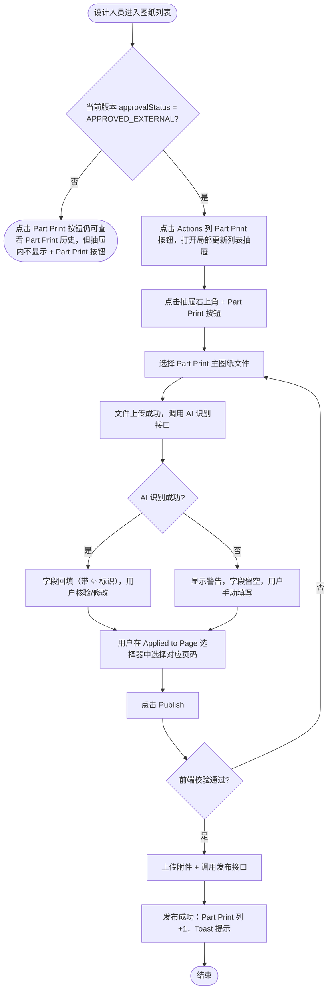

# 需求文档：PC 端 — 图纸局部更新（Part Print）发布与查阅

> **使用说明**：本文档是整个交付链路的**单一事实源**。所有下游文档（UI/前端/QA）从本文档派生。
> 业务规则、数据模型、API 接口见 [REQ-004-shared.md](../shared/REQ-004-shared.md)。
> 本文档仅包含：PC 端特有的页面布局、交互方式、发布局部更新流程。

---

## 1. 背景与目标

### 1.1 业务背景

设计人员需要在 PC 端对已发布的图纸版本进行局部补充说明，无需走完整审批流程，同时精准通知相关的 Site Engineer。

### 1.2 业务目标

在 PC 图纸列表页提供 [Part Print] 入口查阅该图纸的全部局部更新历史记录，并在抽屉内支持设计人员快速发布局部更新并附件。

### 1.3 非目标（Out of Scope）

- APP 端查阅局部更新与通知（见 REQ-004-app）
- 审批流程本身（见 REQ-007-pc 系列）
- Site Engineer 通知逻辑（见 REQ-004-shared）
- 将局部更新汇总为新版本并发起审批（不适用：Part Print 均基于已审批通过的报审记录，不触发新版本流程）

---

## 2. 用户与角色

### 2.1 角色定义

| 角色 ID | 角色名 | 描述 | 典型场景 |
|--------|-------|------|---------|
| ROLE-001 | 设计人员 | 图纸上传人，拥有发布/删除 Part Print 权限 | 发布局部更新、查阅历史记录 |
| ROLE-002 | 图纸管理员 / 其他设计人员 | 可查看 Part Print 列表，无发布/删除权限 | 查看局部更新进展 |
| ROLE-003 | DC / 内部审批人 | 可查看 Part Print 列表 | 了解改动情况 |
| ROLE-004 | Site Engineer | 不访问 PC 管理端 | 通过 APP 接收通知 |

### 2.2 用户故事（User Stories）

#### US-004pc-001：发布局部更新

```
作为 图纸设计人员
我想要 在 PC 端为某张已发布图纸发布局部更新，并附上说明和补充文件
以便 现场工程师能快速了解该图纸的局部改动，无需等待完整版本发布
```

**优先级**：P1
**所属史诗**：图纸管理

#### US-004pc-002：查阅局部更新历史

```
作为 图纸设计人员 / 图纸管理员 / DC
我想要 在 PC 端查看某图纸的所有局部更新记录
以便 随时掌握该图纸的局部改动情况与历史轨迹
```

**优先级**：P1
**所属史诗**：图纸管理

---

## 3. 角色与权限矩阵

| 操作 | 设计人员（本图纸上传人） | 图纸管理员 / 其他设计人员 | DC / 内部审批人 | Site Engineer |
|-----|:-------------------:|:-------------------:|:-----------:|:------------:|
| 查看 Part Print 历史抽屉（[Part Print]）— **任意图纸状态** | ✅ | ✅ | ✅ | ❌ |
| 发布 Part Print（[+ Part Print]）— **仅版本外部审批通过后（`APPROVED_EXTERNAL`）** | ✅ | ❌ | ❌ | ❌ |
| 删除 Part Print | ✅（仅本人创建的 ACTIVE Part Print） | ❌ | ❌ | ❌ |
| 下载 Part Print 附件 | ✅ | ✅ | ✅ | ❌ |

---

## 4. 核心实体与数据生命周期

### 4.1 实体清单

| 实体 ID | 实体名 | 描述 | 关键属性（业务语义） |
|--------|-------|------|------------------|
| ENT-001 | DrawingPartPrint | 局部更新记录 | drawingFileUrl（主图纸文件）、dwgNo、revNo、partPrintDrawingNo、description、issuedDate、drawnBy、approvedByAES、approvedDate、aiRecognized（bool，是否 AI 识别回填）、**appliedPageNo**（整数，局部更新对应基础版本 PDF 的页码，可选）、status（ACTIVE/DELETED）、baseVersionId、additionalAttachments[]、createdBy |
| ENT-002 | DrawingVersion | 图纸版本 | approvalStatus、fileUrl、versionNo、**submissionNo**（报审号，对应该版本的报审单编号） |

### 4.2 实体关系

- 一个 DrawingVersion 可以有多个 DrawingPartPrint（`baseVersionId` 关联）
- Part Print 始终附属于当前有效版本（即 `approvalStatus = APPROVED_EXTERNAL` 的最新 DrawingVersion），不触发新版本创建

### 4.3 数据生命周期

DrawingPartPrint 生命周期：
1. 创建：设计人员点击 [+ Part Print] 发布，状态为 `ACTIVE`
2. 删除：设计人员（仅创建人）主动删除，记录永久移除
3. `ACTIVE` 为唯一稳定态，不存在汇总/归档终态

---

## 5. 状态机

### 5.1 DrawingPartPrint 状态定义

| 状态 ID | 状态名 | 描述 | 是否终态 |
|--------|-------|------|---------|
| S-001 | ACTIVE | 已发布，生效中 | 否（可被删除） |

### 5.2 状态转换表

| From | To | 触发动作 | 守卫条件 | 副作用 |
|------|-----|---------|---------|-------|
| ACTIVE | 删除 | 设计人员点击删除并确认 | 用户为 Part Print 创建人 | 永久删除；图纸 Part Print 列计数 -1 |

### 5.3 非法转换

- 非 Part Print 创建人不可删除

---

## 6. 业务流程

### 6.1 主流程——发布局部更新

1. 设计人员在图纸列表找到当前版本 `approvalStatus = APPROVED_EXTERNAL` 的图纸行
2. 点击 Actions 列 **[Part Print]** 按钮，打开局部更新列表抽屉
3. 在抽屉右上角点击 **[+ Part Print]** 按钮，弹出发布弹窗
4. 用户选择 Part Print 主图纸文件（PDF/PNG/JPG，≤ 50MB）
5. 文件上传成功后，系统自动调用 AI 识别接口读取 Title Block 信息，识别结果回填至各字段
6. 用户核验并按需修改字段；同时从 **Applied to Page** 选择器中选择本次局部更新对应基础版本 PDF 的页码（系统根据当前基础版本 PDF 总页数自动生成可选范围）
7. 点击 [Publish]，前端校验必填项（Dwg No.、Part Print Drawing No.、Description）通过后调用发布接口
8. 发布成功：弹窗关闭，图纸 Part Print 列 +1，顶部 Toast 提示

### 6.2 主流程图（Mermaid）



### 6.3 异常流程

| 异常场景 | 触发条件 | 系统响应 | 用户感知 |
|---------|---------|---------|---------|
| 附件格式不符 | 上传非 PDF/PNG/JPG | 阻止上传 | 文件行显示格式错误提示 |
| 主图纸超大 | 单文件 > 50MB（主图纸）/ > 20MB（附件）| 阻止上传 | 文件行显示大小错误提示 |
| AI 识别失败 / 超时 | 识别接口返回错误或 >15s 无响应 | 中止识别，显示 `el-alert` 警告 | "AI recognition failed. Please fill in the fields manually."；字段留空，用户可手动填写 |
| AI 识别部分缺失 | 某字段在 Title Block 中无值 | 该字段留空，其他字段正常回填 | 无 ✨ 标识的字段提示用户补填 |
| 网络异常 | 接口请求失败 | 保留弹窗内容 | Toast 错误提示，可重试 |

---

## 7. 功能需求详述

### 7.1 功能 F-001：图纸列表页入口

**关联用户故事**：US-004pc-001、US-004pc-002
**所属流程节点**：流程 6.1 步骤 1–2、流程 6.2 步骤 1

Actions 列按钮顺序（位于 Assign 之后）：

```
[View] [History] [Confirms] [Assign] [Part Print] [Upload V{n}]
```

| 按钮 | 显示条件 | 权限 | 说明 |
|------|---------|------|------|
| [Part Print] | **始终显示**（任意图纸状态） | `drawing:view` | 打开 Part Print 局部更新历史抽屉 |

**Part Print 列（可选表格列）**：

| 列名 | 字段 | 宽度 | 说明 |
|------|------|------|------|
| Part Print | `activeMarkupCount` | 90px | 当前 `ACTIVE` 数量；0 时显示 `—`；点击打开局部更新抽屉 |

---

### 7.2 功能 F-002：发布局部更新弹窗

**关联用户故事**：US-004pc-001
**所属流程节点**：流程 6.1 步骤 2–7

**触发方式**：在局部更新列表抽屉（F-003）中点击右上角 `[+ Part Print]` 按钮（仅设计人员且当前版本 `approvalStatus = APPROVED_EXTERNAL` 时可见）。

**弹窗交互分两阶段**：
- **阶段一**：用户选择 Part Print 图纸文件
- **阶段二**：文件上传后，系统自动调用 AI 识别接口，从图纸 Title Block 中提取信息并回填表单字段；用户可手动修改任意字段后提交

**弹窗布局（阶段一 — 初始态，未上传图纸）**：

```
┌─────────────────────────────────────────────────────────┐
│  Publish Part Print — ARCH-001 · 首层平面图  V3       [✕] │
├─────────────────────────────────────────────────────────┤
│                                                         │
│  Part Print Drawing *                                   │
│  ┌─────────────────────────────────────────────────┐   │
│  │                                                 │   │
│  │    📎  Drag & Drop or  [Browse Files]           │   │
│  │    Supports: PDF / PNG / JPG · Max 50MB         │   │
│  │                                                 │   │
│  └─────────────────────────────────────────────────┘   │
│                                                         │
│  ─ ─ ─ ─ ─ ─ ─ ─ ─ ─ ─ ─ ─ ─ ─ ─ ─ ─ ─ ─ ─ ─ ─ ─   │
│  上传图纸后将自动识别 Title Block 信息                     │
│  ─ ─ ─ ─ ─ ─ ─ ─ ─ ─ ─ ─ ─ ─ ─ ─ ─ ─ ─ ─ ─ ─ ─ ─   │
│                                                         │
├─────────────────────────────────────────────────────────┤
│                           [Cancel]  [Publish]           │
└─────────────────────────────────────────────────────────┘
```

**弹窗布局（阶段一 → 阶段二过渡 — AI 识别中）**：

```
┌─────────────────────────────────────────────────────────┐
│  Publish Part Print — ARCH-001 · 首层平面图  V3       [✕] │
├─────────────────────────────────────────────────────────┤
│                                                         │
│  Part Print Drawing *                                   │
│  ┌───────────────────────────────────────────────────┐  │
│  │  📄 ARCH-001-PP-0014.pdf (2.1 MB)           [✕]  │  │
│  └───────────────────────────────────────────────────┘  │
│                                                         │
│  ✨ Identifying drawing info...  ████████░░  80%        │
│                                                         │
├─────────────────────────────────────────────────────────┤
│                           [Cancel]  [Publish]           │
└─────────────────────────────────────────────────────────┘
```

**弹窗布局（阶段二 — AI 识别完成，字段回填，可编辑）**：

```
┌─────────────────────────────────────────────────────────┐
│  Publish Part Print — ARCH-001 · 首层平面图  V3       [✕] │
├─────────────────────────────────────────────────────────┤
│                                                         │
│  Part Print Drawing *                                   │
│  ┌───────────────────────────────────────────────────┐  │
│  │  📄 ARCH-001-PP-0014.pdf (2.1 MB)           [✕]  │  │
│  └───────────────────────────────────────────────────┘  │
│                                                         │
│  ✨ Drawing info recognized — please verify and edit   │
│     if needed                                           │
│                                                         │
│  Dwg No. *                                              │
│  [CJY-P1-DW-SH-WFR-0117-ST-L1_0                    ✨] │
│                                                         │
│  Rev No.                                                │
│  [0                                                 ✨] │
│                                                         │
│  Part Print Drawing No. *                               │
│  [0014                                              ✨] │
│                                                         │
│  Description *                                          │
│  [Updated beam and wall layout                      ✨] │
│                                                         │
│  Issued Date                                            │
│  [10-Mar-2026                                       ✨] │
│                                                         │
│  Drawn By                                               │
│  [WANG WENHAO                                       ✨] │
│                                                         │
│  Approved By AES (C&S)                                  │
│  [Dicky                                             ✨] │
│                                                         │
│  Approved Date                                          │
│  [11/3/2026                                         ✨] │
│                                                         │
│  Applied to Page                                        │
│  [  Page 2 of 8           ▼                         ]  │
│  （从下拉列表选择本次局部更新对应底图 PDF 的页码）          │
│                                                         │
├─────────────────────────────────────────────────────────┤
│                           [Cancel]  [Publish]           │
└─────────────────────────────────────────────────────────┘
```

> ✨ 图标表示该字段值由 AI 自动识别填入；字段仍可自由编辑，编辑后 ✨ 图标消失。

**表单字段规格**：

| 字段 | 必填 | 组件 | AI 识别来源 | 校验规则 |
|------|:---:|------|------------|---------|
| Part Print Drawing（主图纸文件） | ✅ | 单文件上传区（`el-upload`） | — | 格式 PDF/PNG/JPG；≤ 50MB；仅 1 个 |
| Dwg No. | ✅ | `el-input` | Title Block — Dwg No. | ≤ 200 字符 |
| Rev No. | — | `el-input` | Title Block — Rev No. | ≤ 50 字符 |
| Part Print Drawing No. | ✅ | `el-input` | Title Block — Part Print Drawing No. | ≤ 50 字符 |
| Description | ✅ | `el-input type="textarea" rows=3` | Title Block — Description | ≤ 2000 字符，右下角字数计数 |
| Issued Date | — | `el-input` | Title Block — Issued Date | ≤ 50 字符，格式宽松（原始文本） |
| Drawn By | — | `el-input` | Title Block — Drawn By | ≤ 200 字符 |
| Approved By AES (C&S) | — | `el-input` | Title Block — Approved By AES (C&S)（文字签名部分） | ≤ 200 字符 |
| Approved Date | — | `el-input` | Title Block — Approved Date | ≤ 50 字符，格式宽松（原始文本） |
| Applied to Page | — | `el-select`（单选，选项为 `Page 1`～`Page N`，N = 基础版本 PDF 总页数；若基础版本非 PDF 或页数获取失败则改为 `el-input-number`，最小值 1） | — | 整数，1 ≤ value ≤ 总页数；选填，未选时存 null |

**AI 识别交互规则**：

| 场景 | 系统行为 |
|-----|---------|
| 用户选择文件后 | 立即开始上传，上传完成后自动调用 AI 识别接口，显示进度条与"Identifying drawing info..."提示 |
| 识别成功 | 将识别到的字段值回填至对应输入框，字段右侧显示 ✨ 标识；用户可直接编辑任意字段 |
| 识别部分失败（某字段无值） | 该字段留空，不阻塞；字段无 ✨ 标识，用户需手动填写 |
| 识别整体失败 / 超时（>15s） | 显示 `el-alert` 警告："AI recognition failed. Please fill in the fields manually."；表单字段全部留空，用户可手动填写 |
| 用户修改 AI 回填的字段 | 该字段 ✨ 标识移除，表示用户已覆盖 AI 值 |
| 用户替换主图纸文件 | 清空所有 AI 回填字段，进度条重新出现，触发新一轮 AI 识别 |
| [Publish] 点击时 | 仅校验必填字段（Part Print Drawing、Dwg No.、Part Print Drawing No.、Description），AI 识别状态不阻塞提交 |

> **Applied to Page 交互规则**：弹窗打开时前端从服务端获取基础版本 PDF 总页数（接口：`GET /drawing/version/{versionId}/page-count`）。若总页数 ≥ 1，则 Applied to Page 显示为 `el-select`，选项为 `Page 1`～`Page N`，默认空（未选）；若获取失败或基础版本非 PDF，则改为 `el-input-number`（min=1）；该字段为选填，不影响提交。

**发布交互**：

1. 用户选择 Part Print 图纸文件（必填）
2. 文件上传成功后，自动调用 AI 识别接口，进度条显示识别进度
3. 识别完成，字段回填；用户核验并按需修改
4. 用户在 **Applied to Page** 选择器中选择本次局部更新对应底图 PDF 的页码（选填）
5. 点击 [Publish]，前端校验必填项
6. 调用发布接口（主图纸 + 字段数据 + appliedPageNo）
7. 发布成功：弹窗关闭，图纸表格 Part Print 列 +1，Toast：`"Part Print published. Assigned Site Engineers have been notified."`
8. 有填写内容时点击取消或遮罩，弹出二次确认

---

### 7.3 功能 F-003：局部更新列表抽屉

**关联用户故事**：US-004pc-002
**所属流程节点**：流程 6.1 结束后查阅历史

**触发方式**：点击 Actions 列 [Part Print] 按钮（**任意图纸状态均可**），从右侧滑入。

**抽屉布局**：

```
┌──────────────────────────────────────────────────────────┐
│ ← Part Print — ARCH-001 · 首层平面图                         │
│   Based on V3 · 2 Active                                 │
├──────────────────────────────────────────────────────────┤
│  [All (5)]                              [+ Part Print]   │
├──────────────────────────────────────────────────────────┤
│  🔍 Search by description or drawing no...               │
├──────────────────────────────────────────────────────────┤
│                                                          │
│  ┌──────────────────────────────────────────────────┐   │
│  │  A轴节点详图修正                                   │   │
│  │  Apr 8, 2026 · 张三                               │   │
│  │  Based on SUB-2026-003  · Page 3                 │   │
│  │  A轴与3轴交叉节点详图已更新，新增钢筋排布说明...    │   │
│  │  📎 node-detail.pdf                              │   │
│  │                                       [🗑 Delete]│   │
│  └──────────────────────────────────────────────────┘   │
│                                                          │
│  ┌──────────────────────────────────────────────────┐   │
│  │  C区消防管道路由修正                               │   │
│  │  Apr 7, 2026 · 张三                               │   │
│  │  Based on SUB-2026-003  · Page 5                 │   │
│  │  消防主管道路由变更，详见附图...                    │   │
│  │  📎 route-update.png                             │   │
│  │                                       [🗑 Delete]│   │
│  └──────────────────────────────────────────────────┘   │
│                                                          │
└──────────────────────────────────────────────────────────┘
```

**抽屉属性**：

| 属性 | 规格 |
|------|------|
| 组件 | `el-drawer`，direction="rtl" |
| 宽度 | 560px |
| 标题 | `Part Print — {drawingCode} · {drawingName}` |
| 副标题 | `Based on {baseVersionNo} · {activeCount} Active` |
| Tab 筛选 | All ({n})，`el-tabs`；显示局部更新总条数（所有 Part Print 均为 ACTIVE，无需额外筛选 Tab） |
| 搜索框 | Tab 筛选行下方，全宽 `el-input`，placeholder 为"Search by description or drawing no..."；前端对当前列表实时过滤，匹配字段为 Description 和 Part Print Drawing No.（大小写不敏感）；无匹配时显示空态提示"No results found" |
| [+ Part Print] 按钮 | 抽屉右上角，仅设计人员（本图纸上传人）可见；复用 F-002 弹窗 |

**局部更新卡片规格**：

| 卡片属性 | 规格 |
|---------|------|
| 标题 | 14px，font-weight 600 |
| 元信息行 | `{日期} · {创建人}`，12px，`#909399` |
| 报审号 + 页码行 | 元信息行下方；格式：`Based on {submissionNo}`，若 `appliedPageNo` 不为 null 则追加 ` · Page {n}`；灰色 `#909399`，12px；`submissionNo` 取自关联 DrawingVersion 的 `submissionNo` 字段 |
| 说明文字 | 最多 3 行，超出显示"…Show more"展开 |
| 附件列表 | 📎 图标 + 文件名，点击下载 |
| [🗑 Delete] | 仅 Part Print 创建人且状态为 `ACTIVE` 时可见；点击后弹出二次确认 Dialog |

**删除交互流程**：

1. 创建人点击卡片右下角 `[🗑 Delete]`
2. 弹出 `el-dialog` 二次确认，标题："Delete Part Print"，内容："Are you sure you want to delete this Part Print? This action cannot be undone."，按钮：`[Cancel]` / `[Delete]`（Delete 为红色危险按钮）
3. 点击 `[Cancel]`：关闭 Dialog，抽屉与卡片保持不变
4. 点击 `[Delete]`：
   - `[Delete]` 按钮进入 loading 状态，防止重复提交
   - 调用删除接口
   - **成功**：Dialog 关闭，该卡片从列表中移除，抽屉副标题 Active 计数 -1，图纸列表 Part Print 列计数 -1，顶部 Toast 提示"Part Print deleted."
   - **失败**：Dialog 保持打开，`[Delete]` 恢复可点击，Toast 错误提示，用户可重试

---

## 8. 验收标准（Acceptance Criteria）

### AC-004pc-001：[+ Part Print] 与 [Part Print] 按钮显示条件

```
Given  图纸列表中存在当前版本 approvalStatus = APPROVED_EXTERNAL 的图纸
       以及当前版本处于其他状态（如 PENDING_INTERNAL、PENDING_EXTERNAL 等）的图纸
When   查看各行的 Actions 列
Then   approvalStatus = APPROVED_EXTERNAL 的图纸显示 [+ Part Print] 按钮
       其他状态的图纸隐藏 [+ Part Print] 按钮
       所有图纸行均显示 [Part Print] 按钮（查看历史，不受状态限制）
```

### AC-004pc-002：发布弹窗标题正确

```
Given  设计人员点击某图纸行的 [+ Part Print]
When   弹窗打开
Then   弹窗标题格式为"Publish Part Print — {drawingCode} · {drawingName}  {currentVersionNo}"
```

### AC-004pc-003：发布弹窗必填校验

```
Given  设计人员打开发布弹窗，Dwg No. / Part Print Drawing No. / Description 为空，或未选择主图纸文件
When   点击 [Publish]
Then   空字段显示必填错误提示，[Publish] 不执行提交
```

### AC-004pc-004：附件格式校验

```
Given  设计人员在发布弹窗上传非 PDF/PNG/JPG 文件（主图纸或附件）
When   文件添加到上传区
Then   该文件行显示格式错误提示，不上传该文件
```

### AC-004pc-005：主图纸与附件大小校验

```
Given  设计人员上传主图纸超过 50MB，或附件超过 20MB
When   文件添加到上传区
Then   该文件行显示大小超限提示，不上传该文件
```

### AC-004pc-018：AI 识别自动触发

```
Given  设计人员在发布弹窗成功上传主图纸文件
When   文件上传完成
Then   系统立即调用 AI 识别接口，弹窗内显示进度条与"Identifying drawing info..."提示
```

### AC-004pc-019：AI 识别成功回填

```
Given  AI 识别接口返回识别结果
When   识别成功
Then   各字段自动填入对应值，字段右侧显示 ✨ 标识；所有字段仍可手动编辑；编辑后 ✨ 标识消失
```

### AC-004pc-020：AI 识别失败降级

```
Given  AI 识别接口超时（>15s）或返回错误
When   识别失败
Then   弹窗显示 el-alert 警告"AI recognition failed. Please fill in the fields manually."；字段全部留空；不阻塞用户继续手动填写与提交
```

### AC-004pc-021：替换主图纸重新识别

```
Given  设计人员在发布弹窗已完成 AI 识别并看到回填字段
When   点击已上传主图纸的 [✕] 移除并重新上传新图纸
Then   所有 AI 回填字段清空，进度条重新出现，触发新一轮 AI 识别
```

### AC-004pc-022：Applied to Page 选项范围正确

```
Given  设计人员打开发布弹窗，当前基础版本文件为 N 页 PDF
When   弹窗完成初始化
Then   Applied to Page 显示 el-select，选项为 Page 1 ～ Page N；
       若基础版本非 PDF 或页数接口失败，则退化为 el-input-number（最小值 1）
```

### AC-004pc-023：Applied to Page 随 Part Print 正确存储与展示

```
Given  设计人员在 Applied to Page 选择了 Page 3 后点击 [Publish]
When   发布成功
Then   后端 appliedPageNo 记录为 3；
       局部更新抽屉卡片中该 Part Print 展示"Page 3"页码信息；
       若用户未选页码，appliedPageNo 为 null，卡片不显示页码标签
```

### AC-004pc-007：发布成功反馈

```
Given  设计人员填写完整信息并点击 [Publish]
When   发布成功
Then   弹窗关闭；图纸列表 Part Print 列数字 +1；顶部 Toast 显示"Part Print published. Assigned Site Engineers have been notified."
```

### AC-004pc-008：发布弹窗取消二次确认

```
Given  设计人员已在弹窗中填写部分内容
When   点击 [Cancel] 或点击遮罩
Then   弹出二次确认对话框，确认后弹窗关闭并清空内容
```

### AC-004pc-009：局部更新抽屉内容正确

```
Given  设计人员点击某图纸行 [Part Print]
When   抽屉打开
Then   展示该图纸所有 ACTIVE DrawingPartPrint；ACTIVE 卡片显示 [🗑 Delete]（仅创建人可见）；若 appliedPageNo 不为 null，卡片展示对应 Page 标签
```

### AC-004pc-010：删除 Part Print 权限控制

```
Given  非 Part Print 创建人打开局部更新抽屉
When   查看 ACTIVE 卡片
Then   该卡片不显示 [🗑 Delete] 按钮
```

### AC-004pc-011：删除 Part Print 二次确认与反馈

```
Given  设计人员点击某 ACTIVE Part Print 的 [🗑 Delete]
When   二次确认 Dialog 弹出后点击 [Cancel]
Then   Dialog 关闭，卡片与列表保持不变

Given  设计人员点击某 ACTIVE Part Print 的 [🗑 Delete]
When   二次确认 Dialog 弹出后点击 [Delete]
Then   调用删除接口成功：该卡片从列表移除；抽屉副标题 Active 计数 -1；图纸列表 Part Print 列数字 -1；Toast 提示"Part Print deleted."

Given  设计人员点击 [Delete] 后接口调用失败
When   接口返回错误
Then   Dialog 保持打开；[Delete] 按钮恢复可点击；Toast 显示错误提示；用户可重试
```

### AC-004pc-012：[Part Print] 历史抽屉在任意状态下可打开

```
Given  图纸列表中存在任意 approvalStatus 的图纸（PENDING_INTERNAL、PENDING_EXTERNAL、APPROVED_EXTERNAL 等）
When   点击该图纸行的 [Part Print] 按钮
Then   Part Print 历史抽屉正常打开，展示该图纸所有局部更新记录
```

---

## 9. 非功能需求

### 9.1 性能

| 指标 | 目标值 | 测量方式 |
|-----|-------|---------|
| 局部更新抽屉加载（≤ 30 条） | ≤ 1.5s | 手动 |
| 发布弹窗附件上传（10MB 文件） | ≤ 5s | 手动 |

### 9.2 安全

- 鉴权：JWT
- 权限校验：后端在发布/删除接口均需校验操作人是否为本图纸上传人
- 审计：发布、删除操作均写操作日志

### 9.3 可访问性

- WCAG 等级：AA
- 弹窗支持 Esc 关闭；表单支持 Tab 切换焦点

### 9.4 兼容性

- 浏览器：Chrome 100+、Edge 100+、Safari 15+
- 移动端：不支持
- 国际化：中英双语

### 9.5 可观测性

- 关键埋点：点击 [+ Part Print]、发布成功、打开抽屉

---

## 10. 数据量级与扩展性

| 维度 | 当前预期 | 1 年后 |
|-----|---------|-------|
| 单图纸 ACTIVE Part Print 数 | ≤ 20 条 | ≤ 50 条 |

---

## 11. 依赖与外部系统

| 依赖系统 | 用途 | 集成方式 | Owner |
|---------|------|---------|-------|
| REQ-004-shared | 业务规则、API 接口定义 | 文档引用 | — |
| REQ-003A-pc | 图纸列表页（入口所在页面） | 组件扩展 | 前端 |
| REQ-007C-pc | 版本历史抽屉 Part Print Tab 只读展示本功能数据 | 数据复用 | 前端 |

---

## 12. 数据迁移

无。本功能为新增功能，无存量数据迁移需求。

---

## 13. 上线操作清单

### 13.1 上线前

- [ ] DrawingPartPrint 表已创建，包含 status / baseVersionId / attachments[] / createdBy / **appliedPageNo** 字段
- [ ] `/drawing/markup/publish`、`/drawing/markup/delete` 接口已就绪
- [ ] `GET /drawing/version/{versionId}/page-count` 接口已就绪（用于 Applied to Page 选项范围）
- [ ] 权限码 `drawing:markup:publish` 已配置到设计人员角色

### 13.2 上线后

- [ ] 验证发布、删除主流程端到端可用
- [ ] 验证非创建人无法删除他人 Part Print

---

## 14. 灰度与发布策略

- 与 REQ-003A-pc 同步上线
- 回滚预案：隐藏 [+ Part Print] / [Part Print] 按钮入口，不影响已有数据

---

## 15. 成功指标（北极星）

| 指标 | 当前基线 | 目标 | 测量周期 |
|-----|---------|------|---------|
| 局部更新发布次数 | — | ≥ 10 次/月 | 每月 |
| 汇总为新版本使用率 | — | ≥ 30%（有 Part Print 的图纸中） | 每月 |

---

## 16. Open Questions

| OQ ID | 问题 | 影响 | Owner | 截止 |
|------|------|------|-------|------|
| OQ-001 | Part Print 发布后，通知哪些 Site Engineer（已分配全部 / 仅活跃）？ | 通知逻辑（REQ-004-shared） | PM | — |

## 18. 变更历史

| 版本 | 日期 | 修改人 | 变更摘要 | 影响下游文档 |
|-----|------|-------|---------|------------|
| 0.5.0 | 2026-05-25 | agent | 移除"汇总为新版本"功能：删除 US-004pc-002（原）、F-004、状态 S-002 MERGED、§6.2 汇总流程、AC-004pc-013~016；重写 §1.3 非目标、§4.3 生命周期、§5 状态机、F-003 抽屉（移除 [☑ Merge] 与底部汇总栏）；AC 重新编号；§16 OQ-001 移除 | UI、前端、QA、数据契约 |
| 0.4.0 | 2026-05-25 | agent | F-002 发布弹窗新增 Applied to Page 字段；ENT-001 新增 appliedPageNo；新增 AC-004pc-022~023 | UI、前端、QA、数据契约 |
| 0.3.0 | 2026-05-25 | agent | F-002 发布弹窗重构：AI 识别 Title Block 流程；ENT-001 新增 8 个 Title Block 字段 + aiRecognized；新增 AC-004pc-018~021 | UI、前端、QA |
| 0.2.0 | 2026-05-25 | agent | 按新模板重构：新增 YAML Front Matter、§1 背景目标、§2 用户故事、§3 权限矩阵、§4 实体与生命周期、§5 状态机、§6 业务流程（含 Mermaid）、§8 AC 编号化（AC-004pc-001~016）、§9~18 非功能/上线/灰度/OQ 章节 | UI、前端、QA |
| 0.1.0 | 2026-05-05 | agent | 初稿（旧格式） | 全部 |
| 0.5.1 | 2026-08-08 | XIA YING | 按 glossary.md §2 统一角色名称：项目管理员 / 项目管理人员 / 业务人员 / 管理员 → 图纸管理员；Drawing 团队（成员）→ 设计人员；审批人 → 内部审批人；普通业务人员 → 普通用户 | 全部 |

---

## 19. 备注

- 本文档仅覆盖 PC 端交互，APP 端见 REQ-004-app.md
- 业务规则（通知、接口）见 REQ-004-shared.md
- REQ-007C-pc §3.3 Part Print Tab 只读展示本功能的 Part Print 数据，不重复定义
- Part Print 均附属于已外部审批通过（`APPROVED_EXTERNAL`）的报审记录，不触发新版本审批流程
