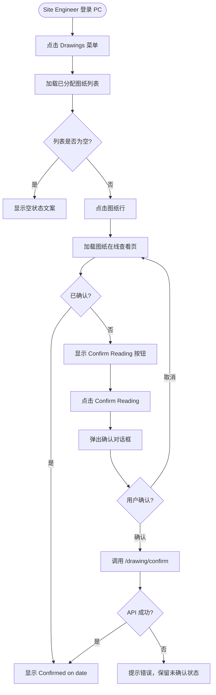

# 需求文档：PC 端 Site Engineer 图纸查阅与局部更新查看

> **端**: PC 管理端（桌面浏览器 Web）
> **共享需求**: [REQ-003-shared.md](../shared/REQ-003-shared.md)（图纸业务规则、数据模型、API）
> **共享需求**: [REQ-004-shared.md](../shared/REQ-004-shared.md)（局部更新业务规则、数据模型、API）
> **依赖需求**: [REQ-003A-pc.md](./REQ-003A-pc.md)（图纸管理列表页基础规范，包含列表行含义与数据模型）
> **对应 APP 功能**: [REQ-003-app.md](../app/REQ-003-app.md)、[REQ-004-app.md](../app/REQ-004-app.md)
> **本文档仅包含**: PC 端 Site Engineer 视角的图纸查阅、确认、局部更新查看功能

---

## 1. 背景与目标

### 1.1 业务背景

Site Engineer 目前通过 APP 接收图纸通知并完成查阅确认，但在办公室或使用电脑时切换到手机查看图纸体验较差，且大尺寸图纸（如 A1 平面图）在 PC 大屏上查看更清晰高效。

### 1.2 业务目标

为 Site Engineer 提供 PC 端等效的图纸查阅与局部更新查看能力，减少跨设备切换的摩擦，并保证确认状态跨端同步。

具体目标：
1. Site Engineer 可在 PC 端访问与 APP 等效的图纸列表（仅显示分配给自己的图纸）
2. 在 PC 端在线查看图纸并完成"查阅确认（Confirm Reading）"，确认记录跨端同步
3. 在 PC 端查看图纸的所有 ACTIVE 局部更新（Markups），并完成"标记已读（Mark as Read）"
4. 在 PC 端接收图纸局部更新的站内通知（In-App Notification），点击跳转到对应图纸的 Markups 面板

### 1.3 非目标（Out of Scope）

- 本期不包含：Site Engineer 在 PC 端上传或编辑图纸
- 本期不包含：Site Engineer 在 PC 端发布或管理局部更新（Markups）
- 本期不包含：局部更新的评论或回复功能

---

## 2. 用户与角色

### 2.1 角色定义

| 角色 ID | 角色名 | 描述 | 典型场景 |
|--------|-------|------|---------|
| ROLE-001 | Site Engineer | 施工现场工程师，负责查阅图纸、确认已读并跟进局部更新 | 在办公室 PC 上查阅最新图纸及局部更新 |
| ROLE-002 | Admin | 项目管理员，负责上传图纸、分配图纸、发布局部更新 | 向 Site Engineer 分配图纸；发布局部更新并触发通知 |

### 2.2 用户故事（User Stories）

#### US-005-001：PC 端查看分配图纸列表

```
作为 ROLE-001 Site Engineer
我想要 在 PC 端看到分配给我的图纸列表
以便 在使用电脑时也能方便地访问相关图纸，不必切换到手机
```

**优先级**: P1

#### US-005-002：PC 端在线查看图纸并确认已读

```
作为 ROLE-001 Site Engineer
我想要 在 PC 端在线查看图纸并点击"Confirm Reading"完成查阅确认
以便 在大屏上看清楚图纸细节，并留存跨平台的阅读记录
```

**优先级**: P1

#### US-005-003：PC 端查看局部更新并标记已读

```
作为 ROLE-001 Site Engineer
我想要 在 PC 端查看某张图纸的所有局部更新（Markups）并逐条标记已读
以便 在使用电脑时也能掌握图纸的最新改动，不遗漏任何局部更新
```

**优先级**: P1

#### US-005-004：PC 端接收站内通知

```
作为 ROLE-001 Site Engineer
我想要 在 PC 端收到图纸局部更新的站内通知
以便 在使用电脑时也能第一时间获知图纸改动，无需主动切换到手机
```

**优先级**: P1

---

## 3. 角色与权限矩阵

| 操作 | Site Engineer | Admin |
|-----|--------------|-------|
| 查看个人分配图纸列表 | ✅ | ❌ |
| 在线查看图纸文件 | ✅ | ✅ |
| 执行 Confirm Reading | ✅ | ❌ |
| 查看图纸的 Markups 列表 | ✅ | ✅ |
| 执行 Mark Markup as Read | ✅ | ❌ |
| 接收局部更新站内通知 | ✅ | ❌ |
| 上传 / 编辑图纸 | ❌ | ✅ |
| 发布 / 管理 Markup | ❌ | ✅ |

---

## 4. 核心实体与数据生命周期

> ⚠️ 本节仅定义业务语义；技术字段在 `data-contract.md` 中定义。本需求直接复用 REQ-003-shared 与 REQ-004-shared 中已定义的实体，不新增实体。

### 4.1 实体清单

| 实体 ID | 实体名 | 描述 | 关键属性（业务语义） |
|--------|-------|------|------------------|
| ENT-001 | DrawingVersion | **列表每行所对应的实体**；对应设计人员的一次 PDF 上传（一次提交记录）；PDF 内各页图纸（Drawing No / Name）为页级属性，不在列表中展示 | description、category、status（审批状态）、版本号（仅内部使用，不展示给 SE）、PDF 文件 |
| ENT-002 | Drawing | 图纸页级记录；对应 PDF 中的一页，拥有唯一的 Drawing No 和 Drawing Name；**不作为列表行展示** | Drawing No、Drawing Name、所属 DrawingVersion |
| ENT-003 | DrawingAssignment | 提交记录与 Site Engineer 的分配关系 | drawingVersionId、userId |
| ENT-004 | DrawingConfirmation | Site Engineer 对某次提交记录的查阅确认记录 | drawingVersionId、userId、confirmedAt、deviceInfo |
| ENT-005 | DrawingMarkup | 图纸局部更新 | drawingVersionId、title、affectedArea、description、publishTime、status（ACTIVE/MERGED） |
| ENT-006 | MarkupConfirmation | Site Engineer 对某条 Markup 的已读确认记录 | markupId、userId、confirmedAt |
| ENT-007 | InAppNotification | PC 端站内通知 | userId、type、referenceId、isRead、createdAt |

### 4.2 实体关系

- 一次提交记录（DrawingVersion）可被分配给多个 Site Engineer（1:N，通过 DrawingAssignment）
- 一次提交记录（DrawingVersion）包含多个 DrawingMarkup（1:N）
- 一个 DrawingConfirmation 对应一次提交记录 + 一个用户的一次确认（1:1 per DrawingVersion）
- 一个 MarkupConfirmation 对应一个 DrawingMarkup + 一个用户的一次已读确认（1:1）
- 一条 InAppNotification 对应一个用户 + 一个触发事件（DrawingMarkup 发布）

### 4.3 数据生命周期

本需求不创建新实体，生命周期遵循 REQ-003-shared 与 REQ-004-shared 的定义。

**InAppNotification 生命周期**：
1. 创建：Admin 发布 DrawingMarkup 时，系统为所有已分配该图纸的 Site Engineer 批量创建通知记录
2. 流转：用户点击通知 → `isRead = true`；"Mark all as read" → 批量更新
3. 归档：通知保留最近 90 天，超期自动归档，不再显示于面板

---

## 5. 状态机

### 5.1 DrawingConfirmation 状态（用户视角）

| 状态 ID | 状态名 | 描述 | 是否终态 |
|--------|-------|------|---------|
| S-001 | Unconfirmed | 用户尚未对该版本图纸执行 Confirm Reading | 否 |
| S-002 | Confirmed | 用户已完成 Confirm Reading，记录 confirmedAt 与 deviceInfo | 是 |

### 5.2 DrawingConfirmation 状态转换表

| From | To | 触发动作 | 守卫条件（前置） | 副作用 |
|------|-----|---------|-------------|-------|
| S-001 Unconfirmed | S-002 Confirmed | 点击 [Confirm Reading] 并在对话框确认 | 用户已登录且图纸已分配给该用户 | 写入 DrawingConfirmation 记录；列表页 Status 列实时更新为 ✓ Read |

### 5.3 MarkupConfirmation 状态（用户视角）

| 状态 ID | 状态名 | 描述 | 是否终态 |
|--------|-------|------|---------|
| M-001 | Unread | 用户尚未标记该 Markup 已读 | 否 |
| M-002 | Read | 用户已标记已读 | 是 |

### 5.4 MarkupConfirmation 状态转换表

| From | To | 触发动作 | 守卫条件（前置） | 副作用 |
|------|-----|---------|-------------|-------|
| M-001 Unread | M-002 Read | 点击 [Mark as Read] | 用户已登录且图纸已分配给该用户 | 写入 MarkupConfirmation；卡片按钮替换为 ✓ Read；列表页角标数量减一 |

### 5.5 非法转换

- Confirmed → Unconfirmed：禁止。确认操作不可撤销
- Read → Unread：禁止。已读标记不可撤销

---

## 6. 业务流程

### 6.1 主流程一：图纸查阅与确认（PC 端）

1. Site Engineer 登录 PC → 点击侧边栏 **Drawings** 菜单
2. 系统加载该用户已分配的 ACTIVE 图纸列表
3. Site Engineer 点击某行图纸 → 进入图纸在线查看页
4. 系统加载图纸文件（PDF/PNG/JPG），支持缩放与平移
5. Site Engineer 点击 **[Confirm Reading]** → 弹出确认对话框
6. 用户确认 → 系统调用 `/drawing/confirm`，`deviceInfo = "PC"`
7. 系统写入 DrawingConfirmation 记录，返回列表页，Status 列更新为 `✓ Read`

### 6.2 主流程图（Mermaid）



### 6.3 主流程二：局部更新查看与已读标记

1. Site Engineer 在图纸查看页点击 **Markups Tab**（或从列表点击角标）
2. 系统加载该图纸的所有 `status = ACTIVE` 的 Markup，按 publishTime 降序排列
3. Site Engineer 查看 Markup 卡片内容（标题、发布人、影响区域、说明、附件）
4. 对未读的 Markup 点击 **[Mark as Read]** → 系统调用 `/drawing/markup/confirm`
5. 成功后卡片按钮替换为 `✓ Read`，列表页 `Markups` 列未读数字减一（`●{unread}` 部分更新）

### 6.4 主流程三：PC 端站内通知

1. Admin 发布 DrawingMarkup → 系统向已分配该图纸的 Site Engineer 批量创建 InAppNotification
2. Site Engineer 在 PC 顶部铃铛处看到未读数量角标
3. 点击铃铛 → 打开通知下拉面板，显示最近 20 条通知
4. 点击某条通知 → 跳转到对应图纸查看页，自动激活 **Markups Tab**；通知标记为已读

### 6.5 异常流程

| 异常场景 | 触发条件 | 系统响应 | 用户感知 |
|---------|---------|---------|---------|
| 图纸文件加载失败 | 文件 URL 不可访问或超时 | 展示错误插图 + "Failed to load drawing" + Retry 按钮 | 看到错误提示，可重试 |
| Confirm Reading API 失败 | 网络错误或服务端 5xx | Toast 提示 "Confirm failed, please try again"；状态不变 | 感知操作失败，可重试 |
| Mark as Read API 失败 | 网络错误或服务端 5xx | Toast 提示错误；卡片按钮恢复为 [Mark as Read] | 感知操作失败，可重试 |
| 图纸已被取消分配 | 在用户查看期间管理员取消了分配 | 返回列表时不再显示该图纸；刷新后无权访问 | 刷新后跳回列表，提示无权访问 |

---

## 7. 功能需求详述

### 7.1 F-001：菜单入口与权限控制

**关联用户故事**: US-005-001
**所属流程节点**: 主流程一第 1~2 步

**处理逻辑**:
1. Site Engineer 登录后侧边栏显示 **Drawings** 菜单项（与管理员的 Drawing Management 菜单不同，分属不同菜单项）
2. 若用户同时具有管理员角色，则 Drawings 与 Drawing Management 均显示
3. 后端接口按 `DrawingAssignment` 双重过滤（`status = ACTIVE` + 已分配给当前用户），前端无法绕过

**输入**: 当前登录用户 ID（从 JWT token 解析）

**输出**:
- 成功：图纸列表数据
- 失败：401 未授权 / 403 无权限 → 跳转登录页

---

### 7.2 F-002：Site Engineer 图纸列表页

**关联用户故事**: US-005-001
**所属流程节点**: 主流程一第 2~3 步

**页面布局**:

```
┌─────────────────────────────────────────────────────────────────────────────────┐
│ 📄 Drawings                                          [🔍 Filter Search]         │
├─────────────────────────────────────────────────────────────────────────────────┤
│ Description       │ Category │ RFA No. │ Subject of RFA  │ Status    │ Markups        │ Confirmed │ Last Updated │
├─────────────────────────────────────────────────────────────────────────────────┤
│ 首层平面图施工图纸  │ Arch.    │ RFA-001 │ 首层平面图报审   │ ✓ Read   │  ●2 / 5        │ Apr 8     │ 2026-04-01   │
├─────────────────────────────────────────────────────────────────────────────────┤
│ 基础结构施工详图    │ Struct.  │ —       │ —               │ Confirm → │  0 / 3         │ —         │ 2026-03-20   │
└─────────────────────────────────────────────────────────────────────────────────┘
```

> **列表行含义**：表格每一行代表**一次提交记录（DrawingVersion）**，即设计人员上传的一个 PDF 文件。PDF 内各页图纸（Drawing No / Drawing Name）为页级属性，不在列表列中展示，可通过进入详情页查看。

**表格列定义**:

| 列名 | 说明 |
|------|------|
| Description | 上传时填写的批次描述；列表主标识列（对应 DrawingVersion 的批次描述字段） |
| Category | 图纸分类（上传时填写） |
| RFA No. | 外部审批报审编号；外部审批已发起后显示具体编号，否则显示 `—` |
| Subject of RFA | 外部审批报审主题；外部审批已发起后显示具体主题，否则显示 `—` |
| Status | 确认状态：`✓ Read`（绿）/ `Confirm →`（蓝色文字链接，点击跳转在线查看页） |
| Markups | 当前提交记录（DrawingVersion）的 ACTIVE Markup 数量，格式为 `●{unread} / {total}`：`{total}` 为该 DrawingVersion 下 ACTIVE Markup 总数，`●{unread}` 为当前用户尚未标记已读的数量（橙色高亮，unread > 0 时显示角标）；全部已读时显示 `0 / {total}`；无 Markup 时显示 `—`；点击可直接跳转至该记录的 Markups Tab |
| Confirmed | 完成确认的时间（如 `Apr 8`），未确认时显示 `—` |
| Last Updated | 提交记录最后更新时间 |

> **说明**：系统版本号（Current Version）属于内部审批管理信息，**不在 Site Engineer 视图中显示**。Drawing No 与 Drawing Name 为 PDF 页级属性，亦不在列表列中展示。

**输入**:
- Filter Search 关键词（Description 模糊搜索，可选）
- Category 下拉筛选（可选）

**边界与约束**:
- 无 Upload Drawing / Manage 相关操作，本页仅只读查阅
- 未被分配任何提交记录时：居中显示图纸图标 + "No drawings assigned to you yet."

---

### 7.3 F-003：图纸在线查看页

**关联用户故事**: US-005-002
**所属流程节点**: 主流程一第 3~7 步

**触发方式**: 点击表格行任意区域，或点击 `Confirm →` 状态链接

**页面布局**:

```
┌────────────────────────────────────────────────────────────────────┐
│  ← Drawings  /  首层平面图施工图纸                      （面包屑） │
├────────────────────────────────────────────────────────────────────┤
│  首层平面图施工图纸                    [Confirm Reading]            │
│  Architectural  ·  Updated 2026-04-01  （或 ✓ Confirmed on Apr 8） │
├────────────────────────────────────────────────────────────────────┤
│  [Drawing Preview]  [Markups (2)]                      （顶部 Tab）│
├────────────────────────────────────────────────────────────────────┤
│                                                                    │
│             （图纸在线预览区域，支持缩放 / 平移）                   │
│                                                                    │
└────────────────────────────────────────────────────────────────────┘
```

> **说明**：详情页标题显示该提交记录的 Description（批次描述）与 Category，不显示系统版本号。PDF 内各页的 Drawing No / Name 可在图纸文件中查看，不在页面 Header 中单独列出。`[Confirm Reading]` 按钮置于 Header 右侧，用户无需滚动页面即可完成确认操作。

**在线预览规范**:
- 支持格式：PDF / PNG / JPG / DWG（DWG 经后端转换为 PDF 后展示），遵循 REQ-003-app §3.3
- PC 端支持鼠标滚轮缩放、鼠标拖拽平移
- 提供"全屏查看"按钮（页面内全屏）

**Confirm Reading 交互**:

| 状态 | 显示位置 | 显示内容 | 操作 |
|------|---------|---------|------|
| 未确认 | Header 右侧 | `[Confirm Reading]` 主按钮 | 点击弹出确认对话框，确认后调用 `/drawing/confirm` |
| 已确认 | Header 右侧 | `✓ Confirmed on {date}`（绿色文字，不可点击） | 仅展示确认时间 |

**边界与约束**:
- 确认记录 `deviceInfo` 字段记录为 `PC`，与 APP 端确认记录统一汇总
- 确认成功后列表页中该图纸 Status 列自动更新为 `✓ Read`

---

### 7.4 F-004：Markups Tab — 局部更新列表

**关联用户故事**: US-005-003
**所属流程节点**: 主流程二第 1~5 步

**触发方式**: 在图纸查看页顶部切换到 Markups Tab，或从图纸列表点击 `Markups` 列的数字直接进入

**布局**:

```
┌────────────────────────────────────────────────────────────────┐
│  [Drawing Preview]  [Markups (2)]                              │
├────────────────────────────────────────────────────────────────┤
│  ┌──────────────────────────────────────────────────────────┐  │
│  │  [New]  A轴节点详图修正                     Apr 8, 2026  │  │
│  │  张三                                                     │  │
│  │  Based on SUB-2026-003  · Page 3                         │  │
│  │  A轴与3轴交叉节点详图已更新，新增钢筋排布说明。            │  │
│  │  📎 node-detail.pdf                                       │  │
│  │                                    [✓ Mark as Read]       │  │
│  └──────────────────────────────────────────────────────────┘  │
│  ┌──────────────────────────────────────────────────────────┐  │
│  │  C区消防管道路由修正                        Apr 7, 2026  │  │
│  │  张三                                                     │  │
│  │  Based on SUB-2026-003  · Page 5                         │  │
│  │  消防主管道路由变更，详见附图...                           │  │
│  │  📎 route-update.png                                      │  │
│  │                                             ✓ Read        │  │
│  └──────────────────────────────────────────────────────────┘  │
└────────────────────────────────────────────────────────────────┘
```

**卡片规格**（对齐 REQ-004-pc §7.3 卡片规格）:

| 卡片属性 | 规格 |
|---------|------|
| 标题 | Part Print 的 description 字段；14px，font-weight 600；[New] 标签（橙色）在标题左侧，当前用户未标记已读时显示 |
| 元信息行 | `{发布日期} · {创建人}`，12px，`#909399` |
| 报审号 + 页码行 | 元信息行下方；格式：`Based on {submissionNo}`，若 `appliedPageNo` 不为 null 则追加 ` · Page {n}`；灰色 `#909399`，12px |
| 说明文字 | 最多 3 行，超出显示"…Show more"展开 |
| 附件列表 | 📎 图标 + 文件名；点击在浏览器新 Tab 打开；支持 PDF 内嵌预览，PNG / JPG 直接打开 |
| [Mark as Read] | 当前用户未标记已读时显示（蓝色按钮）；点击调用 `/drawing/markup/confirm`；成功后替换为 `✓ Read`（绿色文字） |

**列表规则**：
- 仅显示 `status = ACTIVE` 的 Part Print；
- 按 `publishTime` 降序排列；
- 无 Part Print 时显示空态："No markups for this drawing yet."

---

### 7.5 F-005：PC 端站内通知

**关联用户故事**: US-005-004
**所属流程节点**: 主流程三第 1~4 步

**通知来源**: Admin 发布 DrawingMarkup 时，系统同步向已分配该图纸的所有 Site Engineer 发送站内通知

**通知中心入口**:
- PC 顶部导航栏右侧显示 🔔 铃铛图标
- 有未读通知时图标上显示红色数字角标（最多显示 99，超出显示 99+）
- 点击铃铛打开通知下拉面板（最近 20 条）

**通知格式**:

| 字段 | 内容 |
|------|------|
| 图标 | 📄 图纸图标（橙色） |
| 标题 | Drawing Update — {drawingCode} |
| 正文 | {markupTitle}. Please review the latest markup for {drawingCode} {drawingName}. |
| 时间 | 通知发送时间（如 "5 minutes ago" / "Apr 8"） |
| 跳转 | 点击通知条目 → 跳转到对应图纸在线查看页，并自动激活 Markups Tab |

**通知已读逻辑**:
- 点击通知条目后，该通知标记为已读，角标数量减少
- 通知下拉面板顶部提供 "Mark all as read" 操作

---

## 8. 验收标准（Acceptance Criteria）

### AC-005-001：图纸列表仅显示已分配的提交记录

**关联用户故事**: US-005-001

```
Given  Site Engineer 已登录，管理员已将提交记录 A（DrawingVersion）分配给该用户，提交记录 B 未分配
When   用户进入 Drawings 页面
Then   列表每行代表一次提交记录（DrawingVersion）；
       仅显示已分配的提交记录 A，不显示提交记录 B；
       列表列包含 Description、Category、RFA No.、Subject of RFA、Status、Markups、Confirmed、Last Updated；
       不显示 Drawing Code / Drawing Name（页级属性）；
       不显示系统版本号（Current Version）；
       RFA No. 与 Subject of RFA 在外部审批已发起后显示具体值，否则显示 —
```

### AC-005-002：空状态显示

**关联用户故事**: US-005-001

```
Given  Site Engineer 尚未被分配任何图纸
When   用户进入 Drawings 页面
Then   页面居中展示空状态图标和文案 "No drawings assigned to you yet."
```

### AC-005-003：图纸在线查看

**关联用户故事**: US-005-002

```
Given  Site Engineer 点击已分配给自己的列表行（一次提交记录）
When   图纸查看页加载完成
Then   图纸文件正常显示，支持鼠标滚轮缩放和拖拽平移；
       页面 Header 显示该提交记录的 Description 与 Category，不显示系统版本号
```

### AC-005-004：Confirm Reading 成功

**关联用户故事**: US-005-002

```
Given  Site Engineer 在查看页看到 [Confirm Reading] 按钮
When   用户点击按钮并在确认对话框选择确认
Then   按钮替换为 "✓ Confirmed on {date}"；返回列表页后该图纸 Status 列显示 "✓ Read"
```

### AC-005-005：Confirm Reading 写入 deviceInfo

**关联用户故事**: US-005-002

```
Given  Site Engineer 在 PC 端完成 Confirm Reading
When   后端写入 DrawingConfirmation 记录
Then   记录的 deviceInfo 字段值为 "PC"
```

### AC-005-006：Confirm Reading 跨端同步

**关联用户故事**: US-005-002

```
Given  Site Engineer 已在 APP 端完成对某张图纸的 Confirm Reading
When   同一用户在 PC 端打开同一张图纸
Then   查看页显示 "✓ Confirmed on {date}"，不再显示 [Confirm Reading] 按钮
```

### AC-005-007：Markups Tab 仅显示 ACTIVE 更新

**关联用户故事**: US-005-003

```
Given  图纸有 2 条 ACTIVE Markup 和 1 条 MERGED Markup
When   Site Engineer 切换到 Markups Tab
Then   仅显示 2 条 ACTIVE Markup，按 publishTime 降序排列，MERGED 的不显示
```

### AC-005-008：Mark as Read 操作

**关联用户故事**: US-005-003

```
Given  Markup 卡片显示 [New] 标签和 [Mark as Read] 按钮
When   用户点击 [Mark as Read]
Then   按钮替换为 "✓ Read"（绿色）；页面刷新后状态持久保留；列表页该图纸 `Markups` 列未读数减一（如 `●2 / 5` → `●1 / 5`，全部已读后变为 `0 / 5`）
```

### AC-005-009：Mark as Read 跨端同步

**关联用户故事**: US-005-003

```
Given  Site Engineer 已在 APP 端对某条 Markup 标记已读
When   同一用户在 PC 端刷新 Markups Tab
Then   该条 Markup 显示 "✓ Read"，不显示 [Mark as Read] 按钮
```

### AC-005-010：站内通知接收

**关联用户故事**: US-005-004

```
Given  管理员发布了 Drawing A 的一条 Markup，Site Engineer 已被分配 Drawing A
When   管理员点击发布
Then   该 Site Engineer 的 PC 端铃铛角标数量加一，通知面板中出现对应通知条目
```

### AC-005-011：未分配用户不收通知

**关联用户故事**: US-005-004

```
Given  管理员发布了 Drawing A 的一条 Markup，Site Engineer B 未被分配 Drawing A
When   管理员点击发布
Then   Site Engineer B 的 PC 端不收到该通知
```

### AC-005-012：通知跳转至 Markups Tab

**关联用户故事**: US-005-004

```
Given  Site Engineer 的通知面板中有一条图纸 Markup 通知
When   用户点击该通知条目
Then   跳转到对应图纸查看页，Markups Tab 自动激活；该通知标记为已读，角标数量减一
```

---

## 9. 非功能需求

### 9.1 性能

| 指标 | 目标值 | 测量方式 |
|-----|-------|---------|
| 图纸列表首屏加载 | < 1.5s（100 条以内） | Lighthouse / 实测 |
| 图纸文件加载（< 10MB PDF） | < 3s（正常网络） | 实测 |
| Confirm Reading / Mark as Read 响应 | < 500ms | 接口响应时间 |
| 站内通知推送延迟 | < 5s（从发布到铃铛角标更新） | 端到端实测 |

### 9.2 安全

- 鉴权方式：JWT Token（与现有系统一致）
- 越权防护：后端接口必须校验当前用户是否有 DrawingAssignment，禁止越权访问他人图纸
- 审计：Confirm Reading 与 Mark as Read 操作必须留痕（含 userId、deviceInfo、timestamp）

### 9.3 可访问性

- 键盘可达：菜单导航、Tab 切换、按钮操作均支持键盘
- 屏幕阅读器：不作要求（当前阶段）

### 9.4 兼容性

- 浏览器：Chrome 100+、Edge 100+、Safari 15+
- 移动端：不支持（PC 专属功能）
- 国际化：中英双语（遵循现有 i18n 方案）

### 9.5 可观测性

- 关键埋点：图纸列表访问、图纸查看、Confirm Reading 点击、Mark as Read 点击、通知点击
- 错误监控：接口报错上报 Sentry

---

## 10. 数据量级与扩展性

| 维度 | 当前预期 | 1 年后 | 3 年后 |
|-----|---------|-------|-------|
| 单用户分配图纸数 | ≤ 50 张 | ≤ 200 张 | ≤ 500 张 |
| 单张图纸 ACTIVE Markup 数 | ≤ 20 条 | ≤ 50 条 | ≤ 100 条 |
| 站内通知总量（单用户） | ≤ 200 条 | ≤ 1000 条 | ≤ 5000 条 |

---

## 11. 依赖与外部系统

| 依赖系统 | 用途 | 集成方式 | Owner |
|---------|------|---------|-------|
| REQ-003-shared API | 获取图纸列表、图纸详情、提交 Confirm Reading | REST API | 后端团队 |
| REQ-004-shared API | 获取 Markup 列表、提交 Mark as Read | REST API | 后端团队 |
| 通知服务 | 发送 PC 端站内通知、维护未读数量 | WebSocket / Polling（<!-- TODO: OQ-001 待定 -->） | 后端团队 |
| 文件存储服务 | 图纸文件 URL 生成 | 预签名 URL | 后端团队 |

---

## 12. 数据迁移

无。本需求为新功能，不涉及存量数据迁移。

---

## 13. 上线操作清单（Launch Checklist）

### 13.1 上线前

- [ ] 权限 / 角色初始化：确认 Site Engineer 角色已存在，侧边栏 Drawings 菜单权限已配置
- [ ] 通知服务配置：确认 WebSocket 或 Polling 方案已部署，Topic/频道已创建
- [ ] 环境配置检查：文件存储预签名 URL 有效期配置正确

### 13.2 上线后

- [ ] 数据校验：验证现有 DrawingAssignment 数据完整，Site Engineer 可正常看到图纸列表
- [ ] 通知功能验证：发布一条测试 Markup，确认目标用户收到通知
- [ ] 通知相关方：通知现场 Site Engineer 新 PC 端功能已上线

---

## 14. 灰度与发布策略

- 灰度方式：按用户（优先在内部测试账号验证）
- 灰度比例：内部验证 → 10% Site Engineer → 100%
- 监控指标：Confirm Reading 成功率 < 99% 或 Mark as Read 成功率 < 99% 时回滚
- 回滚预案：前端功能开关关闭 Drawings 菜单入口；数据库无破坏性变更，无需 DB 回滚

---

## 15. 成功指标（北极星）

| 指标 | 当前基线 | 目标 | 测量周期 |
|-----|---------|------|---------|
| PC 端 Confirm Reading 完成率（已分配图纸中已确认比例） | 0%（功能未上线） | ≥ 60% | 上线后 30 天 |
| PC 端 Markup 已读率 | 0%（功能未上线） | ≥ 70% | 上线后 30 天 |
| PC 端通知点击率 | 0%（功能未上线） | ≥ 40% | 上线后 30 天 |

---

## 16. Open Questions（待定项）

| OQ ID | 问题 | 影响 | Owner | 截止 |
|------|------|------|-------|------|
| OQ-001 | 站内通知推送机制采用 WebSocket 实时推送还是 Polling？影响通知延迟和服务端资源消耗 | 通知推送延迟、后端架构 | 后端 TL | 2026-06-10 |
| OQ-002 | 图纸查看页使用独立路由页面还是 El-Dialog 抽屉？影响 URL 分享能力和 UX | UI 设计、前端路由 | UI + PM | 2026-06-10 |

---

## 17. Figma / 原型链接

- Figma 设计稿：<!-- TODO: 待 UI 设计完成后补充 -->
- 交互原型：<!-- TODO: 待补充 -->

---

## 18. 变更历史

| 版本 | 日期 | 修改人 | 变更摘要 | 影响下游文档 |
|-----|------|-------|---------|------------|
| 0.1.0 | 2026-04-01 | | 初稿 | 全部 |
| 0.2.0 | 2026-05-27 | | 按最新需求模板重构文档结构，补充 YAML 元数据、实体清单、状态机、业务流程 Mermaid 图、AC-005-001～012、非功能需求、上线清单、成功指标及 Open Questions | 全部 |
| 0.3.0 | 2026-05-28 | | 对齐 REQ-003A 列表数据模型：列表每行改为一次提交记录（DrawingVersion）；主标识列由 Drawing Code/Name 改为 Description；移除 Version 列（不对 SE 展示）；更新 §4.1 实体清单（突出 DrawingVersion 为列表主体）、§4.2 实体关系、§7.2 表格列定义与 ASCII 布局、§7.3 详情页 Header、AC-005-001、AC-005-003；depends_on 改为 REQ-003A-pc | Frontend、QA |
| 0.3.1 | 2026-05-28 | | 列表新增 RFA No. 与 Subject of RFA 两列；更新 §7.2 ASCII 布局、表格列定义及 AC-005-001 | Frontend、QA |
| 0.3.2 | 2026-05-28 | | 将列名 "Markups" 重命名为 "Unread Markups"，明确该列含义为当前 DrawingVersion 的未读 Markup 数量；更新 §7.2 ASCII 布局与列定义、§6.3、§7.4 触发方式及卡片副作用描述、AC-005-001、AC-005-008 | Frontend、QA |
| 0.3.3 | 2026-05-28 | | 将列名 "Unread Markups" 改回 "Markups"，列值格式改为 `●{unread} / {total}`，同时展示未读数（橙色高亮）与当前 DrawingVersion 的 ACTIVE Markup 总数；全部已读时显示 `0 / {total}`，无 Markup 时显示 `—`；更新 §7.2 ASCII 布局与列定义、§6.3、§7.4 触发方式、AC-005-001、AC-005-008 | Frontend、QA |
| 0.3.4 | 2026-05-28 | | F-003 图纸查看页将 [Confirm Reading] 按钮从底部移至 Header 右侧，用户无需滚动即可确认；已确认时同位置显示 `✓ Confirmed on {date}`；更新 §7.3 ASCII 布局与 Confirm Reading 交互表（新增显示位置列） | Frontend、QA |
| 0.3.5 | 2026-05-28 | | F-004 Markups Tab 卡片规格对齐 REQ-004-pc §7.3：移除 Affected Area 字段，新增元信息行（`{日期} · {创建人}`）与报审号+页码行（`Based on {submissionNo} · Page {n}`）；卡片规格改为表格形式；新增列表规则（排序与空态文案）；更新 §7.4 ASCII 布局与卡片规格 | Frontend、QA |

---

## 19. 备注

- 本需求的数据契约（API 接口字段）由 REQ-003-shared 和 REQ-004-shared 统一维护，本文档不重复定义
- 站内通知（InAppNotification）若后续扩展到其他业务场景（如审批通知），建议抽象为通用通知模块（REQ-XXX-shared）
- 相关需求文档：

| 文档 | 说明 |
|------|------|
| [REQ-003-shared.md](../shared/REQ-003-shared.md) | 图纸共享业务规则与 API |
| [REQ-003-pc.md](./REQ-003-pc.md) | 管理员 PC 端图纸管理（图纸列表基础页） |
| [REQ-003-app.md](../app/REQ-003-app.md) | APP 端图纸查阅（对等功能参考） |
| [REQ-004-shared.md](../shared/REQ-004-shared.md) | 局部更新共享业务规则与 API |
| [REQ-004-pc.md](./REQ-004-pc.md) | 管理员 PC 端发布/汇总局部更新 |
| [REQ-004-app.md](../app/REQ-004-app.md) | APP 端局部更新查阅（对等功能参考） |
