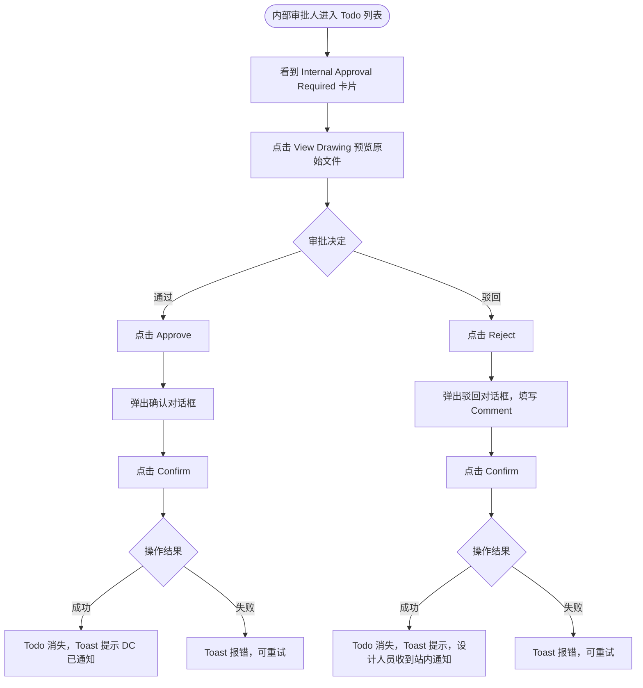

# 需求文档：PC 端 — 内部审批 Todo 调整

> **使用说明**：本文档是整个交付链路的**单一事实源**。所有下游文档（UI/前端/QA）从本文档派生。
> 业务规则、API、数据模型见 [REQ-007-shared.md](../shared/REQ-007-shared.md)。

---

## 1. 背景与目标

### 1.1 业务背景

REQ-003B-pc 定义了单级审批的 Todo 交互（审批人通过即版本生效）。随着 REQ-007 将审批流程升级为两级串行（内部审批 → 外部审批），内部审批 Todo 的行为发生了根本变化：**通过后版本不立即生效，而是进入外部审批阶段**，由 DC 负责后续流转。

### 1.2 业务目标

在 PC 端 Todo 列表中，让内部审批人能清晰识别"内部审批"任务（区别于旧的单级审批任务），并在通过后知晓下一步将由 DC 完成外部审批，而非版本直接生效。

### 1.3 非目标（Out of Scope）

- DC 外部审批 Todo（由 REQ-007B-pc 覆盖）
- APP 端 Todo（APP 端沿用现有审批 Todo 交互，仅标签文案变更）
- 审批业务规则（由 REQ-007-shared §5.2 定义）

---

## 2. 用户与角色

### 2.1 角色定义

| 角色 ID | 角色名 | 描述 | 典型场景 |
|--------|-------|------|---------|
| ROLE-001 | 内部审批人 | 具备 `drawing:approve` 权限的技术人员（设计经理/总工程师等） | 在 PC Todo 列表查看图纸技术内容，决定通过或驳回 |
| ROLE-002 | 设计人员（Designer） | 图纸上传人 | 收到驳回通知后重新上传新版本 |

### 2.2 用户故事（User Stories）

#### US-007A-001：内部审批人在 PC 端完成内部审批

```
作为 内部审批人（设计经理/总工程师）
我想要 在 PC Todo 列表中清晰看到"内部审批"任务，审核图纸技术内容后决定通过或驳回
以便 确保提交给外部方的图纸质量达标，并知晓通过后下一步由 DC 负责外部审批
```

**优先级**：P1
**所属史诗**：图纸两级审批流程

---

## 3. 角色与权限矩阵

| 操作 | 内部审批人 | DC | 设计人员 | Site Engineer |
|-----|:---------:|:--:|:-------:|:-------------:|
| 查看 Internal Approval Required Todo | ✅（仅自己被指定的） | ❌ | ❌ | ❌ |
| 点击 [View Drawing] 在线预览原始文件 | ✅ | ❌ | ❌ | ❌ |
| 点击 [Approve] 通过内部审批 | ✅ | ❌ | ❌ | ❌ |
| 点击 [Reject] 驳回内部审批 | ✅ | ❌ | ❌ | ❌ |

---

## 4. 核心实体与数据生命周期

### 4.1 实体清单

| 实体 ID | 实体名 | 描述 | 关键属性（业务语义） |
|--------|-------|------|------------------|
| ENT-001 | Todo 任务（内部审批） | 内部审批人的待办事项 | 类型、图纸信息、上传人、状态 |
| ENT-002 | DrawingApproval | 审批记录 | phase=INTERNAL、status、comment |

### 4.2 实体关系

- 每个 DrawingVersion（状态为 `PENDING_INTERNAL`）对应一条 Todo 任务给指定的内部审批人
- 审批操作完成后生成一条 `DrawingApproval`（`phase = INTERNAL`）

### 4.3 数据生命周期

**内部审批 Todo 生命周期**：
1. 创建：设计人员上传图纸成功后，系统自动创建
2. 处理：内部审批人在 Todo 列表操作（通过/驳回）
3. 终态：通过 → Todo 关闭，DC 收到新 Todo；驳回 → Todo 关闭，设计人员收到通知

---

## 5. 状态机

### 5.1 内部审批 Todo 状态

| 状态 ID | 状态名 | 描述 | 是否终态 |
|--------|-------|------|---------|
| S-001 | PENDING | 待审批人处理 | 否 |
| S-002 | APPROVED | 内部审批已通过 | 是 |
| S-003 | REJECTED | 内部审批已驳回 | 是 |

### 5.2 状态转换表

| From | To | 触发动作 | 守卫条件 | 副作用 |
|------|-----|---------|---------|-------|
| — | S-001 | 设计人员上传图纸成功 | — | Todo 出现在内部审批人列表 |
| S-001 | S-002 | 审批人确认通过 | — | DrawingVersion 状态 → `INTERNAL_APPROVED`；向所有配置 DC 发通知 + 创建外部审批 Todo |
| S-001 | S-003 | 审批人确认驳回 | Comment 必填 | DrawingVersion 状态 → `INTERNAL_REJECTED`；站内消息通知设计人员 |

### 5.3 非法转换

- 同一版本不允许重复内部审批（Todo 已关闭后不可再操作）
- 无 `drawing:approve` 权限的用户不能触发任何转换

---

## 6. 业务流程

### 6.1 主流程（内部审批通过）

1. 内部审批人进入 PC 端 Todo 列表，看到"Internal Approval Required"任务卡片
2. 点击 [View Drawing] 在线预览原始图纸文件
3. 审核图纸技术内容，点击 [Approve]
4. 弹出确认对话框，文案说明"通过后进入外部审批阶段"
5. 点击 [Confirm]，后端执行内部审批通过逻辑
6. 成功：Todo 消失，Toast 提示 DC 已收到通知

### 6.2 主流程图（Mermaid）



### 6.3 异常流程

| 异常场景 | 触发条件 | 系统响应 | 用户感知 |
|---------|---------|---------|---------|
| 驳回未填 Comment | Reject Comment 为空 | 前端校验阻止提交 | 字段标红，提示必填 |
| 接口调用失败 | 网络异常/服务端错误 | loading 恢复，保留对话框 | Toast 显示错误文案，可重试 |

---

## 7. 功能需求详述

### 7.1 功能 F-001：内部审批 Todo 卡片

**关联用户故事**：US-007A-001
**所属流程节点**：流程 6.1 步骤 1

**卡片布局**：

```
┌─────────────────────────────────────────────────────┐
│ 🔍 Internal Approval Required                       │
│                                                     │
│ ARCH-001  首层平面图  V3                             │
│ Uploaded by: 张三（Designer）  |  2026-04-01 10:00  │
│ Version Note: 修正轴网尺寸                           │
│                                                     │
│ [View Drawing]   [Approve]   [Reject]               │
└─────────────────────────────────────────────────────┘
```

**字段说明**：

| 元素 | 内容 | 说明 |
|------|------|------|
| 图标 | 🔍 | 区分内部审批与外部审批（🌐） |
| 标题 | `Internal Approval Required` | 固定文案 |
| 图纸信息 | `{drawingCode}  {drawingName}  {versionNo}` | 三项同行展示 |
| Uploaded by | `{designerName}（Designer）  \|  {uploadTime}` | 设计人员姓名 + 上传时间 |
| Version Note | 版本修改说明 | 选填，无则不显示该行 |
| [View Drawing] | 在线预览原始文件（`fileUrl`） | 打开 PDF 预览 / 文件下载 |
| [Approve] | 触发内部审批通过流程 | 蓝色主按钮 |
| [Reject] | 触发内部审批驳回流程 | 默认样式按钮 |

### 7.2 功能 F-002：Approve 确认对话框

**关联用户故事**：US-007A-001
**所属流程节点**：流程 6.1 步骤 4–5

```
┌──────────────────────────────────────────────┐
│  Confirm Internal Approval?                  │
│                                              │
│  Once approved, this version will proceed    │
│  to external approval by Document Controller.│
│  The version will NOT become active until    │
│  external approval is completed.             │
│                                              │
│  [Cancel]  [Confirm]                         │
└──────────────────────────────────────────────┘
```

**交互规则**：
- [Confirm] 点击后按钮进入 loading 态，禁用对话框所有操作
- 成功后对话框关闭，Todo 卡片消失，Toast 提示：`"Internal approval completed. DC has been notified for external approval."`
- 失败后 loading 恢复，Toast 显示错误，可重试

### 7.3 功能 F-003：Reject 驳回对话框

**关联用户故事**：US-007A-001
**所属流程节点**：流程 6.1 步骤（驳回分支）

```
┌──────────────────────────────────────────────┐
│  Reject Internal Approval                    │
│  ARCH-001  首层平面图  V3                     │
│                                              │
│  Comment *                                   │
│  ┌────────────────────────────────────────┐  │
│  │                                        │  │
│  │  请填写驳回原因（必填）                  │  │
│  └────────────────────────────────────────┘  │
│  最多 500 字符                               │
│                                              │
│           [Cancel]     [Confirm]             │
└──────────────────────────────────────────────┘
```

**交互规则**：
- Comment 为必填，不填无法点击 [Confirm]
- 成功后对话框关闭，Todo 卡片消失，Toast 提示：`"Internal approval rejected. Designer has been notified."`
- 设计人员收到站内消息，内容包含驳回原因

---

## 8. 验收标准（Acceptance Criteria）

### AC-007A-001：Todo 卡片标题与图标

```
Given  设计人员上传图纸成功，指定了内部审批人
When   内部审批人进入 PC Todo 列表
Then   出现带 🔍 图标、标题为"Internal Approval Required"的卡片，包含图纸编号/名称/版本号/上传人/时间
```

### AC-007A-002：内部审批通过 — 成功路径

```
Given  内部审批人在 Todo 列表看到待审批卡片
When   点击 [Approve] → 在对话框点击 [Confirm]
Then   Todo 卡片消失，Toast 提示"Internal approval completed. DC has been notified for external approval."
```

### AC-007A-003：内部审批通过 — 不触发版本生效

```
Given  内部审批人完成通过操作
When   任何用户查看图纸列表或版本历史
Then   该版本状态为 PENDING_EXTERNAL（Pending External），不为 ACTIVE；Site Engineer 未收到推送
```

### AC-007A-004：内部审批通过 — DC 收到通知

```
Given  内部审批通过
When   项目已配置 DC 的用户进入 Todo 列表
Then   出现"External Approval Required"任务（见 REQ-007B-pc）
```

### AC-007A-005：内部审批驳回 — Comment 必填

```
Given  内部审批人点击 [Reject] 打开驳回对话框
When   Comment 为空时点击 [Confirm]
Then   前端校验阻止提交，Comment 字段标红并显示必填提示
```

### AC-007A-006：内部审批驳回 — 成功路径

```
Given  内部审批人填写驳回原因并点击 [Confirm]
When   操作成功
Then   Todo 卡片消失，Toast 提示"Internal approval rejected. Designer has been notified."；
       设计人员收到站内消息，消息内容包含驳回原因
```

### AC-007A-007：内部审批驳回 — 旧版本保持有效

```
Given  图纸存在已生效的旧版本（APPROVED + isCurrent=true），设计人员上传了新版本被内部驳回
When   内部审批驳回成功
Then   旧版本仍保持 ACTIVE 状态，图纸主记录 status 不变为 ACTIVE（若原为 ACTIVE）
```

### AC-007A-008：对话框 loading 态

```
Given  审批人点击对话框中的 [Confirm]
When   接口请求进行中
Then   按钮显示 loading，对话框内所有操作禁用，防止重复提交
```

### AC-007A-009：接口失败可重试

```
Given  审批人点击 [Confirm] 后接口返回错误
When   loading 结束
Then   对话框保留，loading 恢复为正常态，Toast 显示错误文案，审批人可修改后重试
```

---

## 9. 非功能需求

### 9.1 性能

| 指标 | 目标值 | 测量方式 |
|-----|-------|---------|
| Todo 列表加载 | ≤ 1.5s | 手动 / 监控 |
| 审批接口响应 P95 | ≤ 2s | 后端监控 |

### 9.2 安全

- 鉴权：JWT，需携带 `Authorization` / `X-Tenant-Id` / `Project-Id`
- 权限校验：后端校验用户具备 `drawing:approve` 权限
- 审计：审批操作（通过/驳回）记录操作人、时间、version ID

### 9.3 可访问性

- WCAG 等级：AA
- 键盘可达：对话框内所有字段支持 Tab 键导航

### 9.4 兼容性

- 浏览器：Chrome 100+、Edge 100+、Safari 15+
- 移动端：不支持（PC 专属）
- 国际化：中英双语

### 9.5 可观测性

- 关键埋点：内部审批通过、内部审批驳回、查看图纸
- 错误监控：审批接口失败率 > 5% 告警

---

## 10. 数据量级与扩展性

| 维度 | 当前预期 | 1 年后 |
|-----|---------|-------|
| 单项目每月内部审批任务数 | ≤ 100 条 | ≤ 500 条 |

---

## 11. 依赖与外部系统

| 依赖系统 | 用途 | 集成方式 | Owner |
|---------|------|---------|-------|
| REQ-007-shared §5.2 | 内部审批业务规则 | 文档引用 | — |
| REQ-007-shared §6.2 | 内部审批 API（POST /drawing/approve） | REST | 后端 |
| 消息通知系统 | 驳回通知设计人员、通过后通知 DC | 内部事件 | 后端 |

---

## 12. 数据迁移

- 存量 `PENDING_APPROVAL` 状态的 DrawingVersion 需迁移为 `PENDING_INTERNAL`
- 存量审批 Todo 标题更新为 "Internal Approval Required"
- 详见 REQ-007-shared §8 对现有需求的影响

---

## 13. 上线操作清单

### 13.1 上线前

- [ ] `drawing:approve` 权限已绑定到对应角色
- [ ] 存量 `PENDING_APPROVAL` 版本状态迁移脚本已准备
- [ ] DC 配置页面（REQ-007D-pc）已就绪，确保内部审批通过后有 DC 可通知

### 13.2 上线后

- [ ] 验证内部审批通过后 DC 收到通知
- [ ] 验证驳回后设计人员收到站内消息
- [ ] 审批操作审计日志正常记录

---

## 14. 灰度与发布策略

- 灰度方式：按项目灰度
- 与 REQ-007B/C/D-pc 同步上线（两级审批流程须整体生效）
- 回滚预案：版本状态枚举回滚需配合后端脚本

---

## 15. 成功指标（北极星）

| 指标 | 当前基线 | 目标 | 测量周期 |
|-----|---------|------|---------|
| 内部审批完成率（7天内） | — | ≥ 90% | 每周 |
| 审批操作成功率 | — | ≥ 99% | 每周 |

---

## 16. Open Questions

| OQ ID | 问题 | 影响 | Owner | 截止 |
|------|------|------|-------|------|
| OQ-001 | 内部审批人是否可以在 Todo 卡片内直接下载原始文件（目前仅 View Drawing）？ | F-001 | PM | — |
| OQ-002 | 内部审批超时（如 3 天未处理）是否需要发送催办通知？ | 通知机制 | PM | — |

---

## 17. Figma / 原型链接

- Figma 设计稿：<!-- 填写内部审批 Todo 卡片 / 对话框 Frame 链接 -->
- 交互原型：

---

## 18. 变更历史

| 版本 | 日期 | 修改人 | 变更摘要 | 影响下游文档 |
|-----|------|-------|---------|------------|
| 0.1.0 | 2026-05-05 | agent | 从 REQ-007-pc 按 US-007A-001 拆分初稿 | 全部 |

---

## 19. 备注

- 本文档从 REQ-007-pc.md §2（内部审批 Todo 调整）拆分而来
- 与 REQ-003B-pc 的关系：REQ-003B-pc 定义的是旧单级审批 Todo，本文档是其在两级审批场景下的替代
- APP 端内部审批 Todo 沿用现有交互，仅状态标签文案更新，不单独出文档
