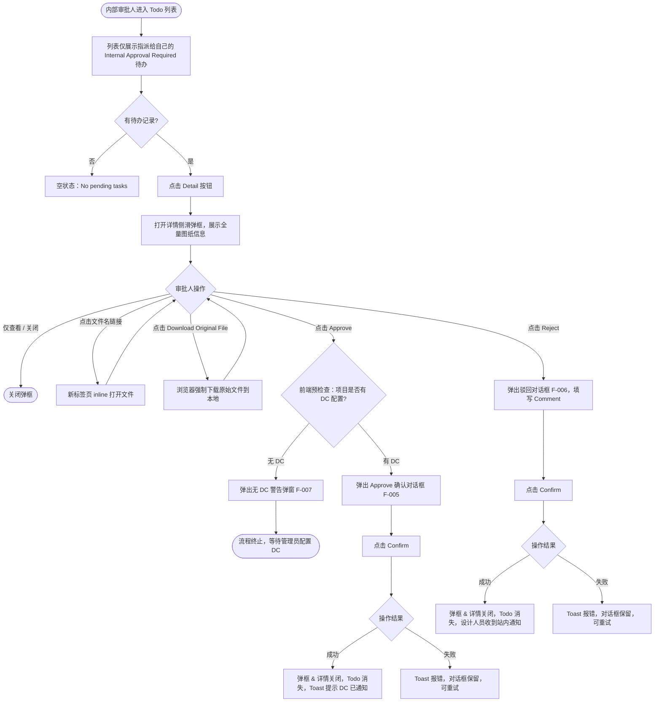

# 需求文档：PC 端 — 内部审批 Todo、详情查看与原文件下载

> **使用说明**：本文档是整个交付链路的**单一事实源**，由原 REQ-007A-pc（内部审批 Todo 调整）与 REQ-007E-pc（审批详情查看与原文件下载）合并而成。所有下游文档（UI / 前端 / 后端 / QA）从本文档派生。
> 业务规则、API、数据模型见 [REQ-007-shared.md](../shared/REQ-007-shared.md)。

---

## 1. 背景与目标

### 1.1 业务背景

REQ-003B-pc 定义了单级审批的 Todo 交互（审批人通过即版本生效）。随着 REQ-007 将审批流程升级为**两级串行**（内部审批 → 外部审批），内部审批 Todo 的行为发生了根本变化：**通过后版本不立即生效，而是进入外部审批阶段**，由 DC 负责后续流转。

此外，内部审批人在作出审批决策前需要获取**完整的图纸上传信息**（与设计人员上传时填写的信息完全一致），包括图纸分类（Category）、图纸描述（Description）及可下载的原始文件，以便进行技术评审。原 Todo 卡片仅支持在线预览，缺乏专用详情面板与**原文件下载**能力。

### 1.2 业务目标

1. 在 PC 端 Todo 列表中，让内部审批人能清晰识别"内部审批"任务（区别于旧单级审批任务），并在通过后知晓下一步将由 DC 完成外部审批，而非版本直接生效
2. 内部审批人在 Todo 列表中仅看到**指定给自己**的图纸待审批记录，列表清晰无干扰
3. 点击任意待办记录可打开**详情侧滑弹框（Detail Drawer）**，其中展示与设计人员上传时完全一致的所有信息
4. 详情侧滑弹框中提供**下载原图纸文件**按钮，审批人可将原始文件下载到本地进行离线审阅

### 1.3 非目标（Out of Scope）

- DC 外部审批 Todo（由 REQ-007B-pc 覆盖）
- APP 端 Todo（APP 端沿用现有审批 Todo 交互，仅标签文案变更）
- 审批业务规则（由 REQ-007-shared §5.2 定义）
- 在线图纸预览（渲染/查看器）功能（由 REQ-004 Markup 范畴覆盖）
- 已处理（APPROVED / REJECTED）历史任务的详情查看（由 REQ-007C-pc 版本历史抽屉覆盖）
- DC 外部审批 Todo 的详情视图（由 REQ-007B-pc 覆盖）

---

## 2. 用户与角色

### 2.1 角色定义

| 角色 ID | 角色名 | 描述 | 典型场景 |
|--------|-------|------|---------|
| ROLE-001 | 内部审批人 | 具备 `drawing:approve` 权限的技术人员（设计经理 / 总工程师等） | 在 PC Todo 列表查看图纸技术内容，打开详情弹框后下载原文件，决定通过或驳回 |
| ROLE-002 | 设计人员（Designer） | 图纸上传人 | 收到驳回通知后重新上传新版本 |

### 2.2 用户故事（User Stories）

#### US-007A-001：内部审批人在 PC 端完成内部审批

```
作为 内部审批人（设计经理 / 总工程师）
我想要 在 PC Todo 列表中清晰看到"内部审批"任务，审核图纸技术内容后决定通过或驳回
以便 确保提交给外部方的图纸质量达标，并知晓通过后下一步由 DC 负责外部审批
```

**优先级**：P1 ｜ **所属史诗**：图纸两级审批流程

#### US-007A-002：查看自己名下的图纸待办记录

```
作为 内部审批人
我想要 在 PC 端待办列表中只看到指定给我的图纸待审批记录
以便 我能快速定位自己需要处理的任务，不被无关记录干扰
```

**优先级**：P1 ｜ **所属史诗**：图纸两级审批流程

#### US-007A-003：查看图纸待办详情（信息与上传一致）

```
作为 内部审批人
我想要 点击待办记录后，在详情侧滑弹框中看到与图纸上传时完全一致的所有信息
以便 我能全面了解图纸背景，做出准确的审批决策
```

**优先级**：P1 ｜ **所属史诗**：图纸两级审批流程

#### US-007A-004：下载原始图纸文件

```
作为 内部审批人
我想要 在图纸待办详情中点击按钮下载原始图纸文件到本地
以便 我可以在离线环境中（如 AutoCAD、PDF 阅读器）仔细审阅图纸内容后再作出审批决定
```

**优先级**：P1 ｜ **所属史诗**：图纸两级审批流程

#### US-007A-005：在详情弹框内通过内部审批

```
作为 内部审批人
我想要 在查看完图纸详情后，直接在详情弹框内点击 [Approve] 完成内部审批
以便 无需离开当前上下文即可提交通过决策，并了解后续将进入外部审批阶段
```

**优先级**：P1 ｜ **所属史诗**：图纸两级审批流程

#### US-007A-006：在详情弹框内驳回内部审批

```
作为 内部审批人
我想要 在查看完图纸详情后，直接在详情弹框内点击 [Reject] 并填写驳回原因
以便 及时通知设计人员修改并重新上传
```

**优先级**：P1 ｜ **所属史诗**：图纸两级审批流程

---

## 3. 角色与权限矩阵

| 操作 | 内部审批人（本人） | 内部审批人（他人） | 设计人员 | DC | Site Engineer |
|-----|:-----------------:|:----------------:|:-------:|:--:|:-------------:|
| 查看 Todo 列表中自己名下的内部审批待办 | ✅ | ❌ | ❌ | ❌ | ❌ |
| 点击 [Detail] 打开审批详情侧滑弹框 | ✅ | ❌ | ❌ | ❌ | ❌ |
| 下载原始图纸文件 | ✅ | ❌ | ❌ | ❌ | ❌ |
| 点击 [Approve] 通过内部审批 | ✅ | ❌ | ❌ | ❌ | ❌ |
| 点击 [Reject] 驳回内部审批 | ✅ | ❌ | ❌ | ❌ | ❌ |

> **说明**："仅自己名下"由后端接口通过 `assigneeId = 当前登录用户` 过滤，前端不可绕过。

---

## 4. 核心实体与数据生命周期

### 4.1 实体清单

| 实体 ID | 实体名 | 描述 | 关键属性（业务语义） |
|--------|-------|------|------------------|
| ENT-001 | Todo 任务（内部审批） | 内部审批人的待办事项 | 指派对象（assigneeId）、关联版本、任务类型、状态 |
| ENT-002 | DrawingVersion（图纸版本） | 审批的操作对象及详情数据来源 | 版本号、原始文件（fileUrl）、版本说明、上传人、上传时间 |
| ENT-003 | Drawing（图纸主记录） | 图纸的元信息来源 | Drawing Code、Drawing Name、Category、Description |
| ENT-004 | DrawingApproval | 审批记录 | phase=INTERNAL、status、comment |

### 4.2 实体关系

- 每个 DrawingVersion（状态为 `PENDING_INTERNAL`）对应一条 Todo 任务给指定的内部审批人（ENT-001 与 ENT-002 为 1:1）
- 一个 DrawingVersion 属于一个 Drawing（ENT-002 与 ENT-003 为 N:1）
- 详情侧滑弹框的字段来源于 ENT-002 + ENT-003 的联合视图
- 审批操作完成后生成一条 `DrawingApproval`（`phase = INTERNAL`）

### 4.3 数据生命周期

**内部审批 Todo 生命周期**：
1. 创建：设计人员上传图纸成功后，系统自动创建并指派给内部审批人
2. 处理：内部审批人在 Todo 列表点击 [Detail] 打开侧滑弹框，完成详情查阅后执行通过 / 驳回
3. 终态：通过 → Todo 关闭，DC 收到新 Todo；驳回 → Todo 关闭，设计人员收到通知

**详情数据读取**：只读操作，不修改任何实体状态，详情数据随 DrawingVersion 和 Drawing 主记录的状态保持一致。

---

## 5. 状态机

### 5.1 内部审批 Todo 状态

| 状态 ID | 状态名 | 描述 | 是否终态 |
|--------|-------|------|---------|
| S-001 | PENDING | 待审批人处理 | 否 |
| S-002 | APPROVED | 内部审批已通过 | 是 |
| S-003 | REJECTED | 内部审批已驳回 | 是 |

### 5.2 状态转换表

| From | To | 触发动作 | 守卫条件 | 副作用 |
|------|-----|---------|---------|-------|
| — | S-001 | 设计人员上传图纸成功 | — | Todo 出现在内部审批人列表 |
| S-001 | S-002 | 审批人确认通过 | — | DrawingVersion 状态 → `INTERNAL_APPROVED`；向所有配置 DC 发通知 + 创建外部审批 Todo |
| S-001 | S-003 | 审批人确认驳回 | Comment 必填 | DrawingVersion 状态 → `INTERNAL_REJECTED`；站内消息通知设计人员 |

### 5.3 非法转换

- 同一版本不允许重复内部审批（Todo 已关闭后不可再操作）
- 无 `drawing:approve` 权限的用户不能触发任何转换

---

## 6. 业务流程

### 6.1 主流程（查看详情 → 审批通过）

1. 内部审批人进入 PC 端 Todo 列表（右上角通知图标），列表中**仅显示**类型为 `Internal Approval Required`、指派给当前登录用户的待办记录
2. 看到"Internal Approval Required"任务卡片，点击右侧 **[Detail]** 按钮
3. 右侧弹出**详情侧滑弹框（Detail Drawer）**，加载并展示图纸完整信息（见 §7.3）
4. 审批人阅读详情；如需离线审阅，点击底部 **[Download Original File]** 按钮，浏览器触发文件下载，文件命名规则：`{drawingCode}-V{versionNo}-original.{ext}`
5. 审批人在弹框底部点击 **[Approve]**
6. **前端预检查**：调用 DC 配置查询接口，确认项目是否已配置 DC
   - 若**无 DC 配置**：弹出无 DC 警告弹窗（F-007），流程终止，不进入确认对话框
   - 若**有 DC 配置**：弹出 Approve 确认对话框（F-005），文案说明"通过后进入外部审批阶段"
7. 点击 [Confirm]，后端执行内部审批通过逻辑（后端二次校验 DC 配置）
8. 成功：确认对话框关闭 → 详情弹框关闭 → Todo 卡片消失，Toast 提示 DC 已收到通知

### 6.2 主流程（查看详情 → 审批驳回）

1. 步骤 1–4 同上
2. 审批人在弹框底部点击 **[Reject]**，弹出驳回对话框（F-006），填写 Comment（必填）
3. 点击 [Confirm]，后端执行驳回逻辑
4. 成功：对话框关闭 → 详情弹框关闭 → Todo 卡片消失，设计人员收到站内通知（含驳回原因）

### 6.3 主流程图（Mermaid）


```mermaid
flowchart TD
    A([内部审批人进入 Todo 列表]) --> B[列表仅展示指派给自己的 Internal Approval Required 待办]
    B --> C{有待办记录?}
    C -- 否 --> D[空状态：No pending tasks]
    C -- 是 --> E[点击 Detail 按钮]
    E --> F[打开详情侧滑弹框，展示全量图纸信息]
    F --> G{审批人操作}
    G -- 仅查看 / 关闭 --> H([关闭弹框])
    G -- 点击文件名链接 --> I1[新标签页 inline 打开文件]
    I1 --> G
    G -- 点击 Download Original File --> I2[浏览器强制下载原始文件到本地]
    I2 --> G
    G -- 点击 Approve --> J{前端预检查：项目是否有 DC 配置?}
    J -- 无 DC --> K[弹出无 DC 警告弹窗 F-007]
    K --> L([流程终止，等待管理员配置 DC])
    J -- 有 DC --> M[弹出 Approve 确认对话框 F-005]
    M --> N[点击 Confirm]
    N --> O{操作结果}
    O -- 成功 --> P[弹框 & 详情关闭，Todo 消失，Toast 提示 DC 已通知]
    O -- 失败 --> Q[Toast 报错，对话框保留，可重试]
    G -- 点击 Reject --> R[弹出驳回对话框 F-006，填写 Comment]
    R --> S[点击 Confirm]
    S --> T{操作结果}
    T -- 成功 --> U[弹框 & 详情关闭，Todo 消失，设计人员收到站内通知]
    T -- 失败 --> V[Toast 报错，对话框保留，可重试]
```

### 6.4 异常流程

| 异常场景 | 触发条件 | 系统响应 | 用户感知 |
|---------|---------|---------|---------|
| 详情弹框加载失败 | 网络异常或接口超时 | 侧滑弹框内显示错误提示 + [Retry] 按钮 | "Failed to load drawing details. [Retry]" |
| 文件名链接打开失败 | 预签名 URL 已过期或 CDN 不可达 | 新标签页显示浏览器错误页 | 用户可回到详情弹框重新点击；若持续失败可改用下载按钮 |
| 文件下载失败 | `fileUrl` 过期 / CDN 不可达 / 权限失效 | Toast 错误提示，下载按钮恢复可点击 | Toast: "Download failed. Please try again." |
| 项目无 DC 配置（前端预检） | 点击 [Approve] 时 DC 配置查询接口返回空列表 | 阻止打开确认对话框，弹出无 DC 警告弹窗（F-007） | 弹窗说明"当前项目无 DC，请联系管理员配置后再审批"，提供 [Got it] 关闭 |
| 项目无 DC 配置（后端兜底） | 前端检查被绕过，POST /drawing/approve 时后端校验无 DC | 接口返回错误码 `1003007012`，loading 恢复，保留对话框 | Toast 提示"No DC configured. Please ask admin to add a DC first."，可重试 |
| 驳回未填 Comment | Reject Comment 为空 | 前端校验阻止提交 | 字段标红，提示必填 |
| 待办已被处理（并发） | 打开详情时任务已被处理（防御） | 弹框内提示任务已关闭，操作按钮隐藏 | "This task has already been completed." |
| 原文件不存在（数据异常） | `fileUrl` 为空 | 文件名显示为 `—`（不可点击），辅助提示文案隐藏；下载按钮禁用 | 下载按钮 Tooltip: "Original file unavailable." |
| 接口调用失败 | 网络异常 / 服务端错误 | loading 恢复，保留对话框 | Toast 显示错误文案，可重试 |

---

## 7. 功能需求详述

### 7.1 功能 F-001：内部审批 Todo 卡片

**关联用户故事**：US-007A-001
**所属流程节点**：流程 6.1 步骤 1–2

**卡片布局**：

```
┌─────────────────────────────────────────────────────┐
│ 🔍 Internal Approval Required                       │
│                                                     │
│ ARCH-001  首层平面图  V3                             │
│ Uploaded by: 张三（Designer）  |  2026-04-01 10:00  │
│ Version Note: 修正轴网尺寸                           │
│                                                     │
│ [Detail]                                            │
└─────────────────────────────────────────────────────┘
```

**字段说明**：

| 元素 | 内容 | 说明 |
|------|------|------|
| 图标 | 🔍 | 区分内部审批（🔍）与外部审批（🌐） |
| 标题 | `Internal Approval Required` | 固定文案 |
| 图纸信息 | `{drawingCode}  {drawingName}  {versionNo}` | 三项同行展示 |
| Uploaded by | `{designerName}（Designer）  \|  {uploadTime}` | 设计人员姓名 + 上传时间 |
| Version Note | 版本修改说明 | 选填，无内容时不显示该行 |
| [Detail] | 打开详情侧滑弹框 | 默认样式按钮；点击后从页面右侧滑入 F-003 详情弹框 |

---

### 7.2 功能 F-002：待办列表"仅我名下"过滤

**关联用户故事**：US-007A-002
**所属流程节点**：流程 6.1 步骤 1

**规则**：
- 内部审批人进入 Todo 列表，类型为 `Internal Approval Required` 的任务，**后端仅返回 `assigneeId` 等于当前登录用户 ID 的记录**
- 前端不需要额外过滤控件；"仅我名下"是默认且唯一的展示逻辑
- 若当前用户在某项目中不是任何图纸版本的指定审批人，对应项目的图纸 Todo 对其不可见

---

### 7.3 功能 F-003：图纸待办详情侧滑弹框（Detail Drawer）

**关联用户故事**：US-007A-003
**所属流程节点**：流程 6.1 步骤 3–4

**触发方式**：点击 Todo 卡片右侧 [Detail] 按钮，从页面右侧滑入弹框（Drawer 宽度建议 480px）。

**弹框头部**：

```
┌────────────────────────────────────────────────────────────┐
│  Drawing Approval Detail                              ×    │
│  Internal Approval Required                               │
└────────────────────────────────────────────────────────────┘
```

**弹框内容区 — 展示字段**（与上传时填写字段严格对应）：

> **设计决策**：Drawing Code 和 Drawing Name 已在 Todo 卡片摘要行中展示，详情弹框不重复展示这两个字段，以减少阅读负担。

| 字段名（展示） | 数据来源 | 对应上传字段 | 说明 |
|--------------|---------|------------|------|
| Category | Drawing.category | Category | 继承自图纸主记录，只读 |
| Description | Drawing.description | Description（选填） | 无内容时显示 `—` |
| Version | DrawingVersion.versionNo | 系统自动递增版本号 | 例：V3 |
| Version Note | DrawingVersion.versionNote | Version Note（选填） | 无内容时显示 `—` |
| Uploaded by | DrawingVersion.uploaderName | 上传人（系统取当前登录用户姓名） | 显示姓名 + 角色标签，例：张三（Designer） |
| Upload Time | DrawingVersion.uploadTime | 上传时间（系统自动记录） | 格式：YYYY-MM-DD HH:mm，Tooltip 显示完整时间戳 |
| Internal Approver | DrawingVersion.approverName | Internal Approver（上传时指定） | 显示被指派审批人姓名；应与当前登录用户一致 |
| Original File | DrawingVersion.fileUrl | 上传的图纸文件 | 显示文件名 + 文件类型图标；文件名为**可点击链接**，点击后在浏览器新标签页中以 inline 方式打开；文件名下方展示辅助提示文案引导用户通过底部按钮下载 |

**布局示意**：

```
┌────────────────────────────────────────────────────────────┐
│  Drawing Approval Detail                              ×    │
│  Internal Approval Required                               │
├────────────────────────────────────────────────────────────┤
│                                                            │
│  Category            Architecture                         │
│  Description         包含外墙及核心筒轮廓线                 │
│                                                            │
│  Version             V3                                   │
│  Version Note        修正轴网尺寸，更新柱位标注              │
│                                                            │
│  Uploaded by         张三（Designer）                      │
│  Upload Time         2026-05-20 14:32                     │
│  Internal Approver   李四（当前用户）                       │
│                                                            │
│  Original File       📄 ARCH-001-V3-plan.pdf  ↗           │
│                      Click to open in browser.            │
│                      To save the file, use                │
│                      [Download Original File] below.      │
│                                                            │
├────────────────────────────────────────────────────────────┤
│  [Download Original File]  [Approve]  [Reject]            │
└────────────────────────────────────────────────────────────┘
```

**交互规则**：
- 弹框打开时展示加载态（Skeleton），加载完成后渲染字段
- 点击 `×` 或按 `Esc` 关闭弹框，审批状态不变
- 弹框打开期间，背景列表不可操作（半透明遮罩）
- 所有字段均为**只读**，不提供编辑入口
- **Original File 文件名链接**：点击后以 `target="_blank"` 在浏览器新标签页中打开文件（HTTP `Content-Disposition: inline`）；文件名下方展示灰色辅助提示文案："Click to open in browser. To save the file, use [Download Original File] below."
- 若 `fileUrl` 为空，文件名显示为 `—`（不可点击），辅助提示文案隐藏
- **[Approve] 按钮**：点击后先执行 DC 配置前端预检查（F-007），无 DC 则弹出警告弹窗；有 DC 则弹出 F-005 确认对话框
- **[Reject] 按钮**：点击后弹出 F-006 驳回对话框；驳回流程不依赖 DC 配置

---

### 7.4 功能 F-004：原始图纸文件下载

**关联用户故事**：US-007A-004
**所属流程节点**：流程 6.1 步骤 4

**按钮位置**：详情侧滑弹框底部操作区最左侧（次要样式按钮）

**按钮标签**：`Download Original File`

**下载规则**：
- 点击后触发浏览器原生文件下载（HTTP `Content-Disposition: attachment`），强制保存到本地，不在浏览器中打开
- 文件命名规则：`{drawingCode}-V{versionNo}-original.{ext}`
  - 示例：`ARCH-001-V3-original.pdf`
- 支持的文件类型：与上传时一致（PDF / DWG / DXF / PNG / JPG）
- 下载期间按钮显示 loading 状态，防止重复点击
- 下载完成（浏览器接管后）按钮恢复正常状态
- 若 `fileUrl` 为空，按钮置灰，hover 显示 Tooltip `"Original file unavailable."`

> **与文件名链接的区别**：文件名链接（F-003）使用 `Content-Disposition: inline`，在浏览器新标签页中打开供在线阅览；[Download Original File] 按钮使用 `Content-Disposition: attachment`，强制触发本地保存，两者后端可共用同一预签名 URL 生成逻辑，仅 `Content-Disposition` 参数不同。

**权限**：
- 仅当前被指派的内部审批人（`drawing:approve` 权限）可触发下载
- 后端接口须校验请求用户为对应 DrawingVersion 的 `assigneeId`，否则返回 403

**接口**（后端实现参考）：

```
# 文件名链接 —— inline 在浏览器打开
GET /drawing/version/{versionId}/view
Headers: Authorization: Bearer {token}
Response: 302 Redirect 至预签名 URL（Content-Disposition: inline，有效期建议 5 分钟）

# Download Original File 按钮 —— 强制下载到本地
GET /drawing/version/{versionId}/download
Headers: Authorization: Bearer {token}
Response: 302 Redirect 至预签名 URL（Content-Disposition: attachment; filename="{drawingCode}-V{versionNo}-original.{ext}"，有效期建议 5 分钟）
```

---

### 7.5 功能 F-005：Approve 确认对话框

**关联用户故事**：US-007A-005
**所属流程节点**：详情侧滑弹框底部 [Approve] 按钮 → 前端预检查通过后

**触发前置条件**：前端已完成 DC 配置预检查（F-007），确认项目已配置 DC 后方可弹出本对话框。

**对话框布局**：

```
┌──────────────────────────────────────────────┐
│  Confirm Internal Approval?                  │
│                                              │
│  Once approved, this version will proceed    │
│  to external approval by Document Controller.│
│  The version will NOT become active until    │
│  external approval is completed.             │
│                                              │
│  [Cancel]  [Confirm]                         │
└──────────────────────────────────────────────┘
```

**交互规则**：
- [Confirm] 点击后按钮进入 loading 态，禁用对话框所有操作，防止重复提交
- 成功后对话框关闭 → 详情弹框关闭 → Todo 卡片消失，Toast 提示：`"Internal approval completed. DC has been notified for external approval."`
- 失败后 loading 恢复，Toast 显示错误，对话框保留，可重试（含后端兜底校验无 DC 时的错误码 `1003007012`）
- [Cancel] 点击后关闭对话框，返回详情弹框，不执行任何审批操作

---

### 7.6 功能 F-006：Reject 驳回对话框

**关联用户故事**：US-007A-006
**所属流程节点**：详情侧滑弹框底部 [Reject] 按钮点击后

**对话框布局**：

```
┌──────────────────────────────────────────────┐
│  Reject Internal Approval                    │
│  ARCH-001  首层平面图  V3                     │
│                                              │
│  Comment *                                   │
│  ┌────────────────────────────────────────┐  │
│  │                                        │  │
│  │  请填写驳回原因（必填）                  │  │
│  └────────────────────────────────────────┘  │
│  最多 500 字符                               │
│                                              │
│           [Cancel]     [Confirm]             │
└──────────────────────────────────────────────┘
```

**交互规则**：
- Comment 为必填；为空时 [Confirm] 不可点击，字段标红并显示必填提示
- [Confirm] 点击后按钮进入 loading 态，禁用对话框所有操作
- 成功后对话框关闭 → 详情弹框关闭 → Todo 卡片消失，Toast 提示：`"Internal approval rejected. Designer has been notified."`
- 设计人员收到站内消息，内容包含驳回原因
- 失败后 loading 恢复，Toast 显示错误，对话框保留，可重试
- [Cancel] 点击后关闭对话框，返回详情弹框

---

### 7.7 功能 F-007：无 DC 警告弹窗

**关联用户故事**：US-007A-005
**所属流程节点**：详情侧滑弹框底部 [Approve] 按钮点击后（F-005 前置检查）

**触发时机**：审批人点击 [Approve] 后，前端调用 DC 配置查询接口（`GET /project/dc-config`），返回空列表时弹出本弹窗，**不进入** F-005 确认对话框。

**弹窗布局**：

```
┌──────────────────────────────────────────────┐
│  ⚠️  No DC Configured                        │
│                                              │
│  This project has no Document Controller     │
│  configured. You cannot proceed with         │
│  internal approval until a DC is added.      │
│                                              │
│  Please contact your project admin to        │
│  configure a DC first.                       │
│                                              │
│                          [Got it]            │
└──────────────────────────────────────────────┘
```

**交互规则**：
- 仅有 [Got it] 一个按钮，点击关闭弹窗，返回详情弹框，不执行任何审批操作
- 弹窗不可通过背景点击关闭（需显式点击 [Got it]）
---

## 8. 验收标准（Acceptance Criteria）

### AC-007A-001：Todo 卡片标题与图标

```
Given  设计人员上传图纸成功，指定了内部审批人
When   内部审批人进入 PC Todo 列表
Then   出现带 🔍 图标、标题为 "Internal Approval Required" 的卡片，
       包含图纸编号 / 名称 / 版本号 / 上传人 / 时间
```

### AC-007A-002：待办列表仅展示自己名下的记录

```
Given  内部审批人 A 登录 PC 端，项目中存在指派给 A 的图纸待审批 TaskA，
       以及指派给审批人 B 的 TaskB
When   A 打开 Todo 列表，查看 Internal Approval Required 类型的待办
Then   列表中仅显示 TaskA，不显示 TaskB
```

### AC-007A-003：待办列表无任务时展示空状态

```
Given  当前登录用户名下无任何 Internal Approval Required 待办
When   用户打开 Todo 列表
Then   列表显示空状态提示文案 "No pending tasks"，不显示他人待办记录
```

### AC-007A-004：点击 [Detail] 打开详情侧滑弹框

```
Given  内部审批人在 Todo 列表中看到一条图纸待办记录
When   点击该记录右侧的 [Detail] 按钮
Then   右侧滑出详情侧滑弹框，弹框头部显示 "Drawing Approval Detail"
       及 "Internal Approval Required" 标签
```

### AC-007A-005：详情弹框展示与上传时一致的全量信息

```
Given  设计人员上传图纸时填写了 Drawing Code="ARCH-001"、Drawing Name="首层平面图"、
       Category="Architecture"、Description="包含外墙轮廓"、Version Note="修正轴网"，
       上传文件名为 "ARCH-001-V3-plan.pdf"
When   内部审批人打开该图纸的待办详情弹框
Then   弹框中展示的每个字段值与上传时填写的内容完全一致：
       Category = "Architecture"
       Description = "包含外墙轮廓"
       Version = "V3"
       Version Note = "修正轴网"
       Original File 显示文件名 "ARCH-001-V3-plan.pdf"
       且弹框中不显示 Drawing Code 和 Drawing Name 字段
```

### AC-007A-006：选填字段为空时显示占位符

```
Given  设计人员上传图纸时未填写 Description 和 Version Note
When   内部审批人打开该图纸的待办详情弹框
Then   Description 字段和 Version Note 字段显示 "—"，不显示空白或报错
```

### AC-007A-007：成功下载原始图纸文件

```
Given  内部审批人在图纸待办详情弹框中，原始文件存在（fileUrl 非空）
When   点击 [Download Original File] 按钮
Then   浏览器触发文件下载，下载文件命名为 "{drawingCode}-V{versionNo}-original.{ext}"，
       文件内容与设计人员上传的原始文件一致
```

### AC-007A-008：文件下载期间按钮进入 loading 状态

```
Given  内部审批人点击了 [Download Original File]
When   下载请求正在进行中
Then   按钮显示 loading 状态，且无法被重复点击
```

### AC-007A-009：原始文件不可用时按钮置灰、文件名不可点击

```
Given  DrawingVersion 的 fileUrl 为空（数据异常）
When   内部审批人打开该图纸的待办详情弹框
Then   Original File 行文件名显示为 "—"（无链接样式，不可点击），辅助提示文案隐藏；
       [Download Original File] 按钮呈置灰禁用状态，
       鼠标悬停时显示 Tooltip "Original file unavailable."
```

### AC-007A-010：非指派审批人无法通过接口下载文件

```
Given  内部审批人 B 尝试直接调用 view 或 download 接口，
       但该 DrawingVersion 的 assigneeId 为审批人 A
When   B 分别发送 GET /drawing/version/{versionId}/view 和
       GET /drawing/version/{versionId}/download 请求
Then   两个接口均返回 403，文件不打开，不下载
```

### AC-007A-011：点击文件名链接在浏览器新标签页中打开文件

```
Given  内部审批人在图纸待办详情弹框中，原始文件存在（fileUrl 非空）
When   点击 Original File 行的文件名链接
Then   浏览器在新标签页中打开该文件（inline 展示），当前弹框保持不变
```

### AC-007A-012：文件名下方展示引导提示文案

```
Given  内部审批人打开图纸待办详情弹框，原始文件存在（fileUrl 非空）
When   弹框内容区完成渲染
Then   Original File 文件名下方显示灰色辅助文案：
       "Click to open in browser. To save the file, use [Download Original File] below."
```

### AC-007A-013：详情弹框加载失败时显示错误提示

```
Given  打开详情侧滑弹框时后端接口返回 5xx 或网络超时
When   弹框加载失败
Then   弹框内显示错误信息 "Failed to load drawing details." 及 [Retry] 按钮；
       点击 [Retry] 重新请求接口
```

### AC-007A-014：Approve — 项目无 DC 配置时弹出警告弹窗

```
Given  项目当前无 DC 配置
When   内部审批人在详情弹框内点击 [Approve]
Then   弹出无 DC 警告弹窗（F-007），不弹出确认对话框；
       点击 [Got it] 后弹窗关闭，返回详情弹框，审批状态不变
```

### AC-007A-015：Approve — 有 DC 配置时弹出确认对话框

```
Given  项目已配置 DC
When   内部审批人在详情弹框内点击 [Approve]
Then   弹出 Confirm Internal Approval 对话框，
       文案说明"通过后进入外部审批阶段，版本不立即生效"
```

### AC-007A-016：Approve — 成功路径

```
Given  内部审批人在确认对话框中点击 [Confirm]
When   操作成功
Then   对话框关闭，详情弹框关闭，Todo 卡片消失，
       Toast 提示 "Internal approval completed. DC has been notified for external approval."
```

### AC-007A-017：Approve — 不触发版本生效

```
Given  内部审批人完成通过操作
When   任何用户查看图纸列表或版本历史
Then   该版本状态为 PENDING_EXTERNAL（Pending External），不为 ACTIVE；
       Site Engineer 未收到推送
```

### AC-007A-018：Approve — DC 收到外部审批通知

```
Given  内部审批通过
When   项目已配置 DC 的用户进入 Todo 列表
Then   出现 "External Approval Required" 任务（见 REQ-007B-pc）
```

### AC-007A-019：Approve — 对话框 loading 态及失败可重试

```
Given  内部审批人点击确认对话框中的 [Confirm]
When   接口请求进行中
Then   按钮显示 loading，对话框内所有操作禁用；
       接口返回错误后，loading 恢复，Toast 显示错误文案，对话框保留，可重试
```

### AC-007A-020：Approve — 无 DC 配置时后端兜底拒绝

```
Given  前端预检查被绕过，项目当前无 DC 配置
When   直接调用 POST /drawing/approve
Then   接口返回错误码 1003007012；若经由前端触发，loading 恢复，
       Toast 提示 "No DC configured. Please ask admin to add a DC first."
```

### AC-007A-021：Reject — Comment 必填校验

```
Given  内部审批人在详情弹框内点击 [Reject] 打开驳回对话框
When   Comment 为空时点击 [Confirm]
Then   前端校验阻止提交，Comment 字段标红并显示必填提示
```

### AC-007A-022：Reject — 成功路径

```
Given  内部审批人填写驳回原因并点击 [Confirm]
When   操作成功
Then   对话框关闭，详情弹框关闭，Todo 卡片消失，
       Toast 提示 "Internal approval rejected. Designer has been notified."；
       设计人员收到站内消息，消息内容包含驳回原因
```

### AC-007A-023：Reject — 旧版本保持有效

```
Given  图纸存在已生效的旧版本（APPROVED + isCurrent=true），
       设计人员上传了新版本被内部驳回
When   内部审批驳回成功
Then   旧版本仍保持 ACTIVE 状态，图纸主记录 status 不变
```

---

## 9. 非功能需求

### 9.1 性能

| 指标 | 目标值 | 测量方式 |
|-----|-------|---------|
| Todo 列表加载 | ≤ 1.5s | 手动 / 监控 |
| 详情弹框首屏加载时间 | P95 ≤ 800ms（局域网环境） | 前端 Performance API 打点 |
| 审批接口响应 P95 | ≤ 2s | 后端监控 |
| 下载预签名 URL 生成时间 | P95 ≤ 500ms | 后端接口监控 |
| 预签名 URL 有效期 | ≥ 5 分钟 | 接口文档 + QA 验证 |

### 9.2 安全

- 鉴权方式：JWT，需携带 `Authorization` / `X-Tenant-Id` / `Project-Id`
- 权限校验：后端校验用户具备 `drawing:approve` 权限
- 下载接口须校验 `assigneeId`，防止越权下载他人图纸文件（行级权限校验）
- 预签名 URL 不应包含永久访问凭证，有效期内才可访问，过期后需重新请求
- 审计：审批操作（通过 / 驳回）记录操作人、时间、version ID；内部审批人每次下载原始文件须留操作日志（操作人、图纸版本 ID、时间戳）

### 9.3 可访问性

- WCAG 等级：AA
- 键盘可达：对话框内所有字段支持 Tab 键导航；侧滑弹框可通过 `Esc` 关闭；[Download Original File] 可通过 Tab 聚焦并按 Enter 触发
- 屏幕阅读器：下载按钮须有 `aria-label`，文件图标须有 `alt` 文本

### 9.4 兼容性

- 浏览器：Chrome 100+、Edge 100+、Safari 15+
- 移动端：不支持（PC 专属）
- 国际化：中英双语（界面文案以英文为主，与现有系统一致）

### 9.5 可观测性

- 关键埋点：
  - `todo_detail_opened`：审批人打开详情弹框（含 drawingVersionId）
  - `drawing_original_download_triggered`：点击下载按钮（含 drawingVersionId、文件类型）
  - `drawing_original_download_failed`：下载失败（含失败原因）
  - `internal_approval_approved`：内部审批通过
  - `internal_approval_rejected`：内部审批驳回
- 错误监控：审批接口及下载接口失败率 > 5% 告警；下载接口 4xx/5xx 上报 Sentry
- 业务监控：每日图纸待办详情打开次数、下载成功率进入 Dashboard

---

## 10. 数据量级与扩展性

| 维度 | 当前预期 | 1 年后 | 3 年后 |
|-----|---------|-------|-------|
| 单项目每月内部审批任务数 | ≤ 100 条 | ≤ 500 条 | — |
| 每个审批人同时待处理的图纸待办数 | ≤ 50 条 | ≤ 200 条 | ≤ 500 条 |
| 单个图纸文件大小 | ≤ 50MB | ≤ 50MB | ≤ 100MB |

---

## 11. 依赖与外部系统

| 依赖系统 | 用途 | 集成方式 | Owner |
|---------|------|---------|-------|
| REQ-007-shared §5.2 | 内部审批业务规则 | 文档引用 | — |
| REQ-007-shared §6.2 | 内部审批 API（POST /drawing/approve） | REST | 后端 |
| REQ-007-shared §6.4 | DC 配置查询 API（GET /project/dc-config）— 前端预检查用 | REST | 后端 |
| 文件存储服务（OSS / S3） | 存储原始图纸文件，生成预签名下载 URL | REST API | 后端团队 |
| 权限系统 | 校验 `drawing:approve` 权限及 `assigneeId` 行级权限 | 内部服务调用 | 后端团队 |
| 消息通知系统 | 驳回通知设计人员、通过后通知 DC | 内部事件 | 后端 |

---

## 12. 数据迁移

- 存量 `PENDING_APPROVAL` 状态的 DrawingVersion 需迁移为 `PENDING_INTERNAL`
- 存量审批 Todo 标题更新为 "Internal Approval Required"
- 本需求不涉及新增数据结构变更（原始文件 URL 已由 REQ-003A-pc 在上传时写入）
- 详见 REQ-007-shared §8 对现有需求的影响

---

## 13. 上线操作清单（Launch Checklist）

### 13.1 上线前

- [ ] `drawing:approve` 权限已绑定到对应角色
- [ ] 存量 `PENDING_APPROVAL` 版本状态迁移脚本已准备
- [ ] DC 配置页面（REQ-007D-pc）已就绪，确保内部审批通过后有 DC 可通知
- [ ] 确认现有 DrawingVersion 的 `fileUrl` 字段已正确存储原始文件地址（与 REQ-003A-pc 对齐）
- [ ] 确认文件存储服务支持按需生成带时效的预签名下载 URL
- [ ] 确认权限系统已支持基于 `assigneeId` 的行级权限校验

### 13.2 上线后

- [ ] 验证内部审批通过后 DC 收到通知
- [ ] 验证驳回后设计人员收到站内消息
- [ ] 审批操作审计日志正常记录
- [ ] 验证至少一条图纸待办的详情弹框可正常打开并展示全量字段
- [ ] 验证下载功能在 Chrome / Edge / Safari 三端均正常触发
- [ ] 验证操作日志已正确记录下载行为

---

## 14. 灰度与发布策略

- 灰度方式：按项目灰度
- 灰度比例：5% → 20% → 50% → 100%
- 与 REQ-007B/C/D-pc 同步上线（两级审批流程须整体生效）
- 监控指标：下载失败率 > 5% 或审批接口失败率 > 5% 触发告警并暂停灰度
- 回滚预案：关闭对应 Feature Flag，隐藏详情侧滑弹框入口；版本状态枚举回滚需配合后端脚本

---

## 15. 成功指标（北极星）

| 指标 | 当前基线 | 目标 | 测量周期 |
|-----|---------|------|---------|
| 内部审批完成率（7 天内） | — | ≥ 90% | 每周 |
| 审批操作成功率 | — | ≥ 99% | 每周 |
| 图纸原文件下载成功率 | 无基线 | ≥ 99% | 每日 |
| 审批人反馈"信息不完整"导致二次沟通的工单数 | <!-- TODO: 需运营提供历史数据 --> | 较上线前下降 80% | 每月 |

---

## 16. Open Questions

| OQ ID | 问题 | 影响 | Owner | 截止 |
|------|------|------|-------|------|
| OQ-001 | 内部审批超时（如 3 天未处理）是否需要发送催办通知？ | 通知机制 | PM | — |
| OQ-002 | 预签名下载 URL 的有效期具体值（5 分钟是否合理，是否需要一次性使用）？ | 安全策略；影响后端实现 | PM + 后端 TL + 安全 | 2026-06-06 |
| OQ-003 | 是否需要在详情弹框中同时提供"在线预览"入口（区别于下载），还是仅保留下载？ | 影响 UI 设计复杂度；在线预览需依赖文件渲染服务 | PM | 2026-06-06 |

---

## 17. Figma / 原型链接

- Figma 设计稿：<!-- 填写内部审批 Todo 卡片 / 详情侧滑弹框 / 对话框 Frame 链接 -->
- 交互原型：<!-- TODO: 待补充 -->

---

## 18. 变更历史

| 版本 | 日期 | 修改人 | 变更摘要 | 影响下游文档 |
|-----|------|-------|---------|------------|
| 0.5.0 | 2026-05-25 | agent | 将 REQ-007E-pc（内部审批人图纸待办详情查看与原文件下载）完整合并至本文档；新增 F-002（仅我名下过滤）、F-003（详情侧滑弹框）、F-004（原文件下载）、F-005（Approve 确认对话框）、F-006（Reject 驳回对话框）、F-007（无 DC 警告弹窗）；统一用户故事（US-007A-001~006）、权限矩阵、实体清单、业务流程图、验收标准（AC-007A-001~023）、非功能需求；REQ-007E-pc 标记为已合并，不再维护 | UI、前端、后端、QA |
| 0.4.0 | 2026-05-25 | agent | 将 F-002（Approve 确认对话框）、F-003（Reject 驳回对话框）、F-004（无 DC 警告弹窗）迁移至 REQ-007E-pc；F-001 卡片操作区新增 [Detail] 按钮 | UI、前端、QA |
| 0.3.0 | 2026-05-25 | agent | F-001 卡片操作区调整：移除 [View Drawing]、[Approve]、[Reject] 按钮，新增 [Detail] 按钮 | UI、前端、QA |
| 0.2.0 | 2026-05-07 | agent | 补充无 DC 配置场景：新增 F-004（无 DC 警告弹窗）、前端预检查流程 | UI、前端、QA |
| 0.1.0 | 2026-05-05 | agent | 从 REQ-007-pc 按 US-007A-001 拆分初稿 | 全部 |

---

## 19. 备注

- 本文档由 REQ-007A-pc（v0.4.0）与 REQ-007E-pc（v0.4.0）合并而成，REQ-007E-pc 文件已标记为废弃，请勿再维护
- 与 REQ-003B-pc 的关系：REQ-003B-pc 定义的是旧单级审批 Todo，本文档是其在两级审批场景下的替代
- APP 端内部审批 Todo 沿用现有交互，仅状态标签文案更新，不单独出文档

