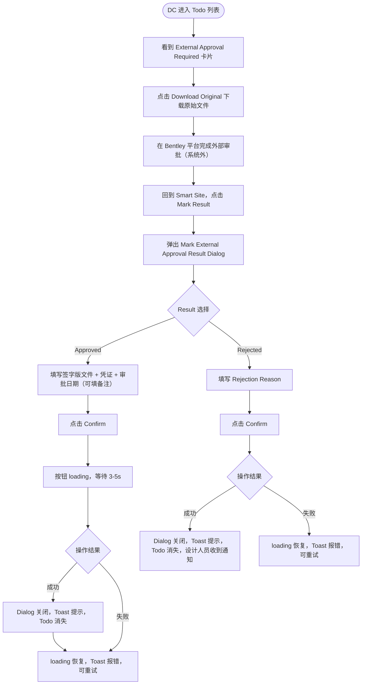

# 需求文档：PC 端 — DC 外部审批 Todo 与标记 Dialog

> **使用说明**：本文档是整个交付链路的**单一事实源**。所有下游文档（UI/前端/QA）从本文档派生。
> 外部审批业务规则、API 见 [REQ-007-shared.md §5.3 / §6.3](../shared/REQ-007-shared.md)。

---

## 1. 背景与目标

### 1.1 业务背景

内部审批通过后，图纸需进入外部审批阶段：Document Controller（DC）将原始图纸提交到 Bentley 平台，由业主代表/监理/设计院等外部方完成审批，再将带签字的正式图纸回传到 Smart Site。

当前痛点：DC 需要在 Smart Site 和 Bentley 之间手动查找文件，缺乏系统化追踪，且审批结果无法实时同步。

本功能在 PC Todo 列表中为 DC 提供完整的外部审批工作流：下载原始文件 → 提交 Bentley → 回传签字版 + 凭证 → 标记结果，**一次操作让版本同步生效**。

### 1.2 业务目标

让 DC 在 PC 端 Todo 列表中高效完成外部审批全流程，外部通过时一次性上传签字版图纸、审批凭证并标记结果，触发版本生效 + QR 生成，无需重复操作。

### 1.3 非目标（Out of Scope）

- Bentley 平台本身的审批操作（系统外行为）
- 内部审批 Todo（由 REQ-007A-pc 覆盖）
- 版本历史中的外部审批信息展示（由 REQ-007C-pc 覆盖）
- DC 人员配置（由 REQ-007D-pc 覆盖）

---

## 2. 用户与角色

### 2.1 角色定义

| 角色 ID | 角色名 | 描述 | 典型场景 |
|--------|-------|------|---------|
| ROLE-001 | Document Controller（DC） | 具备 `drawing:external-approval` 权限，且已在项目中配置为 DC | 从 Todo 下载原始文件提交 Bentley，外部审批完成后回传标记结果 |
| ROLE-002 | 设计人员（Designer） | 图纸上传人 | 收到外部驳回通知后重新上传新版本 |
| ROLE-003 | 项目管理员 | 图纸版本生效后负责分配 SE | 外部审批通过后，在图纸列表中点击 [Assign] 将图纸分配给对应 SE |
| ROLE-004 | Site Engineer（SE） | 被管理员分配后可见该图纸的现场工程师 | 管理员完成 SE 分配后收到站内通知，在 APP 端查看签字版图纸 |

### 2.2 用户故事（User Stories）

#### US-007B-001：DC 从 Todo 下载原始文件并提交外部审批

```
作为 Document Controller (DC)
我想要 在 Todo 列表中看到等待外部审批的图纸，并直接下载原始文件
以便 快速将图纸提交到 Bentley，无需在系统中来回查找
```

**优先级**：P1

#### US-007B-002：DC 外部审批完成后一次性标记结果并上传签字版

```
作为 Document Controller (DC)
我想要 外部审批完成后，在一个弹窗中一次性上传签字版图纸、审批凭证并标记结果
以便 一次操作完成所有工作，版本立即生效；SE 将在管理员完成 [Assign] 分配后收到通知
```

**优先级**：P1

---

## 3. 角色与权限矩阵

| 操作 | DC（已配置） | 内部审批人 | 设计人员 | Site Engineer |
|-----|:-----------:|:---------:|:-------:|:-------------:|
| 查看 External Approval Required Todo | ✅（项目 DC 均可见） | ❌ | ❌ | ❌ |
| 点击 [Download Original] | ✅ | ❌ | ❌ | ❌ |
| 点击 [Mark Result] 打开标记 Dialog | ✅ | ❌ | ❌ | ❌ |
| 标记外部审批通过（上传签字版 + 凭证） | ✅ | ❌ | ❌ | ❌ |
| 标记外部审批驳回 | ✅ | ❌ | ❌ | ❌ |

---

## 4. 核心实体与数据生命周期

### 4.1 实体清单

| 实体 ID | 实体名 | 描述 | 关键属性（业务语义） |
|--------|-------|------|------------------|
| ENT-001 | Todo 任务（外部审批） | DC 的待办事项 | 类型、图纸信息、原始文件下载链接 |
| ENT-002 | DrawingVersion | 图纸版本 | signedFileUrl、evidenceFileUrl、externalApprovalDate、approvalStatus |
| ENT-003 | DrawingApproval | 审批记录 | phase=EXTERNAL、status、comment |

### 4.2 实体关系

- 每个 DrawingVersion（状态为 `INTERNAL_APPROVED`）对应向项目所有配置 DC 各创建一条外部审批 Todo
- DC 标记结果后：生成一条 `DrawingApproval`（`phase = EXTERNAL`），DrawingVersion 状态更新，其余 DC 的 Todo 自动关闭

### 4.3 数据生命周期

**外部审批 Todo 生命周期**：
1. 创建：内部审批通过后，系统向项目所有已配置 DC 自动创建
2. 处理：任一 DC 点击 [Mark Result] 完成外部审批标记
3. 终态：
   - 外部通过 → Todo 关闭，版本生效，其余 DC 的同一 Todo 自动关闭；管理员后续通过 [Assign] 分配 SE 后 SE 收到通知
   - 外部驳回 → Todo 关闭，设计人员收到通知

---

## 5. 状态机

### 5.1 外部审批 Todo 状态

| 状态 ID | 状态名 | 描述 | 是否终态 |
|--------|-------|------|---------|
| S-001 | PENDING | 等待 DC 处理 | 否 |
| S-002 | APPROVED | 外部审批标记通过 | 是 || S-003 | REJECTED | 外部审批标记驳回 | 是 |
| S-004 | CLOSED_BY_OTHER | 其他 DC 已处理，自动关闭 | 是 |

### 5.2 状态转换表

| From | To | 触发动作 | 守卫条件 | 副作用 |
|------|-----|---------|---------|-------|
| — | S-001 | 内部审批通过 | 项目已配置 DC | 所有 DC 的 Todo 列表出现任务 |
| S-001 | S-002 | DC 标记外部通过 | 签字版文件、凭证、审批日期必填 | 版本生效、QR 生成；其余 DC Todo → S-004；管理员后续通过 [Assign] 分配 SE（见 REQ-003D-pc） |
| S-001 | S-003 | DC 标记外部驳回 | Comment 必填 | 通知设计人员；其余 DC Todo → S-004 |
| S-001 | S-004 | 其他 DC 先完成操作 | — | 自动关闭 |

### 5.3 非法转换

- 无 `drawing:external-approval` 权限或非项目配置 DC 的用户不能执行任何转换
- Todo 已关闭（S-002/S-003/S-004）后不可再操作

---

## 6. 业务流程

### 6.1 主流程（外部审批通过）

1. 内部审批通过后，DC 的 Todo 列表自动出现"External Approval Required"任务卡片
2. DC 点击 [📄 Download Original] 下载原始图纸文件
3. DC 将文件提交到 Bentley 平台（系统外操作，Smart Site 无感知）
4. 外部审批完成后，DC 回到 Smart Site，点击 [✅ Mark Result]
5. 弹出"Mark External Approval Result" Dialog
6. 选择 `Approved`，填写必填字段（签字版文件、审批凭证、外部审批日期）
7. 点击 [Confirm]，按钮进入 loading 态
8. 后端同步执行：上传文件 → 版本生效 → QR 生成（约 3–5 秒）
9. 成功：Dialog 关闭，Toast 提示版本已生效 + QR 已生成，Todo 消失

### 6.2 主流程图（Mermaid）



### 6.3 异常流程

| 异常场景 | 触发条件 | 系统响应 | 用户感知 |
|---------|---------|---------|---------|
| QR 生成失败 | 后端 QR 生成服务异常 | 整个操作回滚，版本不生效 | Toast 提示"QR generation failed, please retry"，loading 恢复，DC 当场重试 |
| 文件上传失败 | OSS 写入失败 | 操作回滚 | Toast 报错，Dialog 保留 |
| 未选择 Result | 直接点击 Confirm | 前端校验阻止 | 提示"请选择审批结果" |
| Approved 时必填项为空 | 签字版/凭证/日期任一为空 | 前端校验阻止 | 对应字段标红 |
| Rejected 时 Comment 为空 | Comment 为空 | 前端校验阻止 | 字段标红，提示必填 |

---

## 7. 功能需求详述

### 7.1 功能 F-001：外部审批 Todo 卡片

**关联用户故事**：US-007B-001
**所属流程节点**：流程 6.1 步骤 1–2

**卡片布局**：

```
┌──────────────────────────────────────────────────────────────────┐
│ 🌐 External Approval Required                                   │
│                                                                  │
│ ARCH-001  首层平面图  V3                                         │
│ Uploaded by: 张三（Designer）  |  2026-04-01 10:00               │
│ Internal approved by: 王总工  |  2026-04-02 14:30               │
│ Version Note: 修正轴网尺寸                                       │
│                                                                  │
│ [📄 Download Original]   [✅ Mark Result]                        │
└──────────────────────────────────────────────────────────────────┘
```

**字段说明**：

| 元素 | 内容 | 说明 |
|------|------|------|
| 图标 | 🌐 | 区分外部审批（🌐）与内部审批（🔍） |
| 标题 | `External Approval Required` | 固定文案 |
| 图纸信息 | `{drawingCode}  {drawingName}  {versionNo}` | 三项同行展示 |
| Uploaded by | `{designerName}（Designer）  \|  {uploadTime}` | 设计人员姓名 + 上传时间 |
| Internal approved by | `{approverName}  \|  {internalApprovedTime}` | 内部审批人 + 通过时间 |
| Version Note | 版本修改说明 | 选填，无则不显示该行 |
| [📄 Download Original] | 下载原始图纸文件（`fileUrl`），文件名为原始 `fileName` | DC 用此文件提交 Bentley |
| [✅ Mark Result] | 打开标记 Dialog（F-002） | 绿色主按钮 |

### 7.2 功能 F-002：Mark External Approval Result Dialog

**关联用户故事**：US-007B-002
**所属流程节点**：流程 6.1 步骤 5–9

**Dialog 布局**：

```
┌──────────────────────────────────────────────┐
│  Mark External Approval Result         [✕]   │
│  ARCH-001  首层平面图  V3                     │
├──────────────────────────────────────────────┤
│                                              │
│  Result *                                    │
│  ┌────────────────────────────────────────┐  │
│  │  ○ Approved                            │  │
│  │  ○ Rejected                            │  │
│  └────────────────────────────────────────┘  │
│                                              │
│  ─── 选择 Approved 后显示 ───                │
│                                              │
│  Signed Drawing File *                       │
│  ┌────────────────────────────────────────┐  │
│  │  📎 Click or drag to upload            │  │
│  │     PDF / DWG / DXF / PNG / JPG        │  │
│  │     Max 50MB                           │  │
│  └────────────────────────────────────────┘  │
│                                              │
│  Approval Evidence *                         │
│  ┌────────────────────────────────────────┐  │
│  │  📎 Click or drag to upload            │  │
│  │     PDF / PNG / JPG                    │  │
│  │     Max 20MB                           │  │
│  └────────────────────────────────────────┘  │
│                                              │
│  External Approval Date *                    │
│  ┌────────────────────────────────────────┐  │
│  │  📅 YYYY-MM-DD                         │  │
│  └────────────────────────────────────────┘  │
│                                              │
│  Remarks                                     │
│  ┌────────────────────────────────────────┐  │
│  │                                        │  │
│  └────────────────────────────────────────┘  │
│                                              │
│  ─── 选择 Rejected 后显示 ───               │
│                                              │
│  Rejection Reason *                          │
│  ┌────────────────────────────────────────┐  │
│  │                                        │  │
│  └────────────────────────────────────────┘  │
│                                              │
│           [Cancel]     [Confirm]             │
└──────────────────────────────────────────────┘
```

**字段说明**：

| 字段 | 类型 | 必填条件 | 约束 |
|------|------|---------|------|
| Result | Radio（Approved / Rejected） | ✅ | 默认不选中；未选中时 [Confirm] 禁用 |
| Signed Drawing File | 文件上传 | Approved 时 ✅ | ≤ 50MB；格式 PDF/DWG/DXF/PNG/JPG |
| Approval Evidence | 文件上传 | Approved 时 ✅ | ≤ 20MB；格式 PDF/PNG/JPG |
| External Approval Date | 日期选择器 | Approved 时 ✅ | 不可选未来日期 |
| Remarks | 文本域 | ❌ | 最多 500 字符 |
| Rejection Reason | 文本域 | Rejected 时 ✅ | 最多 500 字符 |

**Approved 交互规则**：
1. DC 选择 `Approved`，填写必填字段后点击 [Confirm]
2. [Confirm] 按钮进入 loading 态（文案变为"Processing..."），禁用 Dialog 内所有操作
3. 后端同步执行：文件上传 → 写入审批信息 → 版本生效 → QR 生成（约 3–5 秒）
4. **成功**：Dialog 关闭，Toast 提示 `"External approval marked. Drawing is now active and QR code has been generated."`，Todo 消失（包含其他 DC 的同一任务）
5. 版本生效后，**项目管理员**需在图纸列表中通过 [Assign] 操作将图纸分配给对应 SE，SE 收到站内通知后方可在 APP 端查看签字版图纸（见 [REQ-003D-pc](./REQ-003D-pc.md)）
5. **失败**：loading 恢复，Toast 显示错误文案（如 `"QR generation failed, please retry"`），DC 可修改后重试

**Rejected 交互规则**：
1. DC 选择 `Rejected`，填写 Rejection Reason 后点击 [Confirm]
2. 后端执行：版本状态 → `EXTERNAL_REJECTED`，通知设计人员
3. **成功**：Dialog 关闭，Toast 提示 `"External rejection recorded. Designer has been notified."`，Todo 消失
4. **失败**：loading 恢复，Toast 报错，可重试

---

## 8. 验收标准（Acceptance Criteria）

### AC-007B-001：Todo 卡片出现时机与内容

```
Given  内部审批人完成通过操作
When   项目已配置 DC 的用户进入 PC Todo 列表
Then   所有已配置 DC 均出现带 🌐 图标、标题为"External Approval Required"的卡片，
       包含图纸信息、上传人、内部审批人及通过时间
```

### AC-007B-002：下载原始文件

```
Given  DC 在 Todo 卡片看到外部审批任务
When   点击 [📄 Download Original]
Then   浏览器下载原始图纸文件（fileUrl），文件名与上传时的原始文件名一致
```

### AC-007B-003：外部审批通过 — 必填校验

```
Given  DC 在 Dialog 中选择 Approved
When   Signed Drawing File / Approval Evidence / External Approval Date 任一为空时点击 [Confirm]
Then   前端校验阻止提交，空字段标红并提示必填
```

### AC-007B-004：外部审批通过 — 成功路径

```
Given  DC 填写所有必填字段并点击 [Confirm]
When   操作成功（约 3-5 秒后）
Then   Dialog 关闭，Toast 提示"Drawing is now active and QR code has been generated"，
       Todo 卡片消失，图纸列表状态变为 ACTIVE；
       项目管理员需后续通过 [Assign] 操作将图纸分配给 SE，SE 收到通知后方可查看
```

### AC-007B-005：外部审批通过 — 管理员分配后 SE 收到通知

```
Given  外部审批通过，版本已生效（ACTIVE）
When   项目管理员在图纸列表点击 [Assign] 并保存 SE 分配（见 REQ-003D-pc）
Then   被新增分配的 SE 收到站内通知，可在 APP 端查看签字版图纸
```

### AC-007B-006：外部审批通过 — QR 生成失败回滚

```
Given  DC 点击 [Confirm] 后 QR 生成服务异常
When   操作失败
Then   版本状态不变（保持 PENDING_EXTERNAL），Dialog 内 loading 恢复，
       Toast 提示"QR generation failed, please retry"，DC 可当场重试
```

### AC-007B-007：外部审批驳回 — Comment 必填

```
Given  DC 在 Dialog 中选择 Rejected
When   Rejection Reason 为空时点击 [Confirm]
Then   前端校验阻止提交，字段标红并提示必填
```

### AC-007B-008：外部审批驳回 — 成功路径

```
Given  DC 填写驳回原因并点击 [Confirm]
When   操作成功
Then   Dialog 关闭，Toast 提示"Designer has been notified"，Todo 消失，
       设计人员收到站内消息（含驳回原因）
```

### AC-007B-009：一个 DC 操作完成后其他 DC 的 Todo 自动关闭

```
Given  项目配置了 DC-A 和 DC-B，两人的 Todo 列表均有同一外部审批任务
When   DC-A 完成外部审批标记（通过或驳回）
Then   DC-B 的 Todo 列表中该任务自动消失
```

### AC-007B-010：非项目 DC 无法调用外部审批接口

```
Given  用户未被配置为该项目的 DC
When   尝试调用 POST /drawing/external-approve
Then   接口返回 403，前端不展示 [Mark Result] 按钮
```

### AC-007B-011：Dialog loading 态防重复提交

```
Given  DC 点击 [Confirm] 后接口请求进行中
When   用户再次点击 [Confirm]
Then   按钮处于 loading 禁用态，不触发重复提交
```

---

## 9. 非功能需求

### 9.1 性能

| 指标 | 目标值 | 测量方式 |
|-----|-------|---------|
| 外部审批标记接口（含 QR 生成）响应 P95 | ≤ 8s | 后端监控 |
| 文件上传（50MB）完成 | ≤ 90s | 实测 |

### 9.2 安全

- 鉴权：JWT，需携带 `Authorization` / `X-Tenant-Id` / `Project-Id`
- 权限校验：后端校验 `drawing:external-approval` 权限 + 是否为项目配置 DC
- 审计：标记操作记录操作人、时间、上传文件信息

### 9.3 可访问性

- WCAG 等级：AA
- 键盘可达：Dialog 内所有字段支持 Tab 键导航

### 9.4 兼容性

- 浏览器：Chrome 100+、Edge 100+、Safari 15+
- 移动端：不支持（PC 专属）
- 国际化：中英双语

### 9.5 可观测性

- 关键埋点：下载原始文件、打开 Mark Result Dialog、标记通过、标记驳回、QR 生成失败
- 错误监控：外部审批接口失败率 > 5% 告警；QR 生成失败率 > 10% 告警

---

## 10. 数据量级与扩展性

| 维度 | 当前预期 | 1 年后 |
|-----|---------|-------|
| 单项目每月外部审批任务数 | ≤ 100 条 | ≤ 500 条 |
| 签字版文件平均大小 | 3–10MB | 不变 |

---

## 11. 依赖与外部系统

| 依赖系统 | 用途 | 集成方式 | Owner |
|---------|------|---------|-------|
| REQ-007-shared §5.3 / §6.3 | 外部审批业务规则与 API | 文档引用 | — |
| REQ-006-shared | QR 生成机制（叠加到签字版 PDF） | 内部事件 | 后端 |
| 对象存储（OSS） | 签字版文件、审批凭证存储 | 服务端预签名 URL 上传 | 后端 |
| REQ-003D-pc | SE 分配 | 版本生效后管理员通过 [Assign] 分配 SE，被分配 SE 收到通知后方可查看图纸 | 后端 |
| Bentley 平台 | 外部审批（系统外） | 无直接集成，人工流转 | DC |

---

## 12. 数据迁移

无（新增功能）

---

## 13. 上线操作清单

### 13.1 上线前

- [ ] `drawing:external-approval` 权限已绑定到 DC 角色
- [ ] DC 配置页面（REQ-007D-pc）已上线，项目已完成 DC 人员配置
- [ ] OSS Bucket 已配置签字版文件目录权限
- [ ] QR 生成服务已就绪（REQ-006-shared）

### 13.2 上线后

- [ ] 验证外部审批通过后版本状态变为 APPROVED
- [ ] 验证 QR 叠加到签字版 PDF 成功
- [ ] 验证管理员 [Assign] 分配 SE 后 SE 收到通知
- [ ] 验证其他 DC 的 Todo 自动关闭

---

## 14. 灰度与发布策略

- 灰度方式：按项目灰度
- 与 REQ-007A/C/D-pc 同步上线
- 回滚预案：关闭外部审批标记功能开关；已生效版本数据无需回滚

---

## 15. 成功指标（北极星）

| 指标 | 当前基线 | 目标 | 测量周期 |
|-----|---------|------|---------|
| 外部审批完成率（10 天内） | — | ≥ 85% | 每周 |
| 外部审批标记操作成功率 | — | ≥ 99% | 每周 |
| QR 生成成功率 | — | ≥ 99.5% | 每日 |

---

## 16. Open Questions

| OQ ID | 问题 | 影响 | Owner | 截止 |
|------|------|------|-------|------|
| OQ-001 | 外部审批超时（如 10 天未处理）是否需要催办通知？ | 通知机制 | PM | — |
| OQ-002 | DC 是否需要在 Dialog 中填写 Bentley 审批单号，便于与 Bentley 平台记录交叉核查？ | F-002 字段 | PM | — |

---

## 17. Figma / 原型链接

- Figma 设计稿：<!-- 填写 DC Todo 卡片 / Mark Result Dialog Frame 链接 -->
- 交互原型：

---

## 18. 变更历史

| 版本 | 日期 | 修改人 | 变更摘要 | 影响下游文档 |
|-----|------|-------|---------|------------|
| 0.1.1 | 2026-05-06 | agent | 全文修正"SE 自动推送"错误描述（共 6 处：§1.2/§2.2 US-007B-002/§4.3/§6.1 步骤8/§13.2），统一为"版本生效后管理员通过 [Assign] 分配 SE，SE 方收到通知"（依据 REQ-003D-pc） | — |
| 0.1.0 | 2026-05-05 | agent | 从 REQ-007-pc 按 US-007B-001/002 拆分初稿 | 全部 |

---

## 19. 备注

- 本文档从 REQ-007-pc.md §3（DC 外部审批 Todo）拆分而来
- QR 生成逻辑由后端在外部审批通过时同步执行，前端仅需处理 loading 状态和失败重试 UI
- 版本历史中外部审批信息的展示见 REQ-007C-pc
