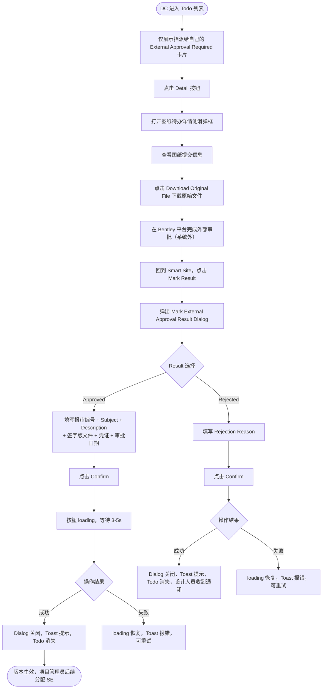

# 需求文档：PC 端 — DC 外部审批 Todo 与标记 Dialog

> **使用说明**：本文档是整个交付链路的**单一事实源**。所有下游文档（UI/前端/QA）从本文档派生。
> 外部审批业务规则、API 见 [REQ-007-shared.md §5.3 / §6.3](../shared/REQ-007-shared.md)。

---

## 1. 背景与目标

### 1.1 业务背景

内部审批通过后，图纸需进入外部审批阶段：Document Controller（DC）将原始图纸提交到 Bentley 平台，由业主代表/监理/设计院等外部方完成审批，再将带签字的正式图纸回传到 Smart Site。

当前痛点：DC 需要在 Smart Site 和 Bentley 之间手动查找文件，缺乏系统化追踪，且审批结果无法实时同步。

本功能在 PC Todo 列表中为 DC 提供完整的外部审批工作流：下载原始文件 → 提交 Bentley → 回传签字版 + 凭证 → 标记结果，**一次操作让版本同步生效**。

### 1.2 业务目标

让 DC 在 PC 端 Todo 列表中高效完成外部审批全流程，外部通过时一次性上传签字版图纸、审批凭证并标记结果，触发版本生效 + QR 生成，无需重复操作。

### 1.3 非目标（Out of Scope）

- Bentley 平台本身的审批操作（系统外行为）
- 内部审批 Todo（由 REQ-007A-pc 覆盖）
- 版本历史中的外部审批信息展示（由 REQ-007C-pc 覆盖）
- DC 人员配置（由 REQ-007D-pc 覆盖）

---

## 2. 用户与角色

### 2.1 角色定义

| 角色 ID | 角色名 | 描述 | 典型场景 |
|--------|-------|------|---------|
| ROLE-001 | Document Controller（DC） | 具备 `drawing:external-approval` 权限，且已在项目中配置为 DC | 从 Todo 下载原始文件提交 Bentley，外部审批完成后回传标记结果 |
| ROLE-002 | 设计人员（Designer） | 图纸上传人 | 收到外部驳回通知后重新上传新版本 |
| ROLE-003 | 项目管理员 | 图纸版本生效后负责分配 SE | 外部审批通过后，在图纸列表中点击 [Assign] 将图纸分配给对应 SE |
| ROLE-004 | Site Engineer（SE） | 被管理员分配后可见该图纸的现场工程师 | 管理员完成 SE 分配后收到站内通知，在 APP 端查看签字版图纸 |

### 2.2 用户故事（User Stories）

#### US-007B-001：DC 从 Todo 下载原始文件并提交外部审批

```
作为 Document Controller (DC)
我想要 在 Todo 列表中只看到指派给自己的图纸待办记录，并能打开详情查看图纸上传信息、下载原始文件
以便 快速定位属于自己的任务，并将图纸提交到 Bentley，无需在系统中来回查找
```

**优先级**：P1

#### US-007B-002：DC 外部审批完成后一次性标记结果并上传签字版

```
作为 Document Controller (DC)
我想要 外部审批完成后，在 Mark Result 弹窗中填写报审编号、Subject、Description，
        并一次性上传签字版图纸、审批凭证并标记审批结果
以便 一次操作完成所有工作，版本立即生效；报审信息完整留档便于与 Bentley 记录交叉核查
```

**优先级**：P1

---

## 3. 角色与权限矩阵

| 操作 | DC（已配置） | 内部审批人 | 设计人员 | Site Engineer |
|-----|:-----------:|:---------:|:-------:|:-------------:|
| 查看 External Approval Required Todo（仅自己名下） | ✅（后端按当前登录用户过滤） | ❌ | ❌ | ❌ |
| 打开图纸待办详情侧滑弹框 | ✅ | ❌ | ❌ | ❌ |
| 详情弹框内下载原始图纸文件 | ✅ | ❌ | ❌ | ❌ |
| 点击 [Mark Result] 打开标记 Dialog | ✅ | ❌ | ❌ | ❌ |
| 标记外部审批通过（填写报审信息 + 上传签字版 + 凭证） | ✅ | ❌ | ❌ | ❌ |
| 标记外部审批驳回 | ✅ | ❌ | ❌ | ❌ |

---

## 4. 核心实体与数据生命周期

### 4.1 实体清单

| 实体 ID | 实体名 | 描述 | 关键属性（业务语义） |
|--------|-------|------|------------------|
| ENT-001 | Todo 任务（外部审批） | DC 的待办事项 | 类型、图纸信息、指派 DC（assigneeId） |
| ENT-002 | DrawingVersion | 图纸版本 | signedFileUrl、evidenceFileUrl、externalApprovalDate、approvalStatus |
| ENT-003 | DrawingApproval | 审批记录 | phase=EXTERNAL、status、comment、submissionRefNo、submissionSubject、submissionDescription |
| ENT-004 | Drawing | 图纸主记录 | Drawing Code、Drawing Name、Category、Description |

### 4.2 实体关系

- 每个 DrawingVersion（状态为 `INTERNAL_APPROVED`）对应向项目所有配置 DC 各创建一条外部审批 Todo
- DC 标记结果后：生成一条 `DrawingApproval`（`phase = EXTERNAL`），DrawingVersion 状态更新，其余 DC 的 Todo 自动关闭

### 4.3 数据生命周期

**外部审批 Todo 生命周期**：
1. 创建：内部审批通过后，系统向项目所有已配置 DC **各自**创建一条独立的外部审批 Todo（`assigneeId` = 各 DC 用户 ID）
2. 处理：任一 DC 点击 [Mark Result] 完成外部审批标记
3. 终态：
   - 外部通过 → Todo 关闭，版本生效，其余 DC 的同一 Todo 自动关闭；管理员后续通过 [Assign] 分配 SE 后 SE 收到通知
   - 外部驳回 → Todo 关闭，设计人员收到通知

---

## 5. 状态机

### 5.1 外部审批 Todo 状态

| 状态 ID | 状态名 | 描述 | 是否终态 |
|--------|-------|------|---------|
| S-001 | PENDING | 等待 DC 处理 | 否 |
| S-002 | APPROVED | 外部审批标记通过 | 是 || S-003 | REJECTED | 外部审批标记驳回 | 是 |
| S-004 | CLOSED_BY_OTHER | 其他 DC 已处理，自动关闭 | 是 |

### 5.2 状态转换表

| From | To | 触发动作 | 守卫条件 | 副作用 |
|------|-----|---------|---------|-------|
| — | S-001 | 内部审批通过 | 项目已配置 DC | 所有 DC 的 Todo 列表出现任务 |
| S-001 | S-002 | DC 标记外部通过 | 签字版文件、凭证、审批日期必填 | 版本生效、QR 生成；其余 DC Todo → S-004；管理员后续通过 [Assign] 分配 SE（见 REQ-003D-pc） |
| S-001 | S-003 | DC 标记外部驳回 | Comment 必填 | 通知设计人员；其余 DC Todo → S-004 |
| S-001 | S-004 | 其他 DC 先完成操作 | — | 自动关闭 |

### 5.3 非法转换

- 无 `drawing:external-approval` 权限或非项目配置 DC 的用户不能执行任何转换
- Todo 已关闭（S-002/S-003/S-004）后不可再操作

---

## 6. 业务流程

### 6.1 主流程（外部审批通过）

1. 内部审批通过后，DC 的 Todo 列表自动出现"External Approval Required"任务卡片（**仅当前登录 DC 自己名下的**）
2. DC 点击卡片右侧 **[Detail]** 按钮，右侧弹出详情侧滑弹框
3. 详情弹框中 DC 查看图纸提交信息，点击 **[Download Original File]** 下载原始图纸文件
4. DC 将文件提交到 Bentley 平台（系统外操作，Smart Site 无感知）
5. 外部审批完成后，DC 回到 Smart Site，在详情弹框底部或 Todo 卡片上点击 **[Mark Result]**
6. 弹出"Mark External Approval Result" Dialog
7. 选择 `Approved`，填写**报审编号（Submission Ref No.）**、**报审 Subject**、**报审 Description**，以及签字版文件、审批凭证、外部审批日期（均必填）
8. 点击 [Confirm]，按钮进入 loading 态
9. 后端同步执行：上传文件 → 写入报审信息 → 版本生效 → QR 生成（约 3–5 秒）
10. 成功：Dialog 关闭，Toast 提示版本已生效 + QR 已生成，Todo 消失

### 6.2 主流程图（Mermaid）


```mermaid
flowchart TD
    A([DC 进入 Todo 列表]) --> B[仅展示指派给自己的 External Approval Required 卡片]
    B --> C[点击 Detail 按钮]
    C --> D[打开图纸待办详情侧滑弹框]
    D --> E[查看图纸提交信息]
    E --> F[点击 Download Original File 下载原始文件]
    F --> G[在 Bentley 平台完成外部审批（系统外）]
    G --> H[回到 Smart Site，点击 Mark Result]
    H --> I[弹出 Mark External Approval Result Dialog]
    I --> J{Result 选择}
    J -- Approved --> K[填写报审编号 + Subject + Description\n+ 签字版文件 + 凭证 + 审批日期]
    J -- Rejected --> L[填写 Rejection Reason]
    K --> M[点击 Confirm]
    L --> N[点击 Confirm]
    M --> O[按钮 loading，等待 3-5s]
    O --> P{操作结果}
    P -- 成功 --> Q[Dialog 关闭，Toast 提示，Todo 消失]
    Q --> R([版本生效，项目管理员后续分配 SE])
    P -- 失败 --> S[loading 恢复，Toast 报错，可重试]
    N --> T{操作结果}
    T -- 成功 --> U[Dialog 关闭，Toast 提示，Todo 消失，设计人员收到通知]
    T -- 失败 --> V[loading 恢复，Toast 报错，可重试]
```

### 6.3 异常流程

| 异常场景 | 触发条件 | 系统响应 | 用户感知 |
|---------|---------|---------|---------|
| 详情弹框加载失败 | 网络异常或接口超时 | 弹框内显示错误提示 + [Retry] | "Failed to load drawing details. [Retry]" |
| 原始文件下载失败 | fileUrl 过期或 CDN 不可达 | Toast 错误提示，按钮恢复可点击 | Toast: "Download failed. Please try again." |
| QR 生成失败 | 后端 QR 生成服务异常 | 整个操作回滚，版本不生效 | Toast 提示"QR generation failed, please retry"，loading 恢复，DC 当场重试 |
| 文件上传失败 | OSS 写入失败 | 操作回滚 | Toast 报错，Dialog 保留 |
| 未选择 Result | 直接点击 Confirm | 前端校验阻止 | 提示"请选择审批结果" |
| Approved 时报审信息必填项为空 | Submission Ref No. / Subject / Description 任一为空 | 前端校验阻止 | 对应字段标红并提示必填 |
| Approved 时文件或日期必填项为空 | 签字版/凭证/日期任一为空 | 前端校验阻止 | 对应字段标红 |
| Rejected 时 Comment 为空 | Comment 为空 | 前端校验阻止 | 字段标红，提示必填 |

---

## 7. 功能需求详述

### 7.1 功能 F-001：外部审批 Todo 卡片

**关联用户故事**：US-007B-001
**所属流程节点**：流程 6.1 步骤 1

**"仅我名下"过滤规则**：
- 后端仅返回 `assigneeId` 等于当前登录用户 ID 的外部审批 Todo 记录
- 前端无需额外过滤控件，"仅我名下"是默认且唯一的展示逻辑
- 若当前 DC 名下无任何 External Approval Required 待办，展示空状态："No pending tasks"

**卡片布局**：

```
┌──────────────────────────────────────────────────────────────────┐
│ 🌐 External Approval Required                                   │
│                                                                  │
│ ARCH-001  首层平面图  V3                                         │
│ Uploaded by: 张三（Designer）  |  2026-04-01 10:00               │
│ Internal approved by: 王总工  |  2026-04-02 14:30               │
│ Version Note: 修正轴网尺寸                                       │
│                                                                  │
│                            [Detail]   [✅ Mark Result]           │
└──────────────────────────────────────────────────────────────────┘
```

**字段说明**：

| 元素 | 内容 | 说明 |
|------|------|------|
| 图标 | 🌐 | 区分外部审批（🌐）与内部审批（🔍） |
| 标题 | `External Approval Required` | 固定文案 |
| 图纸信息 | `{drawingCode}  {drawingName}  {versionNo}` | 三项同行展示 |
| Uploaded by | `{designerName}（Designer）  \|  {uploadTime}` | 设计人员姓名 + 上传时间 |
| Internal approved by | `{approverName}  \|  {internalApprovedTime}` | 内部审批人 + 通过时间 |
| Version Note | 版本修改说明 | 选填，无则不显示该行 |
| [Detail] | 打开图纸待办详情侧滑弹框（F-002） | 次要样式按钮 |
| [✅ Mark Result] | 打开标记 Dialog（F-003） | 绿色主按钮 |

### 7.2 功能 F-002：图纸待办详情侧滑弹框（Detail Drawer）

**关联用户故事**：US-007B-001
**所属流程节点**：流程 6.1 步骤 2–3

**触发方式**：点击 Todo 卡片右侧 [Detail] 按钮，从页面右侧滑入弹框（Drawer 宽度建议 480px）。

**弹框头部**：

```
┌────────────────────────────────────────────────────────────┐
│  Drawing Approval Detail                              ×    │
│  External Approval Required                               │
└────────────────────────────────────────────────────────────┘
```

**弹框内容区 — 展示字段**（与上传时填写信息严格对应）：

> **设计决策**：Drawing Code 和 Drawing Name 已在 Todo 卡片摘要行中展示，一次提交记录中不单独包含这两项，详情弹框不重复展示，以减少冗余信息。

| 字段名（展示） | 数据来源 | 说明 |
|--------------|---------|------|
| Category | Drawing.category | 继承自图纸主记录，只读 |
| Description | Drawing.description | 无内容时显示 `—` |
| Version | DrawingVersion.versionNo | 例：V3 |
| Version Note | DrawingVersion.versionNote | 无内容时显示 `—` |
| Uploaded by | DrawingVersion.uploaderName | 显示姓名 + 角色标签，例：张三（Designer） |
| Upload Time | DrawingVersion.uploadTime | 格式：YYYY-MM-DD HH:mm，Tooltip 显示完整时间戳 |
| Internal Approver | DrawingVersion.approverName | 内部审批人姓名 |
| Internal Approved Time | DrawingApproval.approvedAt（phase=INTERNAL） | 内部审批通过时间 |
| Original File | DrawingVersion.fileUrl | 显示文件名 + 文件类型图标；文件名为可点击链接，点击后在浏览器新标签页 inline 打开；文件名下方展示下载引导提示 |

**布局示意**：

```
┌────────────────────────────────────────────────────────────┐
│  Drawing Approval Detail                              ×    │
│  External Approval Required                               │
├────────────────────────────────────────────────────────────┤
│                                                            │
│  Category            Architecture                         │
│  Description         包含外墙及核心筒轮廓线                 │
│                                                            │
│  Version             V3                                   │
│  Version Note        修正轴网尺寸，更新柱位标注              │
│                                                            │
│  Uploaded by         张三（Designer）                      │
│  Upload Time         2026-04-01 10:00                     │
│  Internal Approver   王总工                               │
│  Internal Approved   2026-04-02 14:30                     │
│                                                            │
│  Original File       📄 ARCH-001-V3-plan.pdf  ↗           │
│                      Click to open in browser.            │
│                      To save the file, use                │
│                      [Download Original File] below.      │
│                                                            │
├────────────────────────────────────────────────────────────┤
│  [Download Original File]          [✅ Mark Result]        │
└────────────────────────────────────────────────────────────┘
```

**交互规则**：
- 弹框打开时展示加载态（Skeleton），加载完成后渲染字段
- 点击 `×` 或按 `Esc` 关闭弹框，审批状态不变
- 弹框打开期间，背景列表不可操作（半透明遮罩）
- 所有字段均为**只读**，不提供编辑入口
- **文件名链接**：点击后以 `target="_blank"` 在浏览器新标签页中打开（`Content-Disposition: inline`）；文件名下方展示灰色辅助提示文案："Click to open in browser. To save the file, use [Download Original File] below."
- **[Download Original File] 按钮**：点击触发浏览器强制下载（`Content-Disposition: attachment`），文件命名格式：`{drawingCode}-V{versionNo}-original.{ext}`；下载期间按钮 loading 防重复；`fileUrl` 为空时按钮置灰，Tooltip 提示 "Original file unavailable."
- **[Mark Result] 按钮**：点击打开 F-003 Dialog，弹框保留在背景

**下载接口**（后端实现参考）：
```
# Inline 在浏览器打开
GET /drawing/version/{versionId}/view
Response: 302 → 预签名 URL（Content-Disposition: inline，有效期 5 分钟）

# 强制下载到本地
GET /drawing/version/{versionId}/download
Response: 302 → 预签名 URL（Content-Disposition: attachment，有效期 5 分钟）
```
> 两个接口均须校验请求用户为该项目已配置 DC，否则返回 403。

### 7.3 功能 F-003：Mark External Approval Result Dialog

**关联用户故事**：US-007B-002
**所属流程节点**：流程 6.1 步骤 5–10

**Dialog 布局**：

```
┌──────────────────────────────────────────────┐
│  Mark External Approval Result         [✕]   │
│  ARCH-001  首层平面图  V3                     │
├──────────────────────────────────────────────┤
│                                              │
│  Status of Approval *                        │
│  ┌────────────────────────────────────────┐  │
│  │  Please select ▾                       │  │
│  └────────────────────────────────────────┘  │
│  A – Approved / No Exception Taken           │
│  B – Approved with comment,                  │
│      resubmission required                   │
│  C – Revise And Resubmit                     │
│  D – For Record Purpose                      │
│  E – Others (please state reason)            │
│                                              │
│  ─── 选择 E 后显示 ───────────────────────── │
│  Others Reason *                             │
│  ┌────────────────────────────────────────┐  │
│  │                                        │  │
│  └────────────────────────────────────────┘  │
│  最多 500 字符                               │
│                                              │
│  ──────────────────────────────────────────  │
│                                              │
│  Submission Ref No. *                        │
│  ┌────────────────────────────────────────┐  │
│  │  请填写报审编号（如 Bentley 审批单号）   │  │
│  └────────────────────────────────────────┘  │
│                                              │
│  Submission Subject *                        │
│  ┌────────────────────────────────────────┐  │
│  │  请填写报审主题                         │  │
│  └────────────────────────────────────────┘  │
│                                              │
│  Submission Description *                    │
│  ┌────────────────────────────────────────┐  │
│  │                                        │  │
│  │  请填写报审说明                         │  │
│  └────────────────────────────────────────┘  │
│  最多 1000 字符                              │
│                                              │
│  ─── Status A / B / D 时显示 ─────────────── │
│                                              │
│  Signed Drawing File *                       │
│  ┌────────────────────────────────────────┐  │
│  │  📎 Click or drag to upload            │  │
│  │     PDF / DWG / DXF / PNG / JPG        │  │
│  │     Max 50MB                           │  │
│  └────────────────────────────────────────┘  │
│                                              │
│  Approval Evidence *                         │
│  ┌────────────────────────────────────────┐  │
│  │  📎 Click or drag to upload            │  │
│  │     PDF / PNG / JPG · Max 20MB         │  │
│  └────────────────────────────────────────┘  │
│                                              │
│  External Approval Date *                    │
│  ┌────────────────────────────────────────┐  │
│  │  📅 YYYY-MM-DD                         │  │
│  └────────────────────────────────────────┘  │
│                                              │
│  ──────────────────────────────────────────  │
│                                              │
│  Remarks                                     │
│  ┌────────────────────────────────────────┐  │
│  │                                        │  │
│  └────────────────────────────────────────┘  │
│  最多 500 字符                               │
│                                              │
│           [Cancel]     [Confirm]             │
└──────────────────────────────────────────────┘
```

**字段说明**：

> **设计决策**：DC 不再区分 Approved / Rejected 二选一，而是直接选择与实际报审表一致的 Status of Approval（A–E），与纸质表单保持一致，便于日后核查。报审三要素（Ref No.、Subject、Description）**始终必填**，与审批结果无关。

| 字段 | 类型 | 必填条件 | 约束 |
|------|------|---------|------|
| Status of Approval | 下拉单选（A / B / C / D / E） | ✅ 始终 | 默认 "Please select"；未选中时 [Confirm] 禁用 |
| Others Reason | 文本域 | Status = E 时 ✅ | 最多 500 字符；仅 E 时显示 |
| Submission Ref No. | 文本输入 | ✅ 始终 | 最多 200 字符；记录 Bentley 审批单号等外部参考编号 |
| Submission Subject | 文本输入 | ✅ 始终 | 最多 200 字符 |
| Submission Description | 文本域 | ✅ 始终 | 最多 1000 字符 |
| Signed Drawing File | 文件上传 | Status A / B / D 时 ✅ | ≤ 50MB；格式 PDF / DWG / DXF / PNG / JPG |
| Approval Evidence | 文件上传 | Status A / B / D 时 ✅ | ≤ 20MB；格式 PDF / PNG / JPG |
| External Approval Date | 日期选择器 | Status A / B / D 时 ✅ | 不可选未来日期 |
| Remarks | 文本域 | ❌ | 最多 500 字符 |

**Status 分组逻辑**：

| 分组 | Status | 说明 | 额外必填 |
|------|--------|------|---------|
| 通过并上传文件 | A、B、D | 图纸已被审批方接受（含附条件），需上传签字版 | Signed Drawing File、Approval Evidence、External Approval Date |
| 退回修改 | C | 需设计人员修改后再提交，无需签字版文件 | 无 |
| 其他 | E | 需说明具体原因 | Others Reason |

**交互规则**：
1. DC 从下拉中选择 Status（A–E），按照分组显示或隐藏对应的附加字段
2. 所有必填字段填写完毕后 [Confirm] 方可点击；否则点击时前端校验阻止提交，空字段标红
3. [Confirm] 点击后进入 loading 态（文案变为 "Processing..."），禁用 Dialog 内所有操作
4. **Status A / B / D — 成功**：后端同步执行文件上传 → 写入报审信息 + 审批记录 → 版本生效 → QR 生成（约 3–5 秒）；Dialog 关闭，Toast 提示 `"External approval marked. Drawing is now active and QR code has been generated."`，Todo 消失（包含其他 DC 的同一任务）
5. **Status C — 成功**：版本状态 → `EXTERNAL_REJECTED`，通知设计人员；Dialog 关闭，Toast 提示 `"External rejection recorded. Designer has been notified."`，Todo 消失
6. **Status E — 成功**：同 Status C 路径，通知内容包含 Others Reason 文本
7. **失败（任意 Status）**：loading 恢复，Toast 显示错误文案（如 `"Operation failed, please retry"`），DC 可修改后重试
8. 版本因 Status A/B/D 而生效后，**项目管理员**需在图纸列表通过 [Assign] 将图纸分配给 SE（见 [REQ-003D-pc](./REQ-003D-pc.md)）

---

## 8. 验收标准（Acceptance Criteria）

### AC-007B-001：Todo 列表仅展示当前 DC 自己名下的待办

```
Given  项目配置了 DC-A 和 DC-B，内部审批通过后两人各自收到一条外部审批 Todo
When   DC-A 进入 PC Todo 列表
Then   列表中仅显示指派给 DC-A 的外部审批任务，不显示 DC-B 的任务
```

### AC-007B-002：点击 Detail 打开详情侧滑弹框

```
Given  DC-A 在 Todo 列表中看到一条 External Approval Required 记录
When   点击该记录右侧的 [Detail] 按钮
Then   右侧滑出详情侧滑弹框，弹框头部显示 "Drawing Approval Detail" 及 "External Approval Required" 标签
```

### AC-007B-003：详情弹框展示完整图纸提交信息

```
Given  设计人员上传图纸时填写了 Category、Description、Version Note，
       并经内部审批人审批通过
When   DC 打开该图纸的待办详情弹框
Then   弹框中展示以上所有字段值，以及 Version、Uploaded by、Upload Time、
       Internal Approver、Internal Approved Time，且与原始提交信息一致；
       弹框中不显示 Drawing Code 和 Drawing Name 字段
```

### AC-007B-004：详情弹框内成功下载原始文件

```
Given  DC 在图纸待办详情弹框中，原始文件存在（fileUrl 非空）
When   点击 [Download Original File] 按钮
Then   浏览器触发文件下载，文件命名为 "{drawingCode}-V{versionNo}-original.{ext}"，
       内容与设计人员上传的原始文件一致
```

### AC-007B-005：非项目 DC 无法下载原始文件

```
Given  用户未被配置为该项目的 DC
When   尝试调用 GET /drawing/version/{versionId}/download
Then   接口返回 403，文件不下载
```

### AC-007B-006：报审三要素始终必填

```
Given  DC 打开 Mark Result Dialog，已选择任意 Status（A/B/C/D/E）
When   Submission Ref No. / Submission Subject / Submission Description 任一为空时点击 [Confirm]
Then   前端校验阻止提交，空字段标红并提示必填
```

### AC-007B-007：Status A / B / D — 文件与日期必填

```
Given  DC 在 Dialog 中选择 Status A、B 或 D，已填写报审三要素
When   Signed Drawing File / Approval Evidence / External Approval Date 任一为空时点击 [Confirm]
Then   前端校验阻止提交，空字段标红并提示必填
```

### AC-007B-007B：Status E — Others Reason 必填

```
Given  DC 在 Dialog 中选择 Status E
When   Others Reason 为空时点击 [Confirm]
Then   前端校验阻止提交，Others Reason 字段标红并提示必填
```

### AC-007B-008：Status A / B / D — 成功路径（含报审信息落库）

```
Given  DC 选择 Status A/B/D，填写 Submission Ref No.、Subject、Description
       及所有文件与日期字段后点击 [Confirm]
When   操作成功（约 3-5 秒后）
Then   Dialog 关闭，Toast 提示"Drawing is now active and QR code has been generated"，
       Todo 卡片消失，图纸列表状态变为 ACTIVE；
       DrawingApproval 记录包含 statusOfApproval、submissionRefNo、
       submissionSubject、submissionDescription；
       项目管理员需后续通过 [Assign] 操作将图纸分配给 SE
```

### AC-007B-009：外部审批通过 — 管理员分配后 SE 收到通知

```
Given  外部审批通过，版本已生效（ACTIVE）
When   项目管理员在图纸列表点击 [Assign] 并保存 SE 分配（见 REQ-003D-pc）
Then   被新增分配的 SE 收到站内通知，可在 APP 端查看签字版图纸
```

### AC-007B-010：外部审批通过 — QR 生成失败回滚

```
Given  DC 点击 [Confirm] 后 QR 生成服务异常
When   操作失败
Then   版本状态不变（保持 PENDING_EXTERNAL），Dialog 内 loading 恢复，
       Toast 提示"QR generation failed, please retry"，DC 可当场重试
```

### AC-007B-011：Status C — 退回必填校验

```
Given  DC 在 Dialog 中选择 Status C（Revise And Resubmit）
When   Submission Ref No. / Submission Subject / Submission Description 任一为空时点击 [Confirm]
Then   前端校验阻止提交，空字段标红并提示必填
```

### AC-007B-012：Status C — 成功路径

```
Given  DC 选择 Status C，填写报审三要素后点击 [Confirm]
When   操作成功
Then   Dialog 关闭，Toast 提示"External rejection recorded. Designer has been notified."，
       Todo 消失，设计人员收到站内消息
```

### AC-007B-013：一个 DC 操作完成后其他 DC 的 Todo 自动关闭

```
Given  项目配置了 DC-A 和 DC-B，两人的 Todo 列表均有同一外部审批任务
When   DC-A 完成外部审批标记（通过或驳回）
Then   DC-B 的 Todo 列表中该任务自动消失
```

### AC-007B-014：非项目 DC 无法调用外部审批接口

```
Given  用户未被配置为该项目的 DC
When   尝试调用 POST /drawing/external-approve
Then   接口返回 403，前端不展示 [Mark Result] 按钮
```

### AC-007B-015：Dialog loading 态防重复提交

```
Given  DC 点击 [Confirm] 后接口请求进行中
When   用户再次点击 [Confirm]
Then   按钮处于 loading 禁用态，不触发重复提交
```

---

## 9. 非功能需求

### 9.1 性能

| 指标 | 目标值 | 测量方式 |
|-----|-------|---------|
| 外部审批标记接口（含 QR 生成）响应 P95 | ≤ 8s | 后端监控 |
| 文件上传（50MB）完成 | ≤ 90s | 实测 |

### 9.2 安全

- 鉴权：JWT，需携带 `Authorization` / `X-Tenant-Id` / `Project-Id`
- 权限校验：后端校验 `drawing:external-approval` 权限 + 是否为项目配置 DC
- 审计：标记操作记录操作人、时间、上传文件信息

### 9.3 可访问性

- WCAG 等级：AA
- 键盘可达：Dialog 内所有字段支持 Tab 键导航

### 9.4 兼容性

- 浏览器：Chrome 100+、Edge 100+、Safari 15+
- 移动端：不支持（PC 专属）
- 国际化：中英双语

### 9.5 可观测性

- 关键埋点：下载原始文件、打开 Mark Result Dialog、标记通过、标记驳回、QR 生成失败
- 错误监控：外部审批接口失败率 > 5% 告警；QR 生成失败率 > 10% 告警

---

## 10. 数据量级与扩展性

| 维度 | 当前预期 | 1 年后 |
|-----|---------|-------|
| 单项目每月外部审批任务数 | ≤ 100 条 | ≤ 500 条 |
| 签字版文件平均大小 | 3–10MB | 不变 |

---

## 11. 依赖与外部系统

| 依赖系统 | 用途 | 集成方式 | Owner |
|---------|------|---------|-------|
| REQ-007-shared §5.3 / §6.3 | 外部审批业务规则与 API | 文档引用 | — |
| REQ-006-shared | QR 生成机制（叠加到签字版 PDF） | 内部事件 | 后端 |
| 对象存储（OSS） | 签字版文件、审批凭证存储 | 服务端预签名 URL 上传 | 后端 |
| REQ-003D-pc | SE 分配 | 版本生效后管理员通过 [Assign] 分配 SE，被分配 SE 收到通知后方可查看图纸 | 后端 |
| Bentley 平台 | 外部审批（系统外） | 无直接集成，人工流转 | DC |

---

## 12. 数据迁移

无（新增功能）

---

## 13. 上线操作清单

### 13.1 上线前

- [ ] `drawing:external-approval` 权限已绑定到 DC 角色
- [ ] DC 配置页面（REQ-007D-pc）已上线，项目已完成 DC 人员配置
- [ ] OSS Bucket 已配置签字版文件目录权限
- [ ] QR 生成服务已就绪（REQ-006-shared）

### 13.2 上线后

- [ ] 验证外部审批通过后版本状态变为 APPROVED
- [ ] 验证 QR 叠加到签字版 PDF 成功
- [ ] 验证管理员 [Assign] 分配 SE 后 SE 收到通知
- [ ] 验证其他 DC 的 Todo 自动关闭

---

## 14. 灰度与发布策略

- 灰度方式：按项目灰度
- 与 REQ-007A/C/D-pc 同步上线
- 回滚预案：关闭外部审批标记功能开关；已生效版本数据无需回滚

---

## 15. 成功指标（北极星）

| 指标 | 当前基线 | 目标 | 测量周期 |
|-----|---------|------|---------|
| 外部审批完成率（10 天内） | — | ≥ 85% | 每周 |
| 外部审批标记操作成功率 | — | ≥ 99% | 每周 |
| QR 生成成功率 | — | ≥ 99.5% | 每日 |

---

## 16. Open Questions

| OQ ID | 问题 | 影响 | Owner | 截止 |
|------|------|------|-------|------|
| OQ-001 | 外部审批超时（如 10 天未处理）是否需要催办通知？ | 通知机制 | PM | — |
| OQ-002 | ~~DC 是否需要在 Dialog 中填写 Bentley 审批单号~~ **已解决**：0.2.0 新增 Submission Ref No.、Subject、Description 三个字段，完整记录报审信息 | — | — | 2026-05-23 |
| OQ-003 | 详情弹框中是否需要同时提供文件名 inline 打开链接（区别于下载按钮）？ | 影响 UI 交互复杂度；inline 打开需依赖 /view 接口 | PM | — |

---

## 17. Figma / 原型链接

- Figma 设计稿：<!-- 填写 DC Todo 卡片 / Mark Result Dialog Frame 链接 -->
- 交互原型：

---

## 18. 变更历史

| 版本 | 日期 | 修改人 | 变更摘要 | 影响下游文档 |
|-----|------|-------|---------|------------|
| 0.1.1 | 2026-05-06 | agent | 全文修正"SE 自动推送"错误描述（共 6 处：§1.2/§2.2 US-007B-002/§4.3/§6.1 步骤8/§13.2），统一为"版本生效后管理员通过 [Assign] 分配 SE，SE 方收到通知"（依据 REQ-003D-pc） | — |
| 0.1.0 | 2026-05-05 | agent | 从 REQ-007-pc 按 US-007B-001/002 拆分初稿 | 全部 |
| 0.2.2 | 2026-05-23 | | F-003 Mark Result Dialog 重构审批结果录入方式：1）将 Approved/Rejected Radio 替换为 Status of Approval 下拉（A–E 五档，与纸质报审表一致）；2）Submission Ref No.、Subject、Description 由"Approved 时必填"改为**始终必填**；3）新增 Others Reason 字段（Status E 时必填）；4）Signed Drawing File、Approval Evidence、External Approval Date 调整为 Status A/B/D 时必填；5）移除 Rejection Reason 字段；6）AC-007B-006/007/008/011/012 同步更新，新增 AC-007B-007B | UI、Frontend、Backend、QA |
| 0.2.1 | 2026-05-23 | | F-002 详情弹框移除 Drawing Code 和 Drawing Name 字段，一次提交记录中不包含这两项，已由 Todo 卡片摘要行覆盖；同步更新字段表、布局示意及 AC-007B-003 | UI、Frontend、QA |
| 0.2.0 | 2026-05-23 | | 1）Todo 列表改为仅展示当前 DC 自己名下的待办（后端 assigneeId 过滤）；2）新增 F-002 图纸待办详情侧滑弹框，展示图纸全量提交信息并支持原始文件下载（inline 打开 + 强制下载）；3）F-003（原 F-002）Mark Result Dialog 新增三个 Approved 必填字段：Submission Ref No.、Submission Subject、Submission Description；4）AC 重新编号并补充新增场景（AC-007B-001 ~ AC-007B-015）；5）关闭 OQ-002 | UI、Frontend、Backend、QA |

---

## 19. 备注

- 本文档从 REQ-007-pc.md §3（DC 外部审批 Todo）拆分而来
- QR 生成逻辑由后端在外部审批通过时同步执行，前端仅需处理 loading 状态和失败重试 UI
- 版本历史中外部审批信息的展示见 REQ-007C-pc
