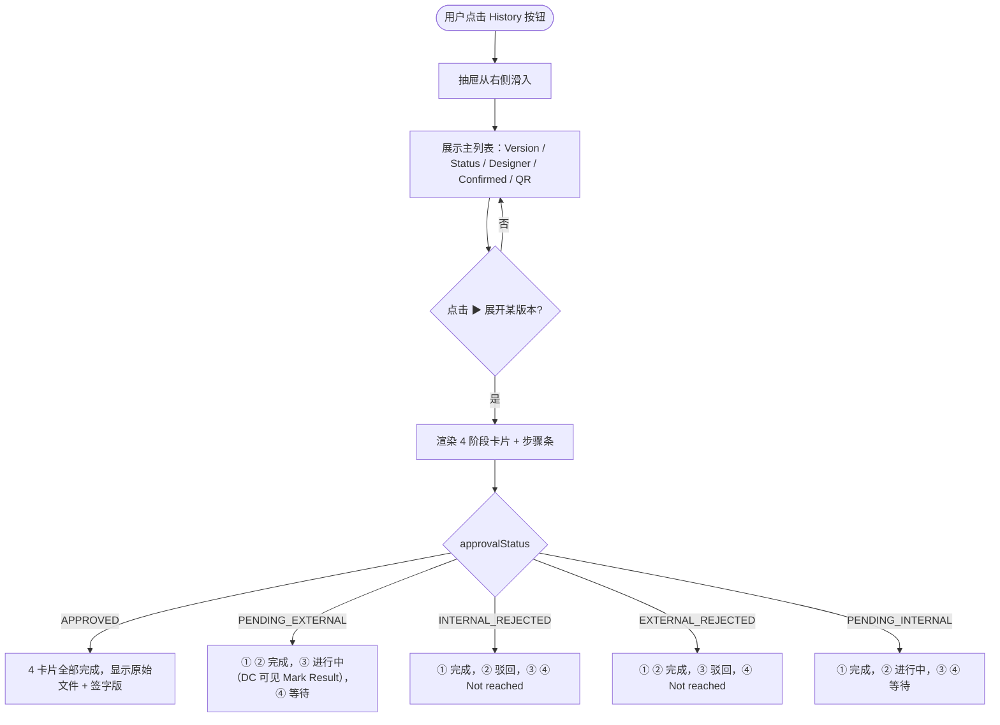

# 需求文档：PC 端 — 版本历史抽屉 4 阶段生命周期视图

> **使用说明**：本文档是整个交付链路的**单一事实源**。所有下游文档（UI/前端/QA）从本文档派生。
> 审批业务规则见 [REQ-007-shared.md](../shared/REQ-007-shared.md)。

---

## 1. 背景与目标

### 1.1 业务背景

REQ-003-pc 定义了图纸的版本历史抽屉，展示各版本的基本状态。升级为两级审批后，每个版本经历**上传 → 内部审批 → 外部审批 → 签字版**四个阶段，原有的简单列表无法直观展示版本在每个阶段的状态、责任人和具体文件。

管理员和 Drawing 团队需要在版本历史中看到完整的流转记录，以便责任追溯和流程监控。

### 1.2 业务目标

将版本历史抽屉升级为**可展开的 4 阶段生命周期视图**，让管理人员一眼看清每个版本在各审批阶段的完整情况，并在适当时机向 DC 提供操作入口（[Mark Result]）。

### 1.3 非目标（Out of Scope）

- 审批操作本身（通过 [Mark Result] 入口进入，逻辑由 REQ-007B-pc 定义）
- 图纸列表页的状态标签（由 REQ-003A-pc 定义）
- QR 查看/下载功能（由 REQ-006 定义，复用现有逻辑）
- APP 端版本历史（APP 不展示 4 阶段视图）

---

## 2. 用户与角色

### 2.1 角色定义

| 角色 ID | 角色名 | 描述 | 典型场景 |
|--------|-------|------|---------|
| ROLE-001 | 项目管理人员 / Drawing 团队 / 管理员 | 可查看完整版本历史 | 追溯图纸在各阶段的流转状态和责任人 |
| ROLE-002 | Document Controller（DC） | 在版本历史中也可执行外部审批标记 | 通过 ③ 外部审批卡片的 [Mark Result] 按钮操作 |
| ROLE-003 | Site Engineer | 仅查看已生效版本 | 查看图纸，不访问版本历史 |

### 2.2 用户故事（User Stories）

#### US-007C-001：在版本历史中查看 4 阶段生命周期

```
作为 项目管理人员
我想要 在版本历史中看到每个版本的完整审批生命周期（上传 → 内部审批 → 外部审批 → 签字版）
以便 清晰了解图纸在各阶段的流转状态和责任人，支持追溯与监控
```

**优先级**：P1
**所属史诗**：图纸两级审批流程

---

## 3. 角色与权限矩阵

| 操作 | 管理员/Drawing 团队 | DC（已配置） | 内部审批人 | 设计人员 | Site Engineer |
|-----|:------------------:|:-----------:|:---------:|:-------:|:-------------:|
| 打开版本历史抽屉 | ✅ | ✅ | ✅ | ✅ | ❌ |
| 展开版本查看 4 阶段卡片 | ✅ | ✅ | ✅ | ✅ | ❌ |
| ① 卡片 [Preview] / [Download]（原始文件） | ✅ | ✅ | ✅ | ✅ | ❌ |
| ③ 卡片 [Mark Result]（外部审批标记） | ❌ | ✅（仅 `PENDING_EXTERNAL` 版本） | ❌ | ❌ | ❌ |
| ③ 卡片 [Download]（审批凭证） | ✅ | ✅ | ✅ | ✅ | ❌ |
| ④ 卡片 [Preview] / [Download]（签字版） | ✅ | ✅ | ✅ | ✅ | ❌ |
| QR 列 [View] | ✅ | ✅ | ✅ | ✅ | ❌ |
| Attachments 列 — 点击打开附件弹框（查看列表） | ✅ | ✅ | ✅ | ✅ | ❌ |
| Attachments 弹框 — [Download]（下载附件） | ✅ | ✅ | ✅ | ✅ | ❌ |
| Attachments 弹框 — [Upload] / [Delete]（上传/删除附件） | ❌ | ❌ | ❌ | ✅（仅本版本上传人） | ❌ |

---

## 4. 核心实体与数据生命周期

### 4.1 实体清单

| 实体 ID | 实体名 | 描述 | 关键属性（业务语义） |
|--------|-------|------|------------------|
| ENT-001 | DrawingVersion | 图纸版本 | approvalStatus、fileUrl、signedFileUrl、evidenceFileUrl、qrImageUrl、pdfWithQrUrl、**attachments[]** |
| ENT-002 | DrawingApproval | 审批记录 | phase（INTERNAL/EXTERNAL）、status、comment、操作人、时间 |

### 4.2 实体关系

- 一个 DrawingVersion 最多有 2 条 DrawingApproval 记录（phase=INTERNAL、phase=EXTERNAL）
- ④ 签字版仅在 `approvalStatus = APPROVED` 时存在（`signedFileUrl` 非空）

---

## 5. 状态机

本文档不新增状态机，仅**展示** DrawingVersion 状态机（定义见 REQ-007-shared §4.4），用于驱动 4 阶段卡片的展示逻辑。

| DrawingVersion.approvalStatus | ① 上传 | ② 内部审批 | ③ 外部审批 | ④ 签字版 |
|------------------------------|:------:|:----------:|:---------:|:-------:|
| `PENDING_INTERNAL` | ✓ 完成 | ⏳ 进行中 | — 等待 | — 等待 |
| `INTERNAL_APPROVED` | ✓ 完成 | ✓ 完成 | ⏳ 进行中 | — 等待 |
| `INTERNAL_REJECTED` | ✓ 完成 | ✕ 驳回 | — 未到达 | — 未到达 |
| `APPROVED` | ✓ 完成 | ✓ 完成 | ✓ 完成 | ✓ 完成 |
| `EXTERNAL_REJECTED` | ✓ 完成 | ✓ 完成 | ✕ 驳回 | — 未到达 |

---

## 6. 业务流程

### 6.1 主流程（查看版本历史）

1. 用户在图纸列表页点击某行的 [History] 按钮
2. 从右侧滑入版本历史抽屉（宽度 720px）
3. 抽屉显示主列表：Version、Status、Designer、Confirmed、QR 列
4. 点击版本行左侧 ▶ 箭头展开，显示 4 阶段卡片 + 底部步骤条
5. 根据 `approvalStatus` 渲染各卡片的状态
6. DC 用户在 ③ 卡片中可点击 [Mark Result]（`PENDING_EXTERNAL` 状态时）

### 6.2 主流程图（Mermaid）



### 6.3 异常流程

| 异常场景 | 触发条件 | 系统响应 | 用户感知 |
|---------|---------|---------|---------|
| 版本历史加载失败 | 网络异常 | 抽屉内显示错误状态 | 提示"加载失败，请刷新重试" |
| 文件 URL 失效 | OSS 文件过期 | 点击 Preview/Download 404 | 提示文件不可用 |

---

## 7. 功能需求详述

### 7.1 功能 F-001：版本历史抽屉主列表

**关联用户故事**：US-007C-001
**所属流程节点**：流程 6.1 步骤 1–3

- 抽屉宽度：**720px**（比原版本宽，以容纳 4 阶段卡片）
- 标题：`Version History — {drawingCode} {drawingName}`
- 默认展示主列表，各版本均可展开

**列定义**：

| 列 | 内容 | 说明 |
|----|------|------|
| Version | 版本号（V1、V2、V3），左侧有 ▶ 展开箭头 | 点击展开/折叠 4 阶段卡片 |
| Status | 状态标签（5 种，颜色见 §7.2） | — |
| Designer | 设计人员（上传人）姓名 | — |
| Confirmed | 已确认/总人数，如 `5/12` | 仅 `APPROVED` 状态显示；其他状态显示 `—` |
| QR | `[View]` 链接 | 仅 `APPROVED` 且 QR 已生成时显示；其他显示 `—` |
| Attachments | 附件数量，如 `📎 2`；无附件显示 `📎 0` | **点击该单元格**打开附件二级弹框（F-006），与版本行展开/折叠无关 |

**主列表示意**：

```
┌──────────────────────────────────────────────────────────────────────────────────┐
│  Version History — ARCH-001 首层平面图                                      [✕]  │
├──────────────────────────────────────────────────────────────────────────────────┤
│                                                                                  │
│  Version  │ Status              │ Designer  │ Confirmed │ QR      │ Attachments  │
│───────────│─────────────────────│───────────│───────────│─────────│──────────────│
│  ▶ V3     │ ✅ Approved         │ 张三      │ 5/12      │ [View]  │ 📎 3         │
│  ▶ V2     │ ⏳ Pending External │ 李四      │ —         │ —       │ 📎 1         │
│  ▶ V1     │ ❌ Int. Rejected    │ 张三      │ —         │ —       │ 📎 0         │
│                                                                                  │
└──────────────────────────────────────────────────────────────────────────────────┘
```

### 7.2 功能 F-002：状态标签颜色规范

| 状态值 | 标签文案 | 颜色 |
|--------|---------|------|
| `PENDING_INTERNAL` | ⏳ Pending Internal | 橙色 `#E6A23C` |
| `INTERNAL_APPROVED` | ⏳ Pending External | 橙色 `#E6A23C` |
| `INTERNAL_REJECTED` | ❌ Int. Rejected | 红色 `#F56C6C` |
| `APPROVED` | ✅ Approved | 绿色 `#67C23A` |
| `EXTERNAL_REJECTED` | ❌ Ext. Rejected | 红色 `#F56C6C` |

### 7.3 功能 F-003：展开行 — 4 阶段卡片

**关联用户故事**：US-007C-001
**所属流程节点**：流程 6.1 步骤 4–5

4 个卡片排列为 2×2 网格。卡片内容根据 `approvalStatus` 动态渲染：

#### 7.3.1 APPROVED 版本（全部完成）

```
▼ V3  ✅ Approved                                                [Collapse]
┌──────────────────────────────────────────────────────────────────────────┐
│  ① Uploaded                          ② Internal Approval                 │
│  ┌───────────────────────────┐       ┌───────────────────────────┐       │
│  │ 📄 arch001-v3.pdf         │       │ ✅ Approved                │       │
│  │ Designer: 张三            │       │ Approver: 王总工           │       │
│  │ 2026-04-01 10:00          │       │ 2026-04-02 14:30           │       │
│  │ Size: 2.5 MB              │       │ Comment: "尺寸已修正"      │       │
│  │            [Preview]      │       │                            │       │
│  │            [Download]     │       │                            │       │
│  └───────────────────────────┘       └───────────────────────────┘       │
│                                                                          │
│  ③ External Approval                 ④ Signed Version                    │
│  ┌───────────────────────────┐       ┌───────────────────────────┐       │
│  │ ✅ Approved                │       │ 📄 arch001-v3-signed.pdf  │       │
│  │ Marked by: DC 陈小明       │       │ ✍️ Signed Drawing         │       │
│  │ Approval Date: 2026-04-05 │       │ Uploaded: 2026-04-05      │       │
│  │ 📎 Evidence: bentley.pdf  │       │ Size: 3.1 MB              │       │
│  │           [Download]      │       │            [Preview]      │       │
│  │ Remark: 业主已签批         │       │            [Download]     │       │
│  └───────────────────────────┘       └───────────────────────────┘       │
│                                                                          │
│  📄 Uploaded ✓  →  🔍 Internal ✓  →  🌐 External ✓  →  ✍️ Signed ✓    │
└──────────────────────────────────────────────────────────────────────────┘
```

#### 7.3.2 INTERNAL_APPROVED 版本（等待外部审批）

```
▼ V2  ⏳ Pending External                                        [Collapse]
┌──────────────────────────────────────────────────────────────────────────┐
│  ① Uploaded                          ② Internal Approval                 │
│  ┌───────────────────────────┐       ┌───────────────────────────┐       │
│  │ 📄 arch001-v2.pdf         │       │ ✅ Approved                │       │
│  │ Designer: 李四            │       │ Approver: 王总工           │       │
│  │ 2026-03-15 09:00          │       │ 2026-03-16 11:00           │       │
│  │ Size: 2.1 MB              │       │                            │       │
│  │            [Preview]      │       │                            │       │
│  │            [Download]     │       │                            │       │
│  └───────────────────────────┘       └───────────────────────────┘       │
│                                                                          │
│  ③ External Approval                 ④ Signed Version                    │
│  ┌───────────────────────────┐       ┌───────────────────────────┐       │
│  │ ⏳ Pending                 │       │ —                          │       │
│  │ Waiting for DC to submit  │       │ Waiting for external       │       │
│  │ external approval         │       │ approval                   │       │
│  │                            │       │                            │       │
│  │  [✅ Mark Result]          │       │                            │       │
│  └───────────────────────────┘       └───────────────────────────┘       │
│                                                                          │
│  📄 Uploaded ✓  →  🔍 Internal ✓  →  🌐 External ⏳  →  ✍️ Signed ...  │
└──────────────────────────────────────────────────────────────────────────┘
```

> [✅ Mark Result] 按钮仅对拥有 `drawing:external-approval` 权限且为项目已配置 DC 的用户可见；点击后打开与 REQ-007B-pc §7.2 相同的 Dialog。

#### 7.3.3 PENDING_INTERNAL 版本

```
▼ V3  ⏳ Pending Internal                                        [Collapse]
┌──────────────────────────────────────────────────────────────────────────┐
│  ① Uploaded                          ② Internal Approval                 │
│  ┌───────────────────────────┐       ┌───────────────────────────┐       │
│  │ 📄 arch001-v3.pdf         │       │ ⏳ Pending                 │       │
│  │ Designer: 张三            │       │ Approver: 王总工           │       │
│  │ 2026-04-01 10:00          │       │ Assigned: 2026-04-01       │       │
│  │ Size: 2.5 MB              │       │                            │       │
│  │            [Preview]      │       │                            │       │
│  │            [Download]     │       │                            │       │
│  └───────────────────────────┘       └───────────────────────────┘       │
│                                                                          │
│  ③ External Approval                 ④ Signed Version                    │
│  ┌───────────────────────────┐       ┌───────────────────────────┐       │
│  │ — Waiting for internal    │       │ — Waiting for internal     │       │
│  │   approval                │       │   approval                 │       │
│  └───────────────────────────┘       └───────────────────────────┘       │
│                                                                          │
│  📄 Uploaded ✓  →  🔍 Internal ⏳  →  🌐 External ...  →  ✍️ Signed ...│
└──────────────────────────────────────────────────────────────────────────┘
```

#### 7.3.4 INTERNAL_REJECTED 版本

```
▼ V1  ❌ Int. Rejected                                           [Collapse]
┌──────────────────────────────────────────────────────────────────────────┐
│  ① Uploaded                          ② Internal Approval                 │
│  ┌───────────────────────────┐       ┌───────────────────────────┐       │
│  │ 📄 arch001-v1.pdf         │       │ ❌ Rejected                │       │
│  │ Designer: 张三            │       │ Approver: 王总工           │       │
│  │ 2026-03-01 14:00          │       │ 2026-03-02 09:00           │       │
│  │ Size: 1.8 MB              │       │ Comment: "轴网标注不完整"  │       │
│  │            [Preview]      │       │                            │       │
│  │            [Download]     │       │                            │       │
│  └───────────────────────────┘       └───────────────────────────┘       │
│                                                                          │
│  ③ External Approval                 ④ Signed Version                    │
│  ┌───────────────────────────┐       ┌───────────────────────────┐       │
│  │ — Not reached              │       │ — Not reached              │       │
│  │ (Internal approval failed) │       │                            │       │
│  └───────────────────────────┘       └───────────────────────────┘       │
│                                                                          │
│  📄 Uploaded ✓  →  🔍 Internal ✕  →  🌐 External —  →  ✍️ Signed —    │
└──────────────────────────────────────────────────────────────────────────┘
```

#### 7.3.5 EXTERNAL_REJECTED 版本

```
▼ V2  ❌ Ext. Rejected                                           [Collapse]
┌──────────────────────────────────────────────────────────────────────────┐
│  ① Uploaded                          ② Internal Approval                 │
│  ┌───────────────────────────┐       ┌───────────────────────────┐       │
│  │ 📄 arch001-v2.pdf         │       │ ✅ Approved                │       │
│  │ Designer: 张三            │       │ Approver: 王总工           │       │
│  │ 2026-03-15 09:00          │       │ 2026-03-16 11:00           │       │
│  │            [Preview]      │       │                            │       │
│  │            [Download]     │       │                            │       │
│  └───────────────────────────┘       └───────────────────────────┘       │
│                                                                          │
│  ③ External Approval                 ④ Signed Version                    │
│  ┌───────────────────────────┐       ┌───────────────────────────┐       │
│  │ ❌ Rejected                │       │ — Not reached              │       │
│  │ Marked by: DC 陈小明       │       │ (External approval failed) │       │
│  │ 2026-03-20 15:00           │       │                            │       │
│  │ Reason: "业主要求修改立面"  │       │                            │       │
│  └───────────────────────────┘       └───────────────────────────┘       │
│                                                                          │
│  📄 Uploaded ✓  →  🔍 Internal ✓  →  🌐 External ✕  →  ✍️ Signed —    │
└──────────────────────────────────────────────────────────────────────────┘
```

### 7.4 功能 F-004：底部步骤条规范

每个展开行底部显示 4 步步骤条（`📄 Uploaded → 🔍 Internal → 🌐 External → ✍️ Signed`）：

| 步骤 | 图标 | 完成 | 进行中 | 失败 | 未到达 |
|------|------|:----:|:------:|:----:|:------:|
| ① Uploaded | 📄 | ✓ 绿色 | — | — | — |
| ② Internal | 🔍 | ✓ 绿色 | ⏳ 橙色 | ✕ 红色 | — 灰色 |
| ③ External | 🌐 | ✓ 绿色 | ⏳ 橙色 | ✕ 红色 | — 灰色 |
| ④ Signed | ✍️ | ✓ 绿色 | — | — | — 灰色 |

- 步骤之间用 `→` 箭头连接
- ① 始终为 ✓ 完成状态（文件已上传才有版本记录）
- 步骤条样式与正文卡片状态保持一致

### 7.5 功能 F-005：卡片内操作按钮汇总

| 卡片 | 按钮 | 显示条件 | 目标文件 |
|------|------|---------|---------|
| ① Uploaded | [Preview] | 始终显示 | `fileUrl`（原始文件） |
| ① Uploaded | [Download] | 始终显示 | `fileUrl` |
| ③ External | [✅ Mark Result] | `approvalStatus = INTERNAL_APPROVED` + DC 权限 | — （打开 Dialog） |
| ③ External | [Download]（Evidence） | `APPROVED` 或 `EXTERNAL_REJECTED` | `evidenceFileUrl` |
| ④ Signed | [Preview] | `approvalStatus = APPROVED` | `signedFileUrl` |
| ④ Signed | [Download] | `approvalStatus = APPROVED` | `pdfWithQrUrl` > `signedFileUrl`（优先带 QR 版） |

---

### 7.6 功能 F-006：Attachments 二级弹框

**关联用户故事**：US-007C-001（扩展）
**触发方式**：在主列表中**点击任意版本行的 Attachments 列单元格**（`📎 n` 或 `📎 0`）即打开弹框，与版本行是否展开**无关**，两个操作相互独立。

**弹框形态**：从右侧滑入的抽屉（Drawer），宽度 **480px**，叠加在版本历史抽屉之上；有独立标题栏和 [✕] 关闭按钮，关闭后返回版本历史抽屉，版本历史抽屉保持原状。

**弹框布局**：

```
右侧滑入 Drawer（480px，叠加在版本历史抽屉之上）：

┌──────────────────────────────────────────────────────────────────────────┐
│  Version History — · ARCH-001  V3                                   [✕]  │
├──────────────────────────────────────────────────────────────────────────┤
│                                                                          │
│  Drawing Code    ARCH-001                                                │
│  Status          ✅ Active                                               │
│  Ver (System)    V3                                                      │
│  Uploaded by     👤 张三                                                 │
│  Upload Date     2026-04-01 10:00                                        │
│                                                                          │
│  ┌──────────────────────────────────────────────────────────────────┐    │
│  │ 📄 arch001-v3.pdf                               [Download]       │    │
│  │ ✅ Approved by 王总工 · 2026-04-02 14:30                          │    │
│  └──────────────────────────────────────────────────────────────────┘    │
│                                                                          │
│  Attachments (3)                                              [+]        │
│  ┌──────────────────────────────────────────────────────────────────┐    │
│  │ Filename              │ Type  │ Size    │ Uploaded    │ Uploaded by │  │
│  │───────────────────────│───────│─────────│─────────────│─────────────│  │
│  │ 结构计算书.xlsx        │ xlsx  │ 1.2 MB  │ 2026-04-01  │ 张三        │  │
│  │ 施工说明.docx          │ docx  │ 0.5 MB  │ 2026-04-01  │ 张三        │  │
│  │ arch001-v3.dwg         │ dwg   │ 8.3 MB  │ 2026-04-01  │ 张三        │  │
│  └──────────────────────────────────────────────────────────────────┘    │
│                                                                          │
│  （无附件时表格内显示 "No Data"）                                         │
└──────────────────────────────────────────────────────────────────────────┘
```

**弹框顶部版本信息区**：

| 字段 | 内容 | 说明 |
|------|------|------|
| 标题 | `Version History — · {drawingCode}  {versionNo}` | 与截图保持一致 |
| Drawing Code | 图纸编号 | 只读展示 |
| Status | 版本当前状态标签（同 §7.2 颜色规范） | 只读展示 |
| Ver (System) | 系统版本号，如 `V1`、`V3` | 只读展示 |
| Uploaded by | 上传人头像 + 姓名 | 只读展示 |
| Upload Date | 上传时间，格式 `DD-MM-YYYY HH:mm:ss` | 只读展示 |
| 主文件行 | 文件名 + 审批状态（`✅ Approved by {name} · {time}`）+ [Download] | 点击 [Download] 下载原始文件（`fileUrl`） |

**Attachments 表格列定义**：

| 列 | 内容 | 说明 |
|----|------|------|
| Filename | 原始上传文件名 | 点击文件名可直接下载（与行内 [Download] 等效） |
| Type | 文件扩展名大写，如 `XLSX`、`DWG` | — |
| Size | 格式化文件大小，如 `1.2 MB` | — |
| Uploaded | 上传日期，格式 `YYYY-MM-DD` | — |
| Uploaded by | 上传人姓名 | — |
| 行操作 | [Download]（所有人可见）；[Delete]（仅本版本上传人可见） | [Delete] 点击需二次确认 |

**[+] 上传按钮规则**：

- 位置：`Attachments (n)` 标题右侧图标按钮
- **仅本版本上传人（设计人员）可见**；其他角色不显示
- 点击触发文件选择器：支持任意文件类型，单文件 ≤ 50MB，单次最多 5 个
- 上传成功：表格即时追加新行，标题计数同步更新，背后主列表 Attachments 列数字同步加 1
- 上传失败：Toast 提示错误（如文件过大）

**[Delete] 删除规则**：

- **仅本版本上传人可见**，非上传人行中不显示
- 点击弹出确认 Dialog：`"Delete {fileName}? This action cannot be undone."` → [Cancel] / [Delete]
- 删除成功：行即时移除，标题计数减 1，主列表 Attachments 列数字同步减 1

---

## 8. 验收标准（Acceptance Criteria）

### AC-007C-001：抽屉宽度与标题

```
Given  用户点击图纸列表的 [History] 按钮
When   抽屉打开
Then   抽屉宽度为 720px，标题格式为"Version History — {drawingCode} {drawingName}"
```

### AC-007C-002：主列表列完整性

```
Given  版本历史抽屉已打开
When   查看主列表
Then   包含 Version、Status、Designer、Confirmed、QR 列；
       APPROVED 版本的 Confirmed 列显示"x/y"，其他状态显示"—"；
       APPROVED 且 QR 已生成时 QR 列显示"[View]"，其他显示"—"
```

### AC-007C-003：APPROVED 版本展开 — 4 卡片全部完成

```
Given  版本 approvalStatus = APPROVED
When   点击 ▶ 展开该版本
Then   ① 上传卡片显示原始文件信息及 [Preview][Download]；
       ② 内部审批卡片显示"Approved"、审批人、时间、Comment；
       ③ 外部审批卡片显示"Approved"、DC 姓名、审批日期、[Download]（凭证）、备注；
       ④ 签字版卡片显示签字版文件信息及 [Preview][Download]；
       底部步骤条 4 步均为绿色 ✓
```

### AC-007C-004：INTERNAL_APPROVED 版本展开 — ③ 卡片显示 Mark Result

```
Given  版本 approvalStatus = INTERNAL_APPROVED，查看版本历史的用户为项目已配置 DC
When   点击 ▶ 展开该版本
Then   ③ 外部审批卡片显示"⏳ Pending"及 [✅ Mark Result] 按钮；
       点击 [Mark Result] 弹出与 REQ-007B-pc 相同的 Dialog；
       底部步骤条 ③ 为橙色 ⏳，④ 为灰色 —
```

### AC-007C-005：INTERNAL_APPROVED 版本 — 非 DC 用户看不到 Mark Result

```
Given  版本 approvalStatus = INTERNAL_APPROVED，查看版本历史的用户不是项目 DC
When   展开该版本
Then   ③ 卡片显示"⏳ Pending"状态文字，但不显示 [✅ Mark Result] 按钮
```

### AC-007C-006：INTERNAL_REJECTED 版本展开

```
Given  版本 approvalStatus = INTERNAL_REJECTED
When   点击 ▶ 展开
Then   ② 内部审批卡片显示"❌ Rejected"及驳回 Comment；
       ③ ④ 卡片显示"— Not reached"；
       底部步骤条 ② 为红色 ✕，③ ④ 为灰色 —
```

### AC-007C-007：EXTERNAL_REJECTED 版本展开

```
Given  版本 approvalStatus = EXTERNAL_REJECTED
When   点击 ▶ 展开
Then   ② 卡片显示"✅ Approved"；③ 卡片显示"❌ Rejected"及驳回原因和 DC 信息；
       ④ 卡片显示"— Not reached"；
       底部步骤条 ③ 为红色 ✕，④ 为灰色 —
```

### AC-007C-008：PENDING_INTERNAL 版本展开

```
Given  版本 approvalStatus = PENDING_INTERNAL
When   点击 ▶ 展开
Then   ② 卡片显示"⏳ Pending"及指定内部审批人；
       ③ ④ 卡片显示等待内部审批的提示；
       底部步骤条 ② 为橙色 ⏳，③ ④ 为灰色 —
```

### AC-007C-009：签字版下载优先返回带 QR 的 PDF

```
Given  APPROVED 版本的 pdfWithQrUrl 存在
When   用户点击 ④ 签字版卡片的 [Download]
Then   下载的是 pdfWithQrUrl（带 QR 水印的签字版 PDF）
```

### AC-007C-010：签字版 Download 降级

```
Given  APPROVED 版本的 pdfWithQrUrl 为 null（非 PDF 原始文件或 QR 生成失败）
When   用户点击 ④ 签字版卡片的 [Download]
Then   下载的是 signedFileUrl（签字版原始文件）
```

### AC-007C-011：Attachments 列计数显示

```
Given  版本历史抽屉已打开
When   查看主列表 Attachments 列
Then   有附件的版本显示"📎 n"（n 为该版本的附件数量），无附件的版本显示"📎 0"
```

### AC-007C-012：Attachments 二级弹框触发与内容展示

```
Given  版本历史抽屉已打开（版本行无论展开或折叠均可）
When   用户点击某版本行的 Attachments 列单元格（📎 n 或 📎 0）
Then   从右侧滑入宽度 480px 的抽屉，叠加在版本历史抽屉之上，
       标题为"Version History — · {drawingCode} {versionNo}"；
       顶部显示该版本的 Drawing Code、Status、Ver、Uploaded by、Upload Date 及主文件行；
       下方 Attachments 区块标题为"Attachments (n)"，右侧 [+] 按钮（仅本版本上传人可见）；
       表格包含 Filename、Type、Size、Uploaded、Uploaded by 列；
       无附件时表格内显示"No Data"；
       关闭该抽屉后返回版本历史抽屉，不影响版本行的展开/折叠状态
```

### AC-007C-013：附件下载

```
Given  任意有权打开版本历史抽屉的用户（管理员/DC/内部审批人/设计人员）
When   点击附件行的 [Download] 或点击文件名
Then   浏览器下载对应附件，文件名与上传时原始文件名一致
```

### AC-007C-014：[+] 上传按钮仅对本版本上传人显示

```
Given  打开版本历史且展开某版本的用户不是该版本的上传人
When   查看 Attachments 区块
Then   不显示 [+] 按钮，[Delete] 对所有附件行均不显示
```

### AC-007C-015：上传附件成功

```
Given  设计人员（本版本上传人）点击 [+] 并选择文件后确认上传
When   上传成功
Then   附件表格即时新增该行，Attachments 标题计数加 1，
       主列表 Attachments 列数字同步更新
```

### AC-007C-016：删除附件 — 二次确认

```
Given  设计人员点击某附件行的 [Delete]
When   确认 Dialog 中点击 [Delete]
Then   该行从表格中移除，标题计数减 1，主列表 Attachments 列数字同步减 1；
       减为 0 时显示"📎 0"
```

---

## 9. 非功能需求

### 9.1 性能

| 指标 | 目标值 | 测量方式 |
|-----|-------|---------|
| 版本历史抽屉加载（10 个版本以内） | ≤ 1.5s | 手动 |
| 展开/折叠动画 | 流畅（≥ 60fps） | 目测 |

### 9.2 安全

- 鉴权：JWT
- `fileUrl` / `signedFileUrl` / `evidenceFileUrl` 均通过预签名 URL 访问，不直接暴露 OSS 路径

### 9.3 可访问性

- WCAG 等级：AA
- 展开/折叠支持键盘操作（Enter/Space）

### 9.4 兼容性

- 浏览器：Chrome 100+、Edge 100+、Safari 15+
- 移动端：不支持
- 国际化：中英双语

### 9.5 可观测性

- 关键埋点：打开版本历史、展开版本、下载原始文件、下载签字版、下载凭证

---

## 10. 数据量级与扩展性

| 维度 | 当前预期 | 1 年后 |
|-----|---------|-------|
| 单图纸版本数量 | ≤ 20 个 | ≤ 50 个 |
| 抽屉同时展开版本数 | ≤ 5 个（前端可全展开） | — |

---

## 11. 依赖与外部系统

| 依赖系统 | 用途 | 集成方式 | Owner |
|---------|------|---------|-------|
| REQ-007-shared §4.1/4.2 | DrawingVersion/DrawingApproval 数据模型 | 文档引用 | — |
| REQ-007B-pc | [Mark Result] Dialog 复用 | 组件复用 | 前端 |
| REQ-006-shared | QR 列展示逻辑 | 文档引用 | — |

---

## 12. 数据迁移

- 存量版本的 `DrawingApproval` 记录需补填 `phase = INTERNAL`
- 存量 `ACTIVE` 版本因无签字版，④ 卡片降级显示原始文件（`fileUrl`）并加注 `(Legacy)`

---

## 13. 上线操作清单

### 13.1 上线前

- [ ] DrawingApproval 表 `phase` 字段已添加，存量数据迁移脚本已准备
- [ ] 版本历史接口支持返回 DrawingApproval 列表（含 phase 字段）

### 13.2 上线后

- [ ] 验证所有 5 种状态的版本历史均能正确渲染
- [ ] 验证 DC 权限的 [Mark Result] 按钮仅在 PENDING_EXTERNAL 时可见

---

## 14. 灰度与发布策略

- 与 REQ-007A/B/D-pc 同步上线
- 回滚预案：恢复旧版本历史抽屉（简单列表），数据无需回滚

---

## 15. 成功指标（北极星）

| 指标 | 当前基线 | 目标 | 测量周期 |
|-----|---------|------|---------|
| 版本历史查看率（有历史时） | — | ≥ 60% | 每月 |

---

## 16. Open Questions

| OQ ID | 问题 | 影响 | Owner | 截止 |
|------|------|------|-------|------|
| OQ-001 | 存量（REQ-003 时代）无签字版的 ACTIVE 历史版本，④ 卡片是否展示原始文件并标注 Legacy？ | F-003 降级逻辑 | PM | — |
| OQ-002 | 是否支持在版本历史抽屉内直接比较两个版本的原始文件（diff 视图）？ | 未来扩展 | PM | — |

---

## 17. Figma / 原型链接

- Figma 设计稿：<!-- 填写版本历史抽屉 / 4 阶段卡片 Frame 链接 -->
- 交互原型：

---

## 18. 变更历史

| 版本 | 日期 | 修改人 | 变更摘要 | 影响下游文档 |
|-----|------|-------|---------|------------|
| 0.2.0 | 2026-05-06 | agent | 新增 Attachments 列（主列表 QR 后）及 §7.6 F-006（展开行内嵌 Attachments 区块，对齐实际 UI：inline 表格、[+] 上传按钮、No Data 空态）；更新 §3 权限矩阵、§4.1 ENT-001、§7.1、§8 新增 AC-011~016；来源：REQ-014 FB-002 | UI、前端、QA |
| 0.1.0 | 2026-05-05 | agent | 从 REQ-007-pc 按 US-007C-001 拆分初稿 | 全部 |

---

## 19. 备注

- 本文档从 REQ-007-pc.md §4（版本历史抽屉升级）拆分而来
- 原 REQ-003-pc §6 定义的简单版本历史列表被本文档替代
- [Mark Result] Dialog 与 REQ-007B-pc §7.2 共用同一组件，避免重复实现
