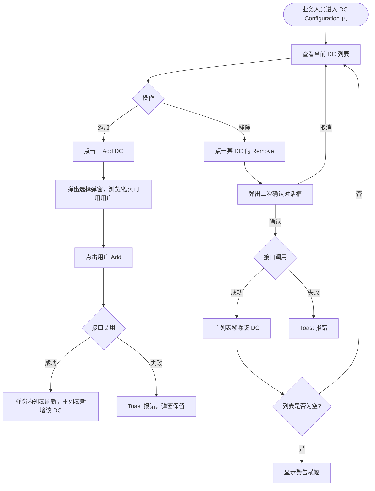

# 需求文档：PC 端 — DC 配置页面

> **使用说明**：本文档是整个交付链路的**单一事实源**。所有下游文档（UI/前端/后端/QA）从本文档派生。
> DC 配置业务规则、API 见 [REQ-007-shared.md §5.5 / §6.4 / §6.5](../shared/REQ-007-shared.md)。

---

## 1. 背景与目标

### 1.1 业务背景

两级审批流程中，内部审批通过后系统需要**自动通知项目 DC（Document Controller）**，让 DC 负责将图纸提交到 Bentley 进行外部审批。然而，当前系统没有 DC 角色配置机制，每次上传都需要手动指定，极易遗漏且无法自动化通知。

当前痛点：
- 上传人需要每次手动查找 DC 联系方式，操作繁琐
- DC 人员变动时，历史设置无法统一更新
- 内部审批通过后系统无法自动找到正确的 DC 发送任务

### 1.2 业务目标

提供项目级 DC 配置页面，业务人员一次性配置项目的 DC 人员名单。内部审批通过后，系统自动向所有已配置 DC 发送外部审批任务，无需每次手动指定。

### 1.3 非目标（Out of Scope）

- DC 执行外部审批的操作（由 REQ-007B-pc 覆盖）
- 其他项目角色配置（如 Site Engineer 分配，由 REQ-003D-pc 覆盖）
- APP 端无 DC 配置功能

---

## 2. 用户与角色

### 2.1 角色定义

| 角色 ID | 角色名 | 描述 | 典型场景 |
|--------|-------|------|---------|
| ROLE-001 | 业务人员 / 项目管理员 | 具备 `drawing:dc-config` 权限，负责配置项目 DC | 添加/移除 DC 人员 |
| ROLE-002 | Document Controller（DC） | 被配置后接收外部审批任务 | 被添加/移除后影响其 Todo 任务接收 |

### 2.2 用户故事（User Stories）

#### US-007D-001：配置项目 DC 人员

```
作为 业务人员
我想要 在配置页面设置项目的 DC 人员
以便 内部审批通过后系统自动通知 DC，无需每次手动指定，DC 人员变动时只需修改一处配置
```

**优先级**：P1
**所属史诗**：图纸两级审批流程

---

## 3. 角色与权限矩阵

| 操作 | 业务人员/项目管理员 | DC 自身 | 普通用户 |
|-----|:-----------------:|:-------:|:-------:|
| 查看 DC 配置列表 | ✅ | ❌ | ❌ |
| 添加 DC | ✅ | ❌ | ❌ |
| 移除 DC | ✅ | ❌ | ❌ |
| 查看 Available Users 列表 | ✅ | ❌ | ❌ |

---

## 4. 核心实体与数据生命周期

### 4.1 实体清单

| 实体 ID | 实体名 | 描述 | 关键属性（业务语义） |
|--------|-------|------|------------------|
| ENT-001 | ProjectDcConfig | 项目 DC 配置记录 | projectId、dcUserId、dcUserName、configuredByName、configuredAt |

### 4.2 实体关系

- 一个项目可有多条 ProjectDcConfig（多个 DC）
- `(projectId, dcUserId)` 联合唯一，同一用户在同一项目只能配置一次

### 4.3 数据生命周期

**ProjectDcConfig 生命周期**：
1. 创建：业务人员点击 [Add] 添加某用户为 DC
2. 使用：内部审批通过时，系统查询该项目所有 ProjectDcConfig，向对应用户发送外部审批 Todo
3. 删除：业务人员点击 [Remove] 移除，该用户不再接收新的外部审批任务
4. 保留：已删除的 DC 历史已完成/驳回的外部审批记录不受影响

---

## 5. 状态机

本功能无复杂状态机。ProjectDcConfig 记录：
- 存在 → DC 有效（接收任务）
- 不存在 → DC 未配置（不接收任务）

**关键约束**：项目至少需配置 1 个 DC（移除最后一个时给出警告，但不阻止移除）。

---

## 6. 业务流程

### 6.1 主流程（添加 DC）

1. 业务人员点击侧边栏 Settings → DC Configuration，进入配置页
2. 查看当前项目已配置的 DC 列表
3. 点击 [+ Add DC]，弹出选择弹窗
4. 搜索/浏览可用用户（有 `drawing:external-approval` 权限且未被配置的）
5. 点击某用户的 [Add]，立即调用接口添加
6. 成功：弹窗内列表刷新（该用户消失），主列表新增该 DC

### 6.2 主流程（移除 DC）

1. 业务人员在 DC 列表点击某 DC 的 [Remove]
2. 弹出二次确认对话框
3. 确认后调用接口移除
4. 成功：主列表中该 DC 消失；若列表为空，显示警告横幅

### 6.3 主流程图（Mermaid）



### 6.4 异常流程

| 异常场景 | 触发条件 | 系统响应 | 用户感知 |
|---------|---------|---------|---------|
| 目标用户无 `drawing:external-approval` 权限 | 后端校验失败 | 接口返回 1003007011 | Toast 提示"用户无 DC 权限" |
| 移除最后一个 DC | 移除后列表为空 | 不阻止操作，显示警告 | 页面顶部警告横幅：`"⚠️ No DC configured. Internal approvals cannot proceed to external approval."` |
| Available Users 为空 | 项目中所有有权限的用户均已配置 | 弹窗内显示空状态 | 提示"所有可用用户均已配置为 DC" |

---

## 7. 功能需求详述

### 7.1 功能 F-001：DC 配置页面主布局

**关联用户故事**：US-007D-001
**所属流程节点**：流程 6.1 步骤 1–2

**页面入口**：侧边栏 Settings → DC Configuration（需 `drawing:dc-config` 权限可见）

**页面布局**：

```
┌──────────────────────────────────────────────────────────────────┐
│ ⚙️ DC Configuration                                  [+ Add DC] │
├──────────────────────────────────────────────────────────────────┤
│                                                                  │
│  Document Controllers for current project:                       │
│                                                                  │
│  ┌────────────────────────────────────────────────────────────┐  │
│  │  Name           │ Configured By  │ Configured At │ Action  │  │
│  │─────────────────│────────────────│───────────────│─────────│  │
│  │  陈小明          │ Admin          │ 2026-04-01    │ [Remove]│  │
│  │  刘文静          │ Admin          │ 2026-04-01    │ [Remove]│  │
│  └────────────────────────────────────────────────────────────┘  │
│                                                                  │
│  ⓘ At least one DC is required for the drawing approval process. │
│                                                                  │
└──────────────────────────────────────────────────────────────────┘
```

**列定义**：

| 列 | 说明 |
|----|------|
| Name | DC 用户姓名 |
| Configured By | 执行配置操作的用户姓名 |
| Configured At | 配置时间，格式 YYYY-MM-DD |
| Action | [Remove] 按钮 |

**无 DC 时的空状态**：

```
┌──────────────────────────────────────────────────────────────────┐
│  ⚠️ No DC configured.                                           │
│  Internal approvals cannot proceed to external approval.        │
│  Please add at least one Document Controller.                   │
└──────────────────────────────────────────────────────────────────┘
```

### 7.2 功能 F-002：添加 DC 弹窗

**关联用户故事**：US-007D-001
**所属流程节点**：流程 6.1 步骤 3–6

```
┌──────────────────────────────────────────┐
│ Add Document Controller            [✕]   │
├──────────────────────────────────────────┤
│ Search: [____________________________]   │
│                                          │
│ Available Users:                         │
│  ┌──────────────────────────────────┐    │
│  │ 王磊                    [Add]    │    │
│  │ 赵强                    [Add]    │    │
│  │ 孙丽                    [Add]    │    │
│  └──────────────────────────────────┘    │
│                                          │
│                           [Close]        │
└──────────────────────────────────────────┘
```

**交互规则**：
- Available Users 列表仅显示：拥有 `drawing:external-approval` 权限 **且** 尚未被配置为该项目 DC 的用户
- Search 框实时过滤 Available Users 列表（按姓名模糊搜索）
- 点击 [Add] 立即调用接口（单条添加），成功后该用户从弹窗列表消失，主列表新增
- 弹窗保持打开，支持连续添加多个 DC
- Available Users 为空时显示：`"All eligible users have been configured as DC."`

### 7.3 功能 F-003：移除 DC 二次确认

**关联用户故事**：US-007D-001
**所属流程节点**：流程 6.2 步骤 2–4

```
┌──────────────────────────────────────────────────┐
│  Remove DC                                       │
│                                                  │
│  Remove 陈小明 from DC list?                     │
│  They will no longer receive external            │
│  approval tasks.                                 │
│                                                  │
│           [Cancel]    [Confirm]                  │
└──────────────────────────────────────────────────┘
```

**交互规则**：
- [Confirm] 点击后调用接口，成功后主列表刷新
- 移除后若列表为空，页面顶部显示警告横幅（不阻止移除）
- 正在处理中的外部审批任务不受影响（已存在的 Todo 不因移除 DC 而消失）

---

## 8. 验收标准（Acceptance Criteria）

### AC-007D-001：页面访问权限

```
Given  用户不具备 drawing:dc-config 权限
When   尝试访问 DC Configuration 页面（直接输入 URL 或查看侧边栏）
Then   侧边栏中 DC Configuration 菜单不可见；直接访问 URL 时跳转至 403 页面
```

### AC-007D-002：DC 列表正确展示

```
Given  项目已配置 2 个 DC
When   业务人员进入 DC Configuration 页
Then   列表显示 2 条记录，包含姓名、配置人、配置时间、[Remove] 按钮
```

### AC-007D-003：添加 DC — Available Users 仅显示有权限且未配置的用户

```
Given  项目中用户 A 有 drawing:external-approval 权限且未配置为 DC；用户 B 无该权限；用户 C 已配置为 DC
When   业务人员打开 Add Document Controller 弹窗
Then   列表仅显示用户 A；用户 B 和 C 不出现
```

### AC-007D-004：添加 DC — 成功路径

```
Given  业务人员在弹窗中点击用户 A 的 [Add]
When   接口调用成功
Then   用户 A 从弹窗 Available Users 列表消失；主列表新增用户 A 的 DC 记录（含配置人、配置时间）
```

### AC-007D-005：添加 DC — 支持连续添加

```
Given  弹窗已打开且有多个 Available Users
When   连续点击多个用户的 [Add]
Then   每次添加成功后弹窗保持打开，可继续添加下一个用户
```

### AC-007D-006：移除 DC — 二次确认文案包含姓名

```
Given  业务人员点击 DC "陈小明" 的 [Remove]
When   确认对话框弹出
Then   对话框文案包含"Remove 陈小明 from DC list?"
```

### AC-007D-007：移除 DC — 成功路径

```
Given  业务人员在确认对话框点击 [Confirm]
When   接口调用成功
Then   该 DC 从主列表消失
```

### AC-007D-008：移除最后一个 DC — 警告但不阻止

```
Given  项目当前只有 1 个 DC
When   业务人员移除该 DC 成功
Then   主列表变为空状态，页面显示警告横幅"⚠️ No DC configured. Internal approvals cannot proceed to external approval."
```

### AC-007D-009：Search 过滤

```
Given  弹窗 Available Users 列表有 3 个用户：王磊、赵强、孙丽
When   在 Search 框输入"王"
Then   列表仅显示"王磊"
```

### AC-007D-010：内部审批通过后 DC 收到 Todo（集成验证）

```
Given  项目配置了 DC-A 和 DC-B
When   内部审批人完成内部审批通过操作
Then   DC-A 和 DC-B 的 Todo 列表均出现"External Approval Required"任务
```

---

## 9. 非功能需求

### 9.1 性能

| 指标 | 目标值 | 测量方式 |
|-----|-------|---------|
| DC 列表加载 | ≤ 1s | 手动 |
| 添加/移除接口响应 P95 | ≤ 1s | 后端监控 |

### 9.2 安全

- 鉴权：JWT，需携带 `Authorization` / `X-Tenant-Id` / `Project-Id`
- 权限校验：后端校验 `drawing:dc-config` 权限
- 审计：添加/移除 DC 操作记录操作人、时间、目标用户

### 9.3 可访问性

- WCAG 等级：AA
- 键盘可达：弹窗内 Search 框及列表支持 Tab 键导航

### 9.4 兼容性

- 浏览器：Chrome 100+、Edge 100+、Safari 15+
- 移动端：不支持（PC 专属）
- 国际化：中英双语

### 9.5 可观测性

- 关键埋点：添加 DC、移除 DC、移除最后一个 DC（触发空状态警告）
- 错误监控：配置接口失败率 > 5% 告警

---

## 10. 数据量级与扩展性

| 维度 | 当前预期 | 1 年后 |
|-----|---------|-------|
| 单项目 DC 数量 | 2 人 | ≤ 10 人 |
| 可选用户数（Available Users） | ≤ 50 人 | ≤ 200 人 |

---

## 11. 依赖与外部系统

| 依赖系统 | 用途 | 集成方式 | Owner |
|---------|------|---------|-------|
| REQ-007-shared §5.5 | DC 配置业务规则 | 文档引用 | — |
| REQ-007-shared §6.4 / §6.5 | DC 配置 API（GET/POST /project/dc-config/...） | REST | 后端 |
| 用户权限系统 | 查询有 `drawing:external-approval` 权限的用户列表 | 内部接口 | 后端 |

---

## 12. 数据迁移

- 新增 `ProjectDcConfig` 表，无存量数据迁移需求
- 建议在上线初期由管理员手动录入各项目的 DC 人员

---

## 13. 上线操作清单

### 13.1 上线前

- [ ] `drawing:dc-config` 权限已创建并绑定到业务人员/项目管理员角色
- [ ] `drawing:external-approval` 权限已创建并绑定到 DC 角色
- [ ] ProjectDcConfig 表已创建，索引已添加（projectId, dcUserId）
- [ ] 各项目 DC 人员名单已收集，准备初始化数据

### 13.2 上线后

- [ ] 各项目完成 DC 人员初始化配置
- [ ] 验证内部审批通过后正确的 DC 收到 Todo
- [ ] 验证无 DC 时的警告横幅正常显示

---

## 14. 灰度与发布策略

- 灰度方式：按项目灰度
- **必须先于 REQ-007A-pc 和 REQ-007B-pc 上线或同步上线**（否则内部审批通过后无 DC 可通知）
- 回滚预案：关闭 DC 配置页入口；已有配置数据保留不清除

---

## 15. 成功指标（北极星）

| 指标 | 当前基线 | 目标 | 测量周期 |
|-----|---------|------|---------|
| 有 DC 配置的项目比例 | 0% | 100%（上线后 1 周内） | 每日 |
| 内部审批通过后 DC 任务推送成功率 | — | ≥ 99% | 每周 |

---

## 16. Open Questions

| OQ ID | 问题 | 影响 | Owner | 截止 |
|------|------|------|-------|------|
| OQ-001 | 是否允许为不同图纸分类（Category）配置不同 DC？当前方案为项目级统一配置。 | 配置粒度 | PM | — |
| OQ-002 | DC 人员离职/权限被撤销时，是否需要系统自动提醒管理员重新配置？ | 运营保障 | PM | — |

---

## 17. Figma / 原型链接

- Figma 设计稿：<!-- 填写 DC Configuration 页 / Add DC 弹窗 Frame 链接 -->
- 交互原型：

---

## 18. 变更历史

| 版本 | 日期 | 修改人 | 变更摘要 | 影响下游文档 |
|-----|------|-------|---------|------------|
| 0.1.0 | 2026-05-05 | agent | 从 REQ-007-pc 按 US-007D-001 拆分初稿 | 全部 |

---

## 19. 备注

- 本文档从 REQ-007-pc.md §6（DC 配置页面）拆分而来
- 本文档是 REQ-007A-pc 和 REQ-007B-pc 的前置依赖（blocks），必须优先上线
- 当前业务场景每个项目配置约 2 名 DC，数据模型支持多人
