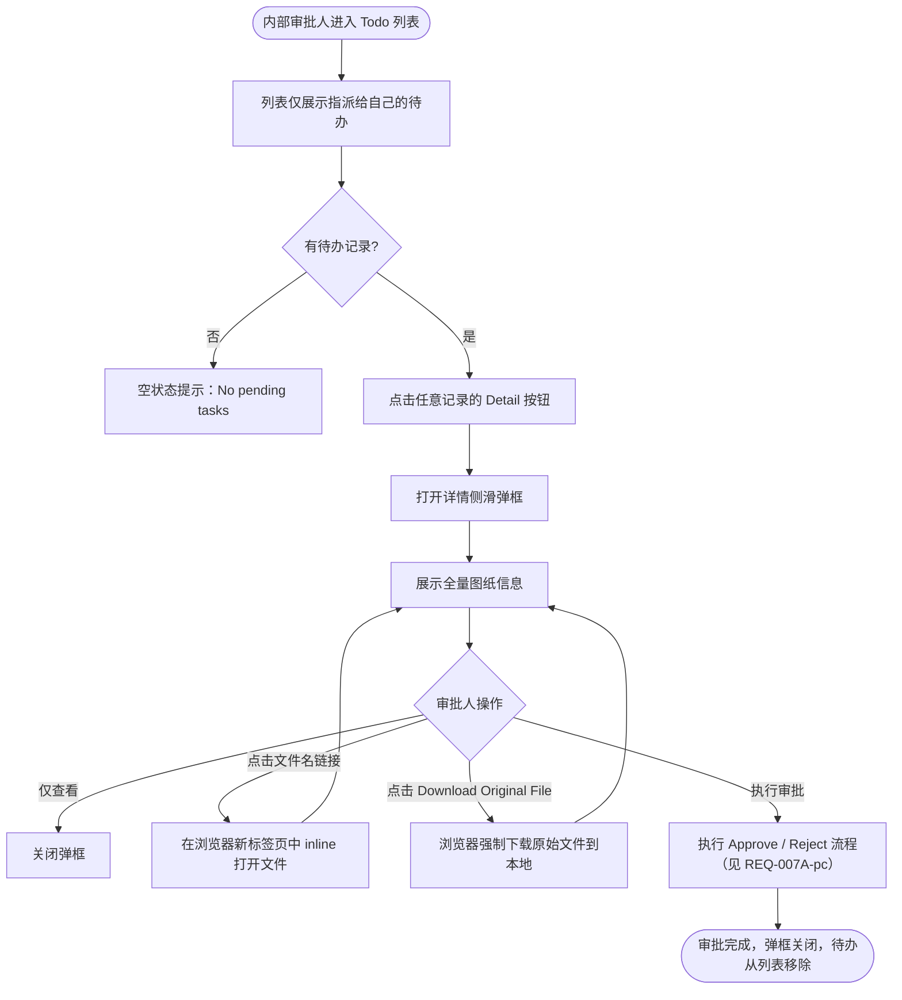

# 需求文档：PC 端 — 内部审批人图纸待办详情查看与原文件下载

> **使用说明**：本文档是整个交付链路的**单一事实源**。所有下游文档（UI/前端/后端/QA）从本文档派生。
> 任何字段标注 `<!-- TODO: ... -->` 表示 PM 待补充，下游 agent 看到 TODO 不应编造，应保留并向上反馈。

---

## 1. 背景与目标

### 1.1 业务背景

REQ-007A-pc 定义了内部审批人在 PC 端 Todo 列表中处理图纸审批任务的主流程，并在 Todo 卡片中以摘要形式展示图纸基本信息（Drawing Code、Drawing Name、版本号、Version Note、上传人、上传时间）。

然而，内部审批人在作出审批决策前需要获取**完整的图纸上传信息**（与设计人员上传时填写的信息完全一致），包括图纸分类（Category）、图纸描述（Description）及可下载的原始文件，以便进行技术评审。当前 Todo 卡片仅支持在线预览（[View Drawing]），无专用详情面板聚合展示全量字段，亦未明确提供**原文件下载**能力。

### 1.2 业务目标

1. 内部审批人在 Todo 列表中仅看到**指定给自己**的图纸待办记录，列表清晰无干扰
2. 点击任意待办记录可打开**详情侧滑弹框（Detail Drawer）**，其中展示的信息与设计人员上传时所填写的全部信息严格一致
3. 详情侧滑弹框中提供**下载原图纸文件**按钮，审批人可将原始文件下载到本地进行离线审阅

### 1.3 非目标（Out of Scope）

- 审批操作本身（[Approve] / [Reject] 交互由 REQ-007A-pc 定义）
- DC 外部审批 Todo 的详情视图（由 REQ-007B-pc 覆盖）
- 在线图纸预览（渲染/查看器）功能（由 REQ-004 Markup 范畴覆盖，不在本需求中重复定义）
- APP 端内部审批待办详情（APP 端另行评估）
- 已处理（APPROVED / REJECTED）历史任务的详情查看（由 REQ-007C-pc 版本历史抽屉覆盖）

---

## 2. 用户与角色

### 2.1 角色定义

| 角色 ID | 角色名 | 描述 | 典型场景 |
|--------|-------|------|---------|
| ROLE-001 | 内部审批人 | 拥有 `drawing:approve` 权限的技术人员（设计经理、总工程师等） | 在 Todo 列表看到自己名下的图纸待办，打开详情后下载原文件进行技术审阅 |

### 2.2 用户故事（User Stories）

#### US-007E-001：查看自己名下的图纸待办记录

```
作为 内部审批人
我想要 在 PC 端待办列表中只看到指定给我的图纸待审批记录
以便 我能快速定位自己需要处理的任务，不被无关记录干扰
```

**优先级**：P1
**所属史诗**：图纸两级审批流程

#### US-007E-002：查看图纸待办详情（信息与上传一致）

```
作为 内部审批人
我想要 点击待办记录后，在详情侧滑弹框中看到与图纸上传时完全一致的所有信息
以便 我能全面了解图纸背景，做出准确的审批决策
```

**优先级**：P1
**所属史诗**：图纸两级审批流程

#### US-007E-003：下载原始图纸文件

```
作为 内部审批人
我想要 在图纸待办详情中点击按钮下载原始图纸文件到本地
以便 我可以在离线环境中（如 AutoCAD、PDF 阅读器）仔细审阅图纸内容后再作出审批决定
```

**优先级**：P1
**所属史诗**：图纸两级审批流程

#### US-007E-004：在详情弹框内通过内部审批

```
作为 内部审批人
我想要 在查看完图纸详情后，直接在详情弹框内点击 [Approve] 完成内部审批
以便 无需离开当前上下文即可提交通过决策，并了解后续将进入外部审批阶段
```

**优先级**：P1
**所属史诗**：图纸两级审批流程

#### US-007E-005：在详情弹框内驳回内部审批

```
作为 内部审批人
我想要 在查看完图纸详情后，直接在详情弹框内点击 [Reject] 并填写驳回原因
以便 及时通知设计人员修改并重新上传
```

**优先级**：P1
**所属史诗**：图纸两级审批流程

---

## 3. 角色与权限矩阵

| 操作 | 内部审批人（本人） | 内部审批人（他人） | 设计人员 | DC | Site Engineer |
|-----|:-----------------:|:----------------:|:-------:|:--:|:-------------:|
| 查看 Todo 列表中自己名下的图纸待办 | ✅ | ❌ | ❌ | ❌ | ❌ |
| 打开图纸待办详情侧滑弹框 | ✅ | ❌ | ❌ | ❌ | ❌ |
| 下载原始图纸文件 | ✅ | ❌ | ❌ | ❌ | ❌ |

> **说明**："仅自己名下"由后端接口通过 `assigneeId = 当前登录用户` 过滤，前端不可绕过。

---

## 4. 核心实体与数据生命周期

### 4.1 实体清单

| 实体 ID | 实体名 | 描述 | 关键属性（业务语义） |
|--------|-------|------|------------------|
| ENT-001 | Todo 任务（内部审批） | 内部审批人的待办事项 | 指派对象（assigneeId）、关联版本、任务状态 |
| ENT-002 | DrawingVersion（图纸版本） | 审批的操作对象及详情数据来源 | 版本号、原始文件（fileUrl）、版本说明、上传人、上传时间 |
| ENT-003 | Drawing（图纸主记录） | 图纸的元信息来源 | Drawing Code、Drawing Name、Category、Description |

### 4.2 实体关系

- 一条 Todo 任务（ENT-001）关联一个 DrawingVersion（ENT-002，1:1）
- 一个 DrawingVersion 属于一个 Drawing（ENT-003，N:1）
- 详情侧滑弹框的字段来源于 ENT-002 + ENT-003 的联合视图

### 4.3 数据生命周期

**详情数据读取**：只读操作，不修改任何实体状态，详情数据随 DrawingVersion 和 Drawing 主记录的状态而保持一致。

---

## 5. 状态机

> 本需求不引入新的状态或状态转换。内部审批 Todo 的状态机由 REQ-007A-pc §5 定义。

---

## 6. 业务流程

### 6.1 主流程（查看待办详情并下载原文件）

1. 内部审批人进入 PC 端，点击右上角通知图标，进入 **Todo List**
2. 列表中仅显示类型为 `Internal Approval Required`、**指派给当前登录用户**的待办记录
3. 点击任意待办记录行右侧的 **[Detail]** 按钮
4. 右侧弹出**详情侧滑弹框（Detail Drawer）**，加载并展示图纸详情（字段见 §7.2）
5. 审批人阅读详情，如需离线审阅，点击底部 **[Download Original File]** 按钮
6. 浏览器触发文件下载，文件命名规则：`{drawingCode}-V{versionNo}-original.{ext}`
7. 下载成功后弹框保留，审批人可继续在弹框内执行审批操作（[Approve] / [Reject]，交互详见 REQ-007A-pc F-002、F-003）

### 6.2 主流程图（Mermaid）



### 6.3 异常流程

| 异常场景 | 触发条件 | 系统响应 | 用户感知 |
|---------|---------|---------|---------|
| 详情加载失败 | 网络异常或接口超时 | 侧滑弹框内显示错误提示，提供重试按钮 | "Failed to load drawing details. [Retry]" |
| 文件名链接打开失败 | `/view` 预签名 URL 已过期、CDN 不可达或权限失效 | 新标签页显示浏览器错误页 | 用户可回到详情弹框重新点击文件名链接；若持续失败可改用下载按钮 |
| 文件下载失败 | `fileUrl` 已过期、CDN 不可达或权限失效 | Toast 错误提示，下载按钮恢复可点击 | Toast: "Download failed. Please try again." |
| 待办已被处理（并发） | 打开详情时任务已被他人处理（系统不允许，但防御） | 侧滑弹框内提示任务已关闭，弹框刷新，操作按钮隐藏 | "This task has already been completed." |
| 原文件不存在（数据异常） | `fileUrl` 为空 | 文件名显示为 `—`（不可点击），辅助提示文案隐藏；下载按钮禁用 | 文件名行：`—`；下载按钮 Tooltip: "Original file unavailable." |

---

## 7. 功能需求详述

### 7.1 功能 F-001：待办列表的"仅我名下"过滤

**关联用户故事**：US-007E-001
**所属流程节点**：流程 6.1 步骤 1–2

**规则**：
- 内部审批人进入 Todo 列表，类型为 `Internal Approval Required` 的任务，**后端仅返回 `assigneeId` 等于当前登录用户 ID 的记录**
- 前端不需要额外过滤控件；"仅我名下"是默认且唯一的展示逻辑
- Todo 列表的整体结构（分页、排序、空状态）复用 REQ-007A-pc F-001 的规格，本需求不重复定义
- 若当前用户在某项目中不是任何图纸版本的指定审批人，对应项目的图纸 Todo 对其不可见

### 7.2 功能 F-002：图纸待办详情侧滑弹框（Detail Drawer）

**关联用户故事**：US-007E-002
**所属流程节点**：流程 6.1 步骤 3–4

**触发方式**：点击 Todo 卡片右侧 [Detail] 按钮，从页面右侧滑入弹框（Drawer 宽度建议 480px）。

**弹框头部**：

```
┌────────────────────────────────────────────────────────────┐
│  Drawing Approval Detail                              ×    │
│  Internal Approval Required                               │
└────────────────────────────────────────────────────────────┘
```

**弹框内容区 — 展示字段**（与上传时填写字段严格对应）：

> **设计决策**：Drawing Code 和 Drawing Name 已在 Todo 卡片摘要行中展示，内部审批人审批时主要关注图纸文件本身，详情弹框不重复展示这两个字段，以减少阅读负担。

| 字段名（展示） | 数据来源 | 对应上传字段 | 说明 |
|--------------|---------|------------|------|
| Category | Drawing.category | Category | 继承自图纸主记录，只读 |
| Description | Drawing.description | Description（选填） | 无内容时显示 `—` |
| Version | DrawingVersion.versionNo | 系统自动递增版本号 | 例：V3 |
| Version Note | DrawingVersion.versionNote | Version Note（选填） | 无内容时显示 `—` |
| Uploaded by | DrawingVersion.uploaderName | 上传人（系统取当前登录用户姓名） | 显示姓名 + 角色标签，例：张三（Designer） |
| Upload Time | DrawingVersion.uploadTime | 上传时间（系统自动记录） | 格式：YYYY-MM-DD HH:mm，Tooltip 显示完整时间戳 |
| Internal Approver | DrawingVersion.approverName | Internal Approver（上传时指定） | 显示被指派的审批人姓名；当前登录用户应与此一致 |
| Original File | DrawingVersion.fileUrl | 上传的图纸文件 | 显示文件名 + 文件类型图标；文件名为**可点击链接**，点击后在浏览器新标签页中以 inline 方式打开；文件名下方展示提示文案引导用户通过底部按钮下载 |

**布局示意**：

```
┌────────────────────────────────────────────────────────────┐
│  Drawing Approval Detail                              ×    │
│  Internal Approval Required                               │
├────────────────────────────────────────────────────────────┤
│                                                            │
│  Category            Architecture                         │
│  Description         包含外墙及核心筒轮廓线                 │
│                                                            │
│  Version             V3                                   │
│  Version Note        修正轴网尺寸，更新柱位标注              │
│                                                            │
│  Uploaded by         张三（Designer）                      │
│  Upload Time         2026-05-20 14:32                     │
│  Internal Approver   李四（当前用户）                       │
│                                                            │
│  Original File       📄 ARCH-001-V3-plan.pdf  ↗           │
│                      Click to open in browser.            │
│                      To save the file, use                │
│                      [Download Original File] below.      │
│                                                            │
├────────────────────────────────────────────────────────────┤
│  [Download Original File]  [Approve]  [Reject]            │
└────────────────────────────────────────────────────────────┘
```

**交互规则**：
- 弹框打开时展示加载态（Skeleton），加载完成后渲染字段
- 点击 `×` 或按 `Esc` 关闭弹框，审批状态不变
- 弹框打开期间，背景列表不可操作（半透明遮罩）
- 所有字段均为**只读**，不提供编辑入口
- **Original File 文件名链接**：点击后以 `target="_blank"` 在浏览器新标签页中打开文件（HTTP `Content-Disposition: inline`）；文件名下方展示灰色辅助提示文案："Click to open in browser. To save the file, use [Download Original File] below."
- 若 `fileUrl` 为空，文件名显示为 `—`（不可点击），辅助提示文案隐藏
- **[Approve] 按钮**：点击后先执行 DC 配置前端预检查，无 DC 则弹出 F-006 警告弹窗；有 DC 则弹出 F-004 确认对话框
- **[Reject] 按钮**：点击后弹出 F-005 驳回对话框；驳回流程不依赖 DC 配置

### 7.3 功能 F-003：原始图纸文件下载

**关联用户故事**：US-007E-003
**所属流程节点**：流程 6.1 步骤 5–6

**按钮位置**：详情侧滑弹框底部操作区最左侧（次要样式按钮）

**按钮标签**：`Download Original File`

**下载规则**：
- 点击后触发浏览器原生文件下载（HTTP `Content-Disposition: attachment`），强制保存到本地，不在浏览器中打开
- 文件命名规则：`{drawingCode}-V{versionNo}-original.{ext}`
  - 示例：`ARCH-001-V3-original.pdf`
- 支持的文件类型：与上传时一致（PDF / DWG / DXF / PNG / JPG）
- 下载期间按钮显示 loading 状态，防止重复点击
- 下载完成（浏览器接管后）按钮恢复正常状态
- 若 `fileUrl` 为空，按钮置灰，hover 显示 Tooltip `"Original file unavailable."`

> **与文件名链接的区别**：文件名链接（F-002）使用 `Content-Disposition: inline`，在浏览器新标签页中打开供在线阅览；[Download Original File] 按钮使用 `Content-Disposition: attachment`，强制触发本地保存，两者后端可共用同一预签名 URL 生成逻辑，仅 `Content-Disposition` 参数不同。

**权限**：
- 仅当前被指派的内部审批人（`drawing:approve` 权限）可触发下载
- 后端接口须校验请求用户为对应 DrawingVersion 的 `assigneeId`，否则返回 403

**接口**（后端实现参考）：
```
# 文件名链接 —— inline 在浏览器打开
GET /drawing/version/{versionId}/view
Headers: Authorization: Bearer {token}
Response: 302 Redirect 至预签名 URL（Content-Disposition: inline，有效期建议 5 分钟）

# Download Original File 按钮 —— 强制下载到本地
GET /drawing/version/{versionId}/download
Headers: Authorization: Bearer {token}
Response: 302 Redirect 至预签名 URL（Content-Disposition: attachment; filename="{drawingCode}-V{versionNo}-original.{ext}"，有效期建议 5 分钟）
```

### 7.4 功能 F-004：Approve 确认对话框

**关联用户故事**：US-007E-004
**所属流程节点**：详情侧滑弹框底部 [Approve] 按钮点击后

**触发前置条件**：前端先完成 DC 配置预检查（F-006），确认项目已配置 DC 后方可弹出本对话框。

**对话框布局**：

```
┌──────────────────────────────────────────────┐
│  Confirm Internal Approval?                  │
│                                              │
│  Once approved, this version will proceed    │
│  to external approval by Document Controller.│
│  The version will NOT become active until    │
│  external approval is completed.             │
│                                              │
│  [Cancel]  [Confirm]                         │
└──────────────────────────────────────────────┘
```

**交互规则**：
- 进入本对话框前，前端已完成 DC 配置预检查（F-006），此处无需重复展示 DC 警告
- [Confirm] 点击后按钮进入 loading 态，禁用对话框所有操作
- 成功后对话框关闭，详情弹框关闭，Todo 卡片消失，Toast 提示：`"Internal approval completed. DC has been notified for external approval."`
- 失败后 loading 恢复，Toast 显示错误，可重试（含后端兜底校验无 DC 时的错误码 `1003007012`）
- [Cancel] 点击后关闭对话框，返回详情弹框，不执行任何审批操作

### 7.5 功能 F-005：Reject 驳回对话框

**关联用户故事**：US-007E-005
**所属流程节点**：详情侧滑弹框底部 [Reject] 按钮点击后

**对话框布局**：

```
┌──────────────────────────────────────────────┐
│  Reject Internal Approval                    │
│  ARCH-001  首层平面图  V3                     │
│                                              │
│  Comment *                                   │
│  ┌────────────────────────────────────────┐  │
│  │                                        │  │
│  │  请填写驳回原因（必填）                  │  │
│  └────────────────────────────────────────┘  │
│  最多 500 字符                               │
│                                              │
│           [Cancel]     [Confirm]             │
└──────────────────────────────────────────────┘
```

**交互规则**：
- Comment 为必填；为空时 [Confirm] 不可点击，字段标红并显示必填提示
- [Confirm] 点击后按钮进入 loading 态，禁用对话框所有操作
- 成功后对话框关闭，详情弹框关闭，Todo 卡片消失，Toast 提示：`"Internal approval rejected. Designer has been notified."`
- 设计人员收到站内消息，内容包含驳回原因
- 失败后 loading 恢复，Toast 显示错误，可重试
- [Cancel] 点击后关闭对话框，返回详情弹框

### 7.6 功能 F-006：无 DC 警告弹窗

**关联用户故事**：US-007E-004
**所属流程节点**：详情侧滑弹框底部 [Approve] 按钮点击后（F-004 前置检查）

**触发时机**：审批人点击 [Approve] 后，前端调用 DC 配置查询接口（`GET /project/dc-config`），返回空列表时弹出本弹窗，**不进入** F-004 确认对话框。

**弹窗布局**：

```
┌──────────────────────────────────────────────┐
│  ⚠️  No DC Configured                        │
│                                              │
│  This project has no Document Controller     │
│  configured. You cannot proceed with         │
│  internal approval until a DC is added.      │
│                                              │
│  Please contact your project admin to        │
│  configure a DC first.                       │
│                                              │
│                          [Got it]            │
└──────────────────────────────────────────────┘
```

**交互规则**：
- 仅有 [Got it] 一个按钮，点击关闭弹窗，返回详情弹框，不执行任何审批操作
- 弹窗不可通过背景点击关闭（需显式点击 [Got it]）
- 本弹窗不影响 [Reject] 流程（驳回不依赖 DC 配置）

---

## 8. 验收标准（Acceptance Criteria）

### AC-007E-001：待办列表仅展示自己名下的记录

**关联用户故事**：US-007E-001

```
Given  内部审批人 A 登录 PC 端，项目中存在指派给 A 的图纸待审批 TaskA，以及指派给审批人 B 的 TaskB
When   A 打开 Todo 列表，查看 Internal Approval Required 类型的待办
Then   列表中仅显示 TaskA，不显示 TaskB
```

### AC-007E-002：待办列表无任务时展示空状态

**关联用户故事**：US-007E-001

```
Given  当前登录用户名下无任何 Internal Approval Required 待办
When   用户打开 Todo 列表
Then   列表显示空状态提示文案 "No pending tasks"，不显示他人待办记录
```

### AC-007E-003：点击 Detail 打开详情侧滑弹框

**关联用户故事**：US-007E-002

```
Given  内部审批人在 Todo 列表中看到一条图纸待办记录
When   点击该记录右侧的 [Detail] 按钮
Then   右侧滑出详情侧滑弹框，弹框头部显示 "Drawing Approval Detail" 及 "Internal Approval Required" 标签
```

### AC-007E-004：详情弹框展示与上传时一致的全量信息

**关联用户故事**：US-007E-002

```
Given  设计人员上传图纸时填写了 Drawing Code="ARCH-001"、Drawing Name="首层平面图"、
       Category="Architecture"、Description="包含外墙轮廓"、Version Note="修正轴网"，
       上传文件名为 "ARCH-001-V3-plan.pdf"
When   内部审批人打开该图纸的待办详情弹框
Then   弹框中展示的每个字段值与上传时填写的内容完全一致：
       Category = "Architecture"
       Description = "包含外墙轮廓"
       Version = "V3"
       Version Note = "修正轴网"
       Original File 显示文件名 "ARCH-001-V3-plan.pdf"
       且弹框中不显示 Drawing Code 和 Drawing Name 字段
```

### AC-007E-005：选填字段为空时显示占位符

**关联用户故事**：US-007E-002

```
Given  设计人员上传图纸时未填写 Description 和 Version Note
When   内部审批人打开该图纸的待办详情弹框
Then   Description 字段和 Version Note 字段显示 "—"，不显示空白或报错
```

### AC-007E-006：成功下载原始图纸文件

**关联用户故事**：US-007E-003

```
Given  内部审批人在图纸待办详情弹框中，原始文件存在（fileUrl 非空）
When   点击 [Download Original File] 按钮
Then   浏览器触发文件下载，下载文件命名为 "{drawingCode}-V{versionNo}-original.{ext}"，
       文件内容与设计人员上传的原始文件一致
```

### AC-007E-007：文件下载期间按钮进入 loading 状态

**关联用户故事**：US-007E-003

```
Given  内部审批人点击了 [Download Original File]
When   下载请求正在进行中
Then   按钮显示 loading 状态，且无法被重复点击
```

### AC-007E-008：原始文件不可用时按钮置灰、文件名不可点击

**关联用户故事**：US-007E-003

```
Given  DrawingVersion 的 fileUrl 为空（数据异常）
When   内部审批人打开该图纸的待办详情弹框
Then   Original File 行文件名显示为 "—"（无链接样式，不可点击），辅助提示文案隐藏；
       [Download Original File] 按钮呈置灰禁用状态，
       鼠标悬停时显示 Tooltip "Original file unavailable."
```

### AC-007E-009：非指派审批人无法通过接口打开或下载文件

**关联用户故事**：US-007E-003

```
Given  内部审批人 B 尝试直接调用 view 或 download 接口，但该 DrawingVersion 的 assigneeId 为审批人 A
When   B 分别发送 GET /drawing/version/{versionId}/view 和 GET /drawing/version/{versionId}/download 请求
Then   两个接口均返回 403，文件不打开，不下载
```

### AC-007E-010：详情弹框加载失败时显示错误提示

```
Given  打开详情侧滑弹框时后端接口返回 5xx 或网络超时
When   弹框加载失败
Then   弹框内显示错误信息 "Failed to load drawing details." 及 [Retry] 按钮；
       点击 [Retry] 重新请求接口
```

### AC-007E-011：点击文件名链接在浏览器新标签页中打开文件

**关联用户故事**：US-007E-003

```
Given  内部审批人在图纸待办详情弹框中，原始文件存在（fileUrl 非空）
When   点击 Original File 行的文件名链接
Then   浏览器在新标签页中打开该文件（inline 展示），当前弹框保持不变
```

### AC-007E-012：文件名下方展示引导提示文案

**关联用户故事**：US-007E-003

```
Given  内部审批人打开图纸待办详情弹框，原始文件存在（fileUrl 非空）
When   弹框内容区完成渲染
Then   Original File 文件名下方显示灰色辅助文案：
       "Click to open in browser. To save the file, use [Download Original File] below."
```

### AC-007E-013：Approve — 项目无 DC 配置时弹出警告弹窗

```
Given  项目当前无 DC 配置
When   内部审批人在详情弹框内点击 [Approve]
Then   弹出无 DC 警告弹窗（F-006），不弹出确认对话框；
       点击 [Got it] 后弹窗关闭，返回详情弹框，审批状态不变
```

### AC-007E-014：Approve — 有 DC 配置时弹出确认对话框

```
Given  项目已配置 DC
When   内部审批人在详情弹框内点击 [Approve]
Then   弹出 Confirm Internal Approval 对话框，文案说明"通过后进入外部审批阶段，版本不立即生效"
```

### AC-007E-015：Approve — 成功路径

```
Given  内部审批人在确认对话框中点击 [Confirm]
When   操作成功
Then   对话框关闭，详情弹框关闭，Todo 卡片消失，
       Toast 提示 "Internal approval completed. DC has been notified for external approval."
```

### AC-007E-016：Approve — 对话框 loading 态及失败可重试

```
Given  内部审批人点击确认对话框中的 [Confirm]
When   接口请求进行中
Then   按钮显示 loading，对话框内所有操作禁用；
       接口返回错误后，loading 恢复，Toast 显示错误文案，对话框保留，可重试
```

### AC-007E-017：Reject — Comment 必填校验

```
Given  内部审批人在详情弹框内点击 [Reject] 打开驳回对话框
When   Comment 为空时点击 [Confirm]
Then   前端校验阻止提交，Comment 字段标红并显示必填提示
```

### AC-007E-018：Reject — 成功路径

```
Given  内部审批人填写驳回原因并点击 [Confirm]
When   操作成功
Then   对话框关闭，详情弹框关闭，Todo 卡片消失，
       Toast 提示 "Internal approval rejected. Designer has been notified."；
       设计人员收到站内消息，消息内容包含驳回原因
```

---

## 9. 非功能需求

### 9.1 性能

| 指标 | 目标值 | 测量方式 |
|-----|-------|---------|
| 详情弹框首屏加载时间 | P95 ≤ 800ms（局域网环境） | 前端 Performance API 打点 |
| 下载预签名 URL 生成时间 | P95 ≤ 500ms | 后端接口监控 |
| 预签名 URL 有效期 | ≥ 5 分钟 | 接口文档 + QA 验证 |

### 9.2 安全

- 鉴权方式：JWT（同系统其他接口）
- 下载接口须校验 `assigneeId`，防止越权下载他人图纸文件（行级权限校验）
- 预签名 URL 不应包含永久访问凭证，有效期内才可访问，过期后需重新请求
- 审计：内部审批人每次下载原始文件须留操作日志（操作人、图纸版本 ID、时间戳）

### 9.3 可访问性

- WCAG 等级：AA
- 键盘可达：侧滑弹框可通过 `Esc` 关闭；[Download Original File] 可通过 Tab 聚焦并按 Enter 触发
- 屏幕阅读器：下载按钮须有 `aria-label`，文件图标须有 `alt` 文本

### 9.4 兼容性

- 浏览器：Chrome 100+、Edge 100+、Safari 15+
- 移动端：不支持（PC 端专用）
- 国际化：仅中英双语（界面文案以英文为主，与现有系统一致）

### 9.5 可观测性

- 关键埋点：
  - `todo_detail_opened`：审批人打开详情弹框（含 drawingVersionId）
  - `drawing_original_download_triggered`：点击下载按钮（含 drawingVersionId、文件类型）
  - `drawing_original_download_failed`：下载失败（含失败原因）
- 错误监控：下载接口 4xx/5xx 上报 Sentry
- 业务监控：每日图纸待办详情打开次数、下载成功率进入 Dashboard

---

## 10. 数据量级与扩展性

| 维度 | 当前预期 | 1 年后 | 3 年后 |
|-----|---------|-------|-------|
| 每个审批人同时待处理的图纸待办数 | ≤ 50 条 | ≤ 200 条 | ≤ 500 条 |
| 单个图纸文件大小 | ≤ 50MB | ≤ 50MB | ≤ 100MB |

---

## 11. 依赖与外部系统

| 依赖系统 | 用途 | 集成方式 | Owner |
|---------|------|---------|-------|
| 文件存储服务（OSS / S3） | 存储原始图纸文件，生成预签名下载 URL | REST API | 后端团队 |
| 权限系统 | 校验 `drawing:approve` 权限及 `assigneeId` 行级权限 | 内部服务调用 | 后端团队 |

---

## 12. 数据迁移

无。本需求为新增交互能力，不涉及数据结构变更（原始文件 URL 已由 REQ-003A-pc 在上传时写入）。

---

## 13. 上线操作清单（Launch Checklist）

### 13.1 上线前

- [ ] 确认现有 DrawingVersion 的 `fileUrl` 字段已正确存储原始文件地址（与 REQ-003A-pc 对齐）
- [ ] 确认文件存储服务支持按需生成带时效的预签名下载 URL
- [ ] 确认权限系统已支持基于 `assigneeId` 的行级权限校验

### 13.2 上线后

- [ ] 验证至少一条图纸待办的详情弹框可正常打开并展示全量字段
- [ ] 验证下载功能在 Chrome / Edge / Safari 三端均正常触发
- [ ] 验证操作日志已正确记录下载行为

---

## 14. 灰度与发布策略

- 灰度方式：按项目灰度
- 灰度比例：5% → 20% → 50% → 100%
- 监控指标：下载失败率 > 5% 触发告警并暂停灰度
- 回滚预案：关闭对应 Feature Flag，隐藏详情侧滑弹框入口，Todo 卡片恢复至 REQ-007A-pc 现有形态

---

## 15. 成功指标（北极星）

| 指标 | 当前基线 | 目标 | 测量周期 |
|-----|---------|------|---------|
| 内部审批人审批完成率（通过 + 驳回 / 全部待办） | 待测量 | ≥ 95%（即待办不积压） | 每周 |
| 图纸原文件下载成功率 | 无基线 | ≥ 99% | 每日 |
| 审批人反馈"信息不完整"导致二次沟通的工单数 | <!-- TODO: 需运营提供历史数据 --> | 较上线前下降 80% | 每月 |

---

## 16. Open Questions（待定项）

| OQ ID | 问题 | 影响 | Owner | 截止 |
|------|------|------|-------|------|
| ~~OQ-001~~ | ~~详情侧滑弹框中的 [Approve] / [Reject] 按钮是否直接复用 REQ-007A-pc 的 F-002、F-003 逻辑，还是需要在弹框内独立实现一套？~~ | **已解决**：F-002/F-003/F-004 已从 REQ-007A-pc 迁移至本文档 §7.4–§7.6，统一在此定义 | — | 2026-05-25 |
| OQ-002 | 预签名下载 URL 的有效期具体值（5 分钟是否合理，是否需要一次性使用）？ | 安全策略；影响后端实现 | PM + 后端 TL + 安全 | 2026-06-06 |
| OQ-003 | 是否需要在详情弹框中同时提供"在线预览"入口（区别于下载），还是仅保留下载？ | 影响 UI 设计复杂度；在线预览需依赖文件渲染服务 | PM | 2026-06-06 |

---

## 17. Figma / 原型链接

- Figma 设计稿：<!-- TODO: 待设计师创建后补充 -->
- 交互原型：<!-- TODO: 待补充 -->

---

## 18. 变更历史

| 版本 | 日期 | 修改人 | 变更摘要 | 影响下游文档 |
|-----|------|-------|---------|------------|
| 0.4.0 | 2026-05-25 | agent | 从 REQ-007A-pc 迁入 F-004（Approve 确认对话框）、F-005（Reject 驳回对话框）、F-006（无 DC 警告弹窗）；新增 US-007E-004/005；Detail Drawer §7.2 补充 [Approve]/[Reject] 按钮触发说明；新增 AC-007E-013~018；关闭 OQ-001；删除重复的 AC-007E-010 | UI、Frontend、QA |
| 0.3.0 | 2026-05-23 | | Original File 文件名改为可点击链接（新标签页 inline 打开）；新增文件名下方引导提示文案；拆分 /view（inline）和 /download（attachment）两个后端接口；补充相关异常流程和 AC | UI、Frontend、Backend、QA |
| 0.2.0 | 2026-05-23 | | 详情弹框移除 Drawing Code 和 Drawing Name 字段，内部审批人审批时仅关注图纸文件，信息已由 Todo 卡片摘要行覆盖 | UI、Frontend、QA |
| 0.1.0 | 2026-05-23 | | 初稿：新增内部审批人图纸待办详情侧滑弹框及原文件下载能力 | UI、Frontend、Backend、QA |
