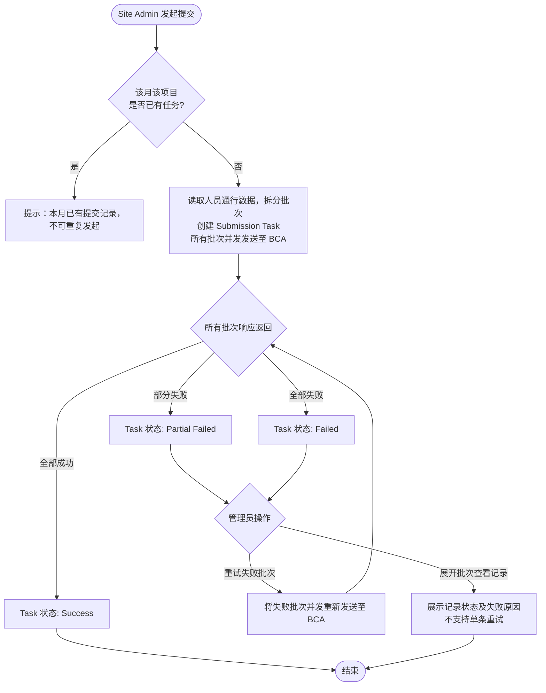

# REQ-015 BCA 月度人力数据提交

---

## 1. 背景与目标

### 1.1 业务背景

BCA（Building and Construction Authority）要求施工企业定期上报工地的人员通行数据（Manpower Attendance），用于统计每个工地月度实际出勤人力。系统已采集工地每日人员通行记录（含进出时间、人员身份、所属公司等信息），但目前尚无自动化上报机制，需人工整理后手动提交，效率低且易遗漏。

### 1.2 业务目标

- 支持工地管理员将系统采集的人员通行数据提交至 BCA 指定接口
- 由于单月数据量较大，支持分批次发送，并清晰呈现每批次的发送状态
- 支持对失败批次或失败记录进行重试，确保最终数据完整上报

### 1.3 非目标（Out of Scope）

- 本期不包含 BCA 返回的统计结果查看（仅做单向提交）
- 本期不包含 App 端操作入口
- 不支持跨项目合并提交（一次提交仅对应单个项目）
- 不提供对已成功发送数据的修改或撤回能力

---

## 2. 用户与角色

### 2.1 角色定义

| 角色 ID | 角色名 | 描述 | 典型场景 |
|--------|-------|------|---------|
| ROLE-001 | Site Admin（工地管理员） | 负责工地日常管理，有权操作 BCA 数据提交 | 每月第一周手动发起上月数据提交，或配置自动提交 |
| ROLE-002 | Platform Admin（平台管理员） | 系统级管理员，可管理所有项目配置 | 全局配置 BCA 接口凭证、管理自动提交开关 |

### 2.2 用户故事

#### US-001：发起月度数据提交

```
作为 ROLE-001 Site Admin
我想要 在当前项目下发起某月的 BCA 人力数据提交任务
以便 BCA 能统计该工地当月的实际出勤人力
```

**优先级**：P0

#### US-002：查看提交任务与批次状态

```
作为 ROLE-001 Site Admin
我想要 查看提交任务的整体进度及每个批次的发送状态
以便 了解数据是否已全部成功提交至 BCA
```

**优先级**：P0

#### US-003：重试失败批次

```
作为 ROLE-001 Site Admin
我想要 对发送失败的批次执行重试
以便 无需重新发起整个提交任务，只补发失败部分
```

**优先级**：P0

#### US-004：查看批次内失败记录详情

```
作为 ROLE-001 Site Admin
我想要 展开批次查看每条记录的发送状态及失败原因
以便 了解具体哪些人员数据未成功上报，决定是否对整批次重试
```

**优先级**：P1

#### US-005：配置自动提交

```
作为 ROLE-001 Site Admin / ROLE-002 Platform Admin
我想要 为项目开启自动提交，并设置每月自动触发时间
以便 系统在指定时间自动完成上月数据提交，无需人工干预
```

**优先级**：P1

---

## 3. 角色与权限矩阵

| 操作 | Site Admin | Platform Admin |
|-----|-----------|---------------|
| 查看提交任务列表 | ✅（仅本项目） | ✅（所有项目） |
| 手动发起提交任务 | ✅ | ✅ |
| 查看批次列表与状态 | ✅ | ✅ |
| 查看批次内记录详情 | ✅ | ✅ |
| 重试失败批次 | ✅ | ✅ |
| 配置自动提交开关 | ✅ | ✅ |
| 配置 BCA 接口凭证 | ❌ | ✅ |

---

## 4. 核心实体与数据生命周期

### 4.1 实体清单

| 实体 ID | 实体名 | 描述 | 关键属性（业务语义） |
|--------|-------|------|------------------|
| ENT-001 | Submission Task（提交任务） | 针对某项目某月发起的一次完整提交动作 | 项目、目标月份、触发方式（手动/自动）、整体状态、创建时间 |
| ENT-002 | Batch（批次） | 提交任务拆分后的每个 API 发送单元 | 所属提交任务、批次序号、包含记录数、发送状态、BCA 响应码、错误信息、发送时间 |
| ENT-003 | Batch Record（批次记录） | 批次内的单条人员通行数据 | 所属批次、人员信息（ID号、工种、Pass类型）、雇主信息、通行日期、进出时间、发送状态、错误信息 |
| ENT-004 | Auto Submit Config（自动提交配置） | 项目级的自动提交开关与调度设置 | 项目、是否启用、每月触发日（第几天）、触发时间 |

### 4.2 实体关系

- 一个项目每月最多存在一个 Submission Task（同月不可重复发起，除非重置）
- 一个 Submission Task 包含 1~N 个 Batch（1:N）
- 一个 Batch 包含 1~N 条 Batch Record（1:N）
- 一个项目对应一条 Auto Submit Config（1:1）

### 4.3 数据生命周期

**Submission Task 生命周期：**
1. 创建：手动点击「发起提交」或自动调度触发，系统读取该项目指定月份的人员通行数据，生成任务并拆分批次，同时将所有批次并发发送至 BCA
2. 完成：所有批次响应返回后，所有批次成功则状态为 Success；存在失败批次则为 Partial Failed；全部失败则为 Failed
3. 重试：针对失败批次/记录执行重试后，重新评估整体状态
4. 保留：任务及批次记录长期保留，不自动删除

---

## 5. 状态机

### 5.1 Submission Task 状态

| 状态 ID | 状态名 | 描述 | 是否终态 |
|--------|-------|------|---------|
| S-T-01 | Success | 所有批次全部发送成功 | 是 |
| S-T-02 | Partial Failed | 部分批次失败，其余成功 | 否（可重试） |
| S-T-03 | Failed | 所有批次均发送失败 | 否（可重试） |

### 5.2 Submission Task 状态转换表

| From | To | 触发动作 | 守卫条件 | 副作用 |
|------|----|---------|---------|-------|
| — | S-T-01 | 创建任务并所有批次响应成功 | 该月该项目无已有任务 | — |
| — | S-T-02 | 创建任务后批次响应返回 | 该月该项目无已有任务；存在 Failed Batch，存在 Success Batch | — |
| — | S-T-03 | 创建任务后批次响应返回 | 该月该项目无已有任务；所有 Batch 均为 Failed | — |
| S-T-02 | S-T-01 | 重试后所有批次成功 | — | — |
| S-T-02 | S-T-02 | 重试后仍有失败批次 | — | — |
| S-T-03 | S-T-01 | 重试后所有批次成功 | — | — |
| S-T-03 | S-T-02 | 重试后部分批次成功 | — | — |

### 5.3 Batch 状态

| 状态 ID | 状态名 | 描述 | 是否终态 |
|--------|-------|------|---------|
| S-B-01 | Sending | 已并发发出，正在等待 BCA 接口响应 | 否 |
| S-B-02 | Success | BCA 接口返回成功 | 是（除非被重试覆盖） |
| S-B-03 | Failed | BCA 接口返回错误或超时 | 否（可重试） |

### 5.4 Batch Record 状态

| 状态 ID | 状态名 | 描述 | 是否终态 |
|--------|-------|------|---------|
| S-R-01 | Success | 发送成功 | 是 |
| S-R-02 | Failed | 发送失败，含错误原因 | 是（不可单独重试，需通过批次重试覆盖） |

### 5.5 非法转换

- Submission Task 处于 `Success` 状态时不允许再次重试（已全部成功）
- 同一月份同一项目已存在任务时，不允许再次创建新任务（无论任务当前状态）
- 批次处于 `Sending` 状态时不允许手动重试
- Batch Record 不支持单条重试（BCA 接口限制），失败记录只能通过所属批次整体重试覆盖

---

## 6. 业务流程

### 6.1 主流程——手动发起提交

1. **Site Admin** 在当前项目的「BCA 数据提交」页面，选择目标月份，点击「发起提交」
2. **系统** 校验该月该项目是否已有任务；若无，读取当月人员通行数据，按固定批次大小（如每批 150 条）拆分，创建 Submission Task，并将所有 Batch **并发**发送至 BCA
3. **BCA 接口** 对每个批次独立返回结果：
   - 成功 → 该批次及其所有记录状态更新为 Success
   - 失败 → 该批次状态更新为 Failed，记录 BCA 错误信息；若 BCA 逐条返回结果，失败记录标记为 Failed
4. **系统** 所有批次响应均返回后，根据批次结果汇总写入 Submission Task 最终状态（Success / Partial Failed / Failed）
5. **Site Admin** 在批次列表中查看结果，对失败批次执行重试；可展开批次查看每条记录的失败原因，但不支持单条记录重试（BCA 接口限制）

### 6.2 主流程图（Mermaid）



### 6.3 子流程——自动触发

1. **系统调度器** 在每月配置的触发日触发自动任务（默认每月 1 日）
2. 遍历所有开启自动提交的项目，为每个项目自动创建上月的 Submission Task
3. 后续执行流程与手动触发相同（从 6.1 第 2 步开始）
4. 如自动触发时该月任务已存在（如管理员已手动提交），则跳过该项目，不重复创建

### 6.4 异常流程

| 异常场景 | 触发条件 | 系统响应 | 用户感知 |
|---------|---------|---------|---------|
| 重复发起 | 该月该项目已存在任务 | 拒绝创建，返回错误 | 页面提示「本月已有提交记录，请勿重复操作」 |
| BCA 接口超时 | 调用 BCA 接口超过超时阈值（如 30s） | 批次状态标为 Failed，记录超时错误 | 批次列表显示「发送失败 - 接口超时」 |
| BCA 接口返回业务错误 | BCA 返回非成功状态码 | 批次/记录状态标为 Failed，记录 BCA 错误码和描述 | 展示 BCA 返回的错误信息 |
| 该月无人员通行数据 | 指定月份下该项目无数据 | 阻止创建任务 | 提示「该月暂无人员通行数据，无需提交」 |
| 发送中再次点击重试 | 批次处于 Sending 状态时触发重试 | 忽略操作 | 重试按钮置灰，不可点击 |

---

## 7. 功能需求详述

### 7.1 F-001：提交任务列表页

**关联用户故事**：US-001、US-002

**展示内容**：
- 每行代表一个 Submission Task，展示：目标月份、触发方式（手动/自动）、总批次数、成功批次数、失败批次数、整体状态、创建时间
- 筛选区域仅提供月份、状态两个筛选项；列表数据固定为当前项目，不显示项目下拉列表
- 点击任意行进入该任务的批次详情页

**操作**：
- 「发起提交」按钮：弹出发起弹窗，仅需选择月份后确认（当前项目无需再次选择）
- 当该月该项目已有任务时，「发起提交」入口提示不可重复发起
### 7.2 F-002：提交任务详情页（批次列表）

**关联用户故事**：US-002、US-003

**顶部信息区**：
- 展示提交任务基本信息：项目、目标月份、触发方式、整体状态
- 进度汇总：如「已成功 8 / 共 10 批次」，可用进度条直观呈现

**批次列表**：

| 列名 | 说明 |
|-----|------|
| 批次序号 | 如 Batch #1、Batch #2 |
| 记录数 | 该批次包含的记录条数 |
| 状态 | Sending / Success / Failed（含状态图标/颜色） |
| 发送时间 | 最近一次发送时间 |
| 错误信息 | 失败时显示 BCA 返回的错误码和描述 |
| 操作 | 失败时展示「重试」按钮；Sending 时置灰 |

**批次级重试**：
- 点击某批次的「重试」→ 重新发送该批次的所有记录（含已成功记录，整批重发）
- 重试时批次状态更新为 Sending，完成后更新结果

**展开批次**：
- 批次行支持展开，展示该批次内的记录列表（详见 F-003）

### 7.3 F-003：批次内记录列表

**关联用户故事**：US-004

**展示内容**（每条记录）：

| 字段 | 说明 |
|-----|------|
| Person ID No | 人员证件号 |
| ID & Work Pass Type | 证件类型 |
| Trade | 工种（person_trade） |
| Employer Company | 雇主公司名称 |
| Attendance Date | 通行日期 |
| Time In / Time Out | 进出时间 |
| 状态 | Success / Failed |
| 错误信息 | 失败时展示 BCA 返回的错误描述 |

**说明**：
- BCA 接口不支持单条记录重试，记录列表仅供查看，无「重试」操作入口
- 如需补发失败记录，需通过所属批次的「重试」按钮对整个批次重发

### 7.4 F-004：自动提交配置

**关联用户故事**：US-005

**配置项**：
- 自动提交开关（启用 / 关闭）
- 触发日：每月第几日触发（默认第 1 日，可选 1~7 日）
- 触发时间：具体时间点（如 02:00 AM，避开业务高峰）

**规则**：
- 若该月该项目已有任务（手动创建），自动触发时跳过，不重复创建
- 关闭自动提交后，已创建的任务不受影响，仅后续月份不再自动触发

**入口**：项目设置页内的「BCA 自动提交」配置区域

### 7.5 F-005：数据快照

**说明**：提交任务创建时，系统对当月人员通行数据做快照，后续即使源数据有变更，已提交的数据内容不变。快照数据与 Batch Record 绑定存储。

---

## 8. 验收标准（Acceptance Criteria）

### AC-015-001：手动发起提交任务

```
Given  Site Admin 在当前项目的提交任务列表页，该月该项目无任何任务
When   选择月份后点击「发起提交」并确认
Then   系统创建 Submission Task，生成所有 Batch 并立即并发发送至 BCA
       所有批次响应返回后，Task 状态写入 Success / Partial Failed / Failed
```

### AC-015-002：防重复发起

```
Given  该月该项目已存在任何状态的任务
When   Site Admin 再次尝试发起同月的提交
Then   系统拒绝，页面提示不可重复发起
```

### AC-015-003：批次发送成功状态更新

```
Given  某批次处于 Sending 状态
When   BCA 接口返回成功响应
Then   该批次状态更新为 Success，其所有记录状态更新为 Success
       系统重新评估 Submission Task 整体状态
```

### AC-015-004：批次发送失败状态更新

```
Given  某批次处于 Sending 状态
When   BCA 接口返回错误响应或超时
Then   该批次状态更新为 Failed，记录 BCA 错误信息
       系统重新评估 Submission Task 整体状态（Partial Failed 或 Failed）
```

### AC-015-005：批次重试

```
Given  某批次状态为 Failed
When   Site Admin 点击该批次的「重试」按钮
Then   该批次状态更新为 Sending，系统重新调用 BCA 接口发送该批次所有记录
       发送结果更新批次状态及任务整体状态
```

### AC-015-006：单条记录不可单独重试

```
Given  批次内某条记录状态为 Failed
When   Site Admin 展开该批次查看记录列表
Then   记录行无「重试」操作入口
       如需补发，须通过所属批次的「重试」按钮整批重发
```

### AC-015-007：无数据时阻止创建

```
Given  指定月份下该项目无人员通行数据
When   Site Admin 尝试发起提交
Then   系统阻止创建任务，提示「该月暂无人员通行数据，无需提交」
```

### AC-015-008：自动提交触发

```
Given  项目已开启自动提交，触发日为每月第 1 日
When   系统时间到达触发日触发时间
Then   系统自动为该项目创建上月的 Submission Task，执行数据提交
       任务创建后页面可见，触发方式显示为「自动」
```

### AC-015-009：自动提交不重复创建

```
Given  项目已开启自动提交，且当月该项目已存在任务（手动创建）
When   自动调度触发
Then   系统跳过该项目，不创建新任务，不影响已有任务
```

### AC-015-010：数据快照一致性

```
Given  提交任务创建后，源系统中的人员通行数据发生变更
When   查看该提交任务的批次记录
Then   展示的记录内容与任务创建时的快照一致，不随源数据变更而改变
```

### AC-015-011：Sending 状态下不可重试

```
Given  某批次状态为 Sending
When   用户查看批次列表
Then   该批次的「重试」按钮处于禁用状态，无法点击
```

---

## 9. 非功能需求

### 9.1 性能

| 指标 | 目标值 | 测量方式 |
|-----|-------|---------|
| 批次创建速度 | 万级数据在 5s 内完成拆批并写入 DB | 压测 |
| 页面批次列表加载 | < 2s（100 批次以内） | Lighthouse / APM |
| BCA 接口单次超时阈值 | 30s | 接口层配置 |

### 9.2 安全

- 鉴权方式：JWT，与现有系统一致
- BCA 接口凭证（API Key 等）加密存储，不在前端暴露
- 审计：发起提交、重试批次、重试记录均需记录操作日志（操作人、时间、操作类型）
- 越权防护：Site Admin 只能操作本人有权限的项目，后端行级校验

### 9.3 可靠性

- 批次发送采用异步队列处理，避免大批量发送阻塞主线程
- 批次发送失败后不自动重试（由人工触发重试），避免频繁调用 BCA 接口
- 系统重启后，处于 Sending 状态的批次应恢复为 Failed，提示用户手动重试

### 9.4 兼容性

- 浏览器：Chrome 100+、Edge 100+、Safari 15+
- 移动端：不支持（仅 PC）
- 国际化：中英双语（与现有系统一致）

---

## 10. 数据量级与扩展性

| 维度 | 当前预期 | 1 年后 |
|-----|---------|-------|
| 单月单项目人员通行记录数 | 约 3,000 ~ 10,000 条 | 约 20,000 条 |
| 每批次记录数（建议值） | 100 条/批 | 可配置调整 |
| 单次提交任务批次数 | 30 ~ 100 批 | 约 200 批 |
| 并发提交任务数 | 多个项目同时提交 | 需队列限流 |

---

## 11. 依赖与外部系统

| 依赖系统 | 用途 | 集成方式 | Owner |
|---------|------|---------|-------|
| BCA Manpower Reporting API | 接收人员通行数据上报 | REST API（由 BCA 提供） | BCA / 平台管理员配置凭证 |
| 系统内部人员通行数据服务 | 数据来源，提供月度通行记录 | 内部服务调用 | 后端团队 |
| 系统调度服务 | 自动触发月度提交任务 | Cron Job / Job Scheduler | 后端团队 |

---

## 12. 数据迁移

无（全新功能，无历史存量数据需迁移）

---

## 13. 上线操作清单（Launch Checklist）

### 13.1 上线前

- [ ] BCA API 凭证（API Key / Secret）已在平台管理员后台配置
- [ ] 批次大小参数（每批记录数）已在系统配置中设定默认值（建议 100）
- [ ] BCA 接口超时阈值已配置（建议 30s）
- [ ] 自动提交调度任务已注册，默认关闭
- [ ] 操作日志表已创建并接入审计系统

### 13.2 上线后

- [ ] 验证手动发起提交任务流程端到端可用（含真实 BCA 接口联调）
- [ ] 验证失败批次重试功能正常
- [ ] 验证自动提交在测试项目上按预期触发
- [ ] 通知 Site Admin 新功能上线，提供操作说明

---

## 14. 灰度与发布策略

- 灰度方式：按项目灰度，先在 1~2 个试点项目开放
- 灰度比例：试点项目 → 全量
- 监控指标：批次发送成功率、BCA 接口错误率、重试频率
- 回滚预案：关闭自动提交开关；手动发起入口通过 Feature Flag 隐藏，不需要 DB 回滚

---

## 15. 成功指标（北极星）

| 指标 | 当前基线 | 目标 | 测量周期 |
|-----|---------|------|---------|
| 月度数据提交成功率 | 0%（当前无自动化） | ≥ 99% 记录成功上报 | 每月 |
| 提交任务完成时效 | 手动 > 数小时 | 自动化 < 30 分钟（万级数据） | 每月 |
| 人工重试操作次数 | — | 逐月下降趋势 | 每月 |

---

## 16. Open Questions

| OQ ID | 问题 | 影响 | Owner | 截止 |
|------|------|------|-------|------|
| OQ-001 | BCA 接口对单次批次的最大记录数是否有限制？需要 BCA 接口文档确认 | 影响批次拆分策略 | 后端 TL | — |
| OQ-002 | BCA 接口对同一条记录重复提交是否有幂等保障？重试时是否会产生重复数据？ | 影响重试策略设计 | 后端 TL | — |
| OQ-003 | BCA 接口调用频率是否有限流要求（Rate Limit）？ | 影响批次发送间隔策略 | 后端 TL | — |
| OQ-004 | 已成功的批次重试（因批次整体重发）时，BCA 是否会对重复记录报错？ | 影响批次重试的粒度决策 | 后端 TL | — |

---

## 17. Figma / 原型链接

- Figma 设计稿：<!-- TODO: 设计稿完成后补充 -->
- 交互原型：<!-- TODO -->

---

## 18. 变更历史

| 版本 | 日期 | 修改人 | 变更摘要 | 影响下游文档 |
|-----|------|-------|---------|------------|
| 0.1.0 | 2026-05-17 | | 初稿，包含手动/自动提交、批次管理、单条/批次重试完整流程 | 全部 |
| 0.2.0 | 2026-05-18 | | 1) 发起提交弹窗不再选择项目，仅选择月份（当前项目上下文）；2) Submission Task 状态去除 Pending 和 In Progress，所有批次并发发送，任务创建即进入 Sending；3) Batch 状态去除 Pending，Record 状态去除 Pending | UI、Frontend、Backend、QA |
| 0.3.0 | 2026-05-18 | | Submission Task 状态移除 Sending，任务直接落地为 Success / Partial Failed / Failed；防重复校验改为「该月已有任何任务均不可重复发起」 | UI、Frontend、Backend、QA |
| 0.4.0 | 2026-05-18 | | BCA 接口不支持单条记录重试，仅支持批次级重试：1) US-004 改为「查看批次内记录详情」；2) 权限矩阵移除「重试单条失败记录」；3) Batch Record Failed 状态改为终态；4) §5.5 补充非法操作；5) F-003 移除重试按钮；6) AC-015-006 改为不可单独重试的验收标准 | UI、Frontend、Backend、QA |
| 0.5.0 | 2026-05-18 | | 任务列表页筛选区域移除项目下拉列表，列表数据固定为当前项目上下文，仅保留月份和状态筛选项 | UI、Frontend |