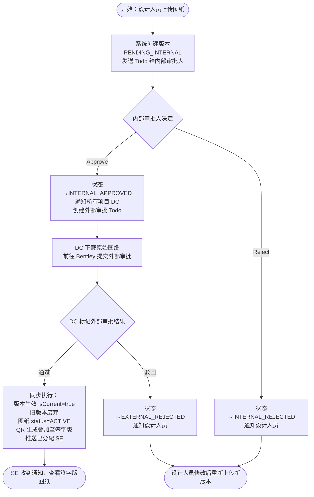

# 需求文档：图纸两级审批流程（内部审批 + 外部审批）

> **适用范围**：本文档定义图纸两级审批流程的**跨端共享**部分：角色定义、完整审批流程、数据模型扩展、API 接口、通知机制。
> PC 端 UI 交互拆分至 [REQ-007A-pc](../pc/REQ-007A-pc.md)（内部审批 Todo）、[REQ-007B-pc](../pc/REQ-007B-pc.md)（DC 外部审批 Todo）、[REQ-007C-pc](../pc/REQ-007C-pc.md)（版本历史抽屉）、[REQ-007D-pc](../pc/REQ-007D-pc.md)（DC 配置页）。
> 本需求基于 [REQ-003-shared](./REQ-003-shared.md) 进行扩展，将原有单级审批升级为内部 + 外部两级串行审批。

---

## 1. 背景与目标

### 1.1 业务背景

当前 REQ-003 定义的图纸审批为单级审批（一个审批人通过即生效）。实际业务中，图纸需要经过**内部技术审核**和**外部方审批**两个阶段：

- **内部审批**：由能看懂图纸的技术人员（设计经理、总工程师等）审核图纸的技术内容和质量
- **外部审批**：由业主代表、监理、设计院等外部方在 **Bentley 平台**上审批，审批通过后产出带外部签字的正式图纸

当前痛点：

- 单级审批无法区分内部质量把关和外部合规审批
- Document Controller (DC) 需要在 Smart Site 和 Bentley 之间手动流转，缺乏系统化追踪
- Site Engineer 看到的应该是**外部签字版图纸**，而非原始上传版本
- 图纸的责任追溯不清晰（上传人 vs 审批人 vs 流转人）

### 1.2 业务目标

1. 将图纸审批升级为**内部审批 → 外部审批**两级串行流程
2. 明确角色分工：设计人员上传（责任人）→ 内部审批人审核技术内容 → DC 负责外部审批流转
3. DC 将外部审批通过的签字版图纸回传到 Smart Site，作为最终流通版本
4. Site Engineer 看到的始终是**带外部签字的正式图纸**
5. 版本正式生效时同步生成 QR 码并叠加到签字版 PDF，确保流通的图纸从一开始就带有 QR
6. 新增项目级 DC 配置页面，减少业务人员重复操作
7. 所有图纸均需经过外部审批，无"仅内部审批"选项

### 1.3 非目标（Out of Scope）

- Smart Site 与 Bentley 平台直接集成（外部审批过程在 Bentley 上进行，Smart Site 无感知）
- 移动端（APP）支持 DC 外部审批标记操作
- 图纸内容的在线批注（属于 REQ-004 Markup 范畴）

---

## 2. 用户与角色

### 2.1 角色定义

| 角色 ID | 角色名 | 描述 | 典型场景 |
|--------|-------|------|---------|
| ROLE-001 | 设计人员（Designer） | 图纸责任人，负责上传图纸并指定内部审批人 | 上传新版图纸；收到驳回通知后修改重传 |
| ROLE-002 | 内部审批人 | 拥有 `drawing:approve` 权限的技术人员（设计经理、总工程师等） | 审核图纸技术内容，通过或驳回 |
| ROLE-003 | Document Controller (DC) | 负责外部审批流转的专职人员，由管理员在配置页指定 | 下载原始图纸提交 Bentley；回传签字版并标记结果 |
| ROLE-004 | Site Engineer (SE) | 现场工程师，查看和使用最终审批通过的签字版图纸 | 收到通知后查看最新版图纸，扫码核验 |
| ROLE-005 | 项目管理员 / 业务人员 | 拥有 `drawing:dc-config` 权限，负责配置项目 DC 人员 | 在 Settings > DC Configuration 页面增删 DC |

### 2.2 用户故事（User Stories）

> 每个 story 必须有唯一 ID，验收标准也挂在 story 上，便于下游追溯。

#### US-001：设计人员上传图纸并发起内部审批

```
作为 ROLE-001 设计人员（Designer）
我想要 上传图纸并指定内部审批人
以便 图纸经过技术审核后再进入外部审批流程，出问题时责任明确可追溯
```

**优先级**: P1

---

#### US-002：内部审批人审核图纸

```
作为 ROLE-002 内部审批人（设计经理 / 总工程师）
我想要 在 Todo 列表中审核图纸的技术内容并决定通过或驳回
以便 确保提交给外部方的图纸质量达标，避免外部审批来回反复
```

**优先级**: P1

---

#### US-003：DC 接收通知并下载原始图纸

```
作为 ROLE-003 Document Controller (DC)
我想要 收到内部审批通过的通知后，从 Todo 列表下载原始图纸提交到 Bentley
以便 高效完成外部审批流转，不需要在系统间来回查找文件
```

**优先级**: P1

---

#### US-004：DC 标记外部审批结果

```
作为 ROLE-003 Document Controller (DC)
我想要 外部审批通过后，在 Smart Site 上传签字版图纸和审批凭证，一次性完成标记
以便 版本立即生效并自动推送给已分配的 Site Engineer，无需重复操作
```

**优先级**: P1

---

#### US-005：Site Engineer 查看签字版图纸

```
作为 ROLE-004 Site Engineer
我想要 收到的图纸是经过外部签字的正式版本
以便 现场施工依据的是合规的正式图纸，与纸质流通版一致
```

**优先级**: P1

---

#### US-006：业务人员配置项目 DC

```
作为 ROLE-005 项目管理员 / 业务人员
我想要 在配置页面设置项目的 DC 人员，而不是每次上传都指定
以便 减少重复操作，DC 人员变动时只需修改一处配置
```

**优先级**: P2

---

## 3. 角色与权限矩阵

> 下游 UI agent 据此生成「显示/隐藏/禁用」逻辑，后端 agent 据此生成权限校验。

| 操作 | 设计人员 | 内部审批人 | DC | Site Engineer | 管理员 / 业务人员 |
|------|---------|-----------|-----|--------------|----------------|
| 上传图纸 / 新版本（`drawing:upload`） | ✅ | ❌ | ❌ | ❌ | ❌ |
| 内部审批（通过 / 驳回）（`drawing:approve`） | ❌ | ✅ | ❌ | ❌ | ❌ |
| 外部审批标记（`drawing:external-approval`） | ❌ | ❌ | ✅（需配置） | ❌ | ❌ |
| DC 配置管理（`drawing:dc-config`） | ❌ | ❌ | ❌ | ❌ | ✅ |
| 查看图纸列表（`drawing:view`） | ✅ | ✅ | ✅ | ✅ | ✅ |
| 查阅确认（`drawing:confirm`） | ❌ | ❌ | ❌ | ✅ | ❌ |
| 查看版本历史（`drawing:history`） | ✅ | ✅ | ✅ | ❌ | ✅ |
| 分配图纸给 SE（`drawing:assign`） | ❌ | ❌ | ❌ | ❌ | ✅ |

---

## 4. 核心实体与数据生命周期

> ⚠️ **重要**：本节定义业务实体的**业务语义**，不定义技术字段。技术字段在 `data-contract.md` 中定义。

### 4.1 实体清单

| 实体 ID | 实体名 | 描述 | 关键属性（业务语义） |
|--------|-------|------|------------------|
| ENT-001 | DrawingVersion | 图纸版本记录 | 版本号、审批状态（5 态）、原始文件 URL、签字版文件 URL、QR URL、isCurrent |
| ENT-002 | DrawingApproval | 单次审批记录 | phase（INTERNAL / EXTERNAL）、status（APPROVED / REJECTED）、审批人、审批意见、审批时间 |
| ENT-003 | ProjectDcConfig | 项目 DC 配置 | projectId、dcUserId，联合唯一约束，同一用户同一项目只能配置一次 |
| ENT-004 | Drawing | 图纸主记录 | Drawing Code、当前版本号、当前状态（5 态） |

### 4.2 实体关系

- 一个 Drawing 包含多个 DrawingVersion（1:N）
- 一个 DrawingVersion 包含多条 DrawingApproval（1:N，最多 2 条：phase=INTERNAL + phase=EXTERNAL）
- 一个项目包含多条 ProjectDcConfig（1:N，每条对应一个 DC 用户）

### 4.3 数据生命周期

**DrawingVersion 生命周期**：

1. **创建**：设计人员上传图纸时创建，`approvalStatus = PENDING_INTERNAL`
2. **流转**：经内部审批（`INTERNAL_APPROVED`）→ 经外部审批（`APPROVED` 或 `EXTERNAL_REJECTED`）
3. **生效**：`approvalStatus = APPROVED` 且 `isCurrent = true` 时为当前有效版本
4. **废弃**：新版本生效后，旧版本 `isCurrent = false`、`isDeprecated = true`
5. **保留**：原始文件（`fileUrl`）和签字版文件（`signedFileUrl`）永久保留，不删除

**ProjectDcConfig 生命周期**：

1. **创建 / 更新**：管理员在 DC 配置页全量覆盖写入
2. **使用**：内部审批通过时系统读取配置，向所有已配置 DC 发送通知
3. **删除**：管理员更新配置时移除旧记录，不影响历史审批记录

---

## 5. 状态机

> 下游后端 agent 据此生成状态转换代码，QA agent 据此生成状态转换测试用例。

### 5.1 DrawingVersion.approvalStatus 状态定义

| 状态 ID | 枚举值 | UI 展示（英文） | 中文含义 | 描述 | 是否终态 |
|--------|--------|--------------|---------|------|---------|
| S-001 | PENDING_INTERNAL | Pending Internal | 待内部审批 | 设计人员上传后的初始状态 | 否 |
| S-002 | INTERNAL_APPROVED | Pending External | 待外部审批 | 内部审批通过，等待 DC 流转外部审批 | 否 |
| S-003 | INTERNAL_REJECTED | Int. Rejected | 内部驳回 | 内部审批人驳回 | 是（该版本） |
| S-004 | APPROVED | Approved | 已通过 | 内外部均通过，版本正式生效 | 是 |
| S-005 | EXTERNAL_REJECTED | Ext. Rejected | 外部驳回 | DC 标记外部审批驳回 | 是（该版本） |

> **注意**：`INTERNAL_APPROVED` 在 UI 展示为 "Pending External"，因为从用户视角该版本正在等待外部审批。

### 5.2 状态转换表

| From | To | 触发动作 | 守卫条件（前置） | 副作用 |
|------|-----|---------|-------------|-------|
| S-001 PENDING_INTERNAL | S-002 INTERNAL_APPROVED | 内部审批人点击 [Approve] | 操作人拥有 `drawing:approve` 权限 | 通知项目所有已配置 DC；创建外部审批 Todo |
| S-001 PENDING_INTERNAL | S-003 INTERNAL_REJECTED | 内部审批人点击 [Reject] | comment 必填 | 通知设计人员（上传人）；旧版本保持 isCurrent=true |
| S-002 INTERNAL_APPROVED | S-004 APPROVED | DC 点击 [Mark Result] 选择通过 | 操作人为项目已配置 DC；签字版 / 凭证 / 日期均已填写 | 版本生效（isCurrent=true）；旧版本废弃；图纸 status→ACTIVE；同步生成 QR；推送已分配 SE |
| S-002 INTERNAL_APPROVED | S-005 EXTERNAL_REJECTED | DC 点击 [Mark Result] 选择驳回 | comment 必填 | 通知设计人员；旧版本保持 isCurrent=true |

### 5.3 非法转换

- `APPROVED` 版本不可再次审批或撤销
- `INTERNAL_REJECTED` / `EXTERNAL_REJECTED` 版本不可重新提交审批（必须上传新版本）
- `INTERNAL_APPROVED`（Pending External）状态下不可被内部审批操作
- 若图纸已有版本处于 `PENDING_INTERNAL` 或 `INTERNAL_APPROVED` 状态，禁止上传新版本

---

## 6. 业务流程

### 6.1 主流程

流程：图纸两级审批（成功路径）

1. **[ROLE-001 设计人员]** 在图纸列表点击 [Upload]，选择图纸文件，指定内部审批人，提交 → **系统**创建 DrawingVersion（PENDING_INTERNAL），发送 Todo 任务给内部审批人
2. **[ROLE-002 内部审批人]** 在 Todo 列表（PC / APP）打开审批任务，查看原始文件，点击 [Approve] → **系统**更新状态为 INTERNAL_APPROVED，通知所有项目 DC，创建外部审批 Todo
3. **[ROLE-003 DC]** 收到站内通知，在 Todo 列表下载原始图纸，前往 Bentley 平台提交外部审批（系统外操作）
4. **[ROLE-003 DC]** 外部审批完成后，回到 Smart Site Todo 列表，点击 [Mark Result]，选择"通过"，上传签字版文件、审批凭证，填写外部审批日期，点击 [Confirm]
5. **[系统]** 同步执行（loading 3–5 秒）：写入签字版信息 → 版本生效（isCurrent=true，旧版本废弃）→ 图纸 status=ACTIVE → QR 生成并叠加至签字版 PDF → 推送已分配 SE
6. **[ROLE-004 SE]** 收到 App Push + 站内消息，查看 / 下载签字版图纸（带 QR）

### 6.2 主流程图（Mermaid）



### 6.3 异常流程

| 异常场景 | 触发条件 | 系统响应 | 用户感知 |
|---------|---------|---------|---------|
| 上传时图纸已有版本在审批中 | 图纸存在 PENDING_INTERNAL 或 INTERNAL_APPROVED 版本 | 拒绝上传，返回错误码 1003007001 | Toast "A version is currently in the approval process" |
| 内部审批驳回未填原因 | comment 为空时点击 [Confirm] | 前端校验拦截 | 输入框下方红色提示 |
| DC 外部通过时必填项缺失 | 签字版 / 凭证 / 日期任一为空 | 前端校验拦截 | 对应字段红色提示 |
| QR 生成失败 | QR 服务不可用或 OSS 异常 | 整体操作回滚，版本保持 INTERNAL_APPROVED，Toast 报错 | "QR generation failed, please retry"，DC 当场重试 |
| 非 DC 用户调用外部审批接口 | 操作人未在项目 DC 配置中 | 返回 403，错误码 1003007003 | Toast "You are not a configured DC for this project" |
| DC 已被其他 DC 抢先标记 | 该版本外部审批 Todo 已关闭 | 返回任务已处理提示 | "This version has already been processed by another DC" |
| 项目未配置任何 DC | 内部审批通过后 DC 列表为空 | 状态停留在 INTERNAL_APPROVED，触发管理员告警 | 管理员收到站内告警"项目未配置 DC，请前往配置页设置"（见 OQ-001） |

---

## 7. 功能需求详述

### 7.1 F-001：图纸上传变更（替代 REQ-003 §4.1）

**关联用户故事**: US-001
**所属流程节点**: 流程 6.1 第 1 步

**变更说明**（接口 `POST /drawing/upload` 不变，业务逻辑调整）：

- 上传人角色从"Drawing 团队"明确为**设计人员**（图纸责任人）
- 版本初始状态从 `PENDING` 改为 `PENDING_INTERNAL`
- 审批任务创建时 `phase = INTERNAL`
- 新增校验：若图纸有版本处于 `PENDING_INTERNAL` 或 `INTERNAL_APPROVED` 状态，拒绝上传

**新增错误码**：

| 错误码 | 英文提示 | 中文提示 |
|--------|---------|---------|
| 1003007001 | A version is currently in the approval process | 该图纸已有版本正在审批流程中 |

---

### 7.2 F-002：内部审批（替代 REQ-003 §4.2）

**关联用户故事**: US-002
**所属流程节点**: 流程 6.1 第 2 步

**接口**：`POST /drawing/approve`（不变）

**变更说明**：

- 仅处理 `phase = INTERNAL` 的审批任务
- **通过**后：版本状态 → `INTERNAL_APPROVED`，通知项目所有已配置 DC，创建外部审批 Todo
- **驳回**后：版本状态 → `INTERNAL_REJECTED`，通知设计人员（上传人），旧版本保持有效

---

### 7.3 F-003：DC 外部审批标记（新增）

**关联用户故事**: US-003, US-004
**所属流程节点**: 流程 6.1 第 4–5 步

**接口**：`POST /drawing/external-approve`（新增，`multipart/form-data`）

**请求参数**：

| 参数 | 类型 | 必填 | 说明 |
|------|------|------|------|
| drawingVersionId | Long | ✅ | 图纸版本 ID |
| action | String | ✅ | `APPROVED`（通过）/ `REJECTED`（驳回） |
| signedFile | File | action=APPROVED 时必填 | 签字版图纸，≤ 50MB |
| evidenceFile | File | action=APPROVED 时必填 | 审批凭证，≤ 20MB，支持 PDF / PNG / JPG |
| externalApprovalDate | Date | action=APPROVED 时必填 | 格式 YYYY-MM-DD |
| remark | String | ❌ | 备注，≤ 500 字符 |
| comment | String | action=REJECTED 时必填 | 驳回原因 |

**业务逻辑（通过路径）**：

1. 校验操作人拥有 `drawing:external-approval` 权限且为项目已配置 DC
2. 校验版本 `approvalStatus = INTERNAL_APPROVED`
3. 上传签字版文件和审批凭证至 OSS，写入外部审批相关字段
4. 同步执行版本生效 + QR 生成 + 推送已分配 SE（见 §5.2 状态转换副作用）
5. 关闭其他 DC 的外部审批 Todo

**错误响应码**：

| 错误码 | 英文提示 | 中文提示 |
|--------|---------|---------|
| 1003007002 | This version is not pending external approval | 该版本未处于待外部审批状态 |
| 1003007003 | You are not a configured DC for this project | 您不是该项目的已配置 DC |
| 1003007004 | Signed file format not supported | 签字版文件格式不支持 |
| 1003007005 | Signed drawing file is required when approving | 外部审批通过时签字版图纸文件必填 |
| 1003007006 | Approval evidence is required when approving | 外部审批通过时审批凭证必填 |
| 1003007007 | External approval date is required when approving | 外部审批通过时外部审批日期必填 |
| 1003007008 | Comment is required when rejecting | 驳回时驳回原因不能为空 |
| 1003007009 | QR generation failed, please retry | QR 生成失败，请重试 |

---

### 7.4 F-004：DC 配置管理（新增）

**关联用户故事**: US-006
**所属流程节点**: 前置配置（不在主审批流程内）

**接口 A**：`GET /project/dc-config/list`（权限：`drawing:dc-config`）

响应包含：
- `dcList`：当前已配置的 DC 列表（id、dcUserId、dcUserName、configuredByName、configuredAt）
- `availableUsers`：项目中有 `drawing:external-approval` 权限但未配置为 DC 的用户

**接口 B**：`POST /project/dc-config/update`（权限：`drawing:dc-config`）

请求体：`{ "dcUserIds": [3001, 3002] }`

**业务规则**：

- 全量覆盖模式：替换当前项目的 DC 配置
- `dcUserIds` 不能为空数组（项目至少需要 1 个 DC）
- 所有 `dcUserIds` 必须拥有 `drawing:external-approval` 权限

**错误响应码**：

| 错误码 | 英文提示 | 中文提示 |
|--------|---------|---------|
| 1003007010 | At least one DC is required | DC 列表不能为空，项目至少需要 1 个 DC |
| 1003007011 | One or more user IDs are invalid or lack DC permission | 包含无效的用户 ID 或用户缺少 DC 操作权限 |

---

### 7.5 F-005：外部审批 Todo 数据结构（扩展 REQ-003 §4.7）

**关联用户故事**: US-003
**接口**：`GET /todo/list`（现有接口，新增 Todo 类型）

新增 `type = DRAWING_EXTERNAL_APPROVAL`，`extra` 字段包含：

| 字段 | 说明 |
|------|------|
| drawingId | 图纸主记录 ID |
| drawingCode | 图纸编号 |
| drawingName | 图纸名称 |
| versionNo | 版本号（如 V3） |
| fileUrl | 原始图纸文件 OSS 地址（供 DC 直接下载） |
| fileName | 原始图纸文件名 |
| internalApproverName | 内部审批人姓名 |
| internalApprovedTime | 内部审批通过时间 |

---

### 7.6 F-006：通知机制（替代 REQ-003 §5.1）

**关联用户故事**: US-001 ~ US-005

| 触发事件 | 通知类型 | 接收人 | 通知内容 |
|---------|---------|--------|---------|
| 设计人员上传，发起内部审批 | Todo 任务 | 指定的内部审批人 | "图纸 {drawingCode} {drawingName} V{n} 等待您的内部审批" |
| 内部审批通过 | Todo 任务 + 站内通知 | 项目所有已配置 DC | "图纸 {drawingCode} {drawingName} V{n} 内部审批已通过，请提交外部审批" |
| 内部审批驳回 | 站内消息 | 设计人员（上传人） | "图纸 {drawingCode} V{n} 内部审批未通过：{comment}" |
| 外部审批通过（DC 标记后） | App Push + 站内消息 | **已分配的 SE**（由管理员 [Assign] 分配） | "图纸 {drawingCode} {drawingName} 已更新至 V{n}，请查阅" |
| 外部审批驳回（DC 标记后） | 站内消息 | 设计人员（上传人） | "图纸 {drawingCode} V{n} 外部审批未通过：{comment}" |

> ⚠️ **重要业务规则**：外部审批通过后**不自动推送全部 SE**；必须由项目管理员在图纸列表点击 [Assign] 完成 SE 分配后，被分配的 SE 才能收到 App Push + 站内消息。详见 [REQ-003D-pc](../pc/REQ-003D-pc.md)。

---

### 7.7 F-007：文件使用优先级规则

| 场景 | 使用的文件 | 说明 |
|------|----------|------|
| 内部审批人审核 | `fileUrl`（原始文件） | 签字版尚不存在 |
| DC 下载提交 Bentley | `fileUrl`（原始文件） | 从 Todo 列表下载 |
| Site Engineer 查看 | `signedFileUrl`（签字版） | 最终流通版 |
| Site Engineer 下载 | `pdfWithQrUrl` > `signedFileUrl` | 优先带 QR 的签字版 |
| 管理员 / Drawing 团队 | 原始文件 + 签字版 | 版本详情中区分展示 |
| QR 叠加（REQ-006） | `signedFileUrl` | 叠加到签字版上 |
| Markup 标注（REQ-004） | `signedFileUrl` | 基于签字版 |
| 审计追溯 | `fileUrl` + `signedFileUrl` | 原始文件始终保留 |

---

## 8. 验收标准（Acceptance Criteria）

> ⚠️ **关键**：每条 AC 必须有唯一 ID，格式 `AC-007-{序号}`。
> 下游 QA agent 必须为每个 AC 至少派生 1 条 TC，且 TC 描述显式标注覆盖的 AC ID。

### AC-007-001：图纸有版本在审批中时禁止再次上传

**关联用户故事**: US-001

```
Given  某图纸已有版本处于 PENDING_INTERNAL 或 INTERNAL_APPROVED 状态
When   设计人员尝试上传该图纸的新版本
Then   系统拒绝上传，返回错误码 1003007001
       且前端 Toast 提示 "A version is currently in the approval process"
```

### AC-007-002：内部审批通过后正确流转并通知 DC

**关联用户故事**: US-002

```
Given  图纸版本处于 PENDING_INTERNAL 状态
When   内部审批人在 Todo 列表点击 [Approve]
Then   版本状态更新为 INTERNAL_APPROVED
       且项目所有已配置 DC 收到站内通知并在 Todo 列表看到外部审批任务
       且不推送 SE、不生成 QR
```

### AC-007-003：内部审批驳回 comment 必填

**关联用户故事**: US-002

```
Given  内部审批人在审批 Dialog 选择驳回
When   comment 字段为空时点击 [Confirm]
Then   前端拦截提交，输入框下方显示红色错误提示，不发起接口请求
```

### AC-007-004：内部审批驳回后通知设计人员

**关联用户故事**: US-002

```
Given  内部审批人填写驳回原因并点击 [Confirm]
When   系统处理驳回操作
Then   版本状态更新为 INTERNAL_REJECTED
       且设计人员（上传人）收到站内消息，内容包含驳回原因
       且旧版本（若存在）仍保持 isCurrent=true
```

### AC-007-005：DC 可从 Todo 直接下载原始图纸

**关联用户故事**: US-003

```
Given  内部审批通过后，DC 在 Todo 列表看到外部审批任务
When   DC 点击任务中的下载按钮
Then   浏览器触发下载，文件为该版本的原始图纸（fileUrl 对应的文件）
```

### AC-007-006：DC 标记外部通过必填项校验

**关联用户故事**: US-004

```
Given  DC 在 Mark Result Dialog 选择"通过"
When   签字版文件、审批凭证、外部审批日期中任一未填写时点击 [Confirm]
Then   前端拦截提交，对应字段下方显示红色错误提示
```

### AC-007-007：外部审批通过后版本生效并推送 SE

**关联用户故事**: US-004, US-005

```
Given  DC 填写所有必填项并点击 [Confirm]
When   系统同步执行外部审批通过操作（3–5 秒 loading）
Then   版本 approvalStatus=APPROVED、isCurrent=true
       且旧版本 isCurrent=false、isDeprecated=true
       且图纸 status=ACTIVE
       且 QR 生成并叠加至签字版 PDF（pdfWithQrUrl 有值）
       且已分配的 SE 收到 App Push + 站内消息
       以上全部在同一事务中完成
```

### AC-007-008：QR 生成失败时操作回滚

**关联用户故事**: US-004

```
Given  DC 触发外部审批通过操作，但 QR 服务不可用
When   系统尝试生成 QR 失败
Then   整体操作回滚，版本保持 INTERNAL_APPROVED 状态
       且 Toast 显示 "QR generation failed, please retry"
       且不推送 SE，不存在"已生效但无 QR"的版本
```

### AC-007-009：外部审批驳回后通知设计人员

**关联用户故事**: US-004

```
Given  DC 选择驳回并填写原因
When   系统处理外部驳回操作
Then   版本状态更新为 EXTERNAL_REJECTED
       且设计人员（上传人）收到站内消息，内容包含驳回原因
       且旧版本（若存在）仍保持 isCurrent=true
```

### AC-007-010：同一版本只需一个 DC 完成操作

**关联用户故事**: US-004

```
Given  项目配置了多个 DC，某 DC 已完成外部审批标记
When   其他 DC 尝试查看该外部审批 Todo
Then   该 Todo 状态显示为已关闭，页面提示"This version has already been processed by another DC"
```

### AC-007-011：SE 查看的始终是签字版图纸

**关联用户故事**: US-005

```
Given  图纸有一个 APPROVED 版本（isCurrent=true）
When   SE 在 PC 端或 APP 端打开图纸详情
Then   显示的文件为签字版（signedFileUrl）
       且下载时优先返回 pdfWithQrUrl（带 QR 的签字版）
```

### AC-007-012：DC 配置列表不能为空

**关联用户故事**: US-006

```
Given  管理员在 DC 配置页面尝试清空所有 DC
When   提交空列表
Then   系统拒绝操作，返回错误码 1003007010
       且提示 "At least one DC is required"
```

### AC-007-013：无权限用户无法执行相应操作

**关联用户故事**: US-001 ~ US-006

```
Given  用户缺少对应操作权限（drawing:upload / drawing:approve / drawing:external-approval / drawing:dc-config）
When   用户尝试调用对应 API 或在 UI 进行操作
Then   API 返回 403；UI 对应入口不显示或置灰
```

---

## 9. 非功能需求

### 9.1 性能

| 指标 | 目标值 | 测量方式 |
|-----|-------|---------|
| 外部审批通过同步操作（版本生效 + QR 生成 + 推送） | ≤ 5 秒 | 前端 loading 计时，P95 |
| 签字版文件上传（≤ 50MB） | ≤ 30 秒，成功率 > 99% | 上传日志统计 |
| DC 配置列表加载 | ≤ 1 秒 | P95 |

### 9.2 安全

- 鉴权方式：JWT（现有 SSO 体系）
- 数据加密：传输 TLS 1.2+；OSS 文件存储加密
- 审计：外部审批标记操作（通过 / 驳回）、DC 配置变更必须留操作日志
- 越权防护：外部审批接口需校验操作人是否为项目已配置 DC（行级权限）

### 9.3 可访问性

- WCAG 等级：A
- 键盘可达：Todo 列表操作按钮、审批 Dialog 确认 / 取消
- 屏幕阅读器：否

### 9.4 兼容性

- 浏览器：Chrome 100+, Edge 100+, Safari 15+（PC 端）
- 移动端：内部审批 Todo 支持 iOS 14+ / Android 10+（APP 端）
- 国际化：中英双语（现有体系）

### 9.5 可观测性

- 关键埋点：外部审批通过 / 驳回操作；DC 配置变更
- 错误监控：QR 生成失败率（目标 < 0.1%）
- 业务监控：待外部审批版本数堆积（同一项目 > 20 条时告警）

---

## 10. 数据量级与扩展性

| 维度 | 当前预期 | 1 年后 | 3 年后 |
|-----|---------|-------|-------|
| 每项目 DrawingVersion 记录数 | ~500 | ~2,000 | ~10,000 |
| 每项目 ProjectDcConfig 记录数 | 2–3 | 2–5 | 2–5 |
| 签字版文件单次上传大小 | ≤ 50MB | 不变 | 不变 |
| 审批凭证文件单次上传大小 | ≤ 20MB | 不变 | 不变 |

---

## 11. 依赖与外部系统

| 依赖系统 | 用途 | 集成方式 | Owner |
|---------|------|---------|-------|
| REQ-003-shared | 图纸管理核心数据模型与基础审批逻辑（扩展基础） | 内部需求依赖 | PM |
| REQ-006-shared | QR 生成机制，外部审批通过时同步调用 | 内部服务调用 | PM |
| OSS（对象存储） | 签字版文件、审批凭证文件存储 | REST API | 后端 TL |
| Bentley 平台 | 外部审批在此平台进行（Smart Site 无感知，手动流转） | 无集成 | - |
| 站内消息系统 | 审批通知、驳回通知 | 内部服务调用 | 后端 TL |
| App Push 服务 | 外部审批通过后推送已分配 SE | 内部服务调用 | 后端 TL |

---

## 12. 数据迁移

存量图纸版本（审批状态为旧三态枚举 `PENDING` / `APPROVED` / `REJECTED` 的记录）需执行以下迁移：

- `PENDING` → `PENDING_INTERNAL`（视为仍在内部审批流程）
- `APPROVED` → `APPROVED`（状态不变；`signedFileUrl` 为空，需告知业务方）
- `REJECTED` → `INTERNAL_REJECTED`
- **迁移策略**：一次性脚本，上线前执行，执行后校验记录数与字段完整性
- **回滚方案**：保留原 `approvalStatus` 字段值备份列，迁移失败可一键还原

---

## 13. 上线操作清单（Launch Checklist）

### 13.1 上线前

- [ ] 执行数据迁移脚本：存量审批状态枚举值映射（详见 §12）
- [ ] 为存量项目初始化至少 1 个 DC 配置（在后台批量写入 ProjectDcConfig）
- [ ] 权限初始化：为现有 DC 角色用户绑定 `drawing:external-approval` 权限
- [ ] 环境配置检查：QR 服务可用性、OSS 存储桶权限、App Push Topic 是否已创建
- [ ] 功能开关默认关闭，待内部验证通过后开启

### 13.2 上线后

- [ ] 执行数据校验脚本：确认迁移后记录数与预期一致，无空值异常
- [ ] 端到端验证：完整走一条审批流程（内部通过 → DC 流转 → 外部通过 → SE 收到通知）
- [ ] 通知客服 / 运营团队：两级审批流程已上线，SE 查看的是签字版图纸

---

## 14. 监控与告警

- QR 生成失败率 > 1% 触发告警，通知后端 TL
- 同一项目待外部审批版本堆积 > 20 条触发告警，通知 PM
- 项目 DC 配置为空时（内部审批通过后无法流转）触发告警，通知管理员

---

## 15. 灰度与发布策略

- 灰度方式：按项目（租户）灰度
- 灰度比例：1 个内部项目验证 → 10% 租户 → 50% → 100%
- 监控指标：QR 生成失败率、外部审批通过耗时 P95、待外部审批版本堆积数
- 回滚预案：Feature Flag 关闭双级审批，恢复单级审批模式；已迁移的数据通过备份列还原

---

## 16. Open Questions（待定项）

> ⚠️ **关键机制**：PM 自己想不清的问题显式列在这里。下游 agent 看到 OQ 标记，在对应章节生成 `<!-- TODO: 等待 OQ-XXX 解决 -->`，**不要编造**。

| OQ ID | 问题 | 影响 | Owner | 截止 |
|------|------|------|-------|------|
| OQ-001 | 若项目未配置任何 DC，内部审批通过后系统如何处理？当前设计为状态停留在 INTERNAL_APPROVED 并向管理员发送告警，是否合理？ | §6.3 异常流程、§14 监控与告警 | PM | 2026-05-20 |
| OQ-002 | 外部审批通过后，SE 收到通知的触发时机——是外部审批通过即推送（无需等 [Assign]），还是必须等管理员 [Assign] 后才推送？当前文档采用后者（依赖 REQ-003D-pc），需 PM 最终确认 | §7.6 F-006 通知机制 | PM | 2026-05-13 |

---

## 17. Figma / 原型链接

- Figma 设计稿：<!-- TODO: 待设计输出后补充 -->
- 交互原型：<!-- TODO: 待设计输出后补充 -->

---

## 18. 变更历史

> **填写规范**：
> - 每次修改需求文件时必须追加一行，不允许修改已有行
> - `变更摘要` 用一句话说明改了什么业务规则（而非"修改了措辞"这类无意义描述）
> - `影响下游文档` 从以下选项中选填：`data-contract` / `UI` / `Frontend` / `Backend` / `QA` / `全部` / `无`
> - 版本号规则：新增功能或修改业务规则 → Minor +1（如 0.1.0 → 0.2.0）；修复描述错误 → Patch +1（如 0.1.0 → 0.1.1）

| 版本 | 日期 | 修改人 | 变更摘要 | 影响下游文档 |
|-----|------|-------|---------|------------|
| 0.1.0 | 2026-03-01 | - | 初稿：定义两级审批流程、角色、数据模型、API、通知机制 | 全部 |
| 0.2.0 | 2026-05-06 | - | 按最新需求文档模版重构：新增 YAML front matter；重组为 §1–§19 标准节结构；用户故事增加 US-ID（US-001~006）；AC 格式化为 Given/When/Then（AC-007-001~013）；新增 §14 监控与告警；新增 OQ-002（SE 通知触发时机待 PM 确认） | 全部 |

---

## 19. 备注

- 本文档为**跨端共享**需求，不包含具体 UI 交互设计，各端 UI 需求分别见：
  - [REQ-007A-pc](../pc/REQ-007A-pc.md)：PC 端内部审批 Todo
  - [REQ-007B-pc](../pc/REQ-007B-pc.md)：PC 端 DC 外部审批 Todo 与 Mark Result Dialog
  - [REQ-007C-pc](../pc/REQ-007C-pc.md)：PC 端版本历史抽屉（4 阶段生命周期视图）
  - [REQ-007D-pc](../pc/REQ-007D-pc.md)：PC 端 DC 配置页
- APP 端内部审批 Todo 沿用 REQ-003-app，仅状态标签变更
- H5 端不涉及图纸审批操作
- 对现有需求的影响摘要：
  | 需求 | 影响说明 |
  |------|---------|
  | REQ-003 | 审批状态枚举扩展为 5 态；上传人角色明确为设计人员；审批流程从单级改为两级串行；文件分为原始文件 + 签字版 |
  | REQ-004 (Markup) | Markup 标注基于签字版 `signedFileUrl`；无审批流程变更 |
  | REQ-005 (SE PC 端) | SE 在 PC 端看到的也是签字版；无其他变更 |
  | REQ-006 (QR) | QR 生成时机从"审批通过后异步"改为"外部审批通过时同步"；QR 叠加基于签字版 |
  | BACKEND-REQ-003 | 需适配新的审批状态、新 API、数据模型扩展 |
