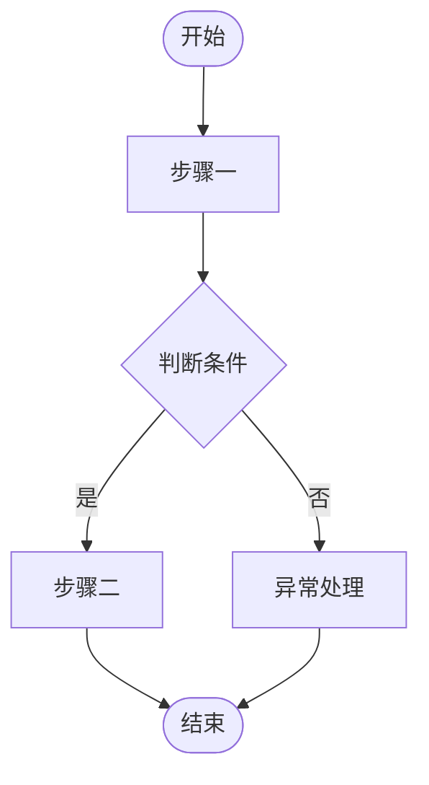

---
# 文档元数据 - 机器可解析,所有下游 agent 必须读取
doc_type: requirement
req_id: REQ-XXXX                    # 必填,全局唯一
req_title: ""                       # 必填
version: 0.1.0                      # 语义化版本,每次重大变更 +0.1
status: draft                       # draft | reviewed | approved | in_progress | done
priority: P1                        # P0 | P1 | P2
product: ""                         # 所属产品/模块
owner: ""                           # PM 姓名
created_at: YYYY-MM-DD
updated_at: YYYY-MM-DD

# 依赖与关联
depends_on: []                      # 依赖的其他需求 ID
related_to: []                      # 相关但不阻塞的需求 ID
blocks: []                          # 本需求阻塞了哪些需求

# 下游文档生成控制
generate:
  data_contract: true
  ui_spec: true
  frontend_spec: true
  backend_spec: true
  qa_spec: true
---

# 需求文档:[需求标题]

> **使用说明**:本文档是整个交付链路的**单一事实源**。所有下游文档(UI/前端/后端/QA)从本文档派生。
> 任何字段标注 `<!-- TODO: ... -->` 表示 PM 待补充,下游 agent 看到 TODO 不应编造,应保留并向上反馈。

---

## 1. 背景与目标

### 1.1 业务背景

<!-- 描述当前业务现状、痛点、为什么要做这个功能 -->

### 1.2 业务目标

<!-- 一句话能讲清的目标。可量化最好 -->

### 1.3 非目标(Out of Scope)

<!-- 明确本期不做什么。重要,防止下游过度设计 -->

---

## 2. 用户与角色

### 2.1 角色定义

| 角色 ID | 角色名 | 描述 | 典型场景 |
|--------|-------|------|---------|
| ROLE-001 | | | |
| ROLE-002 | | | |

### 2.2 用户故事(User Stories)

> 每个 story 必须有唯一 ID,验收标准也挂在 story 上,便于下游追溯。

#### US-001:[故事简短标题]

```
作为 [ROLE-XXX 角色名]
我想要 [具体功能/行为]
以便 [获得的价值]
```

**优先级**: P0 / P1 / P2
**所属史诗**: EPIC-XXX(可选)

---

## 3. 角色与权限矩阵

> 下游 UI agent 据此生成「显示/隐藏/禁用」逻辑,后端 agent 据此生成权限校验。

| 操作 | 角色 A | 角色 B | 角色 C | 角色 D |
|-----|-------|-------|-------|-------|
| [操作 1] | ✅/❌ | ✅/❌ | ✅/❌ | ✅/❌ |
| [操作 2] | ✅/❌ | ✅/❌ | ✅/❌ | ✅/❌ |

---

## 4. 核心实体与数据生命周期

> ⚠️ **重要**:本节定义业务实体的**业务语义**,不定义技术字段。技术字段在 `data-contract.md` 中定义。

### 4.1 实体清单

| 实体 ID | 实体名 | 描述 | 关键属性(业务语义) |
|--------|-------|------|------------------|
| ENT-001 | | | |
| ENT-002 | | | |

### 4.2 实体关系

<!-- 用文字或简图描述实体间关系,如:
- 一个 X 包含多个 Y(1:N)
- 一个 Z 关联多个 X(M:N)
-->

### 4.3 数据生命周期

<!-- 描述每个核心实体从创建到归档/销毁的完整路径

[实体名] 生命周期:
1. 创建:...
2. 流转:...
3. 更新:...
4. 归档/销毁:...
5. 保留期限:...
-->

---

## 5. 状态机

> 下游后端 agent 据此生成状态转换代码,QA agent 据此生成状态转换测试用例。

### 5.1 [实体名] 状态定义

| 状态 ID | 状态名 | 描述 | 是否终态 |
|--------|-------|------|---------|
| S-XXX | | | 是/否 |
| S-YYY | | | 是/否 |

### 5.2 状态转换表

| From | To | 触发动作 | 守卫条件(前置) | 副作用 |
|------|-----|---------|-------------|-------|
| S-XXX | S-YYY | | | |

### 5.3 非法转换

<!-- 显式列出禁止的状态转换,QA 据此生成"非法转换测试" -->

---

## 6. 业务流程

### 6.1 主流程

<!-- 用编号步骤描述主流程,每一步都对应一个用户操作和系统响应

流程:[流程名]
1. [角色] [操作] → [系统响应]
2. ...
-->

### 6.2 主流程图（Mermaid）

> 与 6.1 文字步骤保持一致。下游 agent 据此生成状态机、页面流转、接口调用顺序。



<!-- 绘制要点:
- 每个节点对应 6.1 中的一个步骤,标签保持一致
- 判断节点用菱形 {}
- 异常分支必须画出,对应 6.3 异常流程表
- 如有多个子流程,拆分为 6.2.1、6.2.2 分别绘制
-->

### 6.3 异常流程

| 异常场景 | 触发条件 | 系统响应 | 用户感知 |
|---------|---------|---------|---------|
| | | | |

---

## 7. 功能需求详述

### 7.1 功能 F-001:[功能名]

**关联用户故事**: US-XXX
**所属流程节点**: 流程 6.1 第 N 步

**输入**:
- 字段 1:类型、必填、约束
- 字段 2:...

**处理逻辑**:
1. 步骤 1
2. 步骤 2

**输出**:
- 成功:...
- 失败:...

**边界与约束**:
<!-- 例如:大小上限、并发数、频率限制 -->

---

## 8. 验收标准(Acceptance Criteria)

> ⚠️ **关键**:每条 AC 必须有唯一 ID,格式 `AC-{REQ_ID}-{序号}`。
> 下游 QA agent 必须为每个 AC 至少派生 1 条 TC,且 TC 描述显式标注覆盖的 AC ID。
> 前端/后端 agent 在代码注释中也应引用对应 AC ID。

### AC-XXXX-001:[简短描述]

**关联用户故事**: US-XXX

```
Given  [前置条件]
When   [触发动作]
Then   [期望结果]
```

### AC-XXXX-002:[简短描述]

```
Given  ...
When   ...
Then   ...
```

<!-- 至少覆盖以下类型的 AC:
- 主流程正向 AC
- 每个异常流程对应的 AC
- 每个权限角色的访问 AC
- 每个状态转换的 AC
- 边界值 AC(最大/最小/空/超限)
-->

---

## 9. 非功能需求

### 9.1 性能

| 指标 | 目标值 | 测量方式 |
|-----|-------|---------|
| | | |

### 9.2 安全

- 鉴权方式:<!-- SSO / JWT / OAuth2 -->
- 数据加密:<!-- 传输 TLS、存储加密 -->
- 审计:<!-- 哪些操作必须留痕 -->
- 越权防护:<!-- 行级/字段级权限校验点 -->

### 9.3 可访问性

- WCAG 等级:<!-- A / AA / AAA -->
- 键盘可达:<!-- 哪些操作必须支持 -->
- 屏幕阅读器:<!-- 是 / 否 -->

### 9.4 兼容性

- 浏览器:<!-- 例如 Chrome 100+, Edge 100+, Safari 15+ -->
- 移动端:<!-- iOS 14+ / Android 10+ / 不支持 -->
- 国际化:<!-- 仅中文 / 中英双语 / 多语言 -->

### 9.5 可观测性

- 关键埋点:<!-- 每个核心操作至少 1 个埋点 -->
- 错误监控:<!-- Sentry / 自建 -->
- 业务监控:<!-- 哪些业务指标进 dashboard -->

---

## 10. 数据量级与扩展性

| 维度 | 当前预期 | 1 年后 | 3 年后 |
|-----|---------|-------|-------|
| | | | |

---

## 11. 依赖与外部系统

| 依赖系统 | 用途 | 集成方式 | Owner |
|---------|------|---------|-------|
| | | | |

---

## 12. 数据迁移

<!-- 如需迁移存量数据,在此说明。否则填"无" -->

- 数据来源:
- 数据量:
- 迁移策略:一次性 / 双写 / 增量
- 回滚方案:

---

## 13. 上线操作清单（Launch Checklist）

> 上线前由 PM + 后端 TL 共同确认,逐项打勾后方可发布。

### 13.1 上线前

- [ ] 基础数据初始化:<!-- 例如:在后台配置默认告警阈值、字典表录入 -->
- [ ] 功能开关默认值:<!-- 例如:Feature Flag 默认关闭,待验证后开启 -->
- [ ] 权限 / 角色初始化:<!-- 例如:为现有租户创建默认角色并绑定权限 -->
- [ ] 环境配置检查:<!-- 例如:第三方 API Key、消息队列 Topic 是否已创建 -->

### 13.2 上线后

- [ ] 历史数据处理:<!-- 例如:执行脚本为存量记录补填新字段默认值 -->
- [ ] 数据校验:<!-- 例如:核查处理后记录数与预期一致,关键字段无空值 -->
- [ ] 功能开关开启:<!-- 例如:灰度放量顺序及比例 -->
- [ ] 通知相关方:<!-- 例如:通知客服、运营团队新功能已上线 -->

> 若本需求无需上线操作,填"无"并保留本节结构。

---

## 15. 灰度与发布策略

- 灰度方式:<!-- 按用户 / 按租户 / 按比例 -->
- 灰度比例:<!-- 例如 5% → 20% → 50% → 100% -->
- 监控指标:<!-- 哪些指标异常就回滚 -->
- 回滚预案:<!-- DB 是否需要回滚、配置如何切换 -->

---

## 15. 成功指标(北极星)

> 上线后衡量需求是否达成业务目标的指标。区别于功能验收标准。

| 指标 | 当前基线 | 目标 | 测量周期 |
|-----|---------|------|---------|
| | | | |

---

## 16. Open Questions(待定项)

> ⚠️ **关键机制**:PM 自己想不清的问题显式列在这里。下游 agent 看到 OQ 标记,在对应章节生成 `<!-- TODO: 等待 OQ-XXX 解决 -->`,**不要编造**。

| OQ ID | 问题 | 影响 | Owner | 截止 |
|------|------|------|-------|------|
| OQ-001 | | | | YYYY-MM-DD |

---

## 17. Figma / 原型链接

- Figma 设计稿:
- 交互原型:

---

## 18. 变更历史

> **填写规范**：
> - 每次修改需求文件时必须追加一行，不允许修改已有行
> - `变更摘要` 用一句话说明改了什么业务规则（而非"修改了措辞"这类无意义描述）
> - `影响下游文档` 从以下选项中选填：`data-contract` / `UI` / `Frontend` / `Backend` / `QA` / `全部` / `无`
> - 版本号规则：新增功能或修改业务规则 → Minor +1（如 0.1.0 → 0.2.0）；修复描述错误 → Patch +1（如 0.1.0 → 0.1.1）

| 版本 | 日期 | 修改人 | 变更摘要 | 影响下游文档 |
|-----|------|-------|---------|------------|
| 0.1.0 | YYYY-MM-DD | | 初稿 | 全部 |

---

## 19. 备注

<!-- 任何不属于以上类目但相关的信息 -->
